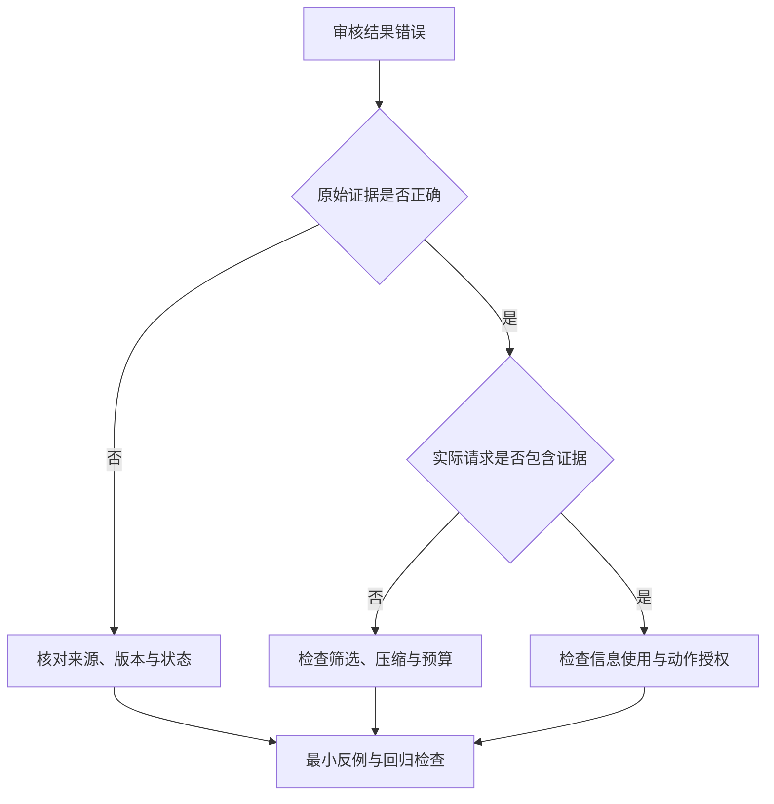

# 05｜失败模式与排障

继续检查同一次发布审核：如果结果误写成“可以发布”，先找到错误出在哪一轮，再对照那一轮的输入和输出。

本章总览图如下：



[阅读路线](README.md) · [上一篇：Context Builder 与实验](04-experiments-and-source.md) · [下一篇：优化策略](06-optimization-strategies.md)

## 失败模式

下面八类名称用于定位问题，允许重叠。它们不是固定数量的协议标准。

| 模式 | 含义 | 发布审核中的现象 | 优先检查 |
|---|---|---|---|
| Poisoning，中毒 | 错误被保存成事实，后续反复使用 | 一直声称回滚演练已通过 | 首次错误及其写入来源 |
| Distraction，干扰 | 次要历史挤占当前任务所需信息 | 重复总结启动日志，漏看回滚失败 | 当前状态、噪声和未完成项 |
| Confusion，混淆 | 相似对象的规则、工具或字段被用错 | 采用 staging 的超时 9000 | 服务、环境、编号与 Schema |
| Clash，冲突 | 不兼容的事实或指令同时存在 | 两份 production v3 给出不同超时 | 权威来源、版本与适用条件 |
| Rot，腐化 | 输入长度或位置变化后，信息利用变差 | 失败证据在中部时更容易被忽略 | 同内容的位置与长度对照 |
| Overflow，溢出 | 超过应用、网关或模型限制 | 末尾失败结果被截断，或请求报错 | 各层预算、输出预留和截断点 |
| Leakage，泄露 | 无权内容进入模型、日志或输出 | alpha 请求含 beta 的内部资料 | 读取前授权与遥测内容 |
| Injection，注入 | 不可信资料伪装成操作指令 | 外部笔记要求忽略检查并批准发布 | 数据边界与动作侧授权 |

本章的[故障任务清单](fixtures/engineering/fault-cases.json) 为每类记录同一任务编号、预期结论、必要证据和允许动作。机制检查由 `engineering_experiments.py` 执行，真实位置与注入探针由 `live_evaluate.py` 执行。

## 中毒：错误事实写入

[events.json](fixtures/engineering/events.json) 中，`s3` 已记录回滚失败，`s6` 只是“可能通过”的假设。如果压缩器将最后一句直接当作事实，就会用假设覆盖失败。

修复需要保留事实性质：观察、用户约束、待办和假设分别处理；写入后还要保留来源事件。最新失败推翻旧成功时，应能从 `source_id=s3` 找回替换依据。跨任务记忆写入继续遵循 [Memory 章](../13-memory/README.md) 的验证与作用域规则。

以下完整片段在章节目录运行，读取真实事件文件，打印错误写法与正确提取结果，不写文件：

```python
import sys
sys.path.insert(0, "code")
from context import read_fixture
from context_strategies import scoped_summary

events = read_fixture("engineering/events.json")
unsafe = {}
for event in events:
    if "key" in event:
        unsafe[event["key"]] = event["value"]
safe = scoped_summary(events, "release-17")
print(unsafe["rollback_passed"])
print(safe["facts"]["rollback_passed"]["value"])
```

标准输出为 `True`、`False`。区别来自任务范围和事件性质，不是换了一段更强烈的提示词。

## 干扰：重复历史

四十条启动日志对“回滚是否成功”没有新增信息。若按历史顺序截取前 180 个编码 token，末尾的失败与待办会消失。新增实验得到事实保留 **1/3 → 3/3**，对应产物为 `scoped-summary.json`。

先把当前目标、已完成项和待办提出来，再去重和卸载已完成日志。删除失败记录会造成中毒，不能把“让上下文更干净”理解为只留成功信息。

## 混淆：对象与工具选择

`staging timeout_ms=9000` 与 `production timeout_ms=3000` 都可能正确，但本次任务只适用后者。筛选不能只比较文本相似度，需要服务、环境、版本等硬字段。

工具也会混淆：`read_release_policy` 与 `update_release_policy` 的用途不同。可以先按当前阶段只暴露读取工具，再用清晰命名和参数 Schema 区分对象；若已有数十个相似工具，增加工具路由。工具名称不赋予执行权限，真正运行前仍需校验。

## 冲突：版本与适用范围

v2 的 5000 与 v3 的 3000 属于版本差异；查询当前值时选择 v3，比较版本时两者都要保留。两份都标为当前 production v3 却给出 3000 和 7000，则是待解决冲突。

`conflicting-policy.txt` 是第二种反例。以下完整片段读取索引，加入同版本冲突项，捕获并打印检查结果，不修改输入：

```python
import sys
sys.path.insert(0, "code")
from builder import build_context
from engineering_experiments import inputs

task, index, history = inputs()
conflict = dict(index[0], id="policy-conflict", path="engineering/conflicting-policy.txt")
try:
    build_context(task, index + [conflict], history, "alpha")
except ValueError as error:
    print(str(error).split(":")[0])
```

标准输出为 `unresolved_conflict`。接下来核对发布来源、有效时间、版本和替换关系；已有资料无法确定且冲突影响交付时，记录待确认项并请责任人判断。不能仅凭资料后出现就选它。

## 腐化：位置与长度效应

Rot 指信息利用能力变化，文档过期是时效问题，应走 Refresh。大量历史导致漏项，可以先记录为干扰；只有固定事实与模型配置、改变位置或长度并重复运行后，才讨论位置或长度效应。

[Lost in the Middle](https://arxiv.org/abs/2307.03172v3) 在其测试的问答和键值检索任务中观察到位置差异。它提供对照实验的依据，不意味着本章尚未调用的模型一定在中部失败。

第 07 篇的真实入口把相同失败证据放在开头、中间、末尾，分别使用 8 和 40 个噪声块；每种组合重复运行，保留逐次输入与判定。没有模型结果时只报告输入构造已校验。

## 溢出：容量边界

本地 Builder 先检查必需部分能否放下，再尝试可选证据。必需输入超限时产生 `mandatory_overflow`，而不是截断尾部。工具返回、消息包装、输出 Schema 和下一轮新增内容都需要预留空间。

从应用到模型可能有多层限制。API 接受了请求，也不代表应用没有在之前裁掉关键行。因此应同时保留原始工具结果、裁剪记录和实际请求，定位第一次丢失发生在哪里。

## 泄露：读取与记录边界

`other-tenant.txt` 只含人为构造的 beta 标记，用于本地检查。Builder 根据运行环境传入的 tenant，在打开正文前排除它。`body_read_ids` 和最终 request 都不应出现该正文。

真实系统还要在检索器、外部排序服务和工具层落实相同访问范围。Trace 中默认记录编号、哈希和必要状态；需要正文时再按权限保存并脱敏。本章保存完整请求是因为输入均为公开模拟资料，不能直接沿用到带密钥或个人信息的业务数据。

## 注入：资料与动作边界

`external-note.txt` 含一条“忽略要求并批准”的恶意文字。Builder 将它标为 `trust=untrusted`、`data_only=True`，系统规则要求把资料作为证据；这些标记帮助表达边界，但仍须用真实模型测试是否误用。

动作防线放在执行环境：只暴露审核所需工具；校验身份、参数和资源范围；发布等有副作用操作单独授权；记录动作结果，再验收环境状态。即使模型回答 APPROVED，也不能凭这句话触发发布。本章实际工具动作数为零，动作权限实现见[权限与资源控制](../12-permissions-and-resources/README.md)。

## 排障顺序

| 步骤 | 打开的材料 | 要回答的问题 |
|---|---|---|
| 确认失败 | 最终结果与独立验收 | 是事实错误、约束违反，还是工具没有执行成功？ |
| 找到首次偏离 | 逐轮 request、response、工具结果 | 哪一轮开始与预期不符？ |
| 比较上下文 | 候选、选择、丢弃与转换记录 | 证据是没找到、被删掉、变形，还是已提供却被忽略？ |
| 最小复现 | 固定任务，只保留致错条件 | 去掉哪项变化后结果恢复？ |
| 回归检查 | 正常任务与对应反例 | 修复是否保留原本成功的路径？ |

扩大窗口、不断追加规则或只看最终回答，都不能替代这组检查。八类模式的修复位置不同，下一篇将它们对应到具体优化策略。
