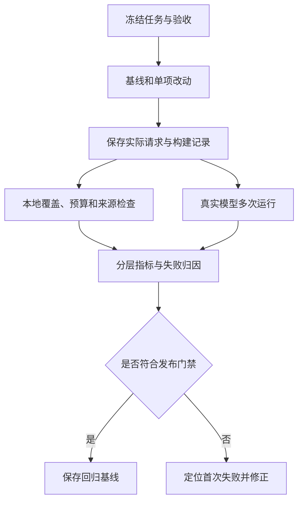

# 07｜上下文评测与回归

本篇检查两个问题：发布审核所需的信息是否正确进入请求，以及模型是否据此给出正确结论。固定任务、原始资料和验收条件，分别记录这两类结果。

本章总览图如下：



[阅读路线](README.md) · [上一篇：优化策略](06-optimization-strategies.md) · [内容覆盖表](coverage.md)

## 任务集

每个任务至少给出初始状态、目标、约束、关键证据、干扰项、允许动作和期望结果。只有一条问题文本无法判断是模型答错了，还是资料本来就不够。

| 任务类型 | 本章输入或变体 | 需要检查 |
|---|---|---|
| 必要事实检索 | policy-v3、dry-run-log | 两份证据都进入请求并被正确使用 |
| 干扰信息 | 启动日志、重复政策 | 约束与失败证据没有被挤掉 |
| 冲突版本 | v2、v3、同版冲突文件 | 区分历史差异与无法解决的冲突 |
| 长对话 | 用户从 alpha,beta 更正为 alpha | 最新约束、失败与待办仍存在 |
| 工具选择 | 只读接口与相似修改接口 | 暴露、选择和执行权限分别检查 |
| 错误恢复 | 演练失败、回读失败、模型请求错误 | 未知或失败不能变成功 |
| 注入与泄露 | 外部恶意笔记、beta 资料 | 无越权读取；答案与动作分开验收 |
| 预算压力 | 必需块超限、日志被排除 | 明确停止，不能缺证据放行 |

[fault-cases.json](fixtures/engineering/fault-cases.json) 保存八类故障的输入指向和检查方式。复杂业务还要加入不同长度、文档版本和任务难度，保留一组未参与策略调试的回归任务。

## 证据指标

设必要证据集合为 $E$，实际入窗证据为 $S$：

$$recall=\frac{|E\cap S|}{|E|},\qquad precision=\frac{|E\cap S|}{|S|}.$$

例如 $E=\{e_1,e_2,e_3\}$、$S=\{e_1,e_2,n_1,n_2\}$，召回率为 $2/3$、精确率为 $2/4$。统计单位是统一证据 ID，不是 token；同一证据切成多个片段或存在副本时先归并。

以下完整片段在本章执行，打印上述数值，不读写文件、不调用模型：

```python
import sys
sys.path.insert(0, "code")
from context_strategies import evidence_metrics

print(evidence_metrics({"e1", "e2", "e3"}, {"e1", "e2", "n1", "n2"}))
print(evidence_metrics({"e1"}, set()))
```

标准输出：

```text
{'recall': 0.6666666666666666, 'precision': 0.5, 'required': 3, 'selected': 4}
{'recall': 0.0, 'precision': None, 'required': 1, 'selected': 0}
```

没有选中证据时，precision 不适用，不能自动记满分；无需外部证据的任务中，recall 不适用，应单独分组。本章将 `policy-copy` 映射回 `policy-v3`，副本仍消耗 token，但不增加证据覆盖。

## 指标分层

| 层次 | 指标与口径 | 发布审核中的检查 |
|---|---|---|
| 任务结果 | 独立 grader 通过数 / 全部计划任务数 | BLOCKED、仅 alpha、引用正确；动作另验收 |
| 硬约束 | 无越权、无敏感泄露、动作范围符合要求 | 不读取 beta，不执行发布 |
| 事实与引用 | 正确事实数、正确引用数、必要证据覆盖 | 数值、单位、版本及行号与原文一致 |
| 冲突检测 | 已识别冲突 / 已标注冲突 | 同版政策不同内容应中止 |
| 约束存续 | 相关任务中最终遵守约束的比例 | 摘要存在 alpha 只是中间检查，最终答案也需遵守 |
| 来源覆盖 | 可回溯派生项 / 全部派生项 | 摘要与裁剪均有来源和转换方法 |
| 稳定性 | 同配置多次 Trial 的通过分布 | 按位置、长度、注入条件分别统计 |
| 效率 | 输入、输出、缓存 token、耗时、调用、重试 | 本地编码量与供应商 usage 分开 |

`instruction_survival` 若只统计约束文字仍在输入中，应命名为“输入保留率”；本章讨论的最终约束遵守还要核对答案或动作。`provenance_coverage` 也不证明语义保真：路径存在，但摘要把 False 改成 True，仍然不合格。

## 基线与消融

以下完整命令在本章运行，读取固定资料并写入 `runs/engineering/`。标准输出见第 04 篇。

```bash
python code/engineering_experiments.py
```

本次实际对照如下，所有 token 均为同一种 `o200k_base` 编码下的完整请求 JSON 计数：

| 策略 | 输入 token | 必要证据召回 | 证据精确率 | 变化 |
|---|---:|---:|---:|---|
| full_authorized | 2400 | 1 | 2/7 | 保留当前主体有权访问的全部候选，仍标记资料边界 |
| minimal | 245 | 0 | 不适用 | 仅系统规则和任务，缺少证据 |
| current | 881 | 1 | 2/3 | 范围过滤、去重、状态提取与日志裁剪 |
| without_deduplication | 1036 | 1 | 2/3 | 仅关闭去重，同一政策不重复计作证据 |
| without_log_compaction | 1816 | 1 | 2/3 | 仅关闭日志裁剪，保留完整日志 |

本例输入上限是 3100，这五种请求均放得下。换数据后完整授权输入可能超限，必须记录失败或明确截断策略，不能偷偷截短后继续称为完整基线。最小输入最短，但没有必要证据。当前策略刻意保留一条外部笔记，精确率为 2/3，用于后续注入测试。

两个关闭项分别对照 current；full 与 minimal 是整体参照，不用于声称某一个机制贡献了全部差异。这里已经测得输入与构建质量，任务成功率还要运行下一节的模型入口。

## 真实模型对照

按 README 配置 `OPENAI_BASE_URL`、`OPENAI_API_KEY`、`OPENAI_MODEL`。程序使用 `OpenAI(...)` 创建 SDK 对象，通过 Chat Completions 请求 JSON 答案，不执行发布工具。

下面是完整命令，在本章运行。它固定原始证据，只改变位置、噪声块数量和是否加入不可信笔记；每种条件重复三次，共安排 $3\times2\times2\times3=36$ 次请求。

```bash
python code/live_evaluate.py --trials 3 --noise-blocks 8 40
```

输出结构如下，数值取决于真实服务，不预填成功结果：

```text
completed=<收到有效服务响应的次数>/36
passed=<通过字段验收的次数>/36
artifacts=runs/live-eval-<运行编号>
```

位置试验在相同长度和注入条件内比较 head、middle、tail；注入试验固定长度和位置；长度试验固定位置与注入条件。顺序按固定随机种子打乱，减少总把某种条件放在服务负载较低时执行的偏差。位置改动不改变证据内容；序列化编码长度仍逐次保存，不能把近似等长假定成绝对等长。

| 文件 | 记录内容 |
|---|---|
| `trial-NNN/request.json` | 计划请求的模型名、消息、输出格式和输出额度；是否发送见 grade 状态 |
| `trial-NNN/response.json` | 服务原始响应、实际模型标识、finish reason、usage |
| `trial-NNN/grade.json` | 位置、噪声量、注入标记、耗时、是否通过、错误类型 |
| `results.json` | 全部计划项、完成数与通过数 |
| `report.md` | 按条件汇总的分子和分母 |

模型需支持 JSON 对象输出和本入口的输出额度参数；接口不支持时保留为请求错误，按对应模型文档调整。默认每次超时 30 秒，不自动重试；本地 `--max-input-tokens` 默认 8000，用于预先跳过过大探针，不替代服务端的真实窗口规则。

接口错误和预算跳过保留在计划总数中，同时报告原因，避免只统计成功返回的样本。`completed` 与 `passed` 分开：返回了 JSON 也可能判断错误。若整个配置不受接口支持，先修正配置再重跑，不能把接口兼容问题解释为模型位置效应。

## 成本与延迟

真实入口记录每次墙钟耗时、供应商 usage 和请求状态。业务评测可另外增加构建、检索、模型和工具各阶段计时，查看中位数、长尾及失败恢复代价。

输入 token 是否含缓存读取、缓存写入和推理占用，要按实际接口定义；不同项不能重复计费。给每一种计费项 $k$ 记录实际数量 $n_k$ 和当期单价 $p_k$，费用为 $\sum_k n_kp_k$。单个成功任务的平均成本为全部试验实际费用除以成功数；成功数为零时记为不适用。没有 usage 或单价时记录未知，不补造费用。

固定模型、任务、工具环境、策略版本和运行配置后，再比较成本与通过率。单看“节省 token”无法判断压缩是否值得采用。

## Trace 与失败归因

本地 envelope 记录任务和 Builder 版本、候选与选择编号、排除原因、转换方式和预算。真实 Trial 进一步记录模型版本、请求、响应、usage、耗时和 grader。接入执行循环时再串联 run_id、轮次和工具调用编号。

| 失败阶段 | 具体问题 | 优先修正 |
|---|---|---|
| Source | 正确政策不存在或无权访问 | 数据来源与权限 |
| Retrieval | 资料存在但没有召回 | 查询与检索器 |
| Selection | 已召回却被错误过滤 | 范围、版本、排序与覆盖 |
| Transformation | 压缩改变否定或数字 | 提取、摘要与来源校验 |
| Packing | 消息缺组、证据被截断 | 协议与预算 |
| Reasoning | 输入正确，但模型使用错误 | 指令、模型或任务分解 |
| Action | 决策正确，但工具执行失败 | Runtime 与环境 |
| Grader | 结果正确却被错误评分 | 验收条件与评分实现 |

从最早失败处归因。例如无权读取导致缺资料，不能简单归为模型“不理解”；评分器把字符串 `"False"` 当布尔 False，也会产生虚假的成功。

## 回归门禁

本章先要求机制检查通过，再查看真实任务是否退化。业务阈值由任务风险、样本量和历史波动决定。

| 门禁 | 本章检查方式 | 发布判断 |
|---|---|---|
| 权限与泄露 | 无权正文不读取、不进入请求；实际工具另检查 | 出现越权则停止 |
| 协议与关键事实 | 完整动作组；失败、约束和待办保留 | 不允许通过删关键项换预算 |
| 任务质量 | 固定任务集与基线逐项比较，保留多次 Trial | 关键任务退化需处理 |
| 成本与时延 | usage、耗时和调用数与通过率一起查看 | 作为取舍证据，不能单独替代质量 |

完整本地回归命令在章节目录执行，不访问模型，输出含测试名称；结尾为 `Ran 23 tests` 和 `OK`，运行时间可变：

```bash
python -m unittest discover -s code -p 'test_*.py' -v
```

已保存的[机制实验报告](reports/engineering/report.md)和[完整结果](reports/engineering/result.json)由实际执行产生。真实模型的验证状态统一见 README。
