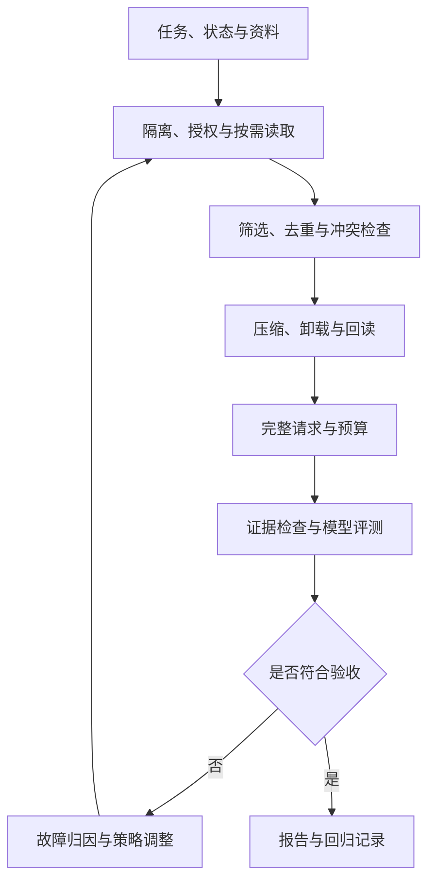

# 06｜上下文工程与管理

本章为笔记与代码检查任务组装上下文：只把当前需要的资料交给模型。

输入从 [notes.txt](notes.txt) 扩展为检查规则、历史消息和脚本日志。`stats` 表示统计任务，`workspace` 表示当前运行范围；`alpha`、`beta` 用来区分两份独立工作资料。程序根据这些证据判断报告是否满足要求。

上下文是**这一次模型调用实际收到的输入**。上下文工程负责选择来源、检查可信度与时效、组织表示、分配预算，并用任务结果验证这些做法。

本章总览图如下：



[组件总览](../../README.md) · [上一组件：通信与交接](../05-communication-and-handoff/README.md) · [下一组件：状态与产物管理](../07-state-and-artifacts/README.md)

资料中混着旧检查规则、临时工作目录配置、一段很长的执行日志，以及用户后来补充的“只允许 alpha”。前几篇从两条消息开始，后面加入跨工作区、重复、过期和不可信资料。输入始终围绕同一次审核，各项扩展见 [fixtures/engineering](fixtures/engineering/)。

## 阅读路线

| 阅读顺序 | 本篇新增的机制 | 代码入口与可见结果 |
|---|---|---|
| [01｜上下文组成、隔离与按需加载](01-isolation-and-loading.md) | 来源、生命周期与相邻概念；拷贝、交接和读取边界 | `first_context.py`、`context.py`；两条消息、5 份索引只读 2 份 |
| [02｜Token 预算与工具结果裁剪](02-budget-and-tool-results.md) | 真正的编码 token 计数；保留元数据和失败行；预算不足停止判断 | `pack`、`crop_tool_result`；402 / 1500，以及缺证据对照 |
| [03｜历史压缩与事实校验](03-history-compression.md) | 最新事实、来源事件、摘要校验；真实 SDK 压缩入口 | `extract_history`、`live_compress.py`；2/3 与 3/3 事实对照 |
| [04｜Context Builder 与实验](04-experiments-and-source.md) | 权限、版本、去重、冲突、完整请求与构建记录 | `builder.py`、`engineering_experiments.py`；请求、选择过程、源码核对 |
| [05｜失败模式与排障](05-failure-modes.md) | 中毒、干扰、混淆、冲突、腐化、溢出、泄露、注入 | 八类故障清单、最小反例与检查结果 |
| [06｜上下文优化策略](06-optimization-strategies.md) | 选择、检索、排序、压缩、隔离、卸载、缓存、刷新 | `context_strategies.py`；按行回读、缓存键与 UNKNOWN |
| [07｜上下文评测与回归](07-evaluation-and-regression.md) | 证据指标、基线消融、真实模型位置探针、成本、归因与门禁 | 五组机制实验；`live_evaluate.py` 生成逐次记录与报告 |

原版知识点逐项对应到[内容覆盖表](coverage.md)。重要结论与延伸材料整理在[参考资料](references.md)。本章运行不依赖归档目录。

## 环境准备

下面所有命令的工作目录都是 `10-Knowledge/02_Harness/06-context-management/`。使用 Python 3.10+；本次实际验证为 Python 3.12.14、tiktoken 0.12.0、openai 3.16.2、python-dotenv 1.2.3。[requirements.txt](requirements.txt) 记录了本次验证的第三方包版本。

安装命令读取 requirements 并安装依赖；包管理器输出因环境而异。

```bash
python -m venv .venv
source .venv/bin/activate
python -m pip install -r requirements.txt
python -c "import tiktoken; print(tiktoken.get_encoding('o200k_base').name)"
```

PowerShell 将激活命令换成 `.venv\Scripts\Activate.ps1`。最后一条标准输出为 `o200k_base`。**第一次加载编码器会下载官方词表并缓存**；准备离线环境时先完成这一步，并保留该环境的缓存。可在首次加载前设置 `TIKTOKEN_CACHE_DIR`，让预热和后续运行共用一个持久目录。只有缓存已就绪时，以下本地实验和测试才能完全离线重跑。

## 运行与产物

以下为完整本地运行命令，输入均已放在 [fixtures](fixtures/) 中，不调用模型；实验会覆盖各自 `--out` 指定的目录，原始 fixtures 保持不变。

```bash
python code/first_context.py
python code/run_experiments.py
python code/run_experiments.py --window 1301 --out runs/tight
python code/engineering_experiments.py
python -m unittest discover -s code -p 'test_*.py' -v
python sources/verify_sources.py
```

默认实验的准确标准输出是：

```text
selected=2/5
summary_facts=3/3
input_tokens=402 limit=1500
report_decision=BLOCKED
artifacts=runs/default
```

这里的 `BLOCKED` 来自日志末尾真实存在的 `verification_check=FAILED`。小窗口实验输出 `input_tokens=231 limit=401`、`report_decision=NEEDS_EVIDENCE`：预算把执行结果排除了，程序因此拒绝给出通过验收结论。

| 路径 | 能核对什么 |
|---|---|
| [fixtures/index.json](fixtures/index.json)、[fixtures/docs](fixtures/docs/) | 元数据筛选规则与真正被读取的文本 |
| [fixtures/history.json](fixtures/history.json)、[fixtures/bad-summary.json](fixtures/bad-summary.json) | 用户更正如何被有损摘要漏掉 |
| `runs/default/messages.json` | 打包后的完整消息；不是所有已读取资料的集合 |
| `runs/default/cropped-log.json` | 原行号、遗漏范围、来源哈希及失败尾行 |
| `runs/default/result.json`、`report.md` | 预算、事实保留数、隔离结果和报告检查 |
| [reports/verified-default.json](reports/verified-default.json)、[reports/verified-report.md](reports/verified-report.md) | 本次已执行的默认实验记录 |
| `runs/engineering/current/request.json`、`envelope.json` | 完整请求与逐项选择、丢弃、转换记录 |
| `runs/engineering/result.json`、`report.md` | 五种策略、十四项机制检查及事实保留对照 |
| `runs/engineering/reference.json`、`read-back.json` | 外部保存引用及回读的真实失败行 |
| [reports/engineering/report.md](reports/engineering/report.md) | 已运行的综合机制报告 |

综合实验的准确标准输出：

```text
variants=5
checks=14/14
scoped_facts=3/3
model_calls=0
artifacts=runs/engineering
```

## 模型接口配置

结构化提取和预算计算本身不需要模型。第三篇另提供真实模型压缩候选入口：复制 `.env.example` 为 `.env`，填写 `OPENAI_BASE_URL`、`OPENAI_API_KEY`、`OPENAI_MODEL`。模型需支持 Chat Completions 的 JSON 对象输出；基础 URL 不包含 `/chat/completions`。

下面为完整命令，输入为同一份 history，输出由真实服务产生，措辞和 usage 可变化：

```bash
python code/live_compress.py
```

它在每次新建的 `runs/live-<运行编号>/` 保存实际请求、原始响应、校验结果及最终采用的上下文。缺少配置会明确退出；摘要不合格时采用原历史。

第 07 篇的真实模型评测使用相同配置，模型还需支持 `max_completion_tokens`。以下完整命令安排 36 次位置、长度与注入对照，写入新建的 `runs/live-eval-<运行编号>/`：

```bash
python code/live_evaluate.py --trials 3 --noise-blocks 8 40
```

程序保留每次请求、响应、usage、耗时、判定与汇总报告；请求错误和预算跳过单独记录。模型回答与运行时间依实际任务变化，输出结构见第 07 篇。

## 验证记录

已执行基础实验、五组综合策略对照、十四项机制检查、23 项自动测试和 tiktoken 源码哈希核对。归档版的预算保护与结构化压缩实验已用本章任务资料复现：读取前排除跨工作区数据、必需输入超限时报错，失败、约束和待办保留 3/3。新计数使用指定编码器，不沿用旧实验的字节数。

正文可独立运行片段的实际输出见[逐段运行记录](reports/reader-verification.json)。

当前没有真实模型密钥，未执行真实压缩和位置/注入请求；API 参数、错误与预算跳过记录通过离线测试检查。模型层 Rot、注入抵抗能力和真实任务成功率需以读者实跑结果为准。完整请求产物只包含本章模拟数据，接入业务资料时按权限保存并脱敏。

旧资料保留在[归档的上下文工程](../../_archive/04-context-engineering/README.md)，用于核对原始结构和实验记录。
