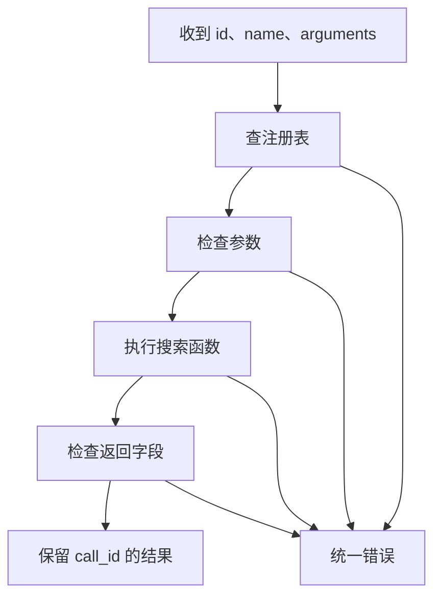

# 01｜工具定义与参数校验

[阅读路线](README.md) · [下一篇：搜索、文件、代码与仿真](02-four-tools.md)

本章总览图如下：



补货实验的初始库存来自 `examples/corpus/policy.md`。搜索工具返回匹配的原文与行号，工作目录与配置见 README。

## 本地搜索

下面是可在章节目录独立运行的完整片段：

```python
from pathlib import Path
lines = Path("examples/corpus/policy.md").read_text(encoding="utf-8").splitlines()
for number, line in enumerate(lines, 1):
    if "初始库存" in line:
        print(f"policy.md:{number}: {line}")
```

标准输出为 `policy.md:3: 初始库存为 4，比较每天补货 2 件与 4 件。`。`enumerate(..., 1)` 保留原文行号，后面的报告才能指向同一条证据。配套入口 `python code/run_minimal.py` 还将这行写入 `runs/minimal.txt`。

查询词写死在代码中时，更换查询词就需要修改代码。将它改为 `query` 参数，并把搜索范围固定为 `examples/corpus/`，即可重复调用。实际 `search_docs()` 位于 [runtime.py](code/runtime.py) 的 `build_registry()` 中：它按文件名排序，逐行做不区分大小写的子串匹配，返回前 `limit` 条结果。它没有向量检索和相关性模型；匹配顺序可完全复现。

## 工具注册表

供调用者阅读的名称与参数说明不会自动执行 Python。注册表把说明和函数放在同一个对象中：

| `Tool` 字段 | 具体内容 | 谁使用它 |
|---|---|---|
| `name` | `search_docs` | 派发器查找工具 |
| `description` | 本地逐行匹配查询词 | 调用者选择动作 |
| `input_schema` | `query` 字符串、`limit` 整数 1—20 | 执行前校验 |
| `output_schema` | matches、total、truncated | 执行后校验 |
| `handler` | 实际的 `search_docs` 函数 | 程序执行 |

下列完整片段在章节目录运行。它直接加载本章注册表并提交一次请求，不会调用模型：

```python
import sys
from pathlib import Path
sys.path.insert(0, str(Path("code").resolve()))
from runtime import build_registry

registry = build_registry(Path("runs/first-call"))
request = {
    "id": "search-1",
    "name": "search_docs",
    "arguments": {"query": "初始库存", "limit": 5},
}
result = registry.call(request)
print(result["call_id"], result["ok"], result["data"]["matches"][0]["line"])
```

标准输出：`search-1 True 3`。结果包含来源信息；`call_id` 原样对应输入 `id`。本次片段只创建工作目录，没有保存调用记录；`run_task.py` 会保存完整 trace。

## 参数校验

`limit=200` 是合法 JSON，也可能由一个不受约束的接口客户端传入，但违反了本工具的读取上限。`Registry.call()` 在调用 handler 前运行 `validate()`，所以这次请求不会读取语料。

以下是 [runtime.py](code/runtime.py) 中类型检查的函数节选，不是独立入口：

```python
types = {"object": dict, "string": str, "integer": int,
         "array": list, "boolean": bool}
if type(value) is not types[schema["type"]]:
    raise ToolError("invalid_arguments", f"{field}: expected {schema['type']}")
```

这里用严格类型相等，是因为 Python 的 `True` 也是 `int` 的子类。让 `True` 成为返回条数会掩盖调用方的错误。对象还会检查必填项、未知参数；整数检查范围，字符串检查长度，数组逐项检查。该函数只实现本章实际使用的 JSON Schema 子集，没有 `$ref`、`oneOf` 或完整规范验证器。

把上一个片段中的 `limit` 改成 200，再把最后一行改成 `print(result["error"]["code"])`，标准输出为 `invalid_arguments`。改成 `True` 也相同。这里应修正参数；重复发送同一请求不会恢复。

## 结果与错误

| 结果字段 | 成功时 | 失败时 |
|---|---|---|
| `call_id` | 输入编号 | 输入编号；无法解析请求时可为空 |
| `tool` | 被调用名称 | 请求名称 |
| `ok` | `True` | `False` |
| `data` | 结构化结果 | `None` |
| `error` | `None` | code、message、retryable |

错误码对应不同修复位置：`unknown_tool` 需要更换名称，`invalid_arguments` 需要更正输入，`not_found` 需要核对文件，`invalid_output` 则说明工具实现违反了自己的返回约定。未知 Python 异常转换为不包含原始异常文本的 `execution_error`，防止路径、凭证或服务响应细节意外流出。

输出校验同样必要。假设搜索实现返回 `total="one"`，调用者若直接把它当整数累计，会在更远处失败。注册表在结果离开执行层前检查输出，错误就停留在实际出错的工具旁边。`test_result_contract` 用一个返回错误类型的 handler 验证这个分支。

本注册表不缓存调用 ID：相同 ID 再次提交仍会重新执行。`call_id` 在这里负责关联，不能作为“只写入一次”的保证。需要可靠重试时，应将请求签名、写入与回执放在有事务能力的后端；[持久化与恢复](../09-persistence-and-recovery/README.md)继续讨论这部分。

[下一篇：搜索、文件、代码与仿真](02-four-tools.md)
