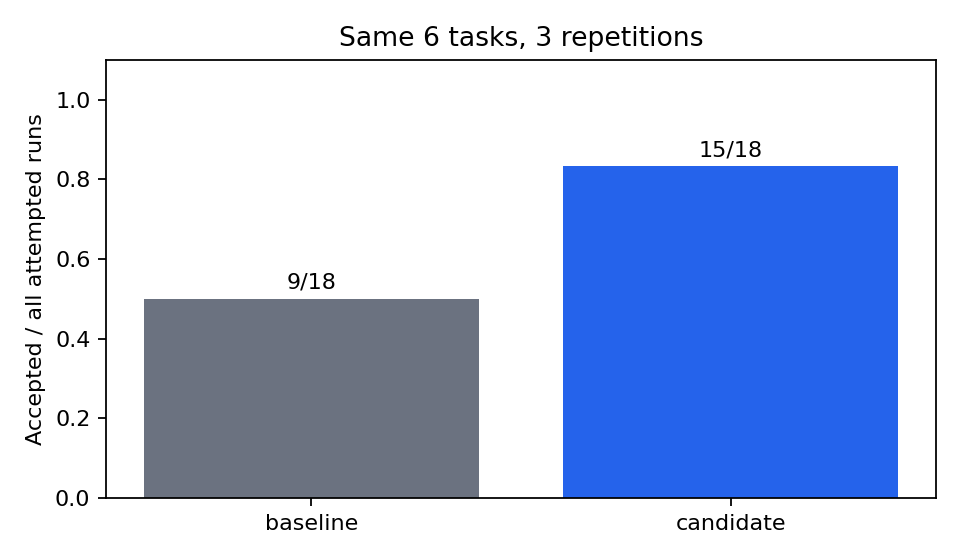

# 实际产物的配对评测

| 版本 | 成功 / 全部尝试 | 成功率 | 成本已知行 | 总模型成本 |
|---|---:|---:|---:|---|
| baseline | 9/18 | 50.0% | 0 | unknown |
| candidate | 15/18 | 83.3% | 0 | unknown |

配对胜 / 平 / 退步：6 / 12 / 0。

成功率差：+33.3%；发布门禁：hold（要求全部任务达标且无回归）。

每一行失败都保留在分母中。三次重复使用相同的确定性程序，不构成 18 个独立任务。成本未采集，不将其填成 0。

## 失败明细

| 版本 | 任务 | trial | 原因 |
|---|---|---:|---|
| baseline | invalid | 0 | invalid_amount: order=o2 |
| candidate | invalid | 0 | invalid_amount: order=o2 |
| baseline | invalid | 1 | invalid_amount: order=o2 |
| candidate | invalid | 1 | invalid_amount: order=o2 |
| baseline | invalid | 2 | invalid_amount: order=o2 |
| candidate | invalid | 2 | invalid_amount: order=o2 |
| baseline | uppercase | 0 | artifact mismatch |
| baseline | uppercase | 1 | artifact mismatch |
| baseline | uppercase | 2 | artifact mismatch |
| baseline | whitespace | 0 | artifact mismatch |
| baseline | whitespace | 1 | artifact mismatch |
| baseline | whitespace | 2 | artifact mismatch |
