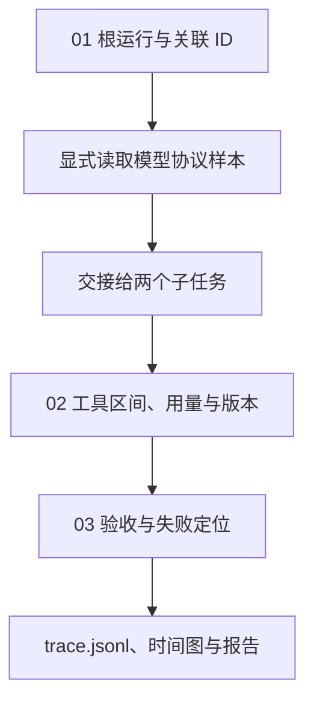

# 11｜Trace 与可观测性

[组件总览](../README.md) · [上一章：评估与验收](../10-evaluation-and-acceptance/README.md) · [下一章：权限与资源控制](../12-permissions-and-resources/README.md)

订单汇总任务并行处理东、西两个分区。东区生成报表，西区因坏金额失败；Trace 记录模型边界、交接、工具和验收的关联、耗时与错误。

本章总览图如下：



| 阅读顺序 | 增加的机制 | 代码位置 |
|---|---|---|
| [01｜Trace、Span 与任务关联](01-linked-spans.md) | 从一次计时到父子 span、任务与交接关联 | `Recorder.span`、`work` |
| [02｜时间、用量与版本](02-time-usage-and-versions.md) | 并行区间、明确来源的 usage、成本覆盖率与版本 | `replay_plan`、`union_ms` |
| [03｜失败定位](03-failure-investigation.md) | 区分直接异常与传播、重建链路、用图核对 | `validate`、`build_report` |

完整实现位于 [code/trace_demo.py](code/trace_demo.py)。Python 3.10+；只有画图使用 `matplotlib`，本地处理和 trace 写入使用标准库。

## 运行命令

以下命令以章节目录为工作目录，与正文中的命令相同，无需重复执行：

```bash
cd 10-Knowledge/02_Harness/11-trace-and-observability
python -m pip install -r requirements.txt
python code/trace_demo.py --out runs/parallel --delay-ms 60
python -m unittest discover -s code -p 'test_*.py' -v
```

`--out` 必须是新目录；再次运行换一个目录，或不传 `--out` 让程序创建时间戳目录。输出结构如下，实际毫秒数会变化：

```text
model_mode=fixture_replay
success_tasks=1 failed_tasks=1
root_wall_ms=<实际墙钟时间> child_sum_ms=<两个子任务时长之和>
artifacts=runs/parallel
```

| 实际输入 | 用途 |
|---|---|
| [east.csv](fixtures/east.csv)、[west.csv](fixtures/west.csv) | 真正由两个线程读取和计算的 CSV；西区包含 `oops` |
| [provider-response.json](fixtures/provider-response.json) | 手写模型协议样本，显式回放两项计划和 usage 字段 |
| [example-rates.json](fixtures/example-rates.json) | 演示计价公式的任意样例费率，不是供应商报价 |
| [expected.json](fixtures/expected.json) | 独立文件验收的预期 |

模型边界使用 `fixture_replay` 回放协议样本，未请求外部模型。两个工具任务、失败、文件验收、线程调度、区间计时均为真实本地执行；读取工具中明确注入 60ms 延迟，让快速磁盘上的并行区间也容易观察。

## 参考产物

| 产物 | 检查入口 |
|---|---|
| [trace.jsonl](artifacts/reference/trace.jsonl) | 11 条已结束的 span 记录，含父子链路 |
| [metrics.json](artifacts/reference/metrics.json) | 墙钟、子任务区间并集、重叠量、直接错误 |
| [report.md](artifacts/reference/report.md) | 从原始 trace 生成的关联表和异常链路 |
| [timeline.png](artifacts/reference/timeline.png) | 实际测量区间绘图 |
| `artifacts/reference/handoff-*.json` | 跨任务传递的 trace、父 span 和输入文件 |
| `artifacts/reference/summary-east.json` | 东区真实计算并验收的结果 |
| `artifacts/reference/manifest.json` | 版本、输入哈希、代码哈希和延迟配置 |

本次运行了完整本地链路及 4 项关键行为测试。
