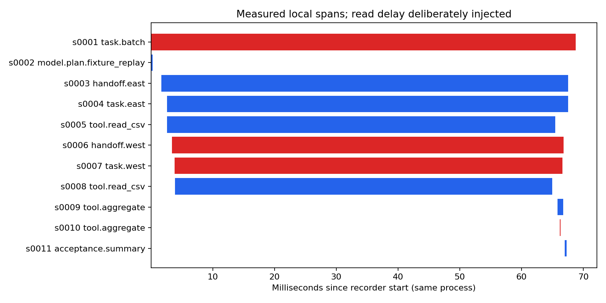

# 实际本地并行轨迹

成功子任务 1；失败子任务 1；span 11。

| 时长指标 | 毫秒 |
|---|---:|
| 根任务墙钟 | 68.732 |
| 两个子任务时长相加 | 127.674 |
| 子任务区间并集 | 64.937 |
| 重叠区间量 | 62.736 |

模型边界为明确选择的 fixture_replay；输入输出 token 来自手写协议样本。示例费用公式值不表示发生了真实调用或账单。实际模型成本为 null。

## 关联和错误

| span | parent | task | kind | status | error origin |
|---|---|---|---|---|---|
| s0001 task.batch | None | batch | task | error |  |
| s0002 model.plan.fixture_replay | s0001 | batch | model | ok |  |
| s0003 handoff.east | s0001 | batch | handoff | ok |  |
| s0004 task.east | s0003 | east | task | ok |  |
| s0005 tool.read_csv | s0004 | east | tool | ok |  |
| s0006 handoff.west | s0001 | batch | handoff | error | s0010 |
| s0007 task.west | s0006 | west | task | error | s0010 |
| s0008 tool.read_csv | s0007 | west | tool | ok |  |
| s0009 tool.aggregate | s0004 | east | tool | ok |  |
| s0010 tool.aggregate | s0007 | west | tool | error | s0010 |
| s0011 acceptance.summary | s0004 | east | acceptance | ok |  |

最早记录到的直接异常：invalid_amount: file=west.csv row=3 order=w2。

向父级追溯：s0010 → s0007 → s0006 → s0001。
