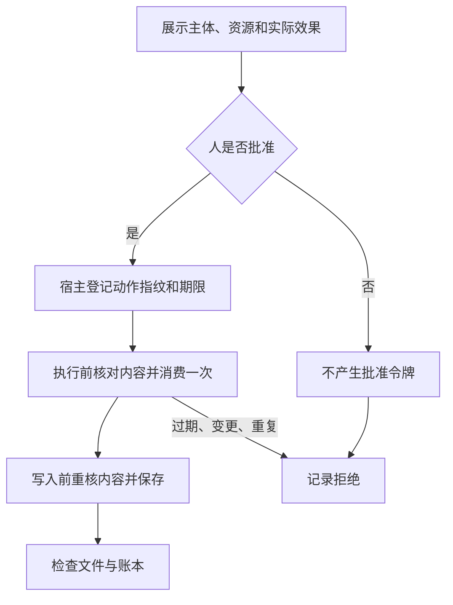

# 04｜人工批准与验收

[阅读路线](README.md) · [上一篇：并发、截止与取消](03-concurrency-deadline-cancel.md)

本章总览图如下：



读取 a1 已在主体权限内。发布策略要求用户确认具体内容，并将批准绑定到本次动作和待写入数据。

## 批准内容

`fingerprint()` 对以下值排序编码成 JSON，再计算 SHA-256：主体 subject、租户 tenant，Request 的全部字段，以及待写入的实际字段投影 payload。资源从 a1 改成 b1，甚至同一资源的步骤数量改变，都会得到不同指纹。daily_delivery 从 4 改成 999 也会失效，即使资源 ID 没变。

批准存储 `Approvals.entries` 保存 token 对应的指纹、过期时间与 used 标志。token 由宿主生成，不写进 trace，也不暴露为可以由工具自己调用的 `grant_approval`。哈希用于检查内容绑定，不能取代批准存储的可信性；如果调用者能任意改这个字典，授权边界就不存在了。

| 核对顺序 | 不满足时的结果 |
|---|---|
| token 存在于宿主记录 | approval_required |
| token 未消费 | approval_used |
| 当前时间早于过期时间 | approval_expired |
| 指纹与主体、动作、待写内容一致 | approval_mismatch |

`Runtime.execute()` 在排队前先检查批准，获得名额并完成预算预留后再检查并消费一次。这样排队期间过期的令牌不会在执行时放行；第二次检查失败时，已经预留的用量以 0 结算，但已接纳次数保留。真正写入前还会重新计算当前投影的指纹；若等待计算时数据被改动，返回 approval_content_changed，文件不落盘，已完成的本地步骤仍按回执结算。单进程中最后一次内容检查和写入之间没有 await，不让其他协程插入修改。

## 批准界面

在章节目录运行完整入口：

```bash
python code/approval_cli.py --output runs/approval
```

它先打印 actor=alice、tenant=A、publish_record(a1)、实际 title 和 daily_delivery 值、内容绑定指纹与效果 `write these exact values to a1.json`。随后提示输入 APPROVE。输出结构为：

```text
Type APPROVE to write this file; anything else rejects: <你的输入>
status=<completed 或 approval_required> artifacts=runs/approval
```

批准后检查 `runs/approval/a1.json`，应只有 title 与 daily_delivery 两个字段。拒绝时该文件不存在，但 result.json 与 events.json 仍保存发生了什么。更换输出目录可以分别运行两条路径。

交互终端的批准来源记录为 human_terminal。为测试输入解析，用管道传入 APPROVE 的操作会记录 stdin_fixture；自动集成实验直接从宿主签发的批准则记为 experiment_fixture。这些来源分别说明实际做过什么，不把自动输入写成真人决策。

## 集成实验

```bash
python code/run_experiments.py --output runs/experiments
python -m unittest discover -s code -p 'test_*.py' -v
```

标准摘要是 `checks=12 passed=12`，随后 10 个测试通过。集成实验在同一组输入上得到以下结果：

| 场景 | 实际状态或账本值 | 为什么是合格结果 |
|---|---|---|
| A 读 a1 | completed，只有两字段 | 合法范围内任务可以完成 |
| A 读 b1 | resource_denied | 拒绝发生在读取返回之前 |
| delete_record | tool_denied | 未授权动作不进入执行 |
| 未批准发布 | approval_required | 不产生发布文件 |
| 批准后改变参数 | approval_mismatch | 批准没有被移用 |
| 原动作带有效批准 | completed，a1.json 存在 | 文件确实写出 |
| 重放批准 | approval_used | 一次性令牌不能再次生效 |
| 8 与 6 争用 10 | B 先拒绝，结算后获准 | 已用 7、剩余 3 |
| 远端未知消耗 | 仍预留 8 | 未知不被当成零 |
| 四个工作者、两名额 | peak=2 | 并发受实际强制 |
| 排队超过期限 | 未开始，deadline_exceeded | 等待时间计入期限 |
| 执行后取消 | active=0、reserved=0 | 已知本地回执结算并释放 |

表里的“发布”是本地实验动作。自动实验的批准没有授权任何外部发布，输入私有字段也不会进入成果文件。

## 结果验收

`completed` 说明执行函数走到了返回；文件验收还需检查实际存在、字段正确、没有 private_note。预算验收则查看 spent、reserved、available 是否守恒。一个任务可能写完文件后才收到取消，这种情况下不能根据 cancelled 宣称文件已撤销。

你可以把 approval_cli 的 Request.resource 改成 b1 再运行：即使人工入口产生了 token，也会先得到 resource_denied，因为具体批准不能扩大主体本来没有的租户权限。把 ttl 改成负数则得到 approval_expired；测试文件已覆盖这一过期分支。

本章的权限、资源与批准都可从 [events.json](evidence/experiments/events.json)对应到分支；[验证记录](evidence/validation.json)列出执行过的命令。接入真正服务时，沿用“主体来源可信、动作前检查、预留原子化、回执可核对”的顺序，再把内存存储换成共享的持久事务。

[返回阅读路线](README.md)
