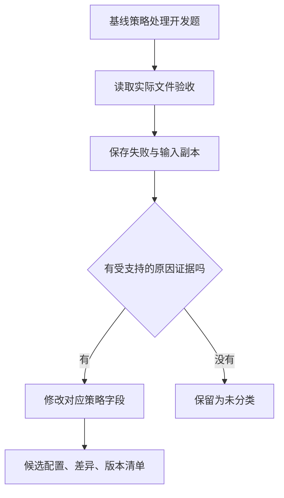

# 01｜失败分析与候选生成

[阅读路线](README.md) · [下一篇：02｜同题评测与采用门禁](02-paired-gates.md)

本章总览图如下：



## 0. 策略配置

基线策略的格式示例如下，对应 [cycle.py](code/cycle.py) 的 `BASELINE`：

```json
{
  "normalize_status": false,
  "invalid_amount": "reject",
  "include_negative": true
}
```

`normalize_status=false` 表示只有精确的 `paid` 会被匹配；`invalid_amount=reject` 表示遇到坏金额立刻抛异常；负金额参与总额。基线保留了第10章的状态匹配与坏金额处理缺陷。

在章节目录执行下面完整 Python 片段，输入为 `fixtures/whitespace.csv`。它只在内存中复制配置并打印真实函数返回值，不写文件：

```python
import sys
from pathlib import Path
sys.path.insert(0, "code")
from cycle import BASELINE
from policy_engine import aggregate

source = Path("fixtures/whitespace.csv")
print(aggregate(source, BASELINE))
changed = {**BASELINE, "normalize_status": True}
print(aggregate(source, changed))
```

标准输出：

```text
{'total_cents': 0, 'paid_rows': 0, 'rejected_rows': []}
{'total_cents': 400, 'paid_rows': 1, 'rejected_rows': []}
```

开启状态规范化后，总额由 0 变为 400。该修改还需要同题评测与版本记录。

## 1. 失败证据

开发集有四题：普通订单、带空格状态、负金额和坏金额。每题重复两次，基线通过 4/8 次。`collect_failures` 只读取开发集第一轮中未通过的任务，避免把同一确定性失败重复当作两种新证据。

[failures.json](artifacts/reference/failures.json) 中实际留下两类：

| 任务 | 失败现象 | 采集的证据 | 候选修改方向 |
|---|---|---|---|
| `whitespace` | 总额 0，而预期 400 | 订单 `o1` 的原始状态为 ` paid ` | 开启状态规范化 |
| `invalid` | `invalid_amount: order=o2` | 真实异常和对应输入哈希 | 跳过坏金额并记录 ID |

第一类判断会重新读取本次保存的 `input.csv`，寻找“原值不等于 paid、去空白并忽略大小写后等于 paid”的行。第二类根据实际解析异常分类。记录还包含具体 `result_file`，可以追到当时的产物和预期。

文件不存在、字段名变化、网络超时没有对应的修改规则，分类保留为 `unclassified`。没有受支持的变更时，候选生成器不修改配置。

## 2. 候选生成规则

下面是完整实现 [propose](code/cycle.py) 的函数定义节选。输入是基线字典和已收集的失败列表，返回新字典与变更清单；定义本身不打印内容：

```python
def propose(policy, failures):
    candidate, changes = dict(policy), []
    reasons = {f["reason"] for f in failures}
    if "unrecognized_status" in reasons and not policy["normalize_status"]:
        candidate["normalize_status"] = True
        changes.append({"field": "normalize_status", "from": False, "to": True})
    if "invalid_amount" in reasons and policy["invalid_amount"] == "reject":
        candidate["invalid_amount"] = "skip_and_record"
        changes.append({"field": "invalid_amount", "from": "reject", "to": "skip_and_record"})
    return candidate, changes
```

完整函数额外为每项变更保存 `evidence_reason`。没有读取 holdout，也没有修改测试预期；允许值由 `validate_policy` 检查。候选修改来自失败分类。

这是一个受控搜索空间：规范化可开或关，坏金额有两个合法动作，负金额有明确开关。可解释、可复现，但搜索能力限于已有动作。给它一个未支持的日期格式失败，不会自动发明日期解析器；需要扩展工具或引入候选补丁生成阶段。

## 3. 策略执行

[policy_engine.py](code/policy_engine.py) 根据策略配置处理坏金额。下面是它的接续片段，前文已经从 `row['amount']` 解析 `Decimal`；片段本身不独立执行：

```python
except (InvalidOperation, ValueError):
    if policy["invalid_amount"] == "reject":
        raise ValueError(f"invalid_amount: order={row['order_id']}") from None
    rejected.append(row["order_id"])
    continue
```

候选策略选择 `skip_and_record` 后，坏订单 `o2` 不再终止整个任务，而进入 `rejected_rows`，其他有效订单继续累计。独立验收要求拒绝列表中真的出现 `o2`；如果只是吞掉异常、不保存 ID，这道题仍然失败。

金额使用 `Decimal` 并检查有限值和精确到分，避免将 `NaN` 或超过两位小数的金额直接塞进整数总额。负金额是否参与是另一条策略，默认保持原值，候选不能因为“负数看起来奇怪”顺手删掉既有行为。

## 4. 修改对象与证据

提示词、工具、技能与策略需要不同的修改证据和回归检查：

| 修改对象 | 具体修改示例 | 需要保存的证据 | 主要回归风险 |
|---|---|---|---|
| 提示词 | 强制先引用原文再总结 | 模板前后差异、实际请求、模型版本、重复评测、引用验收 | 修好某措辞却损害其他任务；模型波动被误当提升 |
| 工具 | 修正金额解析或参数校验 | 代码补丁、工具 schema、单元测试、运行产物、依赖版本 | 接口变化、边界输入与副作用 |
| 技能 | 给处理订单的流程加入坏行检查 | 技能版本、触发条件、实际使用记录、流程前后对照 | 技能未被加载；步骤冲突；不该触发时被触发 |
| 策略 | 改重试次数、选择规则或本章配置 | 配置差异、选择轨迹、同题预算、采用与回滚记录 | 资源增加掩盖质量问题；局部改善带来退步 |

本章实现策略修改。其他对象也经过候选冻结、对照评测、采用或拒绝、版本回滚，但各自需要独立的生成器和验收器。模型生成补丁时，也应把它当作待验候选，不能因来源是模型就放宽代码审查和运行边界。

## 5. 候选差异

在章节目录执行以下完整终端命令，输入为全部 fixture，输出为新的版本、差异和评测目录。命令创建候选并执行评测门禁：

```bash
python code/cycle.py run --out runs/manual-cycle
```

标准输出是 `adopted=True`。打开 `runs/manual-cycle/candidate.diff`，应看到 `normalize_status` 从 `false` 变为 `true`，`invalid_amount` 从 `reject` 变为 `skip_and_record`，`include_negative` 保持 `true`。`versions/<内容标识>/manifest.json` 中保存这两项变更及失败文件哈希。

如果你已经按 README 跑过完整实验，可以直接查看 [参考差异](artifacts/reference/candidate.diff)，不必重复创建目录。不要编辑已经冻结的版本文件；需要另一个候选时，以新的配置生成另一个版本。
