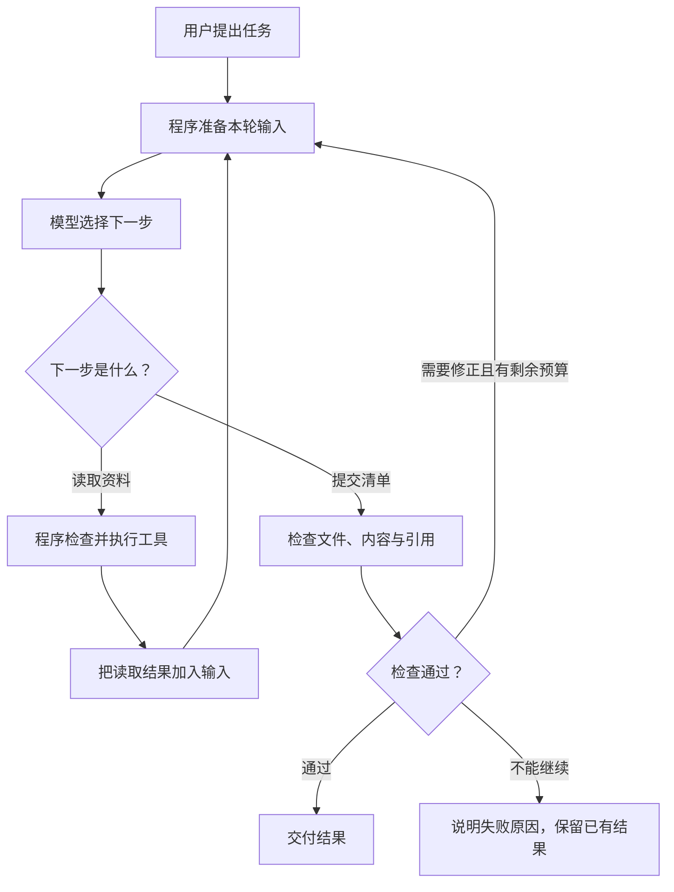

# 从一次读文件，理解 Agent 的各个组件

> 状态：draft | 本文是阅读入口。12 个组件、Memory、Skills、自进化分别有完整章节；示例沿用仓库的虚构教学产品 Pine SDK。

假设你对 Agent 说：

> 看一下 Pine SDK 从 v1 升级到 v2 要改什么，给我一份有原文出处的清单。

两份说明里各有三条内容。旧版使用 `X-API-Key` 认证，默认超时 30 秒，默认重试 3 次；新版改成 `Authorization: Bearer`，默认超时 10 秒，默认重试 0 次。目录里还混着一份已经废弃的预览稿，里面写的是另一组值。

人来做这件事，大概会先打开文件，确认版本，把两份说明放在一起比较，再检查有没有遗漏。Agent 也需要获得这些信息。但模型并不会因为你在提示词里写了一个目录，就自动打开电脑上的文件。必须有程序接住它的读取请求，打开文件，把内容送回模型；模型再根据刚读到的内容决定下一步。

**我们要理解的组件，就藏在这些具体步骤里。** 先看它们怎样一起做完一件事，再到各章研究细节。

## 先跟着一次任务走一遍

程序首先保存用户的要求：比较正式 v1/v2，报告要有新旧值和出处。它还给模型一份工具说明，告诉它可以列目录、读取文件、写清单。

模型发出读取请求，例如 `read_file(path="v1.md")`。这只是一个请求。Python 程序要先确认文件在允许读取的目录里，然后才真正打开它。读取结果被加入下一次模型请求，模型这时才知道旧版超时是 30 秒。

读完 v2 之后，模型已经有了新旧资料，可以提出“超时从 30 秒改成 10 秒”。程序把清单写入文件。随后另一个检查函数打开清单和原文，检查这条变化有没有写错、引用是不是来自正式版。检查通过，才有理由把结果交给用户。

图里是带修订步骤的一般设计。Mini Agent 目前是在循环结束后单独验收，还没有把验收反馈自动送回循环。看到这个差别，就能区分“我理解了一个设计”和“手上的程序已经实现了它”。

现在把任务变得稍复杂一些：资料很多，模型一次看不完；两个子 Agent 同时读文件；程序读到一半被关闭；最后报告虽然生成，却漏了一项。上下文、调度、恢复、评测这些组件，正是用来处理这些具体问题的。

## 1. 任务与协议层

“整理升级事项”可能意味着一份清单，也可能意味着直接修改业务代码。如果事先没说清楚，主 Agent 想要代码补丁，子 Agent 却交来一段说明，两边都会觉得自己没有问题。

这一层把要求写成双方能检查的约定：输入是哪两版资料，允许做什么，结果有哪些字段，什么情况算完成。独立章节从一条自然语言请求开始，逐步写成任务数据，再演示“JSON 能解析，结果却仍然不合格”的情况。

**读这一章：[任务与协议——把一句要求写成可执行的任务](05-task-contracts.md)。**

## 2. 模型接入层

程序要把问题交给模型服务，再把回复接回来。难点在于回复未必是一段普通文本：它也可能是一个工具请求、两个并列请求、被截断的 JSON，或尚未接收完整的流式片段。

这一章先走完一次请求和响应，解释消息、工具参数和调用 ID 的用途，再讨论如何更换模型、怎样处理流式输出，以及为什么服务没返回用量时不能记成零。

**读这一章：[模型适配器——看懂程序与模型之间的来回](03-model-adapters.md)。**

## 3. Agent 执行循环

第一次调用模型时，它没有文件正文。第二次调用时，程序把刚读到的 v1 放了进去；第三次又多了 v2。模型之所以能逐步完成任务，是因为每一轮实际看见的信息发生了变化。

这一章会把消息列表逐轮展开，对照 Python 循环阅读。你会看到工具结果怎样与请求配对，以及为什么模型说“完成了”、循环正常结束、清单通过验收是三件事。

**读这一章：[Agent Loop——跟着消息走完一次任务](02-agent-loop.md)。**

## 4. 编排与调度层：把计划变成满足依赖的执行

读 v1 和读 v2 可以同时做，比较新旧版本却必须等两边都有结果。即使模型列出的计划完全正确，也得有人真正安排先后顺序、等待子任务、处理其中一个失败的情况。

这一章用一个具体任务图解释哪些任务已经可以开始，哪些还在等待。如果 v2 后来被换成新版资料，你还能跟着例子判断：需要重做哪些步骤，哪些结果可以继续使用。

**读这一章：[规划与重规划](../../08-planning-workflow-multi-agent/01-concepts/01-planning-and-replanning.md)。**

## 5. Agent 通信与交接：传递结果，也明确控制权

Reader 发回“我看过 v2 了”，主 Agent 仍不知道新超时是多少，也不知道原文在哪。通信真正要传的是下游完成任务所需的信息。

这一章展开一份委派消息和一份返回结果，解释它们怎样对应。也会区分“帮我读一份资料，读完交回来”和“这件事接下来由你负责”，以及重复、迟到的结果为什么不能随手覆盖新结果。

**读这一章：[任务交接——让接手的人知道该做什么](../../08-planning-workflow-multi-agent/02-patterns/01-task-contract-and-handoff.md)。**

## 6. 上下文管理：选择本次调用真正能看到的信息

程序里保存了十份资料，模型这次请求里却只放了两段。剩下的资料即便就在磁盘上，也不会自动进入模型的判断。

这一章从“文件存在”和“内容已进入请求”的区别讲起，实际计算信息占用了多少空间，展示裁剪前后留下了什么。你还会看到摘要怎样把“预览版可能改为 5 秒”误写成“正式版是 5 秒”。

**读这一章：[上下文模型](../../04-context-engineering/01-concepts/01-context-model.md)。**

## 7. 状态与产物管理：保存进度，也保存能复核的成果

“已读完 v1”是一条进度；“v1 原文和最终清单”是实际内容。程序既要知道工作做到哪一步，也要保存做出来的东西。

这一章先展示一个任务的状态怎样变化，再讲为什么文件要关联版本。两个子 Agent 同时修改同一条记录时，后写入者可能把先写入者的工作覆盖掉；具体的读写时间线会帮助你理解版本检查在防什么。

**读这一章：[State 与 Checkpoint](../../07-state-and-memory/01-concepts/01-state-and-checkpoints.md)。**

## 8. 工具与执行环境：把模型请求变成受控操作

模型写出 `read_file` 这几个字，文件不会自己被打开。工具运行时需要找到对应函数、检查参数、执行读取，并把成功或失败如实返回。

这一章跟踪一次调用怎样经过这些步骤。还会解释工具描述与实际工具的关系，MCP 连接解决哪部分问题，以及限制文件路径为什么不能替代运行陌生代码所需的隔离环境。

**读这一章：[工具运行时](../../05-tools-skills-protocols/02-patterns/01-tool-runtime.md)。**

## 9. 持久化与故障恢复：进程退出后从哪里继续

写过日志不等于能恢复。假设报告已成功上传，但程序在保存回执前断电了；重启时直接再上传一次，可能产生重复报告。

这一章用三个明确的中断位置解释恢复程序能知道什么、还不知道什么。先看一笔本地模拟操作怎样被执行两次，再看同一操作标识怎样避免重复效果。读完就能解释为什么“重试”不是简单地重新运行整个函数。

**读这一章：[持久执行](../../09-runtime-harness-environment/01-concepts/02-durable-execution.md)。**

## 10. 评估与验收：当前结果能否交付，系统修改是否有效

清单生成了，却把 10 秒写成了 5 秒，任务仍然没做好。检查这一份清单，是运行结果验收；让两个系统版本各做一批任务再比较，是离线评测。

这一章从一份看起来成功、实际出错的结果开始，解释检查器到底应该读什么，再手算一组任务的成功率。你会看到，删除失败任务、只看平均分或把标准答案交给被测模型，分别会怎样改变结论。

**读这一章：[评测对象与系统模型](../../10-evaluation-observability/01-concepts/01-evaluation-model.md)。**

## 11. Trace 与可观测性：用运行证据定位第一次偏离

模型为什么用了预览稿？可能是正式版没搜到，也可能是搜到了却没装进输入，还可能是模型看到了两份资料但选错了。只看最终答案分不清这些情况。

这一章把一次任务的调用、工具结果、上下文和检查记录连起来，带你找出最早能观察到问题的地方。Trace 记录外部可观察的过程；它并不等于读取模型的内部思维。

**读这一章：[Trace 与失败分析](../../10-evaluation-observability/01-concepts/05-traces-and-failure-analysis.md)。**

## 12. 权限与资源控制：每次动作都受执行边界约束

只允许读资料目录，必须在读取函数真正打开文件前检查。最多使用一份预算，也不能只在提示词里写一句“请节约”。

这一章先解释一次操作怎样判断是否允许，再用两个子任务同时申请额度的例子，说明预算为什么要预留、何时结算。并发上限、请求速率和总调用次数限制也会分别解释，它们控制的是不同事情。

**读这一章：[权限、并发与预算](../../09-runtime-harness-environment/01-concepts/03-concurrency-and-budgets.md)。**

## 增强一：长期记忆 Memory

用户这次说“以后默认用表格”，下次任务不应该还要从头确认。要做到这一点，程序必须保存偏好、在合适的任务里取出来，并且在用户临时要求项目符号时遵从这次要求。

这一章会跟着一条记忆走过写入、检索、使用、更新和删除。先运行简单的格式偏好实验，再讨论经验如何保留来源、适用范围和有效期。

**读这一章：[Memory 的生命周期](../../07-state-and-memory/01-concepts/02-memory-lifecycle.md)。**

## 增强二：技能库 Skills

做过几次升级清单之后，“确认版本、逐项比较、保留引用、检查遗漏”可以整理成一套方法。下一次做同类任务时，Agent 可以先读这套方法，再操作具体资料。

这一章展示一个技能包怎样组织、怎样逐步加载，并解释它与工具、知识资料、长期记忆的区别。技能里写“运行脚本”只是方法说明，实际脚本能不能运行仍由执行环境决定。

**读这一章：[Skills 与渐进加载](../../05-tools-skills-protocols/01-concepts/02-skills-and-progressive-disclosure.md)。**

## 增强三：自进化机制

在一次任务里读错文件后改正，是这次执行中的修订。把多次读错文件的原因找出来，修改方法，再确认修改没有让其他任务变差，才开始涉及系统跨任务的改进。

这一章跟着一个失败案例提出修改，比较修改前后的逐题结果，再决定采用还是放弃。改进的对象可以是提示词、工具、技能或策略，不一定要更新模型参数。

**读这一章：[从失败案例到系统改进](../../12-agent-learning/02-patterns/01-feedback-to-improvement.md)。**

## Harness 把这些部分放到一起

Loop 负责继续调用，工具负责执行，上下文决定模型看什么，状态保存进度，验收检查结果。Harness 是这些程序围绕一次 Agent 运行共同工作的整体。它不是另一个必须创建的 Agent，也不是给代码换一个名字就自动获得的能力。

单独一章会沿着 Mini Agent 的真实主程序，把这些职责重新放回执行顺序，解释怎样从最小脚本逐步补上必要的控制。

**读这一章：[Runtime 与 Harness](../../09-runtime-harness-environment/01-concepts/01-runtime-and-harness.md)。**

## 建议怎样读，怎样动手

如果还没有完整运行过 Agent，先读任务、模型接入和执行循环三章，再运行 [Mini Agent 项目](../../../20-Projects/00-mini-agent/README.md)。此时不需要一口气读完所有组件。打开自己的 `messages.json`、`report.md` 和 `acceptance.json`，把刚读的过程对应起来。

接着读工具、上下文、状态和评估。这几章能帮助你解释：文件为什么没读到，资料为什么没进入请求，结果为什么没通过检查。完成 [RAG 实验室](../../../20-Projects/01-rag-lab/README.md) 后，再借助逐题图表分析检索、上下文和回答的不同错误。

任务变长或引入多个 Agent 时，再读编排、交接、故障恢复、Trace 与资源控制。Memory、Skills、自进化则放在你已经能够检查一次任务是否完成之后。

每章都给出具体观察点和带解释的练习。读完后试着关掉文章，用自己的话回答：**输入是什么，程序先做了哪一步，中间保存了什么，哪一步失败会让结果变化？** 如果仍只能复述术语，就回到该章的数据和代码例子重新走一遍。
