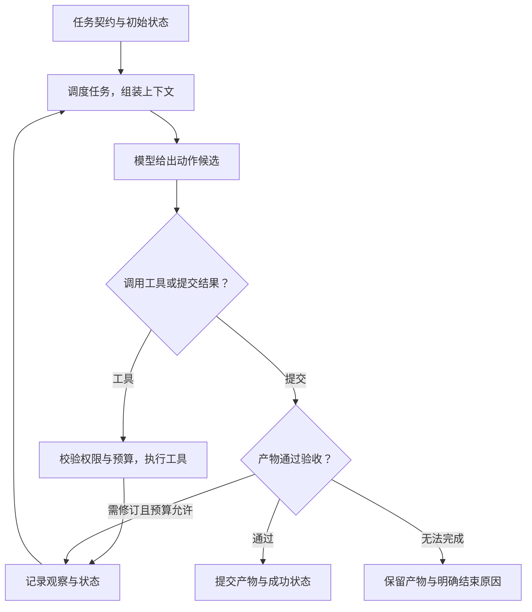

# Agent 核心组件：从任务契约到可验收的执行

> 状态：draft | 来源核验：2026-09-17 | 本文是架构讲解与学习设计；字段、伪代码和故障练习不代表现有项目全部实现。

**这 12 项描述一个 Agent 系统需要承担的职责，3 项增强能力描述系统如何跨任务积累和改进。** 小项目可以把多项职责写在同一个 Python 文件里；任务变长、执行并发增加后，再按边界拆模块。组件数量不等于 Agent 数量，也不要求部署成 12 个服务。

全文沿用 [Mini Agent](../../../20-Projects/00-mini-agent/README.md) 的任务：阅读 Pine SDK 的 v1、v2 说明，排除废弃预览稿，交付包含旧值、新值及双方原文出处的升级清单。Pine 是虚构教学产品。我们通过同一个任务说明每个组件为什么存在，再映射到真实 HotpotQA 数据的 [RAG 实验室](../../../20-Projects/01-rag-lab/README.md)。

已有专题继续承载各概念的正式定义和完整实现。本文按系统组件串起这些专题：**遇到什么问题 → 哪项职责负责 → 如何运作 → 用什么证据验收。** 标为“建议”“扩展设计”“预期”的产物尚不是新的运行结果；已有参考结果见文末项目入口。

## 先分清几个边界

| 容易混在一起的概念 | 分工 | 在升级清单任务中是什么 |
| --- | --- | --- |
| Agent 角色与系统组件 | 角色规定目标和工具范围；组件实现通用机制 | Researcher 负责查资料；调度器安排它何时运行，工具运行时检查它可以读哪些文件 |
| State、Context、Memory | State 保存任务事实；Context 是本次模型调用的可见输入；Memory 保存值得跨任务复用的信息 | State 记已读 v1；Context 装入相关原文；Memory 记用户明确要求默认表格 |
| 规划与执行保障 | 模型提出候选步骤；代码验证依赖、权限、预算并提交状态 | 模型建议并发阅读两版说明；调度器检查两个任务是否独立、资源是否够用 |
| 运行中 Evaluator 与离线 Evals | 前者决定当前产物能否进入下一步；后者比较系统版本的整体表现 | 检查这份清单的引用；比较一批任务在两版提示词下的结果 |
| Harness 与某个 Agent | Harness 是包围 Agent 运行的机制组合，不是一个特定角色 | Loop、上下文、工具、状态、权限、预算、验收、观测共同支撑任务 |

Harness 的范围在不同工程中可能不同。本文沿用本库 [Runtime 与 Harness](../../09-runtime-harness-environment/01-concepts/01-runtime-and-harness.md) 的工程约定；这份 12 项清单是教学组织方法，不宣称它是行业统一标准。固定工作流与模型动态选动作的区别，可对照 [Agent 边界](01-agent-boundaries.md)；Anthropic 的工程文章也从这一区别讨论组合模式。([Building effective agents](https://www.anthropic.com/engineering/building-effective-agents))

## 一次任务如何穿过这些组件



图中只画主循环。父子任务通过第 4、5 项衔接；第 7、9 项分别保存运行事实并处理重启恢复；第 11 项记录经过；第 12 项约束实际动作。取消、超时、预算耗尽和不可恢复错误也会从运行中的任一相应检查点进入终态，不必等到模型提交结果。

## 阅读目录

| 逐项展开 |
| --- |
| [1. 任务与协议层](#1-任务与协议层) |
| [2. 模型接入层](#2-模型接入层) |
| [3. Agent 执行循环](#3-agent-执行循环) |
| [4. 编排与调度层：把计划变成满足依赖的执行](#4-编排与调度层把计划变成满足依赖的执行) |
| [5. Agent 通信与交接：传递结果，也明确控制权](#5-agent-通信与交接传递结果也明确控制权) |
| [6. 上下文管理：选择本次调用真正能看到的信息](#6-上下文管理选择本次调用真正能看到的信息) |
| [7. 状态与产物管理：保存进度，也保存能复核的成果](#7-状态与产物管理保存进度也保存能复核的成果) |
| [8. 工具与执行环境：把模型请求变成受控操作](#8-工具与执行环境把模型请求变成受控操作) |
| [9. 持久化与故障恢复：进程退出后从哪里继续](#9-持久化与故障恢复进程退出后从哪里继续) |
| [10. 评估与验收：当前结果能否交付，系统修改是否有效](#10-评估与验收当前结果能否交付系统修改是否有效) |
| [11. Trace 与可观测性：用运行证据定位第一次偏离](#11-trace-与可观测性用运行证据定位第一次偏离) |
| [12. 权限与资源控制：每次动作都受执行边界约束](#12-权限与资源控制每次动作都受执行边界约束) |
| [增强一：长期记忆 Memory](#增强一长期记忆-memory) |
| [增强二：技能库 Skills](#增强二技能库-skills) |
| [增强三：自进化机制](#增强三自进化机制) |

## 1. 任务与协议层

“帮我整理升级事项”留有许多空白：比哪两个版本，哪些资料可信，要不要修改代码，交付清单还是补丁？任务层把这些空白补成**参与者都能检查的契约**。这里的协议首先指内部任务和结果的数据约定；跨系统通信协议属于第 5 项。

输入来自用户目标及宿主配置，输出是一份经过校验的任务描述。任务 ID 由宿主分配，权限来自已认证身份，验收规则由任务定义或独立评测器提供；这些字段不能由执行模型随意改写。必要信息缺失时，可以保留明确的待确认项，不能用猜测偷偷替换硬约束。

| 契约字段 | 解决什么问题 | 本任务的教学设计 |
| --- | --- | --- |
| `task_id`、`run_id`、`schema_version` | 区分业务任务、执行次数及格式版本 | 同一升级任务可以做多次独立实验，每次有不同 run_id |
| `goal`、`inputs` | 确定要交付什么、依赖哪些输入 | 比较正式 v1/v2 文档；固定输入快照或内容哈希 |
| `constraints`、`budget_ref` | 保留资料范围和宿主预算引用 | 不把 preview 当正式版；执行器只可访问授权目录 |
| `output_schema` | 让下游读懂返回值 | 每项含 topic、old、new、old_evidence、new_evidence |
| `acceptance_policy_ref` | 确定成功条件 | 检查三项变化、版本及双方证据；标准答案只给评分器 |
| `error` | 明确为什么没有结果 | 区分无效任务、资料缺失、工具失败、取消和预算耗尽 |

Schema 是结构契约。JSON Schema 的 `required` 控制必填字段，`additionalProperties` 可以限制额外字段；只写 `properties` 不会自动让字段必填。([JSON Schema 对象规则](https://json-schema.org/understanding-json-schema/reference/object)) 结构通过之后，还要检查业务意义：`new="5 秒"` 是合法字符串，但可能来自废弃预览稿。结构校验无法独自证明事实正确。

例如，旧值和新值都有引用，却分别指向两个相同版本，这份结果能被 JSON 解析，仍不满足升级任务。把验收规则与结果结构分开，可以解释“格式错”“证据错”“结论错”三类失败，并让执行者按明确反馈修订。

**怎样验收这一层：** 保存规范化任务描述和校验结果。缺少目标版本应在开始执行前被拒绝或进入待补充状态；缺少输出必填字段应得到结构错误；把预览稿作为新版本证据应被业务验收拒绝。一个失败结果应带错误类型和已有产物引用，不能用空字典同时表示“没运行”和“没有发现变化”。

继续读 [任务契约与交接](../../08-planning-workflow-multi-agent/02-patterns/01-task-contract-and-handoff.md) 与 [结构化输出和工具契约](../../05-tools-skills-protocols/01-concepts/01-structured-output-and-tool-contracts.md)。

## 2. 模型接入层

模型服务可能返回文字、工具请求、拒绝、截断响应，或者逐步到达的流式事件。接入层把它们转换成运行时理解的类型，并保留原本的结束原因。这样更换模型时，文件权限、任务状态机和验收规则仍可复用。

这一层的输入是经过上下文管理的消息、允许展示的工具描述及生成配置；输出是标准化的响应。以下是**教学接口草图**，不是仓库中已统一实现的 API：

```text
ModelRequest:
  model_id, messages, tool_schemas, output_schema,
  max_output_tokens, deadline

ModelResponse:
  text, tool_calls[{call_id, name, arguments}],
  finish_reason, usage, request_id, provider_metadata
```

它需要两类映射。请求方向把内部消息和工具 Schema 转成服务支持的格式；返回方向把服务事件还原成完整调用及结果。支持“兼容 API”不等于支持所有特性：工具调用、严格结构化输出、图片、流式用量可能不同。应记录能力配置，缺少必需能力时明确失败或按事先声明的降级方式运行，不能偷偷把工具模式变成普通聊天。

**工具调用适配不执行工具。** 对客户端工具，模型产生调用请求，由宿主执行并返回工具结果；这是官方工具使用文档描述的分工。([Tool use with Claude](https://platform.claude.com/docs/en/agents-and-tools/tool-use/overview)) 执行前仍由第 8、12 项校验参数和权限。流式传输时，先按调用 ID 汇集参数片段，待一个调用完整并通过校验后才能执行；半个 JSON 不能触发写文件。

升级任务中，模型可能一次请求读 v1 和 v2。接入层应保留两次调用和各自 ID；是否并发由执行器判断。丢掉第二个调用、把两个结果配错 ID，都会使模型误以为资料已经齐全。原生工具调用和“文本中输出 JSON 动作”也要注明模式，不能以相同名称掩盖能力差异。

用量只记录服务端实际提供的字段，未知记为未知，不能当作零。模型名、可获得的版本、采样参数、提示词版本和请求 ID 共同帮助复盘；缺少供应商版本信息时，应说明只能固定配置，无法保证完全复现同一服务端模型。

**怎样验收这一层：** 用契约样例分别输入普通文本、双工具调用、截断参数、拒绝及缺少 usage 的响应。检查归一化结果与失败类别、调用 ID 的配对，确认错误响应没有执行工具。再用真实模型跑同一任务，另行检查结果质量；适配器测试通过只证明格式转换正确。

继续读 [模型适配器](03-model-adapters.md)，可运行接入见 [Mini Agent providers.py](../../../20-Projects/00-mini-agent/mini_agent/providers.py)。

## 3. Agent 执行循环

执行循环把单次模型调用变成持续推进任务的过程。关键在于**下一轮能利用上一轮真实操作得到的观察**。第一次读取目录才知道文件叫什么，读到 preview 才知道它不是正式版，验收指出缺少旧值出处后才补读 v1。ReAct 论文讨论了推理与行动交替、使用环境反馈推进任务的方法；工程实现不需要保存模型隐藏思维过程。([ReAct](https://arxiv.org/abs/2210.03629))

Loop 接收任务与当前状态，向上下文组件取本轮输入，调用模型适配器取得动作候选，再把动作交给工具运行时。它负责执行顺序和停止条件，具体存储、授权与工具实现由对应组件承担。下面是**说明控制顺序的伪代码**，辅助函数均是接口占位，不能直接当作完整程序执行：

```text
重复直到宿主给定的步数上限：
    检查取消、任务期限和剩余预算
    context = 按任务、权限和预算组装上下文(state)
    response = 在预算内调用模型(context)
    记录响应、实际用量及本轮状态
    如果 response 是不可恢复错误：保存明确结束原因并退出
    如果 response 包含完整工具调用：
        对每个调用：校验结构、权限与资源，执行并保存观察
        继续下一轮
    如果 response 提交了候选结果：
        verdict = 验收实际产物及证据
        如果通过：保存结果与成功状态并退出
        否则：把可公开的验收反馈写入状态，按剩余预算继续
达到上限：保存 budget_exhausted，不把未验收产物记为成功
```

这是带运行中验收的扩展设计。现有最小 Loop 的 `completed/model_finished` 仅表示正常结束，仍需独立检查答案。**模型提出 finish、程序执行完毕和产物通过验收，是三个不同事件。** 即便工具写文件成功，也可能只写出一项变化，任务仍未完成。

| 观察到的情况 | 循环如何回应 | 为什么 |
| --- | --- | --- |
| 文件不存在 | 记录失败观察，允许在预算内重新查目录 | 可修正的工具错误能够提供下一步线索 |
| 同一请求反复得到相同结果 | 用任务进展信号判断是否停止或重新规划 | 调用次数增加不代表新信息增加 |
| 模型拒绝或输出截断 | 保留具体类型，按明确策略处理 | 不能把所有情况当成“再试一次” |
| 预算耗尽或取消 | 停止新增工作，保留部分产物和终止原因 | 无法完成也必须有可追查的结果 |

轮数只是预算的一种：一轮可以调用多个工具，也可能发送很长的上下文。需要明确“步”如何计数，并同时考虑模型调用、工具调用、Token、墙钟期限等限制。重复检测也不应只看工具名；两次 read_file 读取不同页可能是有效进展。

**怎样验收这一层：** 留下逐轮动作、观察、步数和终止原因。正常任务应有真实产物并通过检查；故意让模型反复读同一文件或只输出“完成”，应分别触发无进展/预算停止或验收失败。脚本驱动的 demo 可验证这些机制，真实模型完成率必须单独测量。

继续读 [Agent Loop](02-agent-loop.md)；主项目实现见 [Mini Agent runtime.py](../../../20-Projects/00-mini-agent/mini_agent/runtime.py)。

## 4. 编排与调度层：把计划变成满足依赖的执行

比较 Pine SDK v1/v2 时，两份版本说明可以分别读取，但升级清单必须等两份证据齐全后再生成。**编排负责决定任务怎样拆、交给谁；调度负责检查哪些任务现在可以运行，并管理它们的生命周期。** 角色名称不能代替依赖关系，写出“先研究、再总结”也不能保证程序真的等待研究完成。

可以先用固定流程表达这个任务，再考虑让模型发现缺口并提出新子任务。Anthropic 对预定义工作流与动态编排的区分可以帮助理解这两种设计；这里的 Pine 任务图是本教程的扩展设计。([官方说明](https://www.anthropic.com/engineering/building-effective-agents))

| 任务 | 输入 | 必须等待 | 输出契约 |
|---|---|---|---|
| 读取 v1 | v1 文件引用 | 无 | 带来源位置的旧行为 |
| 读取 v2 | v2 文件引用 | 无 | 带来源位置的新行为 |
| 比较版本 | 两份读取结果 | 两个读取任务通过校验 | 变更、迁移动作、证据引用 |
| 验收清单 | 比较结果与源文件 | 清单产物已写入 | 逐项通过或失败及原因 |

模型可以建议“补查预览版与正式版的区别”，但代码必须核对目标范围、依赖是否成环、输出格式、权限和剩余预算，才能把建议加入新计划。运行时从待执行节点中选择就绪节点，为其分配名额与预算，再登记启动；完成后先校验结果，才解除后继任务的阻塞。输入更新时，需要作废受影响的后继结果，不能把旧证据生成的清单继续当成有效产物。

下面仅展示调度判定的伪代码，不是可运行项目：

```python
ready = [t for t in plan
         if t.status == "pending"
         and all(outputs[p].accepted for p in t.depends_on)]
for task in ready:
    # 在同一受控操作中检查并预留资源，避免并发超发。
    ticket = runtime.try_reserve(task, limits)
    if ticket is not None:
        runtime.launch(task, ticket)
```

常见失败有三类：前驱仅“返回了文字”就启动后继；子 Agent 可以无限创建新任务；失败后整个计划反复重跑。分别应检查产物契约、限制递归与总任务预算、按依赖定位需要重算的范围。没有任何就绪节点且没有运行任务时，还要区分“全部完成”和“被失败前驱阻塞”，不能让调度器一直等待。

**学习验收**可以故意让 v2 读取失败：比较任务应显示被阻塞，已完成的 v1 结果仍能找到。可观察产物是任务表或时间线，至少包含依赖、计划版本、开始结束事件、状态与阻塞原因；这些是预期行为，不是本文实测结果。在 RAG 中，同样的机制可以表达“补查缺失证据后再生成答案”，独立检索能否并行取决于查询之间是否有依赖。

继续读[规划与重规划](../../08-planning-workflow-multi-agent/01-concepts/01-planning-and-replanning.md)、[状态机与 DAG](../../08-planning-workflow-multi-agent/01-concepts/02-workflow-state-machines.md)。[Mini Agent 第 06 课](../../../20-Projects/00-mini-agent/lessons/06-parallel.md)已有固定分工的 Reader 示例，不等于实现了上述动态任务图。

## 5. Agent 通信与交接：传递结果，也明确控制权

主 Agent 让 Reader“看一下 v2”，Reader 返回一篇概述，主 Agent 却需要逐项引用。这类失败首先是交付约定不清。**通信层负责让消息与正确任务关联，交接机制还要说明谁继续负责下一步。** 它使用第 1 节的任务契约，不另外发明一套业务目标。

需要区分两种关系：委派子任务时，主 Agent 保留总任务责任，等待或稍后收集返回结果；转交控制权时，接收方接续当前任务，原执行方不能同时继续推动同一流程。这里把前者称为 `delegate`、后者称为 `handoff`，是本教程的控制语义；不同框架的名称可能不同。OpenAI Agents SDK 的 `handoff()` 明确把控制权交给指定 Agent，可作为后一种语义的具体参考。([官方说明](https://openai.github.io/openai-agents-python/handoffs/))

对 Pine 任务，委派两个 Reader 更自然：主 Agent 负责最终比较，每个 Reader 只负责指定版本的证据。交接包至少说明下面这些信息；字段是教学设计，尚未对应新的运行实现。

| 信息 | 在本例中的作用 |
|---|---|
| `message_id`、父子任务 ID、尝试编号 | 将回执对应到某次委派，识别重复或迟到结果 |
| 目标、输入引用及版本 | 明确只提取哪个版本的哪些行为 |
| 输出 Schema、验收条件 | 要求事实条目及可回读的原文位置 |
| 截止时间、预算、接收方 | 限定责任范围，防止相互无限委派 |
| 运行时绑定的授权上下文 | 控制可读资料；不能由模型自行声明权限 |

收到“任务已接收”只表示消息送达，不能写成子任务成功。Reader 返回时要携带状态、产物引用、未解决问题和错误类别；主 Agent 核对任务与尝试编号、Schema 和证据版本，再决定接受、补查或结束。若旧尝试在重试成功后才返回，应记录迟到结果，不能覆盖当前成果。转交控制权还需要受控地更新当前执行者，明确接收失败时谁承担恢复责任。

常见问题是把全部聊天记录群发、用一句“已经完成”代替产物、失败只发空对象。前者会混入无关数据和旧指令，后两者会让主 Agent 无法区分没有发现变更、尚未执行和读取失败。交接应传必要上下文与引用，接收方回读原文时仍需独立权限检查。通信可以先用函数返回值或本地队列实现，不需要为了“多 Agent”先部署消息系统。

**学习验收**应观察每份结果能否追到唯一委派：模拟重复返回、错误任务 ID 和失败回执，检查它们不会被静默采纳；若做 handoff 扩展，再验证同一任务不会同时由两个控制者推进。建议展示交接记录表，而非只展示 Agent 对话。RAG 多路调查也需要传回查询范围、证据版本和缺口，只有一段汇总文字不足以支持后续引用核验。

继续读[任务契约与交接](../../08-planning-workflow-multi-agent/02-patterns/01-task-contract-and-handoff.md)、[多 Agent 拓扑](../../08-planning-workflow-multi-agent/01-concepts/03-multi-agent-topologies.md)。

## 6. 上下文管理：选择本次调用真正能看到的信息

Pine 资料已经下载到磁盘，不代表模型看过它；给出文件路径，也不等于把正文送进模型。沿用[上下文模型](../../04-context-engineering/01-concepts/01-context-model.md)的定义，Context 是本次模型调用实际接收的信息。State 保存“已经读过哪些资料、哪些任务未完成”等运行事实；Memory 保存以后任务值得复用的经验。Context 从这些来源选择信息，不能取代它们。

上下文构建器每轮都要重新判断：当前要解决什么、哪些材料获准使用、哪个版本有效、还有多少空间。输入通常包括任务契约、当前状态、候选证据、近期工具结果与可用工具；输出除了消息，还应有选择记录，解释哪些内容被加入、删除、压缩。Anthropic 的上下文工程文章强调对持续变化的信息进行选择和维护；本节具体流程与验收方式是教学设计。([官方文章](https://www.anthropic.com/engineering/effective-context-engineering-for-ai-agents))

流程可以用下面的伪代码表达；所列函数需要单独实现：

```python
scope = access.resolve(trusted_identity, task)
# 先限定可访问检索范围，读取正文、外部重排前再次核对权限。
candidates = retrieve(query, allowed_scope=scope)
items = validate_sources_and_versions(candidates, task)
items = deduplicate(items)
context, manifest = pack_with_budget(
    required=[task.goal, task.constraints, task.output_schema],
    state_summary=state.current_summary,
    evidence=items, reserve_for_output=True,
)
```

权限是硬过滤，不能先在全量私有材料中召回并交给模型，再删掉无权限结果。预算也不是把窗口全部装满：目标、硬约束、输出契约和必要协议开销先占位，还要为回答与后续工具结果留空间。必需内容已经放不下时应显式失败；可选内容过多时先去重、分段读取，再考虑摘要。摘要要保留原文引用及有损标记，不能把“预览版可能采用某行为”压成“正式版采用该行为”。

本例中，每个 Reader 只需要其负责版本的资料；比较者需要两份证据及适用版本，不必继承双方所有搜索失败记录。但尚未解决的错误、证据冲突和用户最新要求不能在压缩时消失。工具协议中的调用与结果也要保持匹配，避免裁剪后留下无对应调用的结果消息。

**学习验收**可加入无关长文档、预览版说明和一条更新要求，检查关键约束与版本信息仍在实际请求中；再缩小预算，观察被删除内容及原因。预期产物是上下文清单：来源 ID、版本、保留方式、Token 计数口径和丢弃原因。RAG 的召回结果只是候选信息，检索找到证据不等于证据最终进入模型；应把这两个阶段分别记录，才能判断错误来自召回还是装配。

继续读[Context Builder](../../04-context-engineering/02-patterns/01-context-builder.md)和[上下文失效模式](../../04-context-engineering/01-concepts/02-failure-modes.md)。

## 7. 状态与产物管理：保存进度，也保存能复核的成果

模型说“已完成升级清单”，但文件不存在，这个任务尚未完成。State 管理运行事实，Artifact（产物）保存可交付、可复核的内容。对 Pine 任务，状态记录读取进度、当前计划版本、剩余预算和有效产物引用；源文档快照、证据条目与升级清单则作为产物保存。第 9 节讨论它们怎样持久化和恢复，这一节先解决对象含义、版本关系与更新规则。

**不要把大段正文不断复制到状态中。** 状态保留引用和校验信息，让产物可以独立读取；产物清单则记录由哪个任务、哪组输入和配置生成。下面是教学字段约定，不是实际运行结果：

| 对象 | 最小信息 | 用途 |
|---|---|---|
| 任务状态 | 任务 ID、状态、版本、错误、产物引用 | 判断后续步骤能否开始 |
| 证据产物 | 来源文件、版本、原文位置、内容校验值 | 核对结论来自哪段原文 |
| 清单产物 | 产物 ID、输入证据版本、生成配置、内容校验值 | 追踪结果并比较修订 |
| 验收记录 | 被验收产物版本、规则版本、逐项结果 | 防止旧 PASS 被套到新清单上 |

两个 Reader 不应同时覆盖一份 `report.md`。更容易理解的设计是每个子任务写独立产物，协调者校验后合并：证据按来源与版本去重，状态按任务 ID 汇总，最终清单由明确的写入者负责。两个结果对同一行为给出不同判断时，要保留冲突并查证，不能采用“最后返回的覆盖前一个”。

共享状态还会遇到丢失更新：两个写入者都读取版本 3，一个先提交版本 4，另一个仍按版本 3 写回。可以使用带版本条件的提交，后者发现版本已变就重新读取、合并，不能盲目覆盖。版本检查和更新必须放在同一受保护操作中。本库状态示例用 SQLite 事务实现这种检查；SQLite 同时只允许一个写事务，是其实现依据的一部分。([SQLite 事务文档](https://www.sqlite.org/lang_transaction.html))

保存成功也不代表内容正确。内容哈希可以发现字节变化，却不能证明引用支持结论；状态中“已通过”必须关联实际验收的那一版产物。先写完并核验产物，再提交引用及状态，避免出现成功状态指向半个文件。跨文件系统与数据库的一致性、提交中途崩溃怎样恢复，需要第 9 节继续处理。

**学习验收**可以让两个写入者提交不同版本，预期看到冲突被明确拒绝；再替换 v2 源文档或清单内容，原验收记录应失效。建议输出产物清单和版本差异表：从任意升级条目都能找到证据版本，从 PASS 都能找到对应产物。RAG 中也应把检索配置、逐题预测和评分记录关联起来，避免页面展示新答案、分数却来自旧运行。

继续读[State 与 Checkpoint](../../07-state-and-memory/01-concepts/01-state-and-checkpoints.md)、[共享状态与合并](../../08-planning-workflow-multi-agent/02-patterns/02-shared-state-and-merge.md)。

## 8. 工具与执行环境：把模型请求变成受控操作

Agent 要读取 Pine 文档、写出升级清单，必须通过真实工具完成操作。模型产生的是工具名和参数，**工具运行时负责验证请求、执行处理函数、收集结果；执行环境限定动作实际可以接触的资源。** 两者共同把“想做什么”连接到“做了什么”，不能用最终回答代替文件写入回执。

最小工具集可以只包含列目录、按范围读取文件和写产物；资料增多后再加入搜索。注册表应明确工具名称、输入输出 Schema、失败类型、是否有副作用及权限要求。下面是协议设计示例，不是本项目现有接口：

```json
{
  "call_id": "read-v2-1",
  "tool": "read_lines",
  "arguments": {"path": "docs/v2.md", "start": 1, "end": 20}
}
```

运行时收到请求后，先校验结构和范围，再把路径解析到授权工作区并检查权限，设置超时与输出上限，然后调用读取函数。成功结果应返回实际读取的范围、来源版本、正文和截断标记；失败结果应给出明确类别。`not_found`、`permission_denied`、`timeout` 不能都变成空文本，否则 Agent 会把读取失败误认为文件没有内容。输入合法也不意味着结果可信，工具输出还需要结构校验及必要的来源核验。

MCP 可以统一跨服务的工具发现与调用接口，但工具仍需真正连接、执行和检查结果。仅加载工具描述不等于已经完成接入。MCP 的 2025-11-25 工具规范明确区分协议错误与使用 `isError` 标记的执行错误；这里引用固定版本说明错误分层，不据此声称它是最新协议。([官方工具规范](https://modelcontextprotocol.io/specification/2025-11-25/server/tools))

环境边界需要由代码和操作系统机制落实。Pine 教学任务可以把资料目录设为只读，让产物写入独立目录；路径检查要考虑绝对路径、`..` 和符号链接解析，不能只检查字符串前缀。若扩展到运行生成代码，应进一步限制进程、网络、CPU、内存与执行时间。独立上下文或 Python 对象拷贝只能减少信息混用，不构成安全沙箱。

超时也是一个重要边界：宿主停止等待，不代表后台操作已经停止，更不证明写入没有发生。需要可取消的处理函数或可终止的隔离进程，并在恢复前核对动作结果；幂等与重试规则见第 9 节。工具返回的外部文本仍是数据，其中的指令不能获得额外权限。

**学习验收**可覆盖正确读取、不存在的文件、越界路径、超大结果和写入失败。预期观察到非法动作未执行、错误可分类、截断可见，写入成功后文件确实存在且与回执一致。建议展示调用表及输入、输出、错误、产物链接。在 RAG 中，搜索和重排同样是工具：一次搜索返回空集合与搜索服务失败必须分开记录。

继续读[工具运行时](../../05-tools-skills-protocols/02-patterns/01-tool-runtime.md)、[工作区与沙箱](../../09-runtime-harness-environment/01-concepts/04-workspaces-sandboxes-and-artifacts.md)和[MCP 专题](../../05-tools-skills-protocols/01-concepts/03-mcp.md)。

## 9. 持久化与故障恢复：进程退出后从哪里继续

比较 Pine SDK 两个版本时，Agent 已提取差异，但进程在生成清单前退出。重启后如果只有聊天文本，就很难准确判断哪些证据已经核验、哪些子任务尚未完成。状态管理定义这些运行事实，持久化则把它们可靠保存下来；故障恢复根据保存的事实决定接下来做什么。三者相关，但“有一个 State 对象”并不意味着进程退出后还能恢复。

一个检查点至少应关联 `run_id`、状态版本、已完成步骤、待处理操作、产物引用和剩余预算。Pine SDK 的原文与报告可以单独存放，检查点保存路径、版本或内容哈希，恢复时核对它们仍然存在且未被替换。还要检查程序和 Schema 是否兼容、授权是否有效，不能直接照着旧状态继续执行。具体定义和并发版本检查见[State 与 Checkpoint](../../07-state-and-memory/01-concepts/01-state-and-checkpoints.md)。LangGraph 也区分线程状态检查点和跨线程存储；其内存检查点在进程重启后会丢失，因此接入了 checkpointer 仍需确认存储后端。[官方持久化文档](https://docs.langchain.com/oss/python/langgraph/persistence)

假设进一步设计“把已验收清单发布到报告服务”的教学扩展。最棘手的故障是远端发布成功，但本地来不及保存回执。这时本地看到超时，真实结果却可能已经发生，应记为 `unknown_outcome`，不能直接判定失败并重新发布。恢复程序先用原操作标识查询远端；支持幂等请求时，可按对方约定携带原键重试；既不能查询也不能去重时，应暂停交由人工核对。检查点本身无法保证外部动作恰好执行一次。

这里需要区分两种身份：`operation_id` 表示一次逻辑发布，`attempt_id` 表示其中一次网络尝试。第二次尝试应获得新 attempt，但继续使用原 operation 及幂等键，并核对参数没有变化。否则每次重试都换键，远端会把它当成新的发布。相关机制见[持久执行](../../09-runtime-harness-environment/01-concepts/02-durable-execution.md)。

恢复策略还取决于错误类型。参数不合法应修正输入；无权限应停止该动作；临时连接失败可以在截止时间和次数限制内退避重试；结果未知则进入对账。取消意味着停止后续工作并处理在途请求，不能撤销已经发生的外部效果。把所有异常都送入同一个无限重试循环，会把局部故障放大。

本组件的验收应在“调用前、外部完成后但本地未确认、检查点提交后”分别注入中断，再重启检查。期望产物包括检查点、恢复事件、操作回执与远端记录对照表：已确认成果未丢失，同一逻辑动作未重复产生效果，未知结果有明确去向。这是完整系统的验收设计，不表示 Mini Agent 已实现报告发布与远端对账。

## 10. 评估与验收：当前结果能否交付，系统修改是否有效

Pine SDK 清单看起来完整，并不代表它准确。它可能引用不存在的行，把预览版特性当成正式版变化，或者只生成了一句“已完成”。运行中的 Evaluator 应读取真实产物，按任务协议中的验收条件决定通过、退回修改或因证据不足暂停；离线 Evals 则让多个系统版本完成同一批任务，判断整体能力、稳定性与成本怎样变化。两者可以复用评分函数，但运行时机、数据用途和结论范围不同。详细术语见[评测对象与系统模型](../../10-evaluation-observability/01-concepts/01-evaluation-model.md)。

针对升级清单，可以依次检查：文件是否真实存在且可解析；每条差异是否有新旧版本出处；文件与行号是否有效；引用内容是否支持该差异；任务要求的必需项是否遗漏。前几项适合确定性代码，语义判断可结合受控标注、规则和经过校准的模型评审。引用真实存在只说明位置有效，不代表它支持结论；格式正确也不能替代事实正确。

验收结果应绑定产物版本，保存 `artifact_hash`、`grader_version`、`criterion_id`、`status`、证据引用和失败原因。以下是教学设计中的期望结果：某条引用超出原文件范围时，返回 `citation_validity=FAIL` 并指向具体条目，调度层只把相关内容退回修正。报告之后发生变化，旧验收不能直接沿用。模型说“我检查过了”，或者几个 Reviewer 投票同意，都不能覆盖一个客观失败项。代码项目直接看补丁与测试，实验项目直接看约定条件下的仿真结果。

离线评测还要固定任务集合、输入资料、初始环境与系统配置，把验收答案留在被测系统之外。先运行基线，再改变一个因素，例如加入主动补查，比较逐题通过情况、引用质量、耗时和调用量。不能只展示改善的题目，也不能删除超时记录后再计算成功率；应同时呈现总体任务表现与基础设施错误分类。涉及随机生成时，单次差异不足以说明稳定提升，需要按评测目的安排重复运行和波动分析。

常见误判还有“程序没有抛异常，所以验收通过”和“本次分数更高，所以值得上线”。前者没有检查任务结果，后者忽略可能的成本增加、已有能力退化和评分器变化。评分器本身也需要验证：删除必需项、伪造引用、制造空报告时应能发现问题；合法的不同措辞不应被简单字符串比较误杀。

读者最后应该看到逐条验收表、失败证据和版本对照图，而不是孤立的 PASS。图表从逐题记录计算，并能回到原始产物重新核对。Mini Agent 与 RAG 项目各自已经提供哪些评分能力，应以对应项目说明为准；这里描述的是组件应承担的完整职责，没有预设模型成功率或提升幅度。

## 11. Trace 与可观测性：用运行证据定位第一次偏离

如果 Pine SDK 清单漏了一项变化，只看最终回答，很难区分“根本没读取 v2”“读取后被上下文裁剪”“模型看到了却没有采用”。Trace 应把一次任务经过的模型调用、工具调用、子任务交接和状态变更关联起来，让这些解释可以被检查。它保存可观察的运行事件、结构化决定及输入输出引用，不要求取得或记录模型隐藏思维链。相关定义见[Trace 与失败归因](../../10-evaluation-observability/01-concepts/05-traces-and-failure-analysis.md)。

可以把一次任务作为根操作，把读取资料、构建上下文、生成清单和验收分别记录为子操作。在 OpenTelemetry 中，Span 描述一段操作，Span Context 提供 Trace ID、Span ID 等关联信息，帮助跨进程串联执行路径；这是采用其数据模型的依据，不意味着本库已经接入 OpenTelemetry 导出。[OpenTelemetry Traces](https://opentelemetry.io/docs/concepts/signals/traces/)

对 Agent 系统，记录至少需要 `run_id`、`task_id`、父子关系、操作身份与尝试身份、开始结束时间、状态、错误类型、版本和产物引用。模型调用还关联模型配置、提示词版本、实际输入的安全引用及用量；工具调用关联参数摘要、权限判定和执行结果。跨 Agent 交接应保留委派与回传的关联，否则主任务只看到“子任务失败”，无法追到真正出错的读取操作。

对于漏项问题，一条有用的教学轨迹可以显示：读取工具返回了包含变化的 v2 片段；上下文装配记录表明该片段因预算被丢弃；随后清单缺少对应条目。这些证据支持先检查上下文策略。若片段已进入模型，也不能仅凭轨迹断言模型的内部原因，应通过保留证据、只改变装配方式等受控实验验证判断。Trace 帮助缩小问题范围，不会自动给出因果证明。

可观测性还需要把单次轨迹汇成整体信号：哪些错误最常见、时间主要花在排队还是模型调用、重试是否突然增加。计算总耗时时不能直接累加并行子任务的耗时；同一操作多次尝试也不能被算成多份成功成果。费用无法确定时标记未知并记录缺失原因，不能让仪表盘把缺失值显示成零。

日志本身也是数据出口。默认保存必要字段、脱敏摘要和受控产物引用，按需记录允许留存的完整内容；密钥、无关个人信息和未授权原文不应进入日志。关键权限与执行事件应由 Runtime 记录，不能只依赖模型主动汇报。验收时应能从一条失败清单追溯到对应输入、工具结果和检查器版本，发现断开的关联，并确认终态、失败和取消都有记录。期望产物包括操作时间线、失败分布图和可复查的单题轨迹。

## 12. 权限与资源控制：每次动作都受执行边界约束

Pine SDK 比较任务只需要读取资料目录、写入本次运行的输出目录。模型即使提出读取凭据文件，工具层也应在返回数据前拒绝；子 Agent 也不能因角色名叫“管理员”就获得更大权限。权限管理控制主体对工具和资源能做什么，资源管理控制允许消耗多少。它们由可信执行代码落实，提示词中的“请节约费用、不要越权”不能替代实际检查。

权限判定需要同时看调用主体、动作、目标资源和任务范围。例如教学策略可规定 `read_roots=[docs]`、`write_roots=[run_output]`；文件工具需要规范化路径并检查最终访问对象，不能只看字符串前缀。搜索返回、读取文件、下载和引用解析都应保持同一访问边界，不能先把所有资料送给模型，再让它自行过滤。委派时授权应保持原范围或进一步收窄，详见[身份与权限](../../11-safety-security-governance/01-concepts/02-identity-and-permissions.md)。

若后续教学设计加入报告发布，人工确认应绑定具体目标、内容版本和动作参数。批准某一版报告不能被挪用为发布另一版；对已授权的同一操作进行合法重试，也不应无故要求重复批准。恢复运行时还需重新核对当前权限和批准是否有效。人工介入应出现在系统不能自行裁决的具体边界，并展示可审查的动作。

资源侧至少区分并发、速率、队列容量、总预算和截止时间。并发限制“现在最多几项在跑”，速率限制“一段时间最多发几次”，两者不能互相替代。父任务及所有子任务应共享总账，排队、重试和取消清理也要纳入约定的时间口径，不能让每个子 Agent 都以为自己拥有一份完整预算。

例如一项教学预算还剩 1,000 Token，两个子任务分别请求最多 800 Token。如果它们都先读余额再发请求，就会同时通过检查。执行器应原子完成检查与预留，只放行可覆盖的请求；结束后按实际用量扣账并释放多余预留。预留需覆盖输入和输出的计量范围。若供应商返回未知用量，应保存未知状态与合理预留，按策略查询或保守结算，不能当作零消耗释放全部额度。无法取得可靠上界时，应明确这是软预算。机制详见[并发与预算](../../09-runtime-harness-environment/01-concepts/03-concurrency-and-budgets.md)。

验收应同时覆盖允许与拒绝：合法读取成功，越界读取不产生数据返回；并发请求不会突破上限；预算耗尽停止新动作；取消后不再派生任务，在途结果仍可追踪。期望产物是权限决策记录、预算预留与结算账本、并发时间线及最终停止原因。仅看到“请求被拒绝”的文字还不够，要检查真实文件和外部状态没有出现未授权变化。这里的共享预算与审批绑定属于架构要求，不应误写成当前 Mini Agent 已完整实现的能力。

## 增强一：长期记忆 Memory

第一次生成 Pine SDK 升级清单时，用户明确说“以后的升级报告默认用项目符号”。下一次启动程序，如果仍要求用户重复这句话，说明跨任务偏好的保存或使用链路没有起效，需要分别检查保存、召回和应用。Memory 适合解决这种跨任务重复信息的问题。它也可以保留经过验证的经验，但一条“预览稿曾导致错误”的教训，应同时记录当时的文档版本和验证结果，不能推广成“所有预览文档都没有价值”。正式定义与生命周期见 [Memory 专题](../../07-state-and-memory/01-concepts/02-memory-lifecycle.md)。

**关键是选择、更新和使用规则，而不是选哪种数据库。** 一条可复用记录需要主体、内容、来源、适用范围、更新时间；需要处理失效和并发更新时，再加入过期时间与版本。写入先核查来源、去重并处理冲突；读取先按主体、访问范围和时效过滤，再检索与当前任务相关的记录。最后由上下文管理决定注入哪些内容，保留“历史偏好”的身份。当前任务明确要求表格时，应覆盖默认项目符号，但不必因此永久改写用户偏好。

Memory 与核心组件的配合贯穿整个过程：权限层限制谁能读写；状态与产物层保存来源证据；持久化层负责记录的可靠保存；上下文层决定本次可见内容；Trace 记录采用了哪条记忆及其版本；评估层检查它是否改善任务，也检查过期或错误记忆造成的退化。写入数据库本身不意味着模型已经学习了，也不能证明后续任务使用了它。

常见混淆是把日志、State、Context 和 Memory 放进同一个“记忆库”。日志保存发生过的动作；State 保存当前任务进度；Context 是这次模型请求实际携带的信息；Memory 则需要跨任务复用的理由。同一条信息可以经过筛选成为记忆，但完整日志不应默认全部进入召回。数据库是存储手段，既能保存任务状态，也能保存记忆，不能靠底层介质区分二者。

**练习与验收：** 运行 [Mini Agent 记忆实验](../../../20-Projects/00-mini-agent/lessons/04-memory.md)，依次设置 `bullets`、新进程读取、用当前请求覆盖为 `table`、删除后再运行。保存三个报告及对应 `run.json`，做一张对照表：

| 条件 | 应观察到的结果 |
| --- | --- |
| 仅有持久偏好 | 项目符号，`format_source=memory` |
| 当前明确要求表格 | 表格，`format_source=current_request` |
| 删除偏好后重跑 | 默认表格，`format_source=default` |

三份报告的事实与引用应相同，独立验收都应通过。当前项目只实现显式格式偏好与单用户顺序操作；输出格式还由宿主渲染器应用，这个实验不能证明模型理解自然语言偏好。多用户隔离、时效与冲突处理可继续参考 [写入与召回模式](../../07-state-and-memory/02-patterns/01-memory-write-and-retrieval.md)。

## 增强二：技能库 Skills

当不同 SDK 的升级清单都要经历“确认正式版本—读取新旧说明—提取变化—保存引用—检查产物”，这套方法已经可以复用。Skill 适合在一类任务形成稳定做法后加入，帮助 Agent 找到并执行已有方法。它应写“怎样识别和核查变更”，而不是写死 Pine SDK 的三项标准答案。格式与渐进加载机制沿用 [Skills 专题](../../05-tools-skills-protocols/01-concepts/02-skills-and-progressive-disclosure.md)，这里关注它怎样接入系统。

一个升级报告 Skill 至少需要说明适用任务、所需输入、操作步骤、结果形式以及证据不足时怎么办。脚本可以校验引用位置、渲染表格；模板规定清单列；详细参考解释版本选择规则。加载时先用名称和描述筛选候选，确认适用后读取主说明，实际用到某个脚本或模板时再加载对应资源。这样避免每次模型调用都携带全部技能正文，也要求描述足够准确，否则省下上下文却漏选了正确方法。

核心组件仍负责执行保障。任务与协议层确定本次输入输出；上下文层装入选中的方法；执行循环决定当前动作；工具层实际读取文件、运行脚本；评估层检查产物。Skills 声明“需要访问文档目录”，只是提出执行前提，**不会取得新的权限**。工具与执行环境必须按现有授权检查每次操作；来源不可信的说明也不能通过“这是一项技能”覆盖宿主规则。缺少必要权限时，应返回未满足的条件，而非绕过检查。

技能包需要可辨认的版本，Trace 应能追溯本次加载的版本及运行的脚本。Skill 更新后若产物退化，才能判断是选择错误、流程遗漏，还是脚本实现出错。Memory 可以保存“用户通常偏好项目符号”，Skill 则提供“怎样生成有依据的清单”；两者能够配合，但不应让一条临时偏好悄悄重写整个工作方法。

常见误区包括：把一个工具换名叫 Skill；把长提示词当成已经验证的方法；只测试加载成功，不检查是否在错误任务上触发；把技能中的脚本视为天然可信。复用方法也有前提，例如没有旧版资料时，不能继续填出确定的新旧对照。

**练习与验收〔待扩展〕：** 将 Pine 清单的通用流程整理为一个技能包，准备四类输入：完整的新旧说明、与升级无关的润色请求、缺少旧版说明、带废弃预览稿的资料。保存选用决定、加载版本、实际读取记录、最终清单及独立验收结果。预期分别是完成清单、跳过技能、明确报告证据缺口、仅按可核实的正式版本下结论。用改变字段与数值的第二份教学资料检查是否写死答案。先做人工选用规则检查，再单独记录真实模型的选用与执行结果；两者不可混称模型成功率。现有 Mini Agent 尚无这套技能加载与实验，可参考 [学习工作台技能包](../../../20-Projects/learning-workbench/skills/evidence-comparison/SKILL.md)的组织方式。

## 增强三：自进化机制

Agent 读错 Pine SDK 文档后，在同一次任务里重新检索并修正清单，这是运行中的调整。若系统收集多次失败轨迹，提出新版本的文档选择策略，经过独立评测后让后续任务采用它，才构成本节讨论的跨任务改进机制。改动对象可以是 Prompt、工具、Skill、检索或调度策略；不必训练模型权重。应在验收可信、版本可追溯且能够回滚之后加入，否则只是把未验证的改动传播到更多任务。

从具体证据定位改动位置。若正式版从未进入候选，应先检查检索；若正式版已进入模型输入却仍采用预览稿，再检查上下文组织和版本判断；若结论正确但引用行号错误，检查来源映射与工具契约。相同的“清单验收失败”可能来自完全不同的层，直接让模型重写提示词不能替代定位。诊断方法见 [从失败评分到改进](../../12-agent-learning/02-patterns/01-feedback-to-improvement.md)。

一轮可检查的改进应留下：失败案例与轨迹引用、根因假设、候选修改、基线版本、评测配置、逐题结果和采用或拒绝决定。用开发任务产生和调整候选，在固定环境与预算下比较旧版和新版；同时记录修复了哪些题、退化了哪些题，以及耗时与调用量变化。最终验收集与开发过程隔离；某批任务一旦反复用于选版本，就应当视为开发集，不能继续声称它提供独立检验。

核心组件提供这个过程的边界：Trace 给出故障证据；状态与产物管理保存候选补丁及版本；编排层启动独立实验；评估层执行冻结的检查；权限与资源层限制候选能修改的范围和实验开销；持久化层保存采用记录与回滚目标。改进程序不得自行放宽权限、增加预算或降低评分门槛来制造提升。若确需修复评分器，应作为独立、可审查的变更，并重新计算旧版和新版结果，避免换尺子后直接比较分数。

常见误区是把一次自我反思当成已经进化；把模型说“更好”当成验收；只看平均分而隐去退化任务；把验收答案送进候选生成上下文；以增加调用预算换来的收益宣称策略更高效。某个候选没有提升是正常实验结论，保留旧版也是有效的采用决定。

**练习与验收〔待扩展〕：** 在开发资料中制造“预览稿与正式稿冲突”的失败，提出只修改版本识别方法的候选，再用未参与修改的 SDK 教学资料做对照。提交候选差异、运行配置、旧新版逐题结果、改善／不变／退化图，以及一次回滚后的版本与验收记录。通过标准是实验隔离成立、同条件比较可追溯、回滚确实恢复旧版本；不强制候选分数上涨。当前 Mini Agent 和 RAG Lab 均未实现自动候选生成与版本采用；RAG 已有的 [逐题对照与可视化报告](../../../20-Projects/01-rag-lab/README.md)可作为评测起点，但基线复现检查不等于自进化机制。

## 用现有项目学习这些组件

12 项职责需要按任务规模逐步落实。**先有清晰契约、最小循环、受控工具、可追查结果和独立验收，再按失败证据补充能力。** 一个短任务可以由单个 Agent 顺序执行；需要多个独立上下文时再引入子 Agent；任务跨进程持续运行时再建设可靠恢复。Memory、Skills 和自进化各有加入条件，不作为入门项目的完整性门槛。

下面依据当前项目代码和说明映射学习入口，避免把架构要求误写成已经实现的功能。这里不进行新的模型效果评测。

| 组件 | 项目 00：Mini Agent 已有实现及边界 | 项目 01：RAG Lab 已有实现及边界 |
| --- | --- | --- |
| 1 任务与协议 | 固定教学目标、工具 Schema、升级清单与引用验收 | 固定数据快照、预测格式与评分规则 |
| 2 模型接入 | demo/live 适配、实际返回用量；没有流式接入 | 单一兼容 API 回答入口；真实生成尚未实测 |
| 3 执行循环 | 模型—工具循环；demo 为预编轨迹 | active 最多两轮补查决策；真实生成路径尚未实测 |
| 4 编排与调度 | 计划记录、固定两个 Reader 分工；没有通用 DAG 调度 | 确定性检索流水线；没有多 Agent 调度 |
| 5 通信与交接 | 宿主分派、收集 Reader 回执；没有通用交接协议 | 没有跨 Agent 交接 |
| 6 上下文管理 | 保持完整调用/结果组裁剪，使用字符预算 | 分块、Top-K、按片段 ID 融合排名与字符预算装配 |
| 7 状态与产物 | 运行信息、计划、清单、引用和消息记录 | 逐题结果、配置、图表、查询轮次与模型事件 |
| 8 工具与环境 | 文件工具及路径检查；没有操作系统级沙箱 | 真实检索和重排；没有通用工具执行沙箱 |
| 9 持久化与恢复 | 保存运行记录，错误时明确停止；没有自动崩溃恢复 | 逐题保存与错误记录；没有断点续跑 |
| 10 评估与验收 | 独立清单验收和故障实验 | 评分复算、逐题参考对照和可视化诊断 |
| 11 Trace | 模型/工具事件、独立 Reader 记录 | 排名、上下文、响应、错误和实际耗时 |
| 12 权限与资源 | 工具与文件范围、轮数和调用限制；没有共享费用账本 | 每题资料范围、补查次数、请求超时和输出限制；不是生产授权系统 |
| Memory | 显式格式偏好、覆盖与删除；单用户顺序操作 | 没有跨任务记忆；检索语料不等于 Memory |
| Skills | 没有技能发现与加载 | 没有技能发现与加载 |
| 自进化 | 没有自动候选生成与版本采用 | 对照报告可作为基础；没有自动改进与发布回滚机制 |

Mini Agent 的 Reader 验收只证明各自读过指定文件并结束，不证明自然语言总结正确。RAG 的语义检索与重排已有实测记录；**生成答案与主动补查仍不能写成已验证的真实模型成绩**。字符数限制也不是模型 Token 上限：两项目有意保留了这条教学边界。

### 做完后具体看什么

先完成 [Mini Agent 的七步课程](../../../20-Projects/00-mini-agent/README.md)，查看 [参考清单](../../../20-Projects/00-mini-agent/reference/stage-07/report.md)、[逐项验收](../../../20-Projects/00-mini-agent/reference/stage-07/acceptance.md) 和 [完成报告](../../../20-Projects/00-mini-agent/reference/completion.md)。能解释“真实模型运行”“脚本教学运行”“任务验收失败”和“故障识别实验通过”的差别，才算读懂这些报告。

接着做 [RAG 实验室](../../../20-Projects/01-rag-lab/README.md)，打开本地 `index.html` 交互报告，点击失败题查看查询、候选、最终上下文与原文。以下图像直接复用仓库已有的参考实验，不是本章新跑出的成绩：


这张图帮助学习第 6、10、11 项：召回到部分证据、最终上下文证据齐全，以及模型回答正确，是不同阶段的结果。更多图表见 [RAG 语义实验](../../../20-Projects/01-rag-lab/NEURAL.md)，生成指标未运行时应保留 N/A。

最后按下表选择组件实验。它们已有单独的实现入口，**不代表已经全部接入 Mini Agent 或 RAG Lab**；运行步骤和已验证范围以各工程 README 为准。

| 想补的能力 | 可运行入口 | 应查看的证据 |
| --- | --- | --- |
| 任务委派、并发与结果合并 | [多 Agent Runtime](../../08-planning-workflow-multi-agent/05-code/multi-agent-runtime-python/README.md) | 子任务状态、失败原因、合并冲突及教学 Worker 的顺序/并发对照；不代表真实 Agent 效果对比 |
| 状态版本、记忆时效和覆盖 | [State / Memory 工程](../../07-state-and-memory/05-code/state-memory-python/README.md) | 版本冲突、主体范围、过期与删除记录 |
| 中断恢复、回执和幂等 | [可恢复 Runtime](../../09-runtime-harness-environment/05-code/recoverable-runtime-python/README.md) | 中断前后事件、检查点与账本记录 |
| 评测隔离和失败分类 | [Eval Harness](../../10-evaluation-observability/05-code/eval-harness-python/README.md) | 完整任务分母、逐次试验、评分和汇总 |
| 工具执行与授权 | [工具 Runtime](../../05-tools-skills-protocols/05-code/tool-runtime-typescript/README.md) | 合法调用成功、非法调用未执行、重复请求处理 |

**一份组件学习报告至少应留下四类证据：** 本次任务与配置；实际产物和可追溯来源；对应动作与验收记录；一次故障或受控修改的前后对照。呈现方式可以是任务时间线、版本差异表、证据保留图、逐题改善/退化图。图表必须来自记录，并能回到单次任务；没有真实运行数据时展示结构图或明确标注的预期行为，不画虚构成功率。

完成标准是能用产物和记录解释每个组件如何影响结果，并知道当前实现在哪里停止。没有提升的对照实验也有学习价值：只要比较条件明确、失败被如实保留，就能指导下一次改进。
