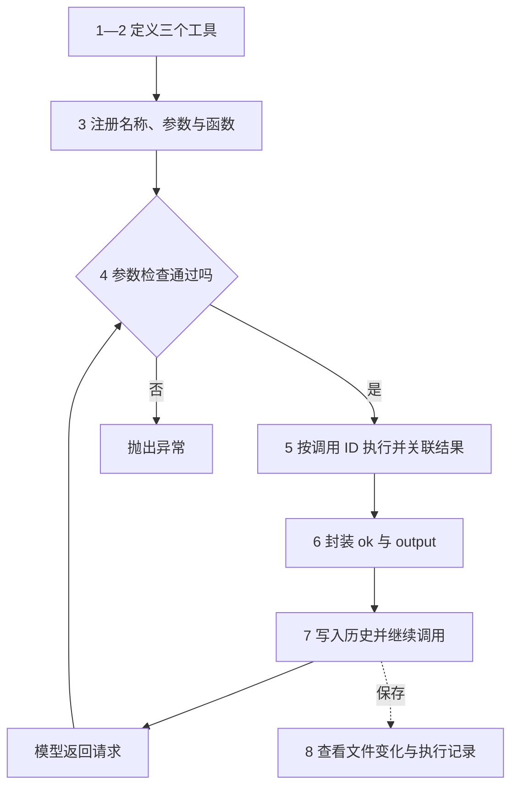
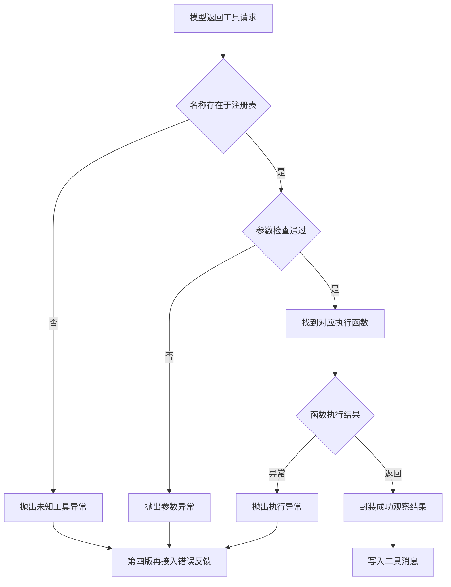
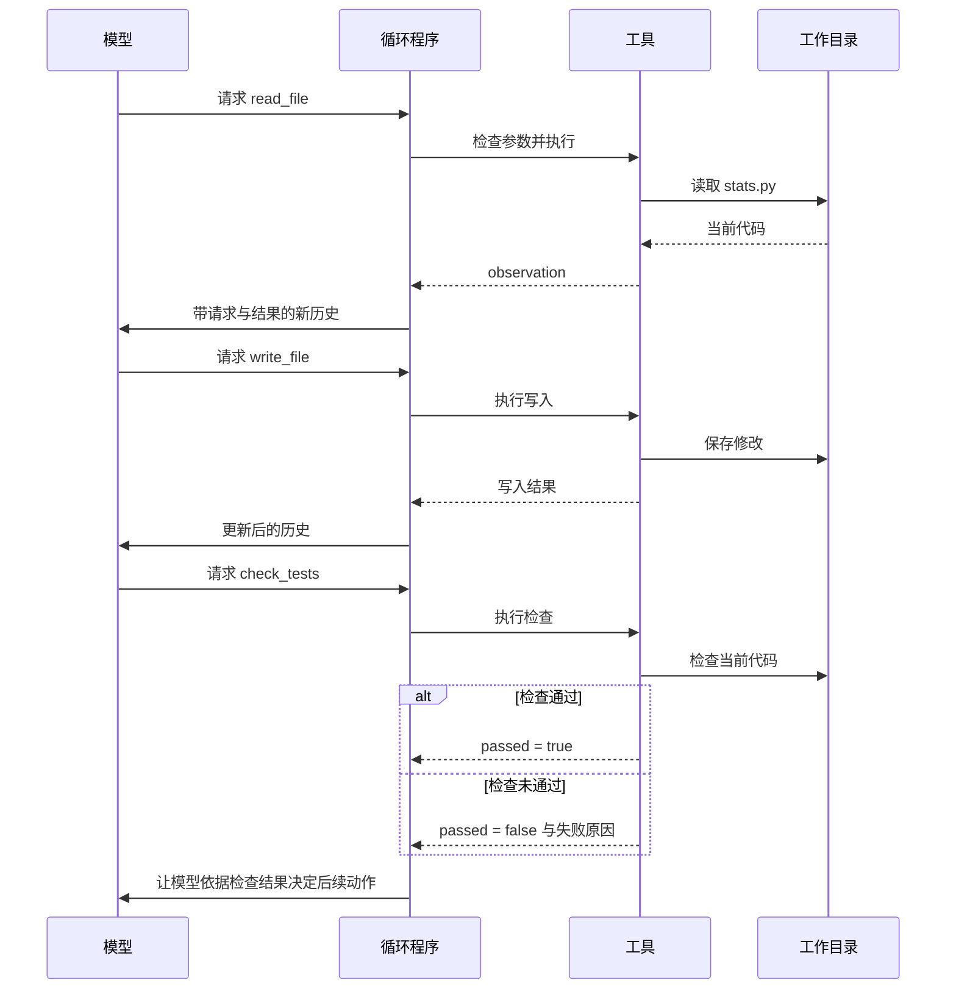

# 02｜为执行循环接入工具

> 状态：draft

> 阅读前提：已经读过 [01｜从一次模型调用到最小 Agent 循环](01-model-call-and-loop.md)，能够解释工具结果为什么要送回模型。

> 本篇目标：把只能调用一个固定函数的循环，改造成能够选择、检查和执行多个工具的程序。

> 对应代码：`code/shared.py`、`code/v2_tool_dispatch.py`。

上一份文件用 `read_file` 读出了 `notes.txt`。这个程序已经形成反馈循环，但它的动作只有一种：读文件。现在把任务改成“读一读 `stats.py`，修复求平均值的函数，再运行测试”，固定调用 `read_file` 显然不够了。

我们需要增加写文件和运行检查的能力。循环的主干仍然是“请求模型 → 执行工具 → 回传结果”；变化发生在工具请求的处理部分。本篇沿着这一个变化，讲清楚工具定义、参数检查、函数分发和结果关联。



本篇输入是 [examples/stats.py](examples/stats.py)；输出包括运行目录中的 `workspace/stats.py`、`changes.diff` 和 `report.md`。

## 1. 新任务需要三个不同的工具

假设工作目录中有下面的错误实现：

```python
# 待修复的 stats.py；这是任务输入，不是正确答案。
def mean(values):
    return sum(values) / (len(values) + 1)
```

任务要求有两项：非空列表返回正确的算术平均值；空列表抛出 `ValueError`。Agent 必须先知道文件里写了什么，才能修改；修改后还要检查行为。工具由此自然分成三种。

| 工具 | 参数 | 它实际做的事 |
|---|---|---|
| `read_file` | `path` | 读取工作目录中的文件 |
| `write_file` | `path`、`content` | 用给定内容写入文件 |
| `check_tests` | 无 | 对当前 `stats.py` 执行固定检查 |

这里的 `check_tests` 是本章专用检查器。它执行预先写好的检查，不接受任意 shell 命令。这样读者可以集中观察循环怎样利用结果，而不用同时理解终端权限、子进程生命周期和完整测试框架。

同一个循环接入多个工具后，模型可以选择“先读再写再检查”，也可能选错工具或跳过检查。**提供能力并不等于规定顺序。** 如果业务要求必须检查后才能交付，这个约束最终需要由程序验证。

## 2. 工具定义让模型知道可以请求哪些操作

Python 函数存在于程序中，模型并不能自动看见它。调用模型时，还需要提供工具的名称、用途和参数结构。下面展示的是一种常见的 JSON Schema 结构，帮助理解工具描述；它不等于某一家模型 API 的完整请求格式。

```python
# 概念示例：描述工具所需的字段，不是厂商原生 API 请求。
read_file_definition = {
    "name": "read_file",
    "description": "读取当前工作目录中的一个 UTF-8 文本文件。",
    "parameters": {
        "type": "object",
        "properties": {"path": {"type": "string"}},
        "required": ["path"],
        "additionalProperties": False,
    },
}
```

`description` 帮助模型选择操作；参数结构帮助模型构造请求。模型返回的仍然只是一个请求，实际文件读写由 Python 程序完成。

本文把 OpenAI SDK 的消息整理为下面的响应字典。`openai_model.py` 负责读取 API 字段、解析参数，以及在下一轮调用前重新组装 API 消息。

```python
# 本文响应字典；arguments 已经被解析为 Python 字典。
response = {
    "content": None,
    "tool_calls": [
        {
            "id": "read-1",
            "name": "read_file",
            "arguments": {"path": "stats.py"},
        }
    ],
}
```

不要把“模型生成了符合结构的请求”理解成“请求一定合理”。`path` 是字符串，仍然可能指向不存在的文件；某些输入虽然类型正确，也不在任务允许的操作范围内。

## 3. 工具注册表把请求名称对应到真实函数

只有一个工具时，代码可以直接调用 `read_file`。增加工具后，如果每一轮都写一大串条件判断，循环会被各个工具的细节占满。注册表把“有哪些工具”与“怎样推进循环”分开。



第二版先让错误直接抛出，便于看清发生位置；第四版才把可修正错误封装为反馈。图中的每个判断都有明确责任。模型负责选择名字和参数；程序负责检查名字、参数和实际执行。程序不应因为请求“看起来像模型精心规划过的”，就省掉检查。

配套程序用 `make_registry(workspace)` 创建注册表，用 `validate_arguments` 检查请求，再通过 `execute_tool` 执行。下面的短程序使用真实接口，可以在章节目录运行：

```bash
PYTHONPATH=code python - <<'PY'
from pathlib import Path
from tempfile import TemporaryDirectory
from shared import make_registry, execute_tool

with TemporaryDirectory() as directory:
    workspace = Path(directory)
    (workspace / "notes.txt").write_text("先读取，再修改，最后检查。", encoding="utf-8")
    registry = make_registry(workspace)
    observation = execute_tool("read_file", {"path": "notes.txt"}, registry)
    print(observation)
PY
```

这段命令的实际输出是：

```text
{'ok': True, 'output': '先读取，再修改，最后检查。'}
```

执行部分的真实代码很短：

```python
# 来源：code/shared.py；完整函数，依赖同文件的 validate_arguments。
def execute_tool(name, arguments, registry):
    validate_arguments(name, arguments, registry)
    function = registry[name]["function"]
    if function is None:
        raise ValueError("finish 必须由控制器处理。")
    return {"ok": True, "output": function(**arguments)}
```

上面的短程序打印 `{"ok": True, "output": "先读取，再修改，最后检查。"}` 对应的 Python 字典。`execute_tool` 本身不打印内容，而是把这个结果返回给循环。

## 4. 参数检查在执行前拦住无法接受的请求

工具定义告诉模型“应该怎么填”，参数检查确认“这次实际填了什么”。两者目的不同，因此都需要。

| 收到的请求 | 问题所在 | 程序应该怎样处理 |
|---|---|---|
| `read_file(path="stats.py")` | 结构正确 | 继续执行，再判断文件是否存在 |
| `read_file()` | 缺少 `path` | 在执行前抛出参数异常 |
| `read_file(path=123)` | 类型错误 | 在执行前抛出参数异常 |
| `write_file(path="stats.py")` | 缺少 `content` | 保持文件原状并抛出异常 |
| `search_file(path="stats.py")` | 未注册的名称 | 不猜测、不映射，抛出未知工具异常 |

最后一行尤其容易被忽略：如果模型请求了 `search_file`，而程序只有 `read_file`，不应该擅自把两个名字当成同一个操作。第四篇会把这个异常转成工具消息，让模型基于真实工具列表重新选择。

参数校验适合处理确定性的规则，例如字段是否存在、类型是否正确、路径是否在工作目录内。至于“这段新代码是否符合任务”，属于后续检查器的工作。把两类问题分开，错误消息才有针对性。

## 5. 调用编号让每个结果找到对应请求

假设同一轮模型请求读取两个文件，仅凭工具名 `read_file` 无法区分两个返回结果。请求中的 `id` 就是这次调用的标识；工具消息通过 `tool_call_id` 指回它。

```python
# 结构示意：工具消息中的 content 使用 JSON 字符串。
import json

assistant_message = {
    "role": "assistant",
    "content": None,
    "tool_calls": [
        {"id": "read-1", "name": "read_file", "arguments": {"path": "stats.py"}}
    ],
}
tool_message = {
    "role": "tool",
    "tool_call_id": "read-1",
    "content": json.dumps({"ok": True, "output": "文件内容……"}, ensure_ascii=False),
}
```

注意消息的顺序：先保存模型提出的请求，再保存工具结果。下一次模型调用需要同时知道“自己刚才要求了什么”和“执行以后得到了什么”。仅把文件内容拼进 prompt，虽然有时能得到答案，却丢失了请求与结果之间的结构。

| 顺序 | 消息角色 | 关键字段 | 读者应该能回答的问题 |
|---|---|---|---|
| 1 | `user` | `content` | 用户要求做什么 |
| 2 | `assistant` | `tool_calls[0].id = read-1` | 模型请求执行什么 |
| 3 | `tool` | `tool_call_id = read-1` | 这是谁的执行结果 |
| 4 | `assistant` | 新请求或文本 | 模型根据结果决定了什么 |

## 6. 观察结果需要区分执行状态和任务事实

工具结果是下一轮决策的重要证据。一个只返回“成功”的写文件工具，对模型帮助有限；一个只返回“失败”的检查工具，也没有提供修正方向。成功结果使用 `ok` 与 `output`；第四版再增加 `ok=False` 与 `error` 的错误反馈。

```python
# 返回结构示例；bytes 是实际写入内容的 UTF-8 字节数。
success = {"ok": True, "output": {"path": "stats.py", "bytes": 120}}
failure = {
    "ok": False,
    "error": {"type": "FileNotFoundError", "message": "目标文件不存在"},
}
```

`ok=True` 只表示工具按约定执行并返回了结果。特别是 `check_tests`：检查器正常运行，但某项检查失败时，应该把“检查没有通过”放在业务结果里，而不是把它和检查器自身崩溃混为一谈。

| 现象 | 工具层面 | 任务层面 |
|---|---|---|
| 文件读取完成 | 执行成功 | 尚未进行修复 |
| 新代码写入完成 | 执行成功 | 仍需检查行为 |
| 检查器正常返回，平均值检查失败 | 执行成功 | 当前代码不满足要求 |
| 读取文件时目标文件不存在 | 抛出执行异常 | 暂时没有获得文件内容 |

配套检查器还会把测试子进程超时等情况记录为 `test_process` 检查失败。因此阅读 `passed=False` 时，应继续看 `checks` 的具体原因，区分代码行为不合格和检查过程出错。

## 7. 多个工具仍然通过同一个反馈循环协作



图中没有第二种循环。读取、写入、检查都经过同一条“请求—执行—观察—再请求”的路径。工具之间的衔接来自模型读到了前一个结果，以及程序保留了完整历史。

## 8. 运行程序后应先检查记录，再阅读最终回答

在章节目录运行：

```bash
python code/v2_tool_dispatch.py
```

程序使用 `.env` 中的真实模型，复制输入文件后运行。模型可以多次读取、修改或检查，实际顺序保存在本次记录中。

**控制台输出结构：**

```text
status=stopped reason=no_tool_calls model_calls=<本次调用次数>
acceptance=<True 或 False>
artifacts=<本次运行目录>
```

**查看产物的顺序：**

| 文件 | 应检查的内容 | 判断标准 |
|---|---|---|
| `responses.jsonl` | 模型发出的工具名和参数 | 能找到 `read_file`、`write_file` 或 `check_tests` 请求 |
| `trace.jsonl` | 工具执行记录 | 请求 ID 与结果对应 |
| `workspace/stats.py` | 当前实现 | 除数改成 `len(values)`，空列表抛出 `ValueError` |
| `changes.diff` | 本次修改 | 能看出相对输入文件改了哪些行 |
| `result.json` | 最终检查 | `acceptance.passed` 反映四项检查结果 |
| `report.md` | 回答与检查表 | 文字结论与检查记录一致 |

修复成功时，函数应具有下面的行为。实现可以采用不同写法：

```python
def mean(values):
    if not values:
        raise ValueError("values must not be empty")
    return sum(values) / len(values)
```

这个函数定义本身没有输出；调用 `mean([2, 4])` 应返回 `3.0`，调用 `mean([])` 应抛出 `ValueError`。配套程序会自动执行这两项及另外两项检查。

本版为了保持简单，仍然把“没有工具请求”视为结束，连空响应也会停止。工具越来越多以后，这个规则会暴露问题：模型可能先回复一段解释，却还没做完任务。代码已经带有防止演示无限运行的 `max_steps`，但尚未解释预算边界，也没有显式的交付动作。下一篇会在当前程序上增加这些控制能力。

[← 01｜从一次模型调用到最小 Agent 循环](01-model-call-and-loop.md) · [返回阅读路线](README.md) · [03｜为执行循环增加历史记录与退出条件 →](03-history-and-stopping.md)
