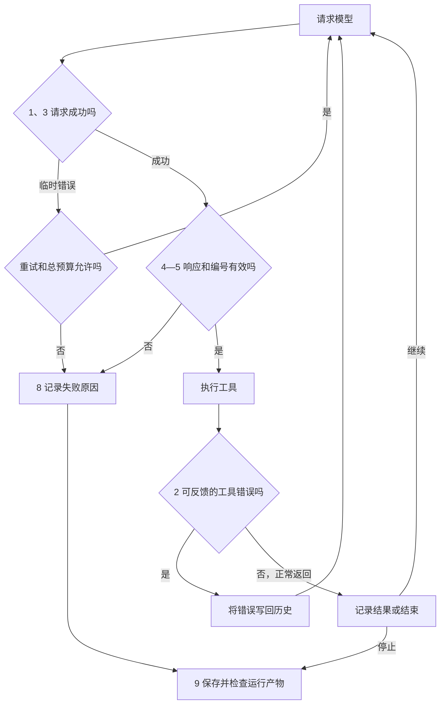
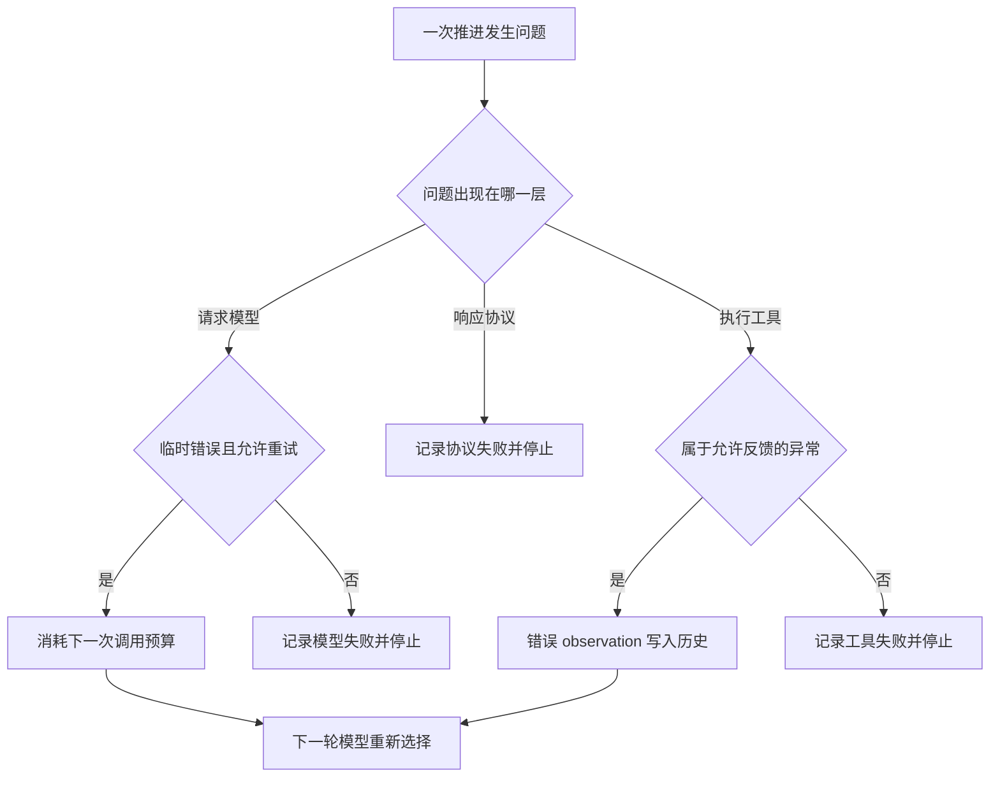
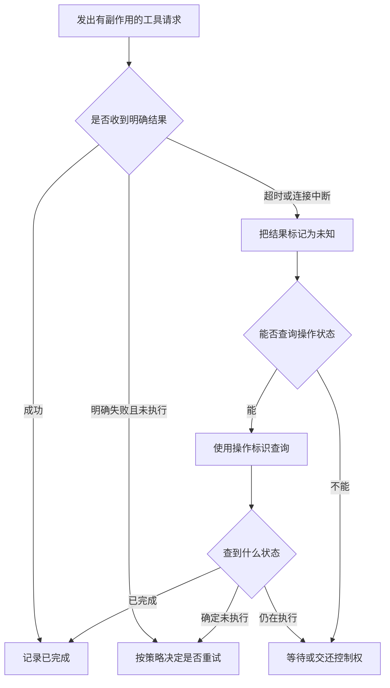

# 04｜为执行循环增加错误处理

> 状态：draft

> 阅读前提：已经读过 [03｜为执行循环增加历史记录与退出条件](03-history-and-stopping.md)，理解历史、结束请求和调用预算。

> 本篇目标：让可修正的错误进入反馈循环，并让无法继续的运行留下明确原因。

> 对应代码：`code/v4_resilient_loop.py`、`code/scenarios.py`。

前三版已经可以完成正常路径，但模型只要把 `read_file` 写成 `read_flie`，第二、三版就会抛出异常。对一个能够继续推理的系统来说，这有些可惜：工具列表已经说明了正确名字，程序也知道哪里错了，只差把这个事实告诉模型。

第四版首先补上这条反馈路径，再处理模型请求失败、空响应和重复调用编号。仍然使用同一份 `stats.py`，不增加新的业务背景。



第 6—7 节说明工具超时与副作用的边界；本版不自动重试工具操作。

## 1. 失败发生的位置决定程序如何处理

先区分三个位置：请求模型时失败，收到的响应结构不合法，以及执行工具时失败。位置不同，可用的证据与恢复方式也不同。

| 失败位置 | 本章例子 | 当前是否有合法工具请求 | 第四版的处理 |
|---|---|---|---|
| 模型调用 | 临时连接错误 | 没有收到新请求 | 在预算内有限重试 |
| 模型响应协议 | 缺少 `tool_calls` 列表 | 无法可靠解释 | 记录 `invalid_response` 并停止 |
| 调用关联协议 | 本次运行内出现重复 ID | 关联存在冲突 | 在工具执行前停止 |
| 工具参数或文件操作 | 名称错误、参数错误、文件不存在 | 有可关联的请求 | 封装错误观察结果，继续循环 |
| 未预期的工具异常 | 非预期的程序错误 | 通常有可关联的请求 | 记录错误结果后停止 |

“可恢复”是当前程序采用的策略。它不是说所有 `OSError` 都能通过模型思考解决，也不是说多重试一次就一定有用。第四版把这类错误反馈给模型，提供重新选择的机会；`max_steps` 则保证它不能无限重复。



## 2. 可修正的工具错误会成为下一轮输入

一次错误工具调用也应该有结果。模型请求 `read_flie` 后，程序返回“未知工具：read_flie”，并把这个结果关联到原调用 ID。模型下一次输入就同时包含错误请求与错误原因。

下面是 `shared.py` 的实际函数摘录。它不重试操作，只负责把异常转换为统一结构：

```python
# 来源：code/shared.py；完整函数。
def error_observation(exc):
    return {"ok": False, "error": {"type": type(exc).__name__, "message": str(exc)}}
```

在 `v4_resilient_loop.py` 中，工具执行放在 `try` 语句里。名称、参数和文件操作错误被转换为上述结构，随后与成功结果一样写入历史。模型拿到反馈后，可以提出新的请求；控制器没有偷偷重放原请求。

| 轮次 | 请求或反馈 | ID | 对后续执行的意义 |
|---|---|---|---|
| 第 1 次模型调用 | 请求 `read_flie` | `bad0` | 请求了不存在的工具 |
| 工具反馈 | `ok=False`，`ValueError` | 对应 `bad0` | 说明错误发生在工具名称 |
| 第 2 次模型调用 | 请求 `read_file` | `c1` | 用新请求表达修正后的操作 |
| 后续调用 | 写入、检查、结束 | `c2`—`c4` | 继续正常路径 |

这张表来自 `bad_tool` 固定场景，用预设响应复现一次工具名修正。真实 API 的轨迹保存在各自运行目录中。

## 3. 模型调用失败时不能伪造工具结果

模型请求还没有成功，就不存在这次响应提出的工具请求。因此，不能随便制造一个 `tool_call_id`，往历史里追加“工具失败”。应该把模型请求失败写入 `trace`，然后决定是否重试。

第四版只对显式标记的 `TransientModelError` 重试；其他模型异常直接终止。这样，认证错误、配置错误和程序缺陷不会因为一个宽泛的 `except Exception: continue` 被无限掩盖。

```python
# 来源：code/v4_resilient_loop.py；实际异常分支摘录，需置于原 try 语句后。
except TransientModelError as exc:
    retry_count += 1
    trace.append({"event": "model_error", "model_call": model_calls,
                  "error": str(exc), "consecutive_failures": retry_count})
    if retry_count > max_model_retries:
        return make_result("failed", "model_retry_limit", model_calls, messages, trace)
    continue
```

`max_model_retries=2` 允许连续失败后最多额外尝试两次。连续三次都失败时，第三次返回 `model_retry_limit`；成功收到一次响应后，连续失败计数归零。所有尝试同时消耗 `max_steps`，总预算可能先耗尽。

| 设置或事件 | 允许发生的行为 | 对计数的影响 |
|---|---|---|
| `max_model_retries=0` | 第一次临时错误就停止 | 该次调用仍计入 `model_calls` |
| `max_model_retries=2` | 连续临时失败最多尝试三次 | 每次尝试都消耗总预算 |
| 重试成功 | 继续处理新响应 | 连续失败计数重置 |
| `max_steps=2` 且连续失败 | 最多尝试两次 | 可能先以 `step_limit` 停止 |

`openai_model.py` 将连接错误、限流和 5xx 响应标记为临时错误。SDK 自动重试设为 0，由这一层统一计数；本版未加入退避等待。

## 4. 连续空响应需要单独的停止条件

没有工具调用并不意味着完成任务。模型可能返回一段解释，也可能返回空字符串或 `None`。第四版要求通过 `finish` 正常交付，因此这两种情况都不会自动视为完成。

非空文本会进入历史，程序提醒模型继续任务。没有文本、没有工具请求则计为一次空响应；默认连续两个空响应触发 `empty_response_limit`。收到非空文本或工具请求后，空响应计数重置。

这个规则仍然有局限。模型可以不断输出“我正在分析”，既不调用工具，也不产生空响应；它不会触发连续空响应阈值，但最终会耗尽 `max_steps`。不同停止规则覆盖的是不同问题，不能相互替代。

## 5. 重复调用编号与重复动作需要分别判断

重复 ID 是关联协议问题。例如先收到 `c1: read_file`，下一轮又收到 `c1: write_file`，同一个标识就对应了两个不同动作。第四版在把本轮响应加入历史之前检查全部 ID；发现重复后，整批请求都不执行。

重复动作则是任务推进问题：模型可以用 `c1`、`c2`、`c3` 反复读取同一个文件。它们都是合法的新请求，只是可能没有新增信息。

| 现象 | 本章是否拦截 | 理由与边界 |
|---|---|---|
| 同一批请求包含两个 `c1` | 是 | 避免一批执行到一半才发现关联冲突 |
| 不同轮次重复使用 `c1` | 是 | 本章要求 ID 在一次运行内唯一 |
| 不同 ID 读取同一文件 | 否 | 文件可能已经变化，不能只凭名称判错 |
| 不同 ID 重复写入同样内容 | 否 | 是否无效需要结合环境与任务判断 |

本文要求调用 ID 在一次运行内唯一。即使 ID 永不重复，也不能获得严格的“操作恰好执行一次”保证：后者还涉及持久化、网络与环境状态。

## 6. 工具超时意味着结果可能仍然未知

下面讨论设计边界，不是第四版已经实现的自动恢复功能。考虑一个远端上传工具：请求发出以后客户端超时，可能是远端根本没收到，也可能是上传已经完成、回复丢失，还可能是远端仍在处理。



因此，“捕获超时以后再执行一次”只是一种策略，并非普遍正确。对支付、发消息或追加记录这样的操作，重复执行会产生额外后果。

本章 `check_tests` 的子进程有 5 秒等待上限，超时会记为检查失败。第四版没有通用工具超时、远端状态查询或自动工具重试；也没有用线程超时包装任意函数，因为停止等待并不等于函数已经停止执行。

## 7. 重试有副作用的操作前需要了解执行状态

| 操作 | 重试前需要确认什么 | 可以考虑的设计 |
|---|---|---|
| 读取文件 | 文件是否可能已变化 | 返回文件版本或摘要 |
| 覆盖写文件 | 上一次是否已经写入，内容是否相同 | 校验目标版本与内容摘要 |
| 追加日志 | 是否已经追加过该条记录 | 使用业务操作标识去重 |
| 发送通知或付款 | 远端是否已经执行 | 状态查询、幂等键、明确恢复流程 |

工具调用 ID 主要关联请求与结果；幂等键则用于让业务系统识别重复操作。两者有时可以映射，但不能仅凭“请求里有一个 ID”就假设业务已经具备去重能力。

对于当前修复任务，第四版采用较保守的做法：工具错误反馈给模型，不自动重放工具。模型重新提出动作后，程序再检查并执行。这样仍然需要上层权限与业务规则约束，但执行记录至少能够说明每次动作来自哪一次请求。

## 8. 不同退出原因让失败能够被定位

第四版把普通停止与错误退出分开记录。下面是代码实际使用的状态与原因，不是模型生成的自由文本。

| `status` | `reason` | 表示什么 |
|---|---|---|
| `stopped` | `finish` | 收到合法的结束请求 |
| `stopped` | `step_limit` | 模型调用尝试次数耗尽 |
| `failed` | `empty_response_limit` | 连续空响应达到阈值 |
| `failed` | `duplicate_call_id` | 本次运行内的调用 ID 冲突 |
| `failed` | `model_retry_limit` / `model_error` | 模型重试耗尽或其他模型错误 |
| `failed` | `invalid_response` / `finish_must_be_alone` | 响应结构或结束协议不合法 |
| `failed` | `tool_error` | 遇到当前策略不继续处理的工具异常 |

## 9. 运行对照场景可以检查错误处理是否生效

先运行真实 API 版本：

```bash
python code/v4_resilient_loop.py
python code/build_report.py
```

**正常结束时的输出结构：**

```text
status=stopped reason=finish model_calls=<本次调用次数>
acceptance=<True 或 False>
artifacts=<本次运行目录>
```

发生错误时，`status`、`reason` 会反映实际分支，运行目录仍保留请求、响应与结果。按下面的关系查看：

| 产物 | 观察项 | 应当能解释什么 |
|---|---|---|
| `responses.jsonl` | API 响应或错误类型 | 哪次请求失败了 |
| `trace.jsonl` | `model_error`、`tool_result` 等事件 | 程序为何重试、继续或停止 |
| `requests.jsonl` | 下一次输入 | 工具错误是否进入下一轮 |
| `result.json` | 原因与最终检查 | 运行是否结束，文件是否合格 |
| `runs/comparison.md` | 与 v3 的运行对照 | 加入错误处理以后发生了什么 |

正常的 API 调用不一定触发错误。需要稳定复现分支时，运行固定故障场景：

```bash
python code/run_scenarios.py bad_tool --summary
python code/run_scenarios.py empty_response --summary
python code/run_scenarios.py duplicate_id --summary
```

这些辅助场景使用预设响应。对应结果应为：

| 场景 | 退出原因 | 模型调用次数 | 最终检查 |
|---|---|---:|---|
| `bad_tool` | `finish` | 5 | 通过 |
| `empty_response` | `empty_response_limit` | 2 | 未通过 |
| `duplicate_id` | `duplicate_call_id` | 2 | 未通过 |

下一份 Notebook 会将真实运行、预算对照与固定故障实验分别组织起来，并读取刚才保存的产物。

[← 03｜为执行循环增加历史记录与退出条件](03-history-and-stopping.md) · [返回阅读路线](README.md) · [05｜通过实验观察执行循环 →](05-loop-experiments.ipynb)
