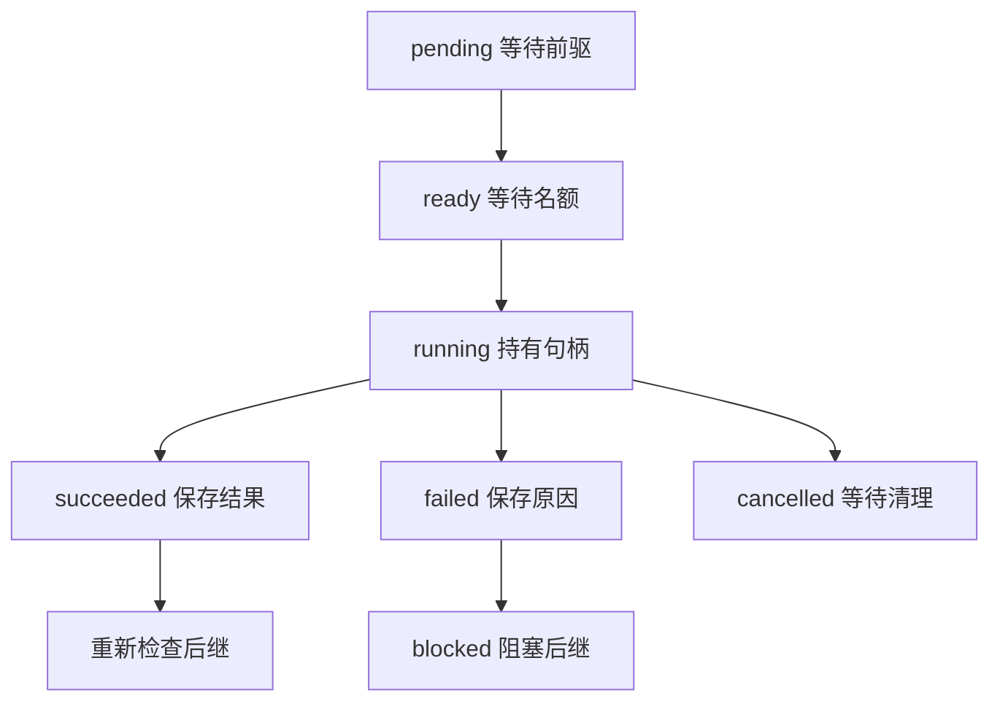

# 02｜就绪队列与子任务生命周期

[阅读路线](README.md) · [上一篇](01-task-graph-and-roles.md) · [下一篇](03-results-and-replanning.md)



这一篇使用 [scheduler.py](code/scheduler.py) 与 [v2_schedule.py](code/v2_schedule.py)。工作目录、依赖与输入沿用 README：Python 3.11+、标准库、`fixtures/` 中的订单资料。代码节选展示新增的控制步骤，完整运行不需要手动拼接片段。

## 1. 有空位之前，先判断工作能不能开始

库存、价格、政策互不依赖，可以先执行；报价要等库存和价格都成功。下列是 `Scheduler.run` 的节选，依赖已有的 `self.plan` 与 `self.states`，返回局部变量 `ready`，本身不打印：

```python
ready = sorted(key for key, node in self.plan.items()
               if self.states[key] in {"pending", "ready"}
               and all(self.states[dep] == "succeeded"
                       for dep in node.dependencies))
```

初始值是 `['policy', 'prices', 'stock']`。排序让同一输入下先选谁有明确规则；`all` 对空前驱列表返回真，因此三个读取节点都就绪。`quote` 此时不在列表内，即使有空闲执行位也不能提前启动。

这里检查的是前驱的**成功状态**。只检查“字典里有没有东西”会让 `{"error": "price missing"}` 也被误当作可用价格。实际业务函数应该按约定返回成功结果，或抛出明确异常，由调度器记录失败。

## 2. 创建协程句柄以后，父任务仍然负责它

仅仅调用异步函数会得到协程对象；`asyncio.create_task` 才将其安排进事件循环。本章保留每个句柄对应的节点和角色，随后才能收集异常、归还名额与取消工作。[Python asyncio 任务文档](https://docs.python.org/3.11/library/asyncio-task.html#creating-tasks)

以下节选位于 `run` 的就绪节点循环内，前面已经选出 `key` 和 `role`；没有可用角色时跳过，有全局空位时才执行：

```python
self.executions += 1
self.role_use[role.name] += 1
self.states[key] = "running"
handle = asyncio.create_task(self.execute_child(self.plan[key], role), name=key)
self.running[handle] = (key, role)
self.peak_active = max(self.peak_active, len(self.running))
self.emit("start", key, role=role.name, active=len(self.running),
          input_version=self.plan[key].input_version)
```

代码不直接打印，状态与事件最终保存到 `result.json`、`events.jsonl`。两种额度同时约束启动：`concurrency` 限制全部活动任务数，`role.capacity` 限制某类角色的活动数。把全局额度设成 10，并不会让只有两个名额的 Reader 同时执行三个读取任务。

`executions` 记录真正启动的节点次数。它和最大并发数不是同一个数字，也不是模型调用次数。一个真实子 Agent 节点内部可能调用模型多次，预算应同时在子循环中约束。本章额外使用 `max_executions=20`，防止整个计划跨重算无限启动节点。

## 3. 每个执行者拿到自己的依赖结果

一个执行者如果直接修改父任务中的嵌套字典，会悄悄污染其他分支。执行入口先复制直接前驱的结果，再包上超时和清理：

```python
async def execute_child(self, node, role):
    context = {key: deepcopy(self.results[key]) for key in node.dependencies}
    try:
        value = await asyncio.wait_for(self.worker(node, context), node.timeout)
        if not isinstance(value, dict):
            raise TypeError("worker result must be a dictionary")
        return value
    finally:
        self.emit("cleanup", node.task_id, role=role.name)
```

这是完整实现中的方法定义，依赖该文件导入的 `asyncio`、`deepcopy` 与 `Scheduler` 字段；定义方法没有输出。调用返回执行者结果字典，或传播异常。`cleanup` 是这里已进入清理阶段的记录；当前业务函数只有内存与读取操作，没有需要关闭的长连接。接入客户端、临时目录等资源时，应把真正的释放动作放在相应 `finally` 或上下文管理器中。

`context` 是该节点的输入快照，不是操作系统沙箱。`OrderWorker` 另外持有本次 fixture 的副本；它不是读取任意路径的模型。接入上一章的循环时，可将“任务说明 + 前驱结果”转换为独立消息历史，并让适配函数等待循环结束后返回同样的结果字典。调度器无需因此学会处理供应商的响应协议。

## 4. 谁先完成，就先回收谁

如果总要等一批任务全部结束，快速任务释放出的空位也会闲置。本章等待任意任务完成，再重新检查依赖和空位。以下为 `run` 中的控制代码节选：

```python
done, _ = await asyncio.wait(self.running, return_when=asyncio.FIRST_COMPLETED)
for handle in sorted(done, key=lambda item: self.running[item][0]):
    key, role = self.running.pop(handle)
    self.role_use[role.name] -= 1
    try:
        value = handle.result()
    except asyncio.CancelledError:
        self.states[key] = "cancelled"
        self.errors[key] = "child cancelled itself"
        self.emit("cancelled", key, reason="child_cancelled")
    except Exception as error:
        self.states[key] = "failed"
        self.errors[key] = f"{type(error).__name__}: {error}"
        self.emit("failed", key, error=self.errors[key])
    else:
        self.results[key] = value
        self.states[key] = "succeeded"
        self.emit("succeeded", key)
```

它仍然不打印，而是保存状态。`handle.result()` 取回成功返回值，也会重新抛出子任务异常；因此父任务必须实际读取句柄。把异常吞掉再写 `succeeded` 会解锁本来不该执行的后继。

子任务还可能主动抛出 `CancelledError`。它不属于普通 `Exception` 分支，所以要单独处理：该节点标为 `cancelled`，后继被阻塞，无关分支仍可完成。这和父任务整体被取消不同；父取消发生在调度器的等待处，才向所有仍活动的子任务传播。两种取消都必须释放句柄和角色名额。

完整脚本中的短暂 `asyncio.sleep` 是显式加入的可让出执行权的等待，用于观察任务重叠；文件读取与业务计算仍是真实执行。它不用于测量真实网络吞吐或证明模型性能提升。

在本章目录运行：

```bash
python code/v2_schedule.py
```

准确标准输出：

```text
accepted=True total_cents=5200
executions=6 peak_active=2
artifacts=runs/v2
```

打开 `runs/v2/events.jsonl`，两个 `start` 会在第一条 `succeeded` 之前出现，表示父任务确实同时持有两个活动句柄。每个 `quote` 的 `start` 前都能找到 `stock` 和 `prices` 的 `succeeded`。具体哪些完成事件先后相邻受事件循环时序影响，不要用整份日志逐字比较；检查这些偏序关系即可。

## 5. 超时、父任务取消，都需要归还名额

单个节点超时由 `wait_for` 传播为异常，父任务将该节点标为 `failed`，角色计数已经减一。父任务整体取消则走另一条路径：把取消请求传给尚未完成的子句柄，再等待它们清理。

下面是 `run` 的 `finally` 中核心节选，前面已将仍在运行的句柄复制到 `handles`。定义中的变量均来自该方法，没有独立标准输出：

```python
for handle in handles:
    handle.cancel()
if handles:
    await asyncio.gather(*handles, return_exceptions=True)
for handle in handles:
    key, role = self.running.pop(handle)
    self.role_use[role.name] -= 1
    self.states[key] = "cancelled"
    self.emit("cancelled", key)
```

`cancel()` 发出请求；`gather` 等待协程回应并结束。协程需要在可取消的等待点协作，超时也不是强行终止一段阻塞 CPU 代码。对于 CPU 密集或不可信工作，应使用可隔离管理的进程执行环境，这不由角色名称或 `async` 关键字自动完成。

第四篇的取消实验会等任务确实启动后取消父任务，并检查子句柄已清空。当前篇完成了“谁能开始、谁正在执行、结束后谁负责回收”；下一篇继续决定结果是否可以合并，以及变化后哪些结果应该作废。

[下一篇：03｜汇总、失败与局部重规划](03-results-and-replanning.md)
