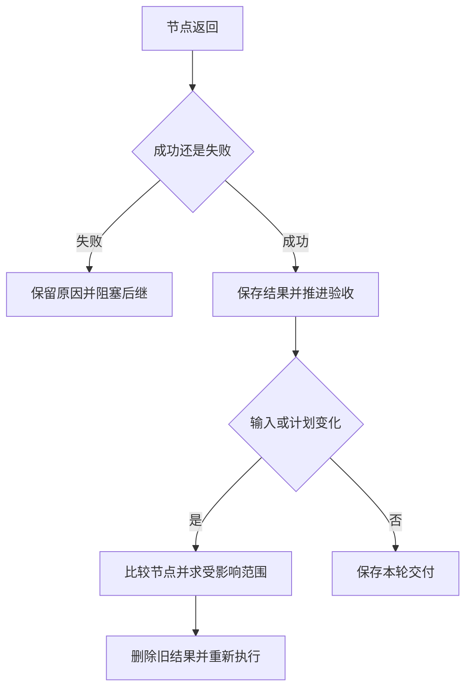

# 03｜汇总、失败与局部重规划

[阅读路线](README.md) · [上一篇](02-scheduling-and-lifecycle.md) · [下一篇](04-experiments-and-source.md)



本篇继续使用同一张订单。前半段删掉笔的单价，观察失败如何传播；后半段让笔记本涨价，再增加运费，观察重规划实际执行哪些节点。

## 1. 收齐结果之后，还要经过业务验收

库存成功返回，不表示库存足够；计算成功返回，不表示报价在预算内。`review` 负责把执行成功与订单达标分开。下面是 [order_workflow.py](code/order_workflow.py) 的分支节选，依赖该方法的 `dependencies`，返回验收对象或抛出异常；无标准输出：

```python
quote = dependencies["quote"]
if not quote["available"]:
    raise ValueError("insufficient stock")
if quote["total_cents"] > dependencies["policy"]["maximum_cents"]:
    raise ValueError("over budget")
return {"accepted": True, "quote": deepcopy(quote)}
```

`publish` 只依赖 `review`，因此拿到的必然是经过上述检查的对象。本例验收核对库存和预算，金额正确性另外由测试对照输入计算；它没有声称能审查任意自然语言报价。接入模型写出的产物时，必须扩展领域检查，不能只沿用一个 `accepted` 字段。

保存结果时，`save_run` 从 `publish` 中读取验收值；没有交付结果就写 `accepted=False`。程序正常退出和订单可交付是两个不同问题。

## 2. 失败会阻塞后继，无关分支仍然保留

[prices-missing.json](fixtures/prices-missing.json) 中没有 `pen` 的价格。使用这一份实际输入，在本章目录运行：

```bash
python code/v2_schedule.py --missing-price --output runs/v2-missing
```

准确标准输出：

```text
accepted=False total_cents=None
executions=3 peak_active=2
artifacts=runs/v2-missing
```

打开 `result.json`，节点状态应为：

| 节点 | 状态 | 原因 |
|---|---|---|
| `stock`、`policy` | `succeeded` | 与缺失价格无关，照常完成 |
| `prices` | `failed` | `ValueError: missing price: pen` |
| `quote`、`review`、`publish` | `blocked` | 必需的上游结果没有成功 |

`blocked` 没有消耗一次执行；因此总执行次数是 3。调度器每轮检查前驱是否 `failed/blocked/cancelled`，把影响向后传播。失败的节点没有结果，不能用空字典替它凑齐依赖。

修复同一单价文件后重试，与“发现需要加入运费节点”是不同操作。前者保持工作图，重新执行失败及其后继；后者改变计划本身。下面的接口可以接收新的完整计划，统一处理两者，但不会自己决定应该怎样规划。

## 3. 价格变了，报价及验收也必须失效

先用版本 1 完成六个节点，再把输入换成 [prices-v2.json](fixtures/prices-v2.json)。新单价是 1400 分。仅仅替换 `prices` 的结果会留下旧的 5200 分报价，所以要沿依赖关系求出所有后继。

以下是 [scheduler.py](code/scheduler.py) 的函数定义。输入是 `task_id → Node` 字典和已改变节点集合，返回需要失效的节点集合；定义本身没有输出：

```python
def affected_closure(plan, seeds):
    affected = set(seeds)
    while True:
        expanded = affected | {key for key, node in plan.items()
                               if affected.intersection(node.dependencies)}
        if expanded == affected:
            return affected
        affected = expanded
```

第一轮从 `prices` 找到 `quote`，第二轮找到 `review`，第三轮找到 `publish`，再无新增节点时停止。`stock` 和 `policy` 没有读取价格，因此可以保留。

在本章目录执行完整入口：

```bash
python code/v3_replan.py
```

准确标准输出：

```text
before_cents=5200 after_cents=5800
invalidated=prices,publish,quote,review
executions=10 retained=policy,stock
artifacts=runs/v3
```

两轮共执行 `6 + 4 = 10` 个节点。`result.json` 的 `before` 保存第一轮结果，顶层 `results` 保存第二轮；`input.json` 的 `before/after` 是两轮真实输入副本。事件里 `stock` 和 `policy` 的 `start` 各出现一次，其他四个节点各出现两次。这样既能验证新金额，也能验证无关分支确实没有重跑。

## 4. 改图时，要同时考虑旧依赖和新依赖

现在加入运费。新节点 `shipping` 依赖 `policy`，`quote` 除了库存和价格，还必须等待 `shipping`。新计划由 `make_plan("2", shipping=True)` 构造。

| 节点 | 旧前驱 | 新前驱 | 处理 |
|---|---|---|---|
| `prices` | 无 | 无 | 输入版本改为 2，重算 |
| `shipping` | 不存在 | `policy` | 新增，执行一次 |
| `quote` | `stock, prices` | `stock, prices, shipping` | 依赖改变，重算 |
| `review, publish` | 不变 | 不变 | 读取受影响结果，重算 |
| `stock, policy` | 不变 | 不变 | 保留已有成功结果 |

`replan` 比较同名 `Node`，把增删或字段变化的节点加入起点；再分别在旧图和新图求闭包，取并集。旧图覆盖被删除的边曾经影响过的结果，新图覆盖新增加的影响。这个方法会按依赖保守失效，不尝试证明“虽然输入变了，结果恰好相同”。

下面是 `replan` 中的关键节选，依赖已经验证过的 `replacement` 和调用者传入的 `changed_inputs`；完整方法还会重置状态、递增计划版本并记录事件：

```python
changed = set(changed_inputs) | {
    key for key in self.plan.keys() | replacement.keys()
    if self.plan.get(key) != replacement.get(key)
}
affected = affected_closure(self.plan, changed) | affected_closure(replacement, changed)
retained = sorted(key for key in self.results if key in replacement and key not in affected)
self.results = {key: self.results[key] for key in retained}
```

这段代码没有标准输出，改变的是可复用结果集合。运行完整场景：

```bash
python code/v3_replan.py --add-shipping --output runs/v3-shipping
```

准确标准输出：

```text
before_cents=5200 after_cents=6000
invalidated=prices,publish,quote,review,shipping
executions=11 retained=policy,stock
artifacts=runs/v3-shipping
```

第二轮执行五个节点，报价 `5800 + 200 = 6000` 恰好达到预算上限，仍然通过。这里实现了实际新增节点和依赖变化，重规划不只是把文字清单换一个名字。

## 5. 失效范围正确，依赖声明也必须完整

`replan` 不监控文件变化。调用者必须报告变化的输入节点，或更新它们的 `input_version`。本章中的对应关系是：

| 改了什么 | 应标记哪些输入节点 |
|---|---|
| 单价文件 | `prices` |
| 库存文件 | `stock` |
| 预算或运费政策 | `policy` |
| 订单 SKU、数量 | `stock` 与 `prices`，它们都直接读取订单 |

遗漏直接读者会使缓存看起来有效而实际上过期。版本号应代表该节点所有直接输入的快照；只有一个孤立的字符串，却没有更新规则，不会自动获得缓存正确性。

本实现要求当前 `run()` 已经结束再调用 `replan`，运行中调用会抛出 `RuntimeError`。这使旧任务没有机会在新计划建立后回写。需要运行中换计划时，还须取消旧任务并等清理，或用尝试编号、输入版本和负责人版本拒绝旧结果；下一组件将实际实现这些消息检查。

试着把预算降到 5700，再在一份临时输入字典中启动版本 2 计划。参考判断是 `quote=5800` 可以成功计算，`review` 因 `over budget` 失败，`publish` 被阻塞；不能因为总额已算出就将任务标为验收通过。第四篇给出不修改原 fixture 的完整练习代码。

[下一篇：04｜实验与标准库对照](04-experiments-and-source.md)
