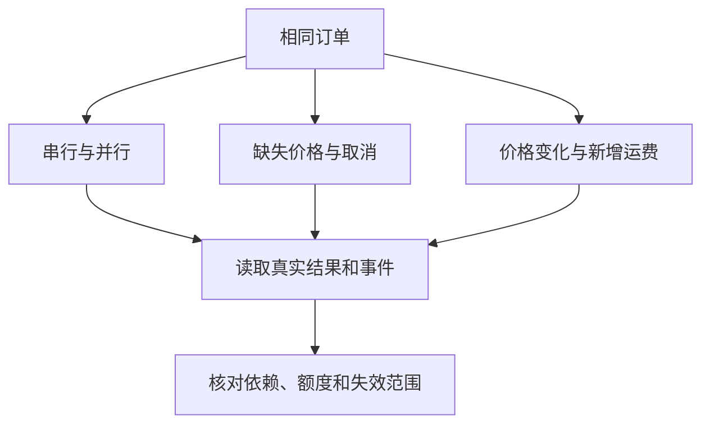

# 04｜实验与标准库对照

[阅读路线](README.md) · [上一篇](03-results-and-replanning.md)



这一篇不换任务，而是每次改变一个调度条件。实验记录来自执行结果；完成顺序可能变化的地方使用依赖关系检查，不把某个耗时当作固定答案。

## 1. 运行六种条件，先比较工作是否做对

在本章目录运行以下完整命令，依赖标准库、读取 `fixtures/`，输出各场景子目录及总表：

```bash
python code/experiments.py
```

准确标准输出：

```text
serial: accepted=True total_cents=5200 executions=6 peak_active=1
parallel: accepted=True total_cents=5200 executions=6 peak_active=2
missing_price: accepted=False total_cents=None executions=3 peak_active=2
price_changed: accepted=True total_cents=5800 executions=10 peak_active=2
plan_changed: accepted=True total_cents=6000 executions=11 peak_active=2
cancelled: accepted=False total_cents=None executions=2 peak_active=2
artifacts=runs/experiments
```

| 对照 | 保持相同 | 只改变什么 | 该看哪项结果 |
|---|---|---|---|
| serial → parallel | 订单、价格、图和角色 | 全局额度 1 → 2 | 金额一致；活动峰值变为 2 |
| parallel → missing_price | 图和额度 | 缺少笔的单价 | 后继不执行；执行数仅 3 |
| parallel → price_changed | 库存、政策、图结构 | 第二轮价格版本变化 | 四节点重算；无关节点各执行一次 |
| price_changed → plan_changed | 第二轮新价格 | 新增运费节点与依赖 | 多执行一个节点；金额增加 200 |
| parallel → cancelled | 原始任务图 | 等待任务启动后取消父任务 | 活动句柄清空；不产生最终报价 |

`peak_active` 来自调度器所持句柄数，表示并发活动量，不是 CPU 同时执行 Python 指令的核数。对 I/O 等待型 Agent，这已经是调度所关心的并发；CPU 密集工作则需要其他执行后端。

已经生成的[参考报告](artifacts/reference/report.md)可以直接打开。用 `--output` 可选择自己的目录，输出最后一行会相应改变。

## 2. 从事件证明并发没有破坏依赖

下面是完整可运行片段。在本章目录、运行上述实验后执行，依赖 `runs/experiments/parallel/result.json`。它读取真实事件，无文件产物，成功时准确打印一行：

```python
import json
from pathlib import Path

result = json.loads(Path("runs/experiments/parallel/result.json").read_text(encoding="utf-8"))
events = result["events"]
starts = {event["task_id"]: event["seq"] for event in events if event["kind"] == "start"}
ends = {event["task_id"]: event["seq"] for event in events if event["kind"] == "succeeded"}
assert starts["quote"] > max(ends["stock"], ends["prices"])
assert starts["review"] > max(ends["quote"], ends["policy"])
first_success = min(ends.values())
assert sum(event["kind"] == "start" and event["seq"] < first_success for event in events) == 2
print("dependency_order=True overlapping_children=2")
```

标准输出是 `dependency_order=True overlapping_children=2`。这比看到程序较快就认定“并发成功”更直接：两个活动任务重叠，同时所有必要前驱又确实先完成。

## 3. 改一个预算，观察执行成功与验收失败

下面的完整片段在本章目录运行，标准库即可；只修改内存副本，不覆盖 `fixtures/policy.json`。输入使用版本 2 的价格，产物写入 `runs/over-budget/`：

```python
import asyncio
import sys
sys.path.insert(0, "code")
from order_workflow import OrderWorker, load_inputs, make_plan, save_run
from scheduler import Scheduler

async def experiment():
    inputs = load_inputs("prices-v2.json")
    inputs["policy"]["maximum_cents"] = 5700
    scheduler = Scheduler(make_plan("2"), OrderWorker(inputs))
    await scheduler.run()
    result = save_run("runs/over-budget", scheduler, inputs)
    print(result["states"]["quote"], result["states"]["review"], result["states"]["publish"])
    print(result["accepted"], result["errors"].get("review", "no_error"))

asyncio.run(experiment())
```

准确标准输出：

```text
succeeded failed blocked
False ValueError: over budget
```

把 5700 改为 5800 后，三者都应 `succeeded`，第二行变成 `True no_error`。金额未变，改变的是验收条件；原始 fixture 保持不变，产物中的 `input.json` 能证明本次采用哪个阈值。

## 4. 对照标准库怎样释放后继

本章保存了当前 CPython **3.12.14** 运行时中的完整 [graphlib.py](sources/graphlib.py)，并附 [Python 许可证](sources/LICENSE.Python.txt)和[来源清单](sources/manifest.json)。这些是原文件，不是本章调度器的改写版。哈希锁定了本次读到的字节；[来源说明](sources/README.md)区分本地核对与远端核对。

| 本文步骤 | 标准库中的对应位置 | 变量和分支 | 需要自己补的行为 |
|---|---|---|---|
| 验证计划无环 | `TopologicalSorter.prepare` | 调用 `_find_cycle`，有环时抛 `CycleError` | 本文额外拒绝未知前驱 |
| 找到就绪任务 | `get_ready` | 取 `_ready_nodes`，将节点标为 `_NODE_OUT` | 角色与并发额度 |
| 前驱完成后推进 | `done` | 逐个后继减少 `npredecessors`，减到 0 才进入就绪列表 | 先做业务验收，再宣布成功 |
| 失效后重新执行 | 没有对应的可变计划接口 | `prepare` 后图被冻结 | 建立新图、比较版本、删除受影响结果 |

走读 [graphlib.py](sources/graphlib.py) 的 `done`，先找到 `nodeinfo.successors` 循环，再看 `successor_info.npredecessors -= 1`。这个计数回答“还差几个前驱”；减到 0 的节点才允许返回给调用者。标准库不知道报价是否超预算，也不知道异常是否值得重试，调用方决定什么时候可以宣告 `done`。

在本章目录运行下面的完整标准库实验；它没有输入文件、没有产物，准确展示两个前驱如何共同解锁后继：

```python
from graphlib import TopologicalSorter

graph = TopologicalSorter({"stock": (), "prices": (), "quote": ("stock", "prices")})
graph.prepare()
print(sorted(graph.get_ready()))
graph.done("stock")
print(list(graph.get_ready()))
graph.done("prices")
print(list(graph.get_ready()))
```

标准输出：

```text
['prices', 'stock']
[]
['quote']
```

这段代码只管理依赖，没有启动协程。因此本文继续保留显式状态调度器，用它展示失败阻塞、取消和结果缓存；两者职责的连接点是“前驱何时可以被认定完成”。[graphlib 官方接口](https://docs.python.org/3.11/library/graphlib.html)

## 5. 自动检查关注哪些容易做错的分支

在本章目录运行：

```bash
python -m unittest discover -s code -p 'test_*.py' -v
python sources/verify_sources.py
```

测试入口不请求模型。当前有 9 项测试，成功结束时出现 `Ran 9 tests` 和 `OK`，测试耗时可变；源码核对的准确标准输出为：

```text
verified=2 runtime=CPython 3.12.14
```

测试实际检查前驱先完成、角色额度、缺价后只阻塞后继、新增运费后的五节点重算、超时归还名额、父取消清理、子任务自身取消与逆序依赖阻塞、执行预算、输入副本，以及未知前驱和环。通过这些分支以后，剩余的边界很清楚：图由本章代码给定，程序不会自动发现业务目标变化；接入会规划的模型时，模型可以提交候选图，而程序继续验证图、控制额度、验收结果。

下一组件进入另一种变化：同一任务的回复可能被重发或晚到，执行者之间还可能移交后续责任。[继续：通信与交接](../05-communication-and-handoff/README.md)。
