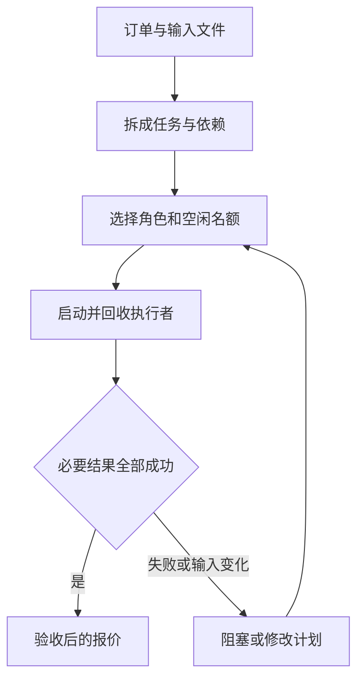

# 04｜编排与调度：把一张订单安排成可执行的工作

[组件总览](../README.md) · [上一组件：Agent 执行循环](../03-agent-loop/README.md) · [下一组件：通信与交接](../05-communication-and-handoff/README.md)

本章处理一张活动订单：买 3 本笔记本、2 支笔，先检查库存、价格和预算，再生成可验收的报价。初始报价为 5200 分。笔记本涨价后，报价变成 5800 分；如果同时增加 200 分运费，则变成 6000 分。每次都能从输入文件、节点结果和执行记录查到计算过程。

你会基础 Python 即可开始。我们先计算一个金额，再给动作补上依赖、角色和状态，最后处理失败与计划修改。本章的执行者是读取 JSON、计算和检查的确定性函数；它们没有模型判断。上一章的真实 Agent 循环也可以成为一个执行者，但调度器仍负责决定它何时启动、何时回收，以及哪些后续节点允许运行。



## 从哪篇开始，完成什么

| 顺序 | 本篇新增的问题 | 正文与完整入口 |
|---|---|---|
| 01 | 算出金额之后，还需要哪些工作、谁可以执行 | [从一次计算拆出任务图](01-task-graph-and-roles.md)；[v1_quote.py](code/v1_quote.py) |
| 02 | 有依赖、有名额时，怎样真正并发并回收子任务 | [就绪队列与子任务生命周期](02-scheduling-and-lifecycle.md)；[v2_schedule.py](code/v2_schedule.py) |
| 03 | 一个分支失败，或价格和依赖变了，哪些结果还能用 | [汇总、失败与局部重规划](03-results-and-replanning.md)；[v3_replan.py](code/v3_replan.py) |
| 04 | 怎样用同题实验和标准库源码核对前面的机制 | [实验与标准库对照](04-experiments-and-source.md)；[experiments.py](code/experiments.py) |

| 版本 | 有什么 | 尚未加入什么 |
|---|---|---|
| v1 | 读取订单、按单价求和、写结果 | 库存、预算、依赖与并发 |
| v2 | 六节点 DAG、角色容量、超时、取消、失败阻塞、结果验收 | 修改已经执行过的计划 |
| v3 | 保留无关结果、重算受影响节点、增加运费分支 | 运行中替换计划、进程重启恢复 |

## 环境与实际输入

使用 Python 3.11 或更新版本，全部主线命令只依赖标准库，不需要安装第三方包或设置 API Key。以下命令的工作目录都是本章目录：

```bash
cd 10-Knowledge/04-orchestration-and-scheduling
```

这条命令从仓库根目录执行，无标准输出，只改变当前目录。后续 `python` 指向你的 Python 3.11+ 解释器。

| 输入 | 内容 |
|---|---|
| [order.json](fixtures/order.json) | `event-001`，笔记本 3 本、笔 2 支 |
| [stock.json](fixtures/stock.json) | 笔记本库存 10，笔库存 5 |
| [prices-v1.json](fixtures/prices-v1.json) | 单价 1200、800 分，版本 1 |
| [prices-v2.json](fixtures/prices-v2.json) | 单价 1400、800 分，版本 2 |
| [prices-missing.json](fixtures/prices-missing.json) | 缺少笔的单价，用于失败实验 |
| [policy.json](fixtures/policy.json) | 预算上限 6000 分、运费 200 分 |

金额统一使用整数分，避免浮点小数影响本章的比较。输入文件保留原样；程序将实际输入复制进运行目录。

## 顺着执行的命令

在本章目录逐条运行以下完整命令：

```bash
python code/v1_quote.py
python code/v2_schedule.py
python code/v2_schedule.py --missing-price --output runs/v2-missing
python code/v3_replan.py
python code/v3_replan.py --add-shipping --output runs/v3-shipping
python code/experiments.py
python -m unittest discover -s code -p 'test_*.py' -v
python sources/verify_sources.py
```

各版本的准确标准输出在对应正文中。前五条命令分别留下 `runs/v1/`、`runs/v2/`、`runs/v2-missing/`、`runs/v3/`、`runs/v3-shipping/`；实验入口写入 `runs/experiments/`。重复运行相同入口会覆盖同名输出目录中的文件，需要保留对照时用 `--output` 指定另一目录。v1 的输出固定为 `runs/v1`。

| 产物 | 应看什么 |
|---|---|
| `input.json` | 这次实际使用的订单、库存、价格和政策；v1 只写结果 |
| `result.json` | 各节点状态、结果、错误、执行次数、验收结论 |
| `events.jsonl` | `ready/start/cleanup/succeeded/failed/blocked/replan` 的真实顺序 |
| `report.md` | 从同一次结果生成的节点状态与报价 |
| `comparison.json` | 六个实验场景的可比较数值 |

可以先打开已经实际生成的[实验报告](artifacts/reference/report.md)、[局部重算记录](artifacts/reference/price_changed/result.json)和[新增节点记录](artifacts/reference/plan_changed/result.json)，再自行重跑。参考文件没有手填结果。

本章在 CPython 3.12.14 下按上述路径运行，9 项自动测试通过，六个实验场景均已执行。源码快照取自该运行时，附许可证与 SHA-256 清单；核对范围是本地快照，未将其与远端发布包逐字节比较。模型调用、外部消息服务和进程崩溃恢复不在这些运行记录中。

逐条命令、完整正文片段的标准输出与退出码见[读者走读记录](artifacts/verification.json)。

开始阅读：[01｜从一次计算拆出任务图](01-task-graph-and-roles.md)。
