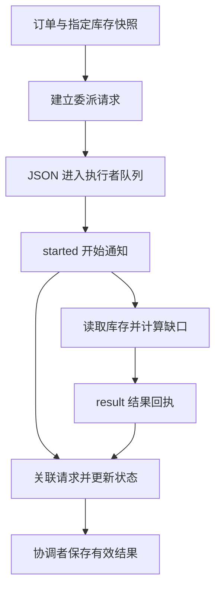

# 01｜从函数返回到委派消息

[阅读路线](README.md) · [下一篇](02-retries-and-late-messages.md)



我们先把图中最核心的动作写出来：给一个函数订单与库存，让它返回缺口。只有当这次返回不能再靠函数调用栈关联时，才需要消息中的 ID、地址与状态。

## 1. 一次委派可以只是参数和返回值

下面是完整可运行片段，工作目录为本章目录，依赖 Python 标准库。输入是已经存在的两份 JSON 文件，片段只打印，不写文件：

```python
import json
from pathlib import Path

order = json.loads(Path("fixtures/order.json").read_text(encoding="utf-8"))
inventory = json.loads(Path("fixtures/inventory-ready.json").read_text(encoding="utf-8"))
available = inventory["stock"][order["sku"]]
shortage = max(0, order["quantity"] - available)
print(f"requested={order['quantity']} available={available} shortage={shortage}")
```

准确标准输出：

```text
requested=3 available=2 shortage=1
```

把计算放到 `check_stock(order, inventory)` 后，调用方不需要知道内部怎样读取字段，只需依赖返回值。完整函数位于 [v1_delegate.py](code/v1_delegate.py)：

```python
def check_stock(order, inventory):
    available = inventory["stock"].get(order["sku"], 0)
    return {"sku": order["sku"], "requested": order["quantity"],
            "available": available, "shortage": max(0, order["quantity"] - available),
            "evidence": {"version": inventory["version"], "pointer": f"/stock/{order['sku']}"}}
```

这是函数定义，定义本身无标准输出；调用返回字典。`pointer` 表示库存文档中的路径，例如 `/stock/pen`，`version` 指明使用哪份快照。输入范围明确：缺少 SKU 时按库存 0 处理，数量校验不是这个函数的职责，本章 fixture 已给出正整数。

运行完整入口：

```bash
python code/v1_delegate.py
```

准确标准输出：

```text
sku=pen requested=3 available=2 shortage=1
owner=coordinator
artifacts=runs/v1
```

打开 `runs/v1/result.json` 可以核对数值和证据路径。库存函数完成了受托检查，后续如何处理缺货仍由协调者决定。这就是本章所说的**委派**：分出去的是工作，整体责任尚未转移。

## 2. 离开调用栈以后，需要显式关联请求

如果有两个执行者、多个任务或重试，调用方不能靠“刚收到一段文字”判断它属于哪个任务。本文消息字典把身份、收发地址和正文分开。下面是正常运行 v2 时第一条请求的结构示例；它是 JSON 数据，不是独立可执行脚本：

```json
{
  "protocol": 1,
  "message_id": "request-001",
  "case_id": "order-017",
  "task_id": "read-stock",
  "correlation_id": "request-001",
  "attempt": 1,
  "input_version": "stock-2",
  "epoch": 1,
  "from": "coordinator",
  "to": "inventory-worker",
  "kind": "delegate",
  "payload": {
    "order": {
      "case_id": "order-017",
      "sku": "pen",
      "quantity": 3,
      "customer_request": "希望本周收到3支笔。"
    },
    "inventory_file": "inventory-ready.json",
    "return_fields": ["sku", "requested", "available", "shortage", "evidence"]
  }
}
```

| 字段 | 类型 | 用来回答什么 |
|---|---|---|
| `message_id` | 字符串 | 是不是同一条消息的再次投递 |
| `case_id` | 字符串 | 属于哪张订单的整件工作 |
| `task_id` | 字符串 | 受托完成哪项逻辑任务 |
| `correlation_id` | 字符串 | 对应哪一次委派请求；本例等于请求的 message_id |
| `attempt` | 正整数 | 该逻辑任务第几次真正执行 |
| `input_version` | 字符串 | 结果基于哪份输入快照 |
| `epoch` | 正整数 | 委派时整体负责人处于哪一任期 |
| `from`、`to` | 字符串 | 发件者和收件者 |
| `kind` | 字符串 | delegate、started、result 或 failure |
| `payload` | 字典 | 请求参数、结果或结构化失败 |
| `protocol` | 整数 1 | 本文消息结构的版本 |

这些是本文订单程序实际使用的字段，不是供应商 API 格式。每个 ID 只有一种主要职责：`task_id` 跨重试不变，`correlation_id` 随新执行请求变化，回复自己的 `message_id` 则与请求不同。不要拿模型工具调用的 `tool_call_id` 直接充当整个订单 ID。

## 3. 队列传递字符串，接收方再解析成字典

[protocol.py](code/protocol.py) 中的 `LocalBus` 为每个参与者保存一个 `asyncio.Queue`。下面是 `send` 和 `receive` 的方法节选，依赖 `self.queues/self.wire`、`canonical` 和 `json`，定义本身不打印：

```python
async def send(self, message):
    encoded = canonical(message)
    self.wire.append(json.loads(encoded))
    await self.queues[message["to"]].put(encoded)

async def receive(self, recipient):
    encoded = await self.queues[recipient].get()
    self.queues[recipient].task_done()
    return json.loads(encoded)
```

`canonical` 使用固定键顺序将字典序列化成 JSON 字符串。接收方用 `json.loads` 建立新的字典，不会与发送者共享原来的嵌套对象。`messages.jsonl` 保存实际传过的消息，便于查关联。

这里的 `task_done` 表示队列项已经交到调用者手中，**不代表库存检查已经完成**。业务状态只由后面的 `started/result/failure` 处理器改变。本章不使用 `Queue.join()` 判断订单是否完成。

## 4. 开始通知和结果回执承担不同职责

库存执行者先发 `started`，读取指定文件后才发结果。`Case.response` 从原请求复制关联字段，交换收发地址，并创建新的消息 ID。以下是其中返回对象的等价节选，依赖 `request/kind/payload` 和 `self.new_id`，没有标准输出：

```python
return {"protocol": 1, "message_id": self.new_id("message"),
        "case_id": request["case_id"], "task_id": request["task_id"],
        "correlation_id": request["correlation_id"], "attempt": request["attempt"],
        "input_version": request["input_version"], "epoch": request["epoch"],
        "from": request["to"], "to": request["from"], "kind": kind,
        "payload": deepcopy(payload)}
```

| 正常路径上的消息 | 接收后状态 | 是否可汇总 |
|---|---|---|
| `delegate` | `pending` | 否，尚未执行 |
| `started` | `running` | 否，仅证明开始 |
| `result` 且证据通过 | `completed` | 是 |

接收结果时，程序不仅看 `kind=result`，还读取请求指定的库存文件，重新构造期望结果，再与回执比较。SKU、数量、缺口、证据版本和文件路径都必须一致。这种领域检查在本例很短；复杂任务可以返回文件、行号、测试结果，再由相应验收器检查。

在本章目录运行完整入口，读取同一组正常输入：

```bash
python code/v2_messages.py
```

准确标准输出：

```text
decisions=accepted_started,accepted_result
complete=True owner=coordinator epoch=1
artifacts=runs/v2
```

打开 `messages.jsonl`：请求是 `request-001`，开始与结果通知是不同的消息 ID，但都关联 `request-001`。再打开 `result.json`：有效结果只有 `read-stock` 一份，负责人仍是协调者。下一篇故意重发、改错和延迟这些消息，检查关联规则是否真的保护了结果。

[下一篇：02｜失败、重发与迟到消息](02-retries-and-late-messages.md)
