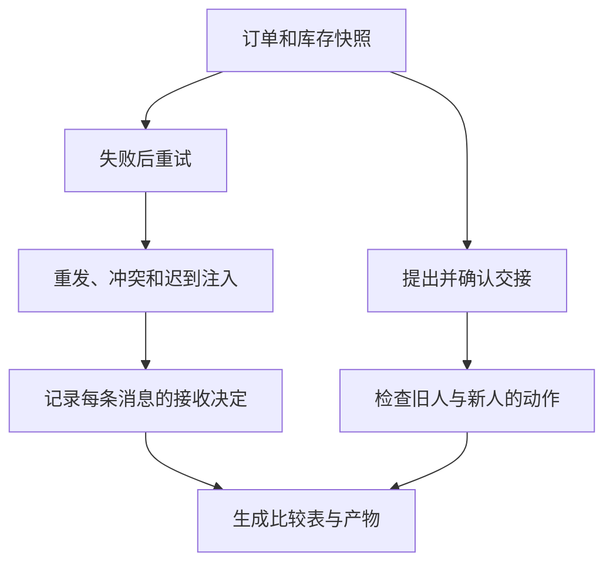

# 04｜实验与队列源码

[阅读路线](README.md) · [上一篇](03-context-and-ownership.md)



这篇从实际接收到的消息出发，核对前面每个拒绝分支。随后回到 `asyncio.Queue` 的源码，分清队列已经交付消息与业务已经验收结果之间的距离。

## 1. 运行固定场景，再读生成的检查表

在本章目录执行下列完整命令。依赖标准库，输入为 `fixtures/`；脚本会运行消息场景与交接场景，再从真实决定生成总表：

```bash
python code/experiments.py
```

准确标准输出：

```text
checks=19 passed=19
worker_executions=2 accepted_results=1 shortage=1
owner=fulfillment-specialist epoch=2
artifacts=runs/experiments
```

检查器中的 expected 是明确的协议约定，actual 来自本次 `Case.receive/accept_handoff/act` 的返回值；只要有一项不相等，入口以退出码 1 结束。两个场景各自使用新的 `Case`，不会把一份有效结果跨实验混用。

| 实验组 | 代表性输入变化 | 应观察的结果 |
|---|---|---|
| 失败与重试 | stock-1 不可用 → stock-2 就绪 | 第一次失败，第二次结果通过，执行次数 2 |
| 重复 | 原请求或原结果再投递一次 | 复用回执，执行次数不增加 |
| 冲突 | 同一 message_id 改了 shortage | `conflicting_message`，有效结果不变 |
| 迟到 | attempt 1 的新消息在 attempt 2 后到达 | `stale_attempt` |
| 进度倒退 | 完成后才收到 started | `late_progress`，仍为 completed |
| 错误关联 | 改 correlation_id 或 input_version | `wrong_correlation` 或 `stale_input` |
| 终态冲突 | 新 message_id 声称另一份结果 | `conflicting_outcome` |
| 交接 | 先提出、再确认、旧人尝试继续 | 确认前 owner 不变；确认后拒绝旧人 |

打开 [已生成的参考报告](artifacts/reference/report.md)，可以查看全部 19 项。再打开 `delivery/messages.jsonl`，按 `message_id` 找到冲突消息；它和之前那条 ID 相同但正文不同。接收器没有替换结果，只在 `decisions` 中增加拒绝记录。

## 2. 从文件核对执行次数与关联关系

以下完整片段需要先运行上面的实验。工作目录为本章目录，依赖标准库，读取实际产物，没有新文件输出：

```python
import json
from pathlib import Path

root = Path("runs/experiments/delivery")
result = json.loads((root / "result.json").read_text(encoding="utf-8"))
messages = [json.loads(line) for line in (root / "messages.jsonl").read_text(encoding="utf-8").splitlines()]
requests = {m["message_id"]: m for m in messages if m["kind"] == "delegate"}
assert len(requests) == 2
assert result["worker_executions"] == 2
assert result["merged"]["results"]["read-stock"]["shortage"] == 1
assert all(m["correlation_id"] == m["message_id"] for m in requests.values())
print("unique_requests=2 executions=2 shortage=1")
```

准确标准输出为 `unique_requests=2 executions=2 shortage=1`。请求消息出现了三次，但去重以后只有两个 ID，实际执行也只有两次。比较“投递次数”和“业务执行次数”能直接发现重发是否造成重复工作。

## 3. 改一个订单数量，检查上下文是否真的生效

下面是完整可运行片段，在本章目录执行，依赖标准库和配套模块。它先读取 `order.json`，只在内存副本把数量改成 4，随后走真实请求、回执和交接流程；不写文件、不修改原 fixture：

```python
import asyncio
import sys
sys.path.insert(0, "code")
from protocol import Case, LocalBus, exchange, read_fixture

async def changed_order():
    order = read_fixture("order.json")
    order["quantity"] = 4
    order["customer_request"] = "希望本周收到4支笔。"
    case = Case(order)
    bus = LocalBus(["coordinator", "inventory-worker"])
    request = case.delegate("coordinator", "inventory-ready.json")
    await exchange(case, request, bus)
    offer = case.offer_handoff("coordinator", "fulfillment-specialist")
    case.accept_handoff("fulfillment-specialist", offer["handoff_id"], 1)
    print(case.results["read-stock"]["shortage"])
    print(case.act("fulfillment-specialist", 1, "draft_options"))
    print(case.act("fulfillment-specialist", 2, "refund"))
    print(case.act("fulfillment-specialist", 2, "draft_options"))

asyncio.run(changed_order())
```

准确标准输出：

```text
2
rejected_stale_owner
rejected_action
draft_created
```

订单数量变化使缺口从 1 变成 2。负责人正确但任期旧，仍然不能推进；任期正确但请求退款，也不能推进。只有允许的动作通过后才生成草稿。可以在最后加 `print(case.draft)` 检查它是否准确写出数量 4、库存 2、缺口 2，且没有补货日期承诺。

## 4. 队列源码没有订单的业务状态

本章保存 CPython **3.12.14** 实际运行时的 [queues.py](sources/queues.py)、[许可证](sources/LICENSE.Python.txt)与[哈希清单](sources/manifest.json)。这是 `Lib/asyncio/queues.py` 的完整原文件，含相对导入，供源码走读，不应当作独立脚本启动。

| 本文动作 | 原文件位置 | 源码中的关键状态 | 不会替本文完成的事 |
|---|---|---|---|
| 发送消息 | `Queue.put`、`put_nowait` | 队列是否满、`_unfinished_tasks` 增加 | 不生成 message_id，不识别重复 |
| 接收消息 | `Queue.get`、`get_nowait` | 队列是否空，唤醒等待的生产者 | 不检查 attempt、输入版本或证据 |
| 确认消费 | `task_done` | `_unfinished_tasks` 减少，归零时设置 `_finished` | 不表示订单已验收 |
| 等待消费完毕 | `join` | 等待 `_finished` | 不检查还缺哪些逻辑任务 |

先读 `put_nowait`，找到 `_put(item)` 后对 `_unfinished_tasks` 的增加；再读 `get_nowait`，会发现它只是取出条目，不负责减少未完成计数。最后读 `task_done`，才能看到计数减少的位置。这个分离允许消费者先取消息，处理完以后再确认；究竟“处理完”指什么，由调用方定义。[Python asyncio.Queue 文档](https://docs.python.org/3.11/library/asyncio-queue.html)

本文 `LocalBus.receive` 在将消息交给业务处理器之前调用 `task_done`，所以它仅用于记录队列交付。如果以后使用 `join()` 等待业务处理完毕，应把 `task_done` 移到业务处理器的 `finally`；业务验收仍需读取 `Case` 的明确状态，不能只检查队列是否空。

以下完整标准库片段没有 fixture 和文件产物，在本章目录或任意目录均可运行，展示取出消息与完成消费是两个时刻：

```python
import asyncio

async def queue_example():
    queue = asyncio.Queue()
    await queue.put("result")
    message = await queue.get()
    waiter = asyncio.create_task(queue.join())
    await asyncio.sleep(0)
    print(message, waiter.done())
    queue.task_done()
    await waiter
    print("joined", waiter.done())

asyncio.run(queue_example())
```

准确标准输出：

```text
result False
joined True
```

`join` 等待的是队列消费计数。本章在这一层之上实现关联、去重、失败、结果验收和控制权，不能因为选用了一个队列就省略这些规则。

## 5. 验证范围与下一步

在本章目录运行下列完整命令，无外网请求：

```bash
python -m unittest discover -s code -p 'test_*.py' -v
python sources/verify_sources.py
```

成功测试输出包括 `Ran 12 tests` 和 `OK`，耗时可变；源码核对的准确输出为 `verified=2 runtime=CPython 3.12.14`。测试覆盖并发重复请求只执行一次、消息冲突、迟到尝试、错误关联/输入/参与者、伪造缺口不通过、交接确认与旧 owner、动作范围、未完成时禁止交接、合并缺项、路径约束和非字典结构错误，并验证实际快照变更及交接未决时禁止新增委派。

两章结合起来，上一章决定何时启动哪项工作，本章决定回来的是哪次执行的什么结果，以及下一步由谁推进。随后还要回答：每个执行者和接手者究竟应看到哪些历史、哪些文件和多大的上下文。[下一组件：上下文管理](../06-context-management/README.md)。
