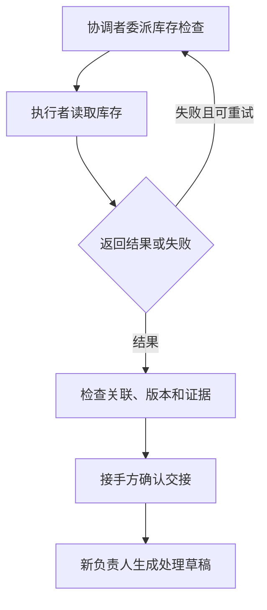

# 05｜通信与交接：让结果回来，让责任有归属

[组件总览](../README.md) · [上一组件：编排与调度](../04-orchestration-and-scheduling/README.md) · [下一组件：上下文管理](../06-context-management/README.md)

客户的订单需要 3 支笔，当前库存只有 2 支。协调者先委派库存检查，拿到可核对的缺货结果；如果库存快照暂时不可用，就依据失败回执重试。确认缺货后，将后续处理交给履约专员，生成一份等待客户确认的分批发货草稿。

本章不发送消息给真实客户，也不修改库存。业务执行者是读取文件和计算缺口的确定性函数，消息传递使用进程内的 JSON 队列。这样可以完整观察委派、回传、去重、迟到结果和责任转移，而不把固定函数说成会推理的模型 Agent。



## 阅读顺序

| 顺序 | 这一篇写出什么 | 完整入口 |
|---|---|---|
| 01 | [从函数返回到委派消息](01-delegation-and-results.md)：先算缺口，再把请求和回执装进 JSON | [v1_delegate.py](code/v1_delegate.py)、[v2_messages.py](code/v2_messages.py) |
| 02 | [失败、重发与迟到消息](02-retries-and-late-messages.md)：区分消息身份、执行尝试、输入版本，核对结果清单 | [protocol.py](code/protocol.py)、[experiments.py](code/experiments.py) |
| 03 | [交接上下文与控制权](03-context-and-ownership.md)：提出交接、确认接手、拒绝旧负责人的动作 | [v3_handoff.py](code/v3_handoff.py) |
| 04 | [实验与队列源码](04-experiments-and-source.md)：重放具体消息，检查 19 项可观察结果 | [experiments.py](code/experiments.py) |

| 版本 | 新增机制 | 负责人 |
|---|---|---|
| v1 | 函数参数与返回值 | 始终是协调者 |
| v2 | JSON 请求、started/result/failure、ID 关联、结果验收 | 始终是协调者 |
| v3 | 上下文包、接手确认、owner 与 epoch 检查 | 确认后转给履约专员 |

## 环境和输入

使用 Python 3.11 或更新版本，仅依赖标准库，不需要模型配置。以下命令都在本章目录运行。从仓库根目录进入：

```bash
cd 10-Knowledge/05-communication-and-handoff
```

命令无标准输出，只改变工作目录。输入已实际放在目录中：

| 文件 | 本章使用的内容 |
|---|---|
| [order.json](fixtures/order.json) | `order-017`，SKU 为 pen，数量 3 |
| [inventory-unavailable.json](fixtures/inventory-unavailable.json) | 版本 stock-1 的快照尚未就绪 |
| [inventory-ready.json](fixtures/inventory-ready.json) | 版本 stock-2，pen 的库存为 2 |
| [policy.json](fixtures/policy.json) | 只允许生成处理草稿，不能承诺补货日期或自动退款 |

先跑正常路径，再跑含失败、重发、迟到和交接的实验：

```bash
python code/v1_delegate.py
python code/v2_messages.py
python code/v3_handoff.py
python code/experiments.py
python -m unittest discover -s code -p 'test_*.py' -v
python sources/verify_sources.py
```

命令的准确标准输出在各篇中。v1 写 `runs/v1/`，v2 写 `runs/v2/`，v3 写 `runs/v3/`，实验写 `runs/experiments/`。重复运行覆盖同名产物；v2、v3 与实验支持 `--output` 指定新目录。

| 产物 | 用途 |
|---|---|
| `input.json` | 本次实际使用的订单、库存快照和政策副本 |
| `messages.jsonl` | 经队列传递的原始请求与回执，包括注入的重复和迟到消息 |
| `result.json` | 接收决定、有效结果、owner/epoch、交接上下文 |
| `draft.md` | 尚未发送、等待客户确认的处理草稿 |
| `report.md` | 按真实事件生成的接收与交接记录 |
| `comparison.json` | 每项实验的 expected、actual 和 passed |

v1 只产生 `result.json`。交接的提出与确认通过本地方法完成，记在 `result.json`，不会伪装成经过消息总线的网络包。

已生成的[实验报告](artifacts/reference/report.md)、[消息实验](artifacts/reference/delivery/result.json)和[交接草稿](artifacts/reference/handoff/draft.md)可以直接打开。当前在 CPython 3.12.14 下完成 README 路径验证、12 项自动测试和 19 项实验检查；不请求外部模型。

边界集中说明：消息去重表、结果缓存和负责人记录保存在单进程内存中；进程重启后不保留，也不提供跨进程认证或数据库事务。本文的 ID/epoch 检查是业务协议规则，接入真实传输时还需要持久化和身份认证。本地源码快照锁定为 CPython 3.12.14 的实际文件，附哈希与许可证；未与远端发布包逐字节比对。

逐条命令、完整正文片段的标准输出与退出码见[读者走读记录](artifacts/verification.json)。

从这里开始：[01｜从函数返回到委派消息](01-delegation-and-results.md)。
