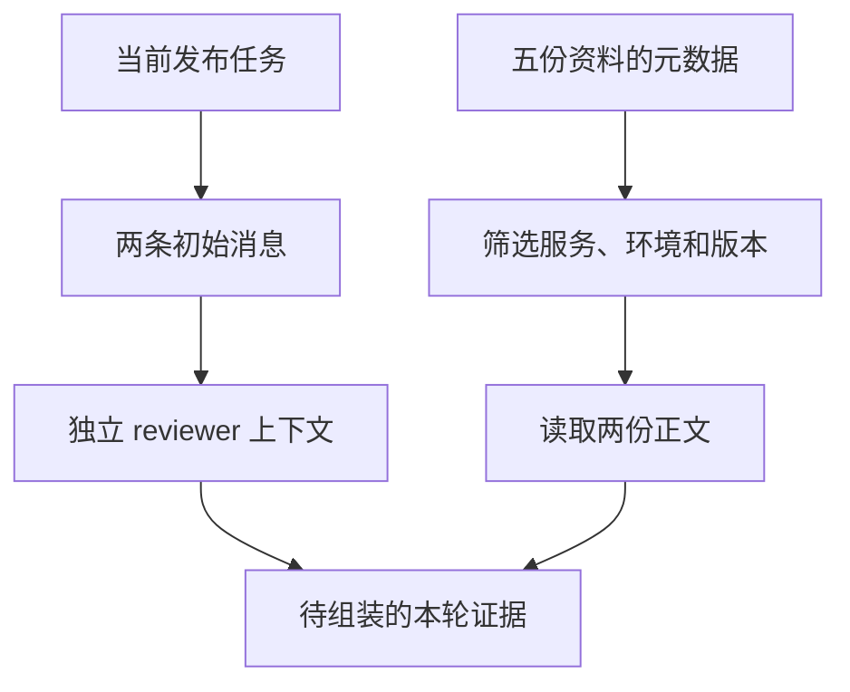

# 01｜从两条消息到独立上下文



[阅读路线](README.md) · [下一篇：预算与工具裁剪](02-budget-and-tool-results.md)

## 先明确一条消息里实际装了什么

`checkout` 的发布审核需要回答四件事：超时是多少、错误率超过多少要回滚、允许哪些租户、回滚演练是否通过。任务在 [task.json](fixtures/task.json) 中。先只把任务送入消息列表，不自动读取其他文件。

下面是**完整可运行片段**；工作目录为本章，依赖 Python 标准库，输入为 task fixture；它打印两条消息，不写文件。

```python
import json
from pathlib import Path

task = json.loads(Path("fixtures/task.json").read_text(encoding="utf-8"))
messages = [
    {"role": "system", "content": "审核发布资料，缺证据时停止判断。"},
    {"role": "user", "content": task["instruction"]},
]
print(len(messages))
print(messages[1]["role"])
```

准确输出为两行：`2`、`user`。任务说“确认 timeout_ms”，却没有提供它的值。模型若要回答，后续程序必须加载政策；不能把资料文件名当成资料内容。

完整脚本 [first_context.py](code/first_context.py) 使用同一 task 和稍完整的系统提示，还把输入落盘并计算第二篇要用的 token 数。以下命令依赖 README 的环境，读取 task，生成 `runs/first/messages.json`：

```bash
python code/first_context.py
```

准确输出：

```text
messages=2
serialized_input_tokens=82
artifacts=runs/first/messages.json
```

这里还没有请求模型。上下文组装是可以独立检查的程序行为；打开产物即可确认它确实没有读取政策。

## 交给另一个 Agent，不等于给列表换个变量名

假设主管已经做过测试环境任务，历史中含 `staging timeout_ms=9000`，现在把生产审核交给 reviewer。常见的第一种写法是 `worker = parent`：两者引用同一个列表。第二种写法 `parent.copy()` 只复制外层列表，其中的字典仍然共享。

下面是**完整反例**，在章节目录的 Python 中执行；只用标准库，无文件输入和产物。它模拟两个消息持有者，并不启动另一个模型。

```python
parent = [{"role": "system", "content": "生产审核"}]
worker = parent
worker.append({"role": "user", "content": "测试环境超时 9000"})
print(len(parent))

worker = parent.copy()
worker[0]["content"] = "覆盖了主管的提示"
print(parent[0]["content"])
```

准确输出为 `2` 和 `覆盖了主管的提示`。这个问题与模型质量无关，数据进入 API 之前就已经互相污染了。

[context.py](code/context.py) 中的 `isolate_worker` 是**函数定义**，输入主管消息和当前任务，返回新列表，不自行打印：

```python
def isolate_worker(messages, task):
    return copy.deepcopy(initial_messages(task))
```

依赖同文件的 `copy` 导入与 `initial_messages`。这里有意不重放 `messages`：只允许明确传入的当前 task 跨过交接边界。即使把整个 parent 深拷贝，也只是消除了共享对象，仍会把无关的 staging 内容复制进去。**对象独立**与**信息选择**是两个不同检查。

真实多 Agent 应用可以将此返回值交给 reviewer 的模型调用。审查者需要主管发现的某条事实时，应把带来源的事实加入交接包，而不是无条件复制全部对话。本章的隔离测试检查父消息保持不变、无关 staging 文本没有进入 reviewer 输入；它不实现操作系统进程或文件权限隔离。

## 先看索引，再决定读哪份正文

目录中有五份真实文本，元数据集中在 [index.json](fixtures/index.json)：

| id | 服务 / 环境 | 状态 | 本次读取 |
|---|---|---|---|
| policy-v3 | checkout / production | active | 是 |
| dry-run-log | checkout / production | active | 是 |
| policy-v2 | checkout / production | superseded | 否 |
| staging-note | checkout / staging | active | 否 |
| search-note | search / production | active | 否 |

先筛选小索引，可以少读取无关正文。v2 的超时是 5000；staging 是 9000；当前 production v3 是 3000。把它们全部塞进消息，再要求模型自己判断，会把本可由版本和范围字段明确解决的选择留给下一步。

下面为 `load_on_demand` 的**实现节选**；导入、排序与读取正文在 [完整实现](code/context.py) 中。`task` 来自 task fixture，`index` 来自 index fixture；`selected` 是元数据列表，没有标准输出。

```python
selected = [entry for entry in index if
            entry["service"] == task["service"] and
            entry["environment"] == task["environment"] and
            entry["status"] == "active"]
```

这三个字段的含义很具体：服务相同、环境相同、版本仍有效。排序按 priority 从高到低，再按 id 固定同分顺序。正文读取只发生在筛选以后，所以实验中的 `body_reads=2` 是实际执行了两次正文读取，不是读取五份以后只统计留下的数量。

这是元数据检索，不是语义检索；“内容是否回答问题”还要靠下面的证据检查。本任务很小，服务、环境与状态足以缩小范围；文档很多时，可以在同一选择阶段加入关键词或向量检索，仍须保留版本和范围过滤。

## 运行后沿着文件确认隔离与加载

以下为**完整实验命令**，环境与输入沿用 README，产物进入 `runs/default/`：

```bash
python code/run_experiments.py
```

控制台首先显示 `selected=2/5`。打开 `result.json`，确认 `alias_changed_parent=true`、`shallow_changed_parent=true`、`isolated_unchanged_parent=true`，同时 `unrelated_staging_leaked=false`。再打开 `loaded-documents.json`，其中只有 policy-v3 与 dry-run-log。

可以把 task fixture 的 environment 临时改为 staging，调用 `load_on_demand` 会只读 staging-note。完整发布实验专门要求 production 的政策与演练文件，因此不适合直接拿 staging 输入跑通全流程；要扩展到测试环境，应先提供对应环境的验收资料。这个区别能帮助定位错误：检索到东西，不等于发布证据齐全。

下一篇沿用这两份正文，解决“演练日志太长，结尾的失败被截掉了”。
