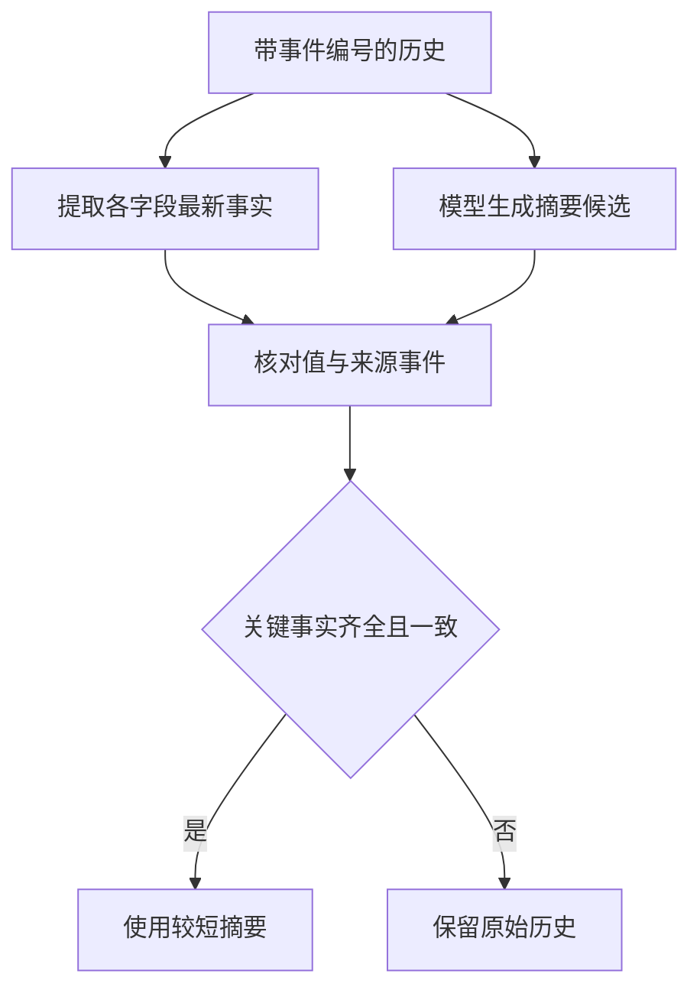

# 03｜压缩历史而不丢掉用户的更正



[阅读路线](README.md) · [上一篇](02-budget-and-tool-results.md) · [下一篇：实验与源码](04-experiments-and-source.md)

## 压缩的目标不是写得更像总结

[history.json](fixtures/history.json) 记录同一次发布的 12 个事件。最初用户说可以考虑 alpha、beta，后来改成“只允许 alpha，beta 不进入灰度”。如果摘要只写“已确定发布参数，超时 3000，错误率 2% 回滚”，句子很流畅，却丢了租户限制。

本章将发布任务的三个关键事实明确列出。事实值保留原类型，3000 是整数，alpha 是字符串；`event_id` 说明它来自哪次观察或更正。

| key | 最新 value | event_id | 要避免的失真 |
|---|---|---|---|
| allowed_tenants | alpha | e10 | 仍使用 e1 的 alpha,beta，或完全遗漏 |
| timeout_ms | 3000 | e11 | 单位、数字或来源错位 |
| rollback_errors_pct | 2 | e12 | 把条件删除或改为 5 |

这里的输入已经带 `fact` 字段，因此可以先不请求模型。结构化来源能直接提取时，可靠的复制通常比重新改写更简单。

## 从一段小循环开始提取

以下是**完整可运行片段**；工作目录为章节目录，仅需标准库，输入 history fixture，打印最新租户事实，不写产物：

```python
import json
from pathlib import Path

history = json.loads(Path("fixtures/history.json").read_text(encoding="utf-8"))
facts = {}
for event in history:
    if "fact" in event:
        item = event["fact"]
        facts[item["key"]] = {**item, "event_id": event["id"]}
print(facts["allowed_tenants"])
```

准确输出：

```text
{'key': 'allowed_tenants', 'value': 'alpha', 'event_id': 'e10'}
```

同一 key 后出现的显式事件覆盖前值，这是本文有序事件记录的约定，不是“互联网最新网页永远更可信”。如果来源之间权限不同，不能只靠列表顺序判定；长期知识的来源与冲突在 [Memory 章](../13-memory/README.md) 继续展开。

[extract_history](code/context.py) 将这个循环封装为函数，并按 key 排序输出。运行默认实验会保存 `summary.json`：原历史为 393 个编码 token，摘要为 53 个，三项最新事实全部保留。

## 故意漏掉一个字段，看看校验怎样失败

[bad-summary.json](fixtures/bad-summary.json) 是用于故障复现的候选摘要：它保留 e11、e12，遗漏 e10。

`validate_summary` 逐项核对 key、value 和 event_id，并要求覆盖原历史里所有最新事实。函数还拒绝重复 key、未知字段、旧事件编号和格式错误。下面是**调用片段**，可在章节目录执行；它通过 `sys.path` 使用本章完整实现，依赖及输入与上面相同，额外依赖已配置的 tiktoken 模块导入，不请求模型、不写文件：

```python
import sys
sys.path.insert(0, "code")
from context import read_fixture, validate_summary

check = validate_summary(read_fixture("bad-summary.json"), read_fixture("history.json"))
print(check)
```

准确输出：

```text
{'accepted': False, 'errors': ['missing:allowed_tenants'], 'preserved': 2, 'required': 3}
```

再把坏摘要的超时改成 5000，会多出 `unsupported_or_stale:timeout_ms`。只统计“字段存在”不够，必须比较值与来源。将 alpha 改回 alpha,beta 即使仍带 e10，也会被拒绝。

校验器在这里能完整核对，是因为输入事实字段已经结构化；开放领域长文的语义事实并没有这么容易自动枚举。实现此能力时，应先选定必须保留的约束，或保留原文引用供进一步核对，不能把本例的 3/3 延伸成所有摘要语义无损。

## 接入真实模型，只让它提出候选

[live_compress.py](code/live_compress.py) 读取同一份 history，使用官方 OpenAI SDK 的 Chat Completions 接口。按 README 填写 `.env` 后运行下面的**完整命令**；输入为 history，产物进入每次新建的 `runs/live-<运行编号>/`：

```bash
python code/live_compress.py
```

下面是**调用结构示例**，缩短了系统提示，依赖完整文件中初始化的 `client`、`model`、`history` 以及 `dumps`，不是单独可运行片段：

```python
response = client.chat.completions.create(
    model=model,
    messages=[
        {"role": "system", "content": "返回 facts，每项仅含 key、value、event_id；保留每个 key 的最新事实。"},
        {"role": "user", "content": dumps(history)},
    ],
    response_format={"type": "json_object"},
)
```

实际文件中的系统提示更完整，明确禁止补充事实。SDK 返回的 `message.content` 是 JSON 文本，`json.loads` 转成 Python dict 后才能交给 `validate_summary`；请求 JSON 格式并不自动保证事实正确。

| API / 程序对象 | 类型 | 下一步 |
|---|---|---|
| `response.choices[0].message.content` | str 或空值 | `json.loads`，失败则候选无效 |
| candidate | dict 或 None | 与原历史的最新事实逐项比较 |
| verdict.accepted | bool | 决定 effective-context 保存摘要或原历史 |
| response.usage | SDK 统计对象或空值 | 原样保存在 response.json，供核对真实服务用量 |

模型运行的**输出结构**如下；True/False 取决于实际回答：

```text
accepted=<True 或 False>
effective_context=<summary 或 original_history>
artifacts=runs/live-<运行编号>
```

失败候选不替换原历史，也不静默调用一个固定响应替身。`request.json` 不保存 API Key；`response.json` 保存真实返回内容；`validation.json` 写出不合格原因。

## 在预算与语义之间保留明确出口

短摘要通过验证后，可以作为第二篇 `pack` 的必需块。摘要不合格时，保留原历史可能导致预算超限；这时应降低本轮任务范围、回读指定事实或明确暂停，而不是先删除约束再宣称预算已解决。

默认实验展示结构提取前后对照；真实模型压缩只在显式运行 live 入口时发生。验证范围统一记录在 README。
