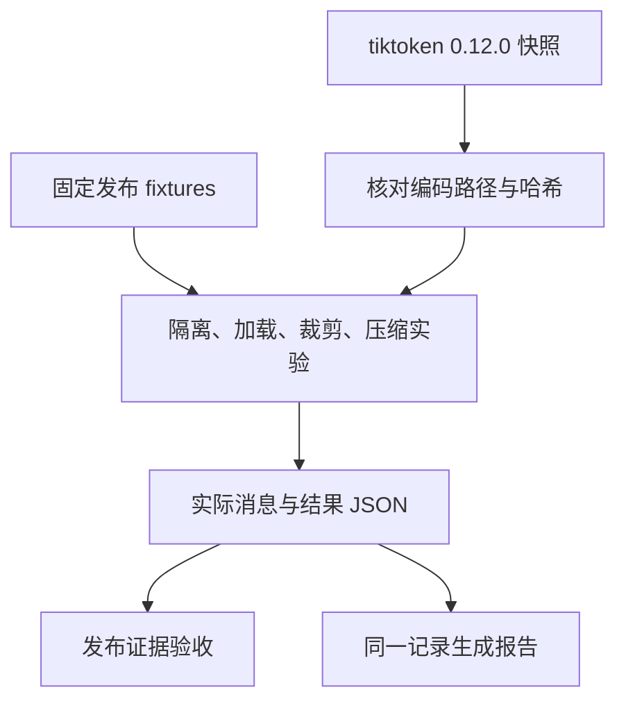

# 04｜运行同题对照，再追到编码器源码



[阅读路线](README.md) · [上一篇](03-history-compression.md)

## 先预测再运行

本章的任务没有变化：为 checkout production 的这次灰度判断发布条件。下面几项反例各改变一个机制，目的是确认变化发生在哪里。

| 对照 | 固定的东西 | 唯一主要变化 | 观察对象 |
|---|---|---|---|
| 引用、浅拷贝、独立构造 | 当前任务 | 消息对象与选择边界 | 父消息是否被改、staging 是否泄漏 |
| 全索引、筛选后读取 | 五份资料 | 先按范围与版本筛选 | 正文读取数 |
| 取开头、保留头尾与元数据 | 84 行日志 | 结果裁剪方式 | 失败行是否保留 |
| 坏摘要、结构提取摘要 | 同一份历史 | 是否保留最新租户约束 | 事实 2/3 或 3/3 |
| 默认、小窗口 | 完全相同的候选证据 | 输入额度 1500 → 401 | 最终可见证据与发布状态 |

下面为**完整运行命令**，在章节目录执行；依赖、编码器缓存按 README 准备，输入 fixtures，输出各自 runs 目录。控制台标准输出见 README。

```bash
python code/run_experiments.py
python code/run_experiments.py --window 1301 --out runs/tight
python code/run_experiments.py --window 1302 --out runs/boundary
```

边界实验正好需要 402，因此重新纳入失败证据。若缩小到连必需块都放不下，`pack` 抛出 `mandatory_overflow`，不会保存一个看似合格但丢了用户任务的 messages。

## 沿实际文件核对结果

先打开 `loaded-documents.json` 确认政策是 v3，再打开 `cropped-log.json`，找到第 83 行的 `rollback_check=FAILED`。随后检查 `summary.json` 的 allowed_tenants 是否为 alpha、event_id 是否为 e10。最后打开 `messages.json`，确认这些内容是否真的进入本轮消息，而不是仅存在于某份中间文件。

[已保存的默认记录](reports/verified-default.json) 对应以下实测值：

| 检查 | 实际值 | 解释 |
|---|---:|---|
| 正文读取 | 2 / 5 | 排除了旧版、测试环境、其他服务 |
| 日志编码量 | 962 → 150 | 保留原行号和来源信息后的量 |
| 历史编码量 | 393 → 53 | 提取三项最新事实 |
| 有损摘要保留 | 2 / 3 | 漏了租户限制，拒绝采用 |
| 默认最终输入 | 402 / 1500 | 重新计数整个序列化消息，不能简单相加前面的数 |
| 默认发布检查 | BLOCKED | 回滚演练有失败证据 |

`report.md` 由 result 中同一批值生成，避免手动填写成功率或另外写一份与消息不一致的报告。本程序没有运行真实发布，所以 `BLOCKED` 是对所给 fixtures 的检查结论。

## 测试针对容易错误的边界

完整测试命令如下，不访问真实模型。tokenizer 缓存已预热后，测试也不需要外网：

```bash
python -m unittest discover -s code -p 'test_*.py' -v
```

本次 9 项全部通过，覆盖父对象污染、无关历史排除、版本筛选、裁剪元数据、遗漏和旧事实拒绝、预算恰好够用与超限，以及缺演练证据时不放行。API 测试注入记录请求参数的测试对象，检查程序构造的调用参数。

## 对照固定版本的 tiktoken

[source manifest](sources/manifest.json) 记录了实际下载核对的 tiktoken `0.12.0` 三个文件 URL 和 SHA-256；原文件与 MIT 许可证存放在 [sources/upstream](sources/upstream/)。上游固定版本：[core.py](https://github.com/openai/tiktoken/blob/0.12.0/tiktoken/core.py)、[registry.py](https://github.com/openai/tiktoken/blob/0.12.0/tiktoken/registry.py)。

| 本文调用 | 真实原文件与函数 | 按什么顺序读 |
|---|---|---|
| `get_encoding("o200k_base")` | `registry.py::get_encoding` | 名称检查 → 缓存命中 → 找构造器 → 构造 Encoding → 写回缓存 |
| `encode_ordinary(text)` | `core.py::Encoding.encode_ordinary` | 调用 `_core_bpe.encode_ordinary`；处理 Unicode 编码异常 |
| `len(ids)` | 本文 `measure` | token ID 列表长度；不是源码提供的“消息账单” |

下面是 `core.py::Encoding.encode_ordinary` 的**原始源码节选**，用于对照，不是独立脚本；完整上下文保存在源码快照中：

```python
try:
    return self._core_bpe.encode_ordinary(text)
except UnicodeEncodeError:
    text = text.encode("utf-16", "surrogatepass").decode("utf-16", "replace")
    return self._core_bpe.encode_ordinary(text)
```

这里返回 `list[int]`，本文再取长度。BPE 的底层实现没有在这几行中展开；同样，这些行不知道聊天服务会添加哪些角色标记。这个对应关系说明为什么我们能精确复现本地编码，却仍把 API 包装余量单独列出。

以下为**完整离线核对命令**，只需标准库，输入 manifest 和快照，不生成文件：

```bash
python sources/verify_sources.py
```

准确输出为 `verified=3`。哈希校验只能确认本地文件仍与已记录的下载字节相同；远端固定版本来源已在保存快照时核对。第一次词表下载需要网络，与这份源码校验是两个独立步骤。

接到完整 Agent 循环时，把本章的“选择 → 裁剪 → 压缩校验 → 预算”放在每次模型请求之前，并保留最终 messages。随后遇到任务失败，就能区分是模型看到了证据却没用，还是程序从未把证据送进去。
