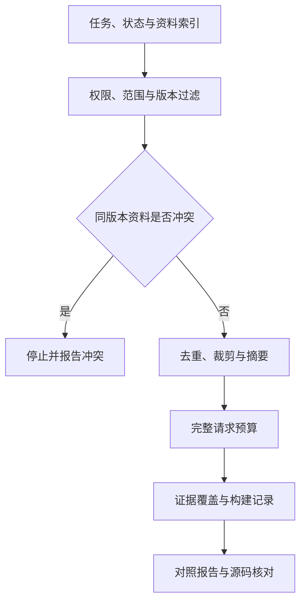

# 04｜Context Builder 与实验

本章总览图如下：



[阅读路线](README.md) · [上一篇：历史压缩与事实校验](03-history-compression.md) · [下一篇：失败模式与排障](05-failure-modes.md)

## 构建器输入

前面分别实现了资料加载、预算和压缩。Context Builder 将这些步骤串在每次模型调用之前。输入仍是同一次发布审核；[engineering/task.json](fixtures/engineering/task.json) 增加任务编号、政策版本、当前时间、约束、待办和验收条件。[engineering/index.json](fixtures/engineering/index.json) 为原有资料增加租户、种类与信任来源，并放入重复、过期和不可信资料用于对照。

| 输入 | 本文内容 | 由谁提供 |
|---|---|---|
| task | `release-17`、production、v3、约束、待办 | 应用保存的当前用户任务 |
| history | 带事件编号的用户更正和工具观察 | 当前任务的事件记录 |
| index | 路径、主体、租户、环境、版本、状态、信任、优先级 | 应用维护的资料索引 |
| tenant | 当前调用主体为 alpha | 认证后的运行环境，不能由模型自报 |
| tools / output Schema | 可用读取接口、审核结果字段 | 应用配置 |
| budget | 总额度、输出预留、包装余量 | 调用入口 |

这里的 index 是受应用控制的元数据，文档自己写的 `tenant=alpha` 不具有授权效力。知识来自文件，并不意味着该文件中的指令拥有用户权限。

## 构建顺序

| 顺序 | 实际函数或分支 | 留下的记录 |
|---|---|---|
| 1 | `select_documents` 在读取前检查 tenant | 无权项记为 permission，正文未打开 |
| 2 | 按服务、环境、状态、指定版本和有效时间筛选 | wrong_scope、superseded、wrong_version、expired |
| 3 | 按 priority 和 id 固定顺序读取，按内容哈希去重 | body_read_ids、duplicate、same_as |
| 4 | 核对当前政策内容是否唯一 | 同一范围和版本的不同正文报 unresolved_conflict |
| 5 | 提取历史事实，裁剪演练日志，标记外部资料 | transformations、source_ids、method、lossy、hash |
| 6 | 计入 messages、tools、response_format 后打包 | 实际请求 token、本地上限、因预算丢弃的编号 |
| 7 | 检查必须存在的政策与演练证据 | warnings、ready_for_review |

这里用内容哈希判断同版本政策是否一致，是保守的文件级检查；不同表述是否语义等价仍需进一步核对。历史版本比较任务则需要同时保留 v2 和 v3，各自带版本，不能套用“只留下当前版”的规则。

下面是完整调用片段。在章节目录运行，依赖 README 环境，读取已有 fixtures，打印构建结果，不请求模型、不写文件：

```python
import sys
sys.path.insert(0, "code")
from builder import build_context
from engineering_experiments import inputs

task, index, history = inputs()
envelope = build_context(task, index, history, "alpha")
print(envelope["selected_item_ids"])
print(envelope["ready_for_review"])
```

标准输出：

```text
['policy-v3', 'dry-run-log', 'external-note']
True
```

`ready_for_review=True` 表示指定证据已进入请求，不表示发布已经通过；本次演练依然失败。`external-note` 刻意保留为不可信数据，用来检查注入边界，后续评测再观察模型是否误用它。

## 请求与构建记录

`envelope` 是本文构建记录字典。`request` 保存准备交给模型入口的消息、工具和输出格式；其余字段供调试与评测，不应把整份 envelope 再发给模型。

| 字段 | 类型 | 本次用途 |
|---|---|---|
| request | dict | 审阅本轮实际准备发送的输入 |
| candidate_item_ids / selected_item_ids | list[str] | 比较候选与最终入窗证据 |
| body_read_ids | list[str] | 证明读取发生在过滤以后 |
| dropped | list[dict] | 说明每个排除项的原因 |
| transformations | list[dict] | 定位摘要、裁剪及其原始来源 |
| budget | dict | 本地计数范围、输出预留与包装余量 |
| warnings / ready_for_review | list[str] / bool | 关键证据缺口 |
| builder_version / task_id | str | 复现使用的策略和任务 |

`read_evidence` 在这里是接口定义，Builder 不执行工具；若接入 Agent 循环，运行环境仍须实现 ID 到授权文件的映射和读取校验。`response_format` 展示 JSON Schema 输出契约；调用时按模型能力选择相应接口，返回后仍需检查事实与引用。

权限、精确版本、哈希、字段格式和预算适合由代码完成。语义检索、开放文本摘要与冲突线索可交给模型，但要保存输入、模型版本和校验结果。Builder 本身不发布服务、不永久保存所有历史；一次固定输入的简单调用也不必先引入整套配置。

独立 Builder 会增加元数据维护、读取与 Trace 存储开销。先读全部正文再做权限过滤、为了缓存继续使用旧政策、只保存最终 Prompt 而不保存选择过程，都会让构建器难以定位问题。一次调用固定输入时，简单组装函数更容易维护。

## 综合运行

以下完整命令在本章运行，读取 `fixtures/engineering/` 和原始发布资料，写入 `runs/engineering/`：

```bash
python code/engineering_experiments.py
```

标准输出：

```text
variants=5
checks=14/14
scoped_facts=3/3
model_calls=0
artifacts=runs/engineering
```

先打开 `current/request.json`，核对模型输入；再打开 `current/envelope.json`，检查为什么选择或排除某条资料。`result.json` 保存五个策略的计数与十四项机制检查，`report.md` 从同一结果生成。失败模式、其他优化策略和指标定义分别在后面三篇展开。

## 对照实验

实验固定 checkout production 的发布资料，每组对照只改变一项机制：

| 对照 | 固定的东西 | 唯一主要变化 | 观察对象 |
|---|---|---|---|
| 引用、浅拷贝、独立构造 | 当前任务 | 消息对象与选择边界 | 父消息是否被改、staging 是否泄漏 |
| 全索引、筛选后读取 | 五份资料 | 先按范围与版本筛选 | 正文读取数 |
| 取开头、保留头尾与元数据 | 84 行日志 | 结果裁剪方式 | 失败行是否保留 |
| 坏摘要、结构提取摘要 | 同一份历史 | 是否保留最新租户约束 | 事实 2/3 或 3/3 |
| 默认、小窗口 | 完全相同的候选证据 | 输入额度 1500 → 401 | 最终可见证据与发布状态 |

**完整运行命令**，在章节目录执行；依赖、编码器缓存按 README 准备，输入 fixtures，输出各自 runs 目录。控制台标准输出见 README。

```bash
python code/run_experiments.py
python code/run_experiments.py --window 1301 --out runs/tight
python code/run_experiments.py --window 1302 --out runs/boundary
```

边界实验正好需要 402，因此重新纳入失败证据。若缩小到连必需块都放不下，`pack` 抛出 `mandatory_overflow`，不会保存一个看似合格但丢了用户任务的 messages。

## 产物检查

先打开 `loaded-documents.json` 确认政策是 v3，再打开 `cropped-log.json`，找到第 83 行的 `rollback_check=FAILED`。随后检查 `summary.json` 的 allowed_tenants 是否为 alpha、event_id 是否为 e10。最后打开 `messages.json`，确认这些内容是否真的进入本轮消息，而不是仅存在于某份中间文件。

[已保存的默认记录](reports/verified-default.json) 对应以下实测值：

| 检查 | 实际值 | 解释 |
|---|---:|---|
| 正文读取 | 2 / 5 | 排除了旧版、测试环境、其他服务 |
| 日志编码量 | 962 → 150 | 保留原行号和来源信息后的量 |
| 历史编码量 | 393 → 53 | 提取三项最新事实 |
| 有损摘要保留 | 2 / 3 | 漏了租户限制，拒绝采用 |
| 默认最终输入 | 402 / 1500 | 重新计数整个序列化消息，不能简单相加前面的数 |
| 默认发布检查 | BLOCKED | 回滚演练有失败证据 |

`report.md` 根据 `result.json` 中的实际值生成。本程序没有运行真实发布，所以 `BLOCKED` 是对所给 fixtures 的检查结论。

## 边界测试

完整测试命令如下，不访问真实模型。tokenizer 缓存已预热后，测试也不需要外网：

```bash
python -m unittest discover -s code -p 'test_*.py' -v
```

本章测试覆盖父对象污染、无关历史排除、版本筛选、裁剪元数据、遗漏和旧事实拒绝、完整动作组、读取前授权、同版本冲突、回读完整性及真实接口入口的错误记录。API 测试使用记录参数或返回指定错误的测试对象；实际验证数量统一见 README。

## tiktoken 源码

[source manifest](sources/manifest.json) 记录了实际下载核对的 tiktoken `0.12.0` 三个文件 URL 和 SHA-256；原文件与 MIT 许可证存放在 [sources/upstream](sources/upstream/)。上游固定版本：[core.py](https://github.com/openai/tiktoken/blob/0.12.0/tiktoken/core.py)、[registry.py](https://github.com/openai/tiktoken/blob/0.12.0/tiktoken/registry.py)。

| 本文调用 | 真实原文件与函数 | 按什么顺序读 |
|---|---|---|
| `get_encoding("o200k_base")` | `registry.py::get_encoding` | 名称检查 → 缓存命中 → 找构造器 → 构造 Encoding → 写回缓存 |
| `encode_ordinary(text)` | `core.py::Encoding.encode_ordinary` | 调用 `_core_bpe.encode_ordinary`；处理 Unicode 编码异常 |
| `len(ids)` | 本文 `measure` | token ID 列表长度；不是源码提供的“消息账单” |

下面是 `core.py::Encoding.encode_ordinary` 的**原始源码节选**，用于对照，不是独立脚本；完整上下文保存在源码快照中：

```python
try:
    return self._core_bpe.encode_ordinary(text)
except UnicodeEncodeError:
    text = text.encode("utf-16", "surrogatepass").decode("utf-16", "replace")
    return self._core_bpe.encode_ordinary(text)
```

这里返回 `list[int]`，本文再取长度。BPE 的底层实现没有在这几行中展开；同样，这些行不知道聊天服务会添加哪些角色标记。因此，本地编码计数与 API 包装余量分别记录。

**完整离线核对命令**，只需标准库，输入 manifest 和快照，不生成文件：

```bash
python sources/verify_sources.py
```

准确输出为 `verified=3`。哈希校验只能确认本地文件仍与已记录的下载字节相同；远端固定版本来源已在保存快照时核对。第一次词表下载需要网络，与这份源码校验是两个独立步骤。

接到完整 Agent 循环时，把本章的“选择 → 裁剪 → 压缩校验 → 预算”放在每次模型请求之前，并保留最终 messages。随后遇到任务失败，就能区分是模型看到了证据却没用，还是程序从未把证据送进去。
