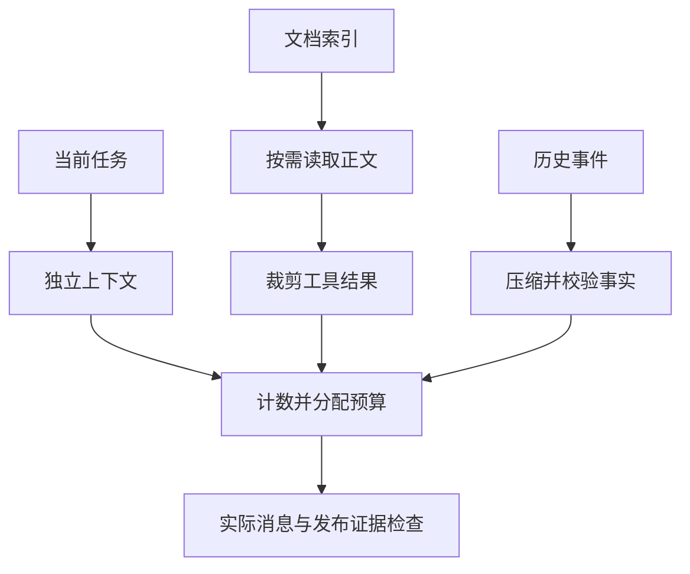

# 06｜上下文管理：把本轮真正需要的证据送进去



[组件总览](../README.md) · [上一组件：通信与交接](../05-communication-and-handoff/README.md) · [下一组件：状态与产物管理](../07-state-and-artifacts/README.md)

本章继续一个具体任务：审核 `checkout` 服务的生产灰度发布。资料中混着旧政策、测试环境配置、一段很长的演练日志，以及用户后来补充的“只允许 alpha 租户”。审核者需要看到当前政策和失败证据，不能因为资料被裁短而把失败当成功。

上下文是**这一次调用实际收到的输入**。文件存在磁盘上、其他 Agent 看过某份资料、历史中曾经出现某句话，都不等于本轮已经收到它。我们先构造两条消息，再逐项解决隔离、加载、长度和压缩问题。

| 阅读顺序 | 本篇新增的机制 | 代码入口与可见结果 |
|---|---|---|
| [01｜从两条消息到独立上下文](01-isolation-and-loading.md) | 拷贝与交接边界；先筛元数据，再读正文 | `first_context.py`、`context.py`；父消息污染反例、5 份索引只读 2 份 |
| [02｜测量预算并裁剪工具结果](02-budget-and-tool-results.md) | 真正的编码 token 计数；保留元数据和失败行；预算不足停止判断 | `pack`、`crop_tool_result`；402 / 1500，以及缺证据对照 |
| [03｜压缩历史而不丢掉更正](03-history-compression.md) | 最新事实、来源事件、摘要校验；真实 SDK 压缩入口 | `extract_history`、`live_compress.py`；2/3 与 3/3 事实对照 |
| [04｜运行对照并追到编码器源码](04-experiments-and-source.md) | 完整实验、产物验收、tiktoken 固定版本走读 | `run_experiments.py`；报告、消息与源码哈希 |

## 先准备环境

下面所有命令的工作目录都是 `10-Knowledge/06-context-management/`。使用 Python 3.10+；本次实际验证为 Python 3.12.14、tiktoken 0.12.0、openai 3.16.2、python-dotenv 1.2.3。[requirements.txt](requirements.txt) 记录了本次验证的第三方包版本。

以下是完整安装命令。它读取 requirements 并安装依赖，没有模型请求；包管理器输出因环境而异。

```bash
python -m venv .venv
source .venv/bin/activate
python -m pip install -r requirements.txt
python -c "import tiktoken; print(tiktoken.get_encoding('o200k_base').name)"
```

PowerShell 将激活命令换成 `.venv\Scripts\Activate.ps1`。最后一条标准输出为 `o200k_base`。**第一次加载编码器会下载官方词表并缓存**；准备离线环境时先完成这一步，并保留该环境的缓存。可在首次加载前设置 `TIKTOKEN_CACHE_DIR`，让预热和后续运行共用一个持久目录。只有缓存已就绪时，以下本地实验和测试才能完全离线重跑。

## 按阅读顺序运行

以下为完整运行命令，输入均已放在 [fixtures](fixtures/) 中。前三条不会调用模型；实验会覆盖各自 `--out` 指定的目录，原始 fixtures 保持不变。

```bash
python code/first_context.py
python code/run_experiments.py
python code/run_experiments.py --window 1301 --out runs/tight
python -m unittest discover -s code -p 'test_*.py' -v
python sources/verify_sources.py
```

默认实验的准确标准输出是：

```text
selected=2/5
summary_facts=3/3
input_tokens=402 limit=1500
release_decision=BLOCKED
artifacts=runs/default
```

这里的 `BLOCKED` 来自日志末尾真实存在的 `rollback_check=FAILED`。小窗口实验输出 `input_tokens=234 limit=401`、`release_decision=NEEDS_EVIDENCE`：预算把演练结果排除了，程序因此拒绝给出放行结论。它不会把“没有看到失败”解释成“已经成功”。

| 路径 | 能核对什么 |
|---|---|
| [fixtures/index.json](fixtures/index.json)、[fixtures/docs](fixtures/docs/) | 元数据筛选规则与真正被读取的文本 |
| [fixtures/history.json](fixtures/history.json)、[fixtures/bad-summary.json](fixtures/bad-summary.json) | 用户更正如何被有损摘要漏掉 |
| `runs/default/messages.json` | 打包后的完整消息；不是所有已读取资料的集合 |
| `runs/default/cropped-log.json` | 原行号、遗漏范围、来源哈希及失败尾行 |
| `runs/default/result.json`、`report.md` | 预算、事实保留数、隔离结果和发布检查 |
| [reports/verified-default.json](reports/verified-default.json)、[reports/verified-report.md](reports/verified-report.md) | 本次已执行的默认实验记录 |

## 要观察模型压缩时，再配置真实接口

结构化提取和预算计算本身不需要模型。第三篇另提供真实模型压缩候选入口：复制 `.env.example` 为 `.env`，填写 `OPENAI_BASE_URL`、`OPENAI_API_KEY`、`OPENAI_MODEL`。模型需支持 Chat Completions 的 JSON 对象输出；基础 URL 不包含 `/chat/completions`。

下面为完整命令，输入为同一份 history，输出由真实服务产生，措辞和 usage 可变化：

```bash
python code/live_compress.py
```

它在每次新建的 `runs/live-<运行编号>/` 保存实际请求、原始响应、校验结果及最终采用的上下文。缺少配置会明确退出；摘要不合格时采用原历史。本次已执行本地实验、9 项针对性测试与源码哈希校验；没有真实模型密钥，未执行真实压缩请求。API 传输格式由不联网的测试单独检查。

从 [01](01-isolation-and-loading.md) 开始。旧资料保留在[归档的上下文工程](../_archive/04-context-engineering/README.md)，本章运行不依赖归档内容。
