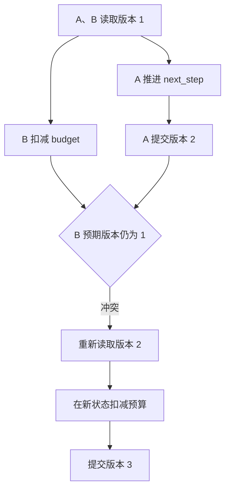

# 03｜两个写者怎样保住彼此的修改

[阅读路线](README.md) · [上一篇](02-versions-and-evidence.md) · [下一篇：实验与源码](04-experiments-and-source.md)



前两篇中只有一个执行器写状态。现在让 A 推进检查步骤，B 记录已消耗的一次预算。两者并发工作，不能允许 B 把 A 的新进度覆盖回旧值。本篇使用两个实际线程，各自建立 SQLite 连接；同步屏障保证它们确实都读取到版本 1。

## 1. 每次写文件都成功，结果仍可能错误

假设最初 `next_step=inspect, budget=4`。A 和 B 各取了一份 Python 字典。下面是**反例的完整可运行片段**，在章节目录执行，仅在内存中复现覆盖关系，没有标准库外依赖：

```python
original = {"next_step": "inspect", "budget": 4}
a, b = dict(original), dict(original)
a["next_step"] = "verify"
b["budget"] -= 1
stored = a
stored = b
print(stored)
```

准确输出：

```text
{'next_step': 'inspect', 'budget': 3}
```

B 只想改预算，却通过覆盖整份字典撤销了 A 的进度。这就是丢失更新。对 JSON 文件先写临时文件再原子替换，仍可能出现同样结果：替换动作没有半截内容，并不等于知道写者基于哪一版进行修改。

## 2. 保存时带上“我读取的是哪一版”

[Store.save](code/state.py) 要求显式传入 `expected_version`。返回值是新版本整数。只有存储中的实际版本与预期版本一致，才插入新的快照。

| 操作 | 预期版本 | 实际版本 | 结果 |
|---|---:|---:|---|
| 创建初始状态 | 0 | 0 | 保存版本 1 |
| A 提交新进度 | 1 | 1 | 保存版本 2 |
| B 提交旧字典 | 1 | 2 | 抛 `VersionConflict` |
| B 重新读取并应用减 1 | 2 | 2 | 保存版本 3 |

“比较版本，再提交变更”叫比较并交换（CAS）。下面是**源码节选**，位于 `Store.save()` 的事务内部；省略的是状态字段校验，不是另外一段独立脚本：

```python
actual, previous = self.load()
if actual != expected_version:
    raise VersionConflict(f"expected={expected_version} actual={actual}")
self.db.execute(
    "INSERT INTO snapshots VALUES (?,?)",
    (actual + 1, json.dumps(value, ensure_ascii=False, sort_keys=True)),
)
```

版本在 `snapshots.version` 主键列中。`state` 列存 JSON。每次追加旧快照，不覆盖历史；`load()` 用版本倒序查询得到当前状态。`version` 是存储记录版本，`schema_version` 是 JSON 结构版本，二者不能互换。

## 3. 版本比较必须留在同一个事务里

若先读版本、结束事务，再另外写入，A、B 都可能检查通过。完整函数在比较之前执行 `BEGIN IMMEDIATE`，插入完成后执行 `COMMIT`，任何异常都执行 `ROLLBACK`。

以下是**完整函数结构的节选**，`self.load()`、状态检查和插入部分见 [code/state.py](code/state.py)：

```python
self.db.execute("BEGIN IMMEDIATE")
try:
    # 在这里读版本、检查预期版本、验证字段并插入新快照。
    ...
    self.db.execute("COMMIT")
    return actual + 1
except BaseException:
    self.db.execute("ROLLBACK")
    raise
```

这段带 `...` 的结构只用于解释事务范围，不能作为独立实现运行。SQLite 只允许一个同时进行的写事务；`BEGIN IMMEDIATE` 提前申请写事务，所以其他连接必须等候或者得到忙错误。[SQLite 事务文档](https://www.sqlite.org/lang_transaction.html)

SQLite 的写锁解决同时修改数据库的串行化；业务版本解决“读到旧值后仍想覆盖新值”。它们职责不同，因此即使有数据库事务，仍要保留版本检查。

## 4. 冲突后重新应用意图，不是换个版本号重试旧快照

B 得到冲突后，读取版本 2，再从版本 2 的预算减 1。这段是实际并发函数的**源码节选**，发生在捕获 `VersionConflict` 之后：

```python
fresh_version, fresh = connection.load()
fresh["budget"] -= 1
connection.save(fresh, fresh_version)
```

不能写成 `connection.save(old_state, fresh_version)`，否则只不过借新版本号再次覆盖旧字典。

减预算是本例可明确重新应用的意图。代码合并更复杂：若 A、B 同时修改同一函数，不能把两个内容哈希合成一个新字符串就宣称合并成功。应重新取得当前代码、合并修改、创建新产物并再次运行证据检查。互不冲突的状态字段，也应在新的当前状态上重新计算。

## 5. 运行真实并发实验

章节目录执行：

```bash
python code/demo.py conflict --out runs/conflict-1
```

准确标准输出：

```text
{"budget": 3, "cas_next_step": "verify", "conflict": "expected=1 actual=2", "state_version": 3, "unversioned_next_step": "inspect"}
artifacts=runs/conflict-1
```

程序在两个线程的读取之后调用 `Barrier(2)`，所以两者都先拿到版本 1；B 再等待 A 的提交事件。这个受控交错避免依赖“电脑恰好在某个时间切换线程”的偶然性，但读写仍然由两个连接真实发生。

`unversioned.json` 另用相同旧字典按 A、B 顺序落盘，保留确定性的丢失更新反例。该反例是等价交错的顺序复现；真正并发竞争发生在 SQLite 场景中。

打开 `state.json`，应该同时看到 `next_step=verify` 和 `budget=3`；仅看到“发生过一次冲突”还不能证明合并正确。如果把 B 的重新应用改成整份旧字典保存，版本仍能正常增长，但 `next_step` 会退回 `inspect`，针对性测试会失败。

## 6. 什么时候保留冲突，什么时候自动重试

| 意图 | 可以怎样处理 | 需要补充什么检查 |
|---|---|---|
| 预算减 1 | 在当前状态上减 1 | 非负约束、消费身份是否已记过 |
| 设置下一步 | 重新检查当前步骤 | 不得让已完成步骤退回旧值 |
| 写入代码引用 | 重新检查上游方案与代码 | 必要时合并代码并重跑测试 |
| 确认外部发布成功 | 根据稳定操作身份对账 | 不能把 CAS 成功当作未重复发布证明 |

本例仅有两名写者、一次受控冲突，因此只演示一次重新应用。长期服务还需有限重试、退避和热点分流；不能用无上限循环不断撞同一个任务。下一篇把本章结果汇总，并说明数据库事务实际保护到哪里。
