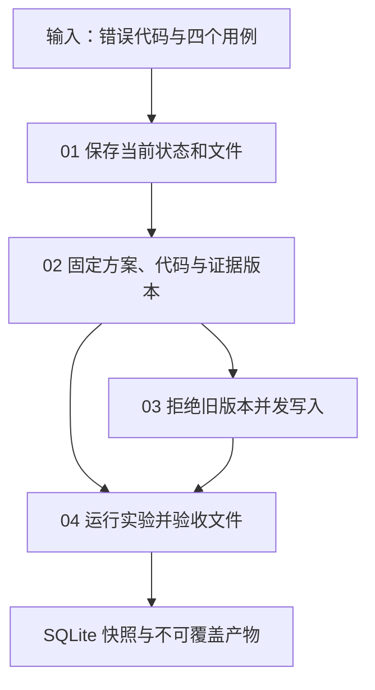

# 07｜状态与产物管理：同一任务，究竟做到哪一版

[组件总览](../README.md) · [上一组件：上下文管理](../06-context-management/README.md) · [下一组件：工具与执行环境](../08-tools-and-environment/README.md)

一个 Agent 改好了 `stats.py`，另一个 Agent 却把旧代码的测试结果写成“通过”。文件都存在，任务仍然不能交付。本章沿着“修复均值函数”这个小任务，先保存状态与代码，再固定方案、证据和实验结果的依赖，最后让两个真实并发写者争用同一版本。



## 顺着一次修复任务阅读

| 阅读文件 | 增加的机制 | 完整运行入口 |
|---|---|---|
| [01｜先保存状态，再看文件](01-state-and-files.md) | 状态、事件、产物的区别；完成条件 | `code/demo.py minimal` |
| [02｜让方案、代码与证据指向同一版](02-versions-and-evidence.md) | 内容哈希、依赖、旧证据失效、实际验收 | `code/demo.py versions` |
| [03｜两个写者怎样保住彼此的修改](03-concurrent-updates.md) | 真实并发、CAS、冲突后重新应用变更 | `code/demo.py conflict` |
| [04｜运行对照实验并走读事务边界](04-experiments-and-source.md) | 产物检查、故障测试、固定版本 CPython 源码 | `code/demo.py experiments` |

假定读者会 Python 字典、文件读写和函数调用。只用 Python 3.10 以上版本的标准库，无需安装第三方包，也无需模型配置。让模型决定怎样修代码属于[执行循环](../03-agent-loop/README.md)；这里使用两份确定的代码，把注意力放在保存和验收机制上。

## 输入和完整程序

| 文件 | 在任务中的角色 |
|---|---|
| [fixtures/stats.py](fixtures/stats.py) | 原始错误代码，分母多加了 1 |
| [fixtures/cases.json](fixtures/cases.json) | 正数、正负抵消、单元素、空输入四个验收条件 |
| [fixtures/plan-v1.json](fixtures/plan-v1.json)、[plan-v2.json](fixtures/plan-v2.json) | 从只关注分母，变为明确空输入应抛 `ValueError` |
| [code/state.py](code/state.py) | 状态快照、转移校验、版本冲突及最终验收 |
| [code/artifacts.py](code/artifacts.py) | 内容寻址、依赖元数据与文件哈希检查 |
| [code/check_code.py](code/check_code.py) | 在子进程中运行实际候选代码 |
| [code/demo.py](code/demo.py) | 四个场景的完整入口和自动报告生成 |

所有命令的工作目录都是 `10-Knowledge/07-state-and-artifacts/`。从仓库根目录先执行：

```bash
cd 10-Knowledge/07-state-and-artifacts
python code/demo.py minimal --out runs/minimal-1
python code/demo.py versions --out runs/versions-1
python code/demo.py conflict --out runs/conflict-1
python code/demo.py experiments --out runs/experiments-1
python -m unittest discover -s code -p 'test_*.py' -v
python sources/verify_sources.py
```

输出目录必须尚不存在；再次运行时把末尾编号改成 `-2`，输入文件和旧记录都会保留。前三个命令各打印一行确定性的 JSON，下一行是 `artifacts=<你指定的目录>`。汇总实验中的 Python、SQLite 版本取自实际环境。

## 运行后从引用找到字节

| 产物 | 核对什么 |
|---|---|
| `state.json` | 当前状态与当前引用；完整版本在 `state.sqlite` |
| `objects/<内容标识>/meta.json` | 产物类型、内容哈希、上游引用 |
| `objects/<内容标识>/payload.py` 或 `payload.json` | 某一版真实代码、方案、证据、实验结果 |
| `workspace/stats.py` | 子进程实际执行的修复后代码 |
| `comparison.json` | 两版代码各个用例的真实观察值 |
| `unversioned.json` | 无版本检查时丢掉进度的反例 |
| `result.json`、`report.md` | 从实际返回值生成的机器结果与阅读版报告 |

[examples/verified-run/report.md](examples/verified-run/report.md) 与 [result.json](examples/verified-run/result.json) 是已执行并保留的样例。可先阅读这些文件，再运行自己的实验。

本章实际验证了四个针对性测试与全部场景。它使用本机文件系统和 SQLite；文件发布采用同一文件系统中的目录重命名，并未实现跨对象存储事务、断电后的目录刷盘协议或分布式写者租约。进程退出后怎样继续，以及外部动作已经生效但回执丢失时如何处理，接着看[持久化与故障恢复](../09-persistence-and-recovery/README.md)。

从 [01｜先保存状态，再看文件](01-state-and-files.md) 开始。
