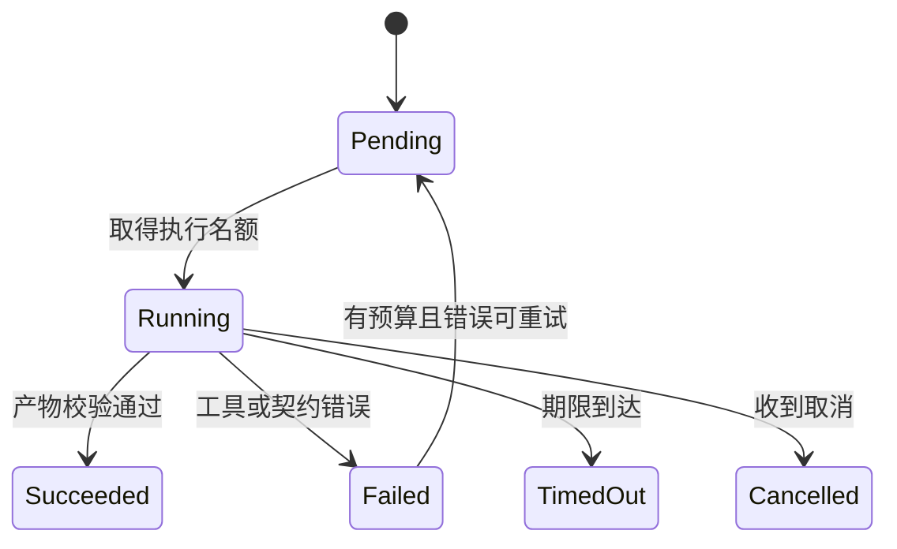

# 状态机与 DAG：把允许发生的下一步写进代码

> 状态：draft；来源核验：2026-09-06；配套实现已进行本地 fixture 验证，非真实模型性能评测。


程序输出“已完成”不能让一次任务变成完成。真正要检查的是：必需的步骤是否完成、产物是否验证、有没有仍在运行的子任务。这些约束适合由状态机表达。

状态机由状态集合、事件和转移规则组成。例如任务初始为 `pending`，取得执行名额后变成 `running`，只有拿到合法结果才能进入 `succeeded`。异常进入 `failed`，达到期限进入 `timed_out`。这些不是界面的颜色，而是决定下一步能做什么的数据。



## 三种组织方式各解决什么问题

| 结构 | 核心规则 | 合适任务 | 限制 |
|---|---|---|---|
| 顺序流水线 | 上一步成功才进入下一步 | 解析→切块→建索引 | 独立步骤被迫等待 |
| DAG | 前驱完成就可运行，没有环 | 并行检索多个来源后汇总 | 无法直接表示反复尝试 |
| 有环状态图 | 根据事件选择下一状态 | 生成→测试→修复→测试 | 必须设置轮数、预算、无进展停止 |

任务依赖与运行状态是不同维度。DAG 说明“依赖谁”，状态机说明“当前能做什么”。可以在 DAG 的一个节点内运行最多三轮修复循环，也可以由状态机调度一批 DAG 任务。

## 为什么不能只用一个 completed 布尔值

考虑 Worker 先写文件，再发完成通知。通知丢失后，主 Agent 看到 `completed=False` 就重新运行，可能重复写入。如果状态里有 `step_id`、输入哈希、尝试号和产物 ID，恢复时至少能先查询“这个逻辑步骤是否已经产生过效果”。更可靠的实现见[持久执行](../../09-runtime-harness-environment/01-concepts/02-durable-execution.md)。

`attempt_id` 表示一次尝试，`step_id` 表示逻辑上的同一步。重试应新增尝试号但保留步骤 ID；把它们混为一谈会让幂等机制失效。

## 转移检查要放在哪里

```python
allowed = {
    "pending": {"running", "cancelled"},
    "running": {"succeeded", "failed", "timed_out", "cancelled"},
    "succeeded": set(),
}
if next_status not in allowed[current_status]:
    raise ValueError("illegal state transition")
```

这段说明性代码检查合法边。在多个进程并发更新时，还要加“版本必须等于我读取的版本”条件，避免两个进程都以为自己拥有任务。单纯在 Python 中先检查再写入，不能代替数据库事务。

复现实验中的协调器使用更小的状态集：`queued/started/completed/timeout/error/cancelled` 记录为事件，输出汇总为 `ok/error/timeout`。外部取消通过异常向上传播，不伪造成正常返回。这个实现适合观察控制流；它没有分布式抢占任务的租约，也没有自动执行任意 DAG 的调度器。

## 学习时检查一个重要不变量

不变量是每一步都必须为真的条件。本例是不完整评审不能做最终选择：质量 Worker 成功而约束 Worker 超时，系统可以展示质量结果，但 `complete=False`，选择函数必须拒绝给出“最佳可行方案”。否则运行时的“部分成功”会在最终回答中变成事实错误。

打开[Notebook](../04-labs/01-single-vs-multi-agent.ipynb)，将约束 Worker 改为超时，观察事件和缺失任务如何传到合并结果。事件回放背景参考[LangGraph 持久化文档](https://docs.langchain.com/oss/python/langgraph/persistence)，本例不是该库的实现或 API 教程。
