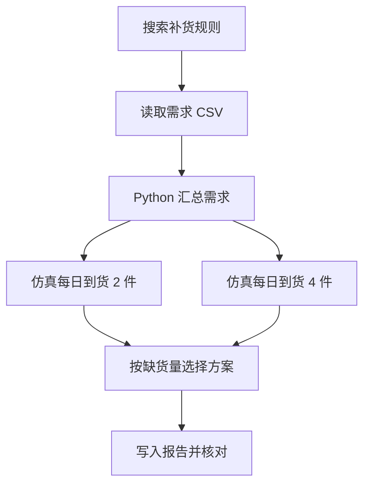

# 02｜连接搜索、文件、代码和仿真

[阅读路线](README.md) · [上一篇](01-contract-and-dispatch.md) · [下一篇](03-environment-and-mcp.md)



搜索已经告诉我们初始库存为 4。下一步需要把七天需求带入计算。为了能重复比较，`run_task.py` 先把 `examples/demand.csv` 复制到本次 `workspace/`，随后所有文件操作都针对这个副本。

## 文件工具返回内容与真实路径

直接读取的核心仍是一行 `target.read_text(encoding="utf-8")`。增加相对路径检查后，调用者就不能通过这个文件接口读取父目录：

```python
# confined() 的核心节选；root、relative 是函数参数。
root = root.resolve()
target = (root / relative).resolve()
if Path(relative).is_absolute() or not target.is_relative_to(root):
    raise ToolError("path_denied", "relative path must remain inside tool root")
```

完整函数在 [runtime.py](code/runtime.py)。`resolve()` 会处理已存在的符号链接，因此指向工作目录外的链接也会被拒绝。这里的范围控制假设工作目录没有另一个恶意进程同时改换链接；检查与打开之间不是操作系统原子操作。它约束本文件函数，不约束任意 Python 代码。

`read_file` 最多读取 16000 字节；`write_file` 写 UTF-8 文本，返回实际字节数。字符数与 UTF-8 字节数不同，例如“补货”是 2 个字符、6 个字节。写入成功只说明文件存在，不说明采购选择符合规则，因此任务末尾还有内容验收。

| 工具 | 输入 | 结果中需要继续使用的字段 |
|---|---|---|
| `search_docs` | query、limit | matches 中的文件、行号、原文 |
| `read_file` | 工作目录内的 path | text |
| `write_file` | path、text | path、bytes |
| `run_python` | script、input_path | exit_code、stdout、stderr |
| `simulate_inventory` | input_path、initial、daily_delivery | lost、ending、逐日 history |

这些是五个注册名称、四类操作；读取和写入属于同一文件类别。

## 代码执行把文件内容送进另一个 Python 进程

本章的计算程序 [compute.py](examples/compute.py) 从标准输入读 CSV，将需求转成整数，再输出 JSON。它没有访问工作目录中的其他文件。先独立运行它，可分清“脚本算错”与“工具传参错”：

```bash
python examples/compute.py < examples/demand.csv
```

在章节目录执行，标准输出：

```json
{"days": 7, "total": 29, "maximum": 6}
```

接着工具把输入文本作为 `subprocess.run(input=...)` 送进脚本。这是 [execute_python()](code/runtime.py) 的关键函数调用节选：

```python
result = subprocess.run(
    [sys.executable, "-I", str(script)],
    input=stdin, cwd=cwd,
    env={"PYTHONIOENCODING": "utf-8"},
    capture_output=True, text=True, encoding="utf-8",
    timeout=timeout, check=False,
)
```

命令是参数列表，没有经过 Shell 拼接。`cwd` 决定相对路径起点，`env` 不继承宿主凭证。`-I` 减少 Python 的导入环境干扰；它不会剥夺读文件、联网或创建进程的能力。这里的本机工具只允许执行仓库内已审阅的 `compute.py`，其他 script 名称返回 `script_denied`。运行任意生成代码需要第三篇的环境方案。

子进程退出非零时返回 `process_failed`，超时返回 `timeout`。stdout 长度检查发生在进程返回后；它不是运行中的内存或输出配额，因此不能拿它约束恶意打印程序。本机入口适用于这个小型可信脚本。

## 仿真工具要把状态变化留下来

库存仿真没有必要另起模型或 Shell。每天只需要四步，下面是完整 `simulate()` 中的循环节选，`stock` 初始为 `initial`：

```python
for day, demand in enumerate(demands, 1):
    stock += daily_delivery
    sold = min(stock, demand)
    stock -= sold
    shortage = demand - sold
    lost += shortage
    history.append({"day": day, "demand": demand,
                    "sold": sold, "lost": shortage, "ending": stock})
```

先到货后售出是输入规则，换成先售出后到货会改变结果。`history` 保留这一区别可见的逐日状态；只返回最后一个“推荐 4”就无法排查第一天的顺序错误。文件工具只验证路径，仿真函数还会验证天数连续、需求非负、最多 365 行。

初始 4、每日到货 2 时，前两天库存分别从 6 降至 3、从 5 降至 0。第三天只到 2 件、需求 4 件，第一次缺货 2 件。七天累计缺货 11 件。每日到货 4 时七天不缺货，期末剩 3 件。

| 每日到货 | 初始加总到货 | 总售出 | 总缺货 | 期末库存 |
|---:|---:|---:|---:|---:|
| 2 | 18 | 18 | 11 | 0 |
| 4 | 32 | 29 | 0 | 3 |

核对每行的 `初始库存 + 7 × 每日到货 = 总售出 + 期末库存`，以及 `总需求 = 总售出 + 总缺货`。这两条关系比“程序没报错”更能暴露库存计算错误。

## 用六次工具调用完成任务

完整入口为 [run_task.py](code/run_task.py)，在章节目录运行：

```bash
python code/run_task.py --output runs/task
```

标准输出：

```text
selected=4 calls=6 acceptance=True
artifacts=runs/task
```

六次分别是搜索、读取、代码计算、两次仿真、写报告。调用脚本将 `run_python` 的 stdout 用 `json.loads()` 解码，再把实际计算的 days、total 写进报告。它先筛选 `lost == 0` 的方案，再选期末库存最小者；如果两者都缺货，selected 为 `None`，本题验收不通过。

打开 `result.json` 看数值，打开 `workspace/report.md` 看报告，再在 `trace.jsonl` 中找到对应的写入请求。本题验收还核对了 7 天、总需求 29、方案 2 缺货 11、方案 4 剩余 3，以及文件确实包含生成的报告。选择规则和业务验收属于任务层，通用注册表不应硬编码这些数字。

[下一篇：运行环境与 MCP 接口](03-environment-and-mcp.md)
