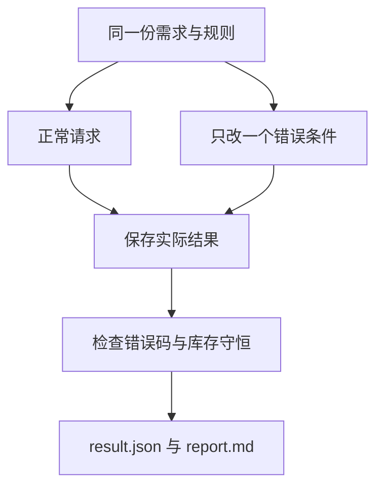

# 04｜从失败案例检查工具契约

[阅读路线](README.md) · [上一篇](03-environment-and-mcp.md)



主线已经选择每日到货 4 件。现在分别改变参数、路径和补货量，看执行层能否指出真实原因。输入保持相同，避免同时换语料、换算法又换环境，最后不知道差异来自哪里。

## 先运行八个可复现请求

在章节目录运行完整实验入口：

```bash
python code/run_experiments.py --output runs/experiments
```

标准输出：`cases=8 passed=8` 和 `artifacts=runs/experiments`。其中 passed 的含义是“结果符合该案例期望”，因此预期的拒绝也应通过。

| 案例 | 唯一关键条件 | 应看到的结果 |
|---|---|---|
| search | 搜索“库存”，limit=1 | 成功，total 大于已返回数量，truncated 为真 |
| bad_limit | limit 改为 200 | `invalid_arguments` |
| bool_limit | limit 改为 True | `invalid_arguments` |
| escape | path 改为 `../outside.txt` | `path_denied`，与文件是否存在无关 |
| missing | 合法目录内的缺失文件 | `not_found` |
| python | 执行 compute.py | stdout 为七天需求统计 |
| q2 | 每日到货 2 | lost=11，ending=0 |
| q4 | 每日到货 4 | lost=0，ending=3 |

打开 [已执行的 result.json](evidence/experiments/result.json) 查看完整 data 和 error；[report.md](evidence/experiments/report.md) 是从这些实际行生成的摘要。它没有把预期成功值伪装为执行输出。

## 让产物接受独立核对

以下是章节目录下可独立运行的检查片段，前提是已经生成 `runs/task/result.json`。它不重新调用工具，只读保存的真实仿真历史：

```python
import json
from pathlib import Path
result = json.loads(Path("runs/task/result.json").read_text(encoding="utf-8"))
for delivery, simulation in result["alternatives"].items():
    history = simulation["history"]
    sold = sum(day["sold"] for day in history)
    demand = sum(day["demand"] for day in history)
    assert 4 + len(history) * int(delivery) == sold + simulation["ending"]
    assert demand == sold + simulation["lost"]
    print(delivery, sold, simulation["lost"], simulation["ending"])
```

标准输出：

```text
2 18 11 0
4 29 0 3
```

第一条等式检查货物没有凭空产生或消失；第二条检查未满足的需求没有被丢掉。它们覆盖了“输出格式正确但业务数值不对”的情况。

## 再检查不会出现在正常报告里的边界

```bash
python -m unittest discover -s code -p 'test_*.py' -v
```

[测试代码](code/test_runtime.py) 共 8 项，覆盖布尔数值与额外参数、父目录与符号链接越界、错误输出类型、UTF-8 读写、缺文件与未知工具、子进程超时和非零退出、脚本白名单、库存守恒。文件全部建在临时目录，测试退出自动清理，不触碰真实资料。

第一次运行中曾发现非零退出测试使用 0.05 秒会把 Python 启动延迟误判为 timeout；现在非零分支用 2 秒，超时分支仍执行一个实际等待 1 秒的临时脚本。测试条件要单独暴露目标故障，不能用机器偶然足够快作为前提。

## 改一个需求，观察验收为什么失败

复制 `examples/demand.csv` 到新的临时输入，将第 7 天需求由 4 改成 8，通过 `write_file` 写进另一个工作目录，再调用仿真工具。不要覆盖已保存的 evidence。参考结果是：每日到货 4 时最后一天可售 7 件，缺货 1 件、期末库存 0；每日到货 2 时总缺货由 11 变成 15。

若直接修改根输入后运行任务脚本，本题原来的固定验收会失败，因为总需求不再是 29。这个失败说明验收条件也依赖任务输入；通用运行层依然可以成功执行工具。正式系统通常从任务需求构造验收，而不是把某个示例答案永久写死。

最后沿 [trace.jsonl](evidence/task/trace.jsonl) 找到六个请求、对应 call_id、结果和最终报告。你现在能够分清四件事：请求格式是否合格、工具是否执行成功、仿真是否遵守规则、交付内容是否通过验收。

[返回阅读路线](README.md)
