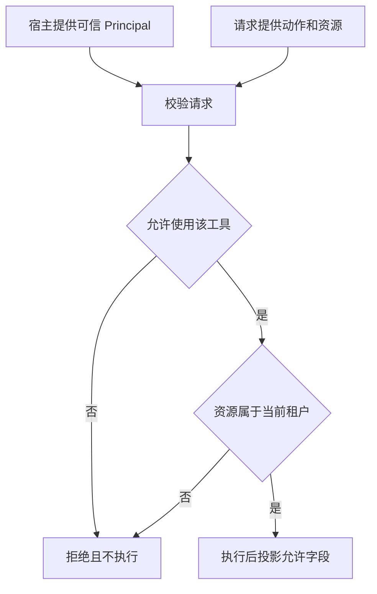

# 01｜从读取范围开始强制权限

[阅读路线](README.md) · [下一篇](02-reservation-and-settlement.md)



Alice 想读取 A 门店的补货结果。文件中还保存着 B 门店数据和内部备注；不能先把整个 JSON 交给模型，再要求它不要引用 B。检查位置必须在返回数据之前。

## 先看一次最小许可判断

真实输入 [records.json](examples/records.json) 中，a1 的 tenant 为 A，b1 为 B。以下是在章节目录可独立运行的完整片段：

```python
import json
from pathlib import Path
records = json.loads(Path("examples/records.json").read_text(encoding="utf-8"))
tenant = "A"
for resource in ("a1", "b1"):
    allowed = resource in records and records[resource]["tenant"] == tenant
    print(resource, allowed)
```

标准输出：

```text
a1 True
b1 False
```

这个条件已经阻止跨租户读取，但还没有说明谁确定 tenant、能否调用删除工具、成功后返回哪些字段。完整入口 `python code/run_minimal.py` 使用后面的权限类，输出 a1=allowed、b1=resource_denied，并保存 `runs/minimal/result.json`。

## 身份与动作从不同入口进入

[control.py](code/control.py) 用两个冻结的数据类表达不同责任：

| 对象 | 字段 | 在本例中由谁构造 |
|---|---|---|
| `Principal` | subject、tenant、tools | 宿主函数 `principal()` |
| `Request` | id、tool、resource、steps、delay_ms | 调用者提交的动作 |

Alice 的 Principal 为 subject=alice、tenant=A、tools 包含 read_record 与 publish_record。Request 不能携带一个覆盖 tenant 的参数，也不能在正文写“管理员”来添加工具。正式服务应由认证后的身份与授权策略构造 Principal；本例固定主体便于集中观察授权分支，没有实现登录系统。

下面是 `authorize()` 的关键函数节选；完整实现还检查请求字符串和 steps、delay_ms 的范围：

```python
if request.tool not in principal.tools or request.tool not in {"read_record", "publish_record"}:
    raise Denied("tool_denied")
if request.resource not in self.records or self.records[request.resource]["tenant"] != principal.tenant:
    raise Denied("resource_denied")
```

第一个条件同时要求主体有权限、程序确实支持该操作。即使主体 tools 被错误配置成包含一个未实现的 delete_record，仍然不能找到删除 handler。第二个条件把不存在和无权访问都映射为 resource_denied，避免错误码泄露其他租户的资源是否存在。

## 合法读取也只返回需要的字段

获准访问 a1，不代表 private_note 可以出现在输出中。执行层明确构造字段投影：

```python
# Runtime.execute() 的函数节选；record 来自已授权的资源。
projected = {key: record[key] for key in ("title", "daily_delivery")}
```

返回数据应是：

```json
{"title": "七天补货结果", "daily_delivery": 4}
```

private_note 没有进入 result、输出文件或 trace 的数据部分。投影解决“同一资源内部哪些字段可见”，租户检查解决“哪条资源可见”。二者不能互相替代。字段列表在服务端，不接受调用者随意传 `fields=["private_note"]`。

如果任务只需总数或汇总，也可以在这里返回聚合结果；关键是先做允许范围内的数据选择，再把结果交出去。

## 从执行入口观察拒绝有没有副作用

下面是章节目录可运行的完整片段。它真正经过预算、执行和投影，但只读取记录，不写发布文件：

```python
import asyncio
import sys
from pathlib import Path
sys.path.insert(0, str(Path("code").resolve()))
from control import Request, Runtime, principal

async def main():
    runtime = Runtime("runs/read-only")
    end = asyncio.get_running_loop().time() + 2
    for name in ("a1", "b1"):
        result = await runtime.execute(
            principal(), Request(name, "read_record", name), deadline=end)
        print(name, result["status"])
    print("charged_calls", runtime.budget.calls)

asyncio.run(main())
```

标准输出：

```text
a1 completed
b1 resource_denied
charged_calls 1
```

拒绝发生在资源预留之前，b1 没有占用已接纳的调用额度，也没有出现 started 事件。这个顺序能区分“访问被禁止”与“已经执行但结果藏起来”：只有前者阻止了实际操作。

改变 Request.tool 为 delete_record，会得到 tool_denied；把 resource 改为 a1、tool 改为 publish_record，会得到 approval_required。后者是主体本来可以发布，但本次写入尚未获得具体批准。第四篇会把批准绑定到这一动作，而非永久扩充 tools。

[下一篇：先预留再结算预算](02-reservation-and-settlement.md)
