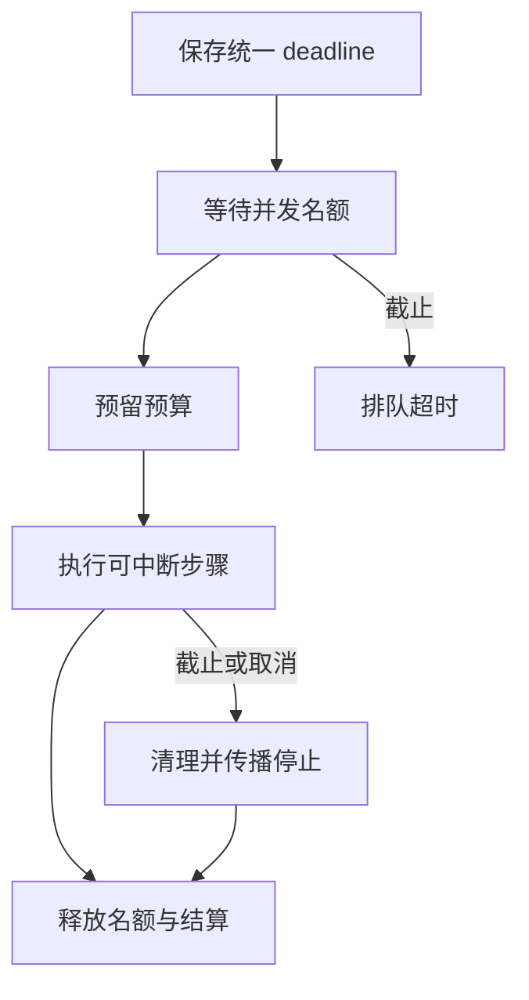

# 03｜并发名额、deadline 与取消

[阅读路线](README.md) · [上一篇](02-reservation-and-settlement.md) · [下一篇](04-approval-and-experiments.md)



预算限制整项任务的总消耗，并发限制此刻有多少动作正在执行。即使总预算足够，也可能只有两个连接或两个本地工作位置；已经排队的任务也在消耗用户愿意等待的时间。

## 先用信号量限制同时运行数

`Runtime` 初始化一个 `asyncio.Semaphore(concurrency)`。进入 `async with self.semaphore` 时占用名额，离开时归还。真正开始执行后才增加 active，并用 peak 记录观察到的最大值。

以下是执行入口的结构节选，所需身份、请求、账本和数据操作都在 [control.py](code/control.py)：

```python
async with asyncio.timeout_at(deadline):
    async with self.semaphore:
        await self.budget.reserve(request.id, upper_units, upper_units * 3)
        # 复查并消费需要的批准。
        self.active += 1
        try:
            # 完成请求中的步骤并生成字段投影。
            ...
        finally:
            self.active -= 1
```

这里省略号表示未展示的实际执行段，不是待补代码；完整函数已实现读记录、发布文件与逐步回执。信号量本身只管数量，不限制每秒请求频率。本章实验一次提交固定的 4 个任务，没有实现接收队列容量或速率限制；服务面对持续请求时还应在受理层控制积压。

## deadline 应从受理开始，而不是取得名额后

`deadline` 使用 `asyncio.get_running_loop().time()` 的单调时钟。同一个绝对截止值可以传给多个步骤；每进入下一步都不能重新获得完整五秒。

完整任务的外部写法是：

```python
# 这是接续片段，actor、request、runtime 已创建。
deadline = asyncio.get_running_loop().time() + 5
result = await runtime.execute(actor, request, deadline=deadline)
```

重要的是 `timeout_at` 包含获取信号量的等待。若把它放进 semaphore 块里面，排队阶段就没有截止限制。程序还在入队前比较当前时间，拒绝已经过期的请求，避免空闲信号量使过期任务继续执行。

实验用一个名额：holder 执行 80 毫秒，queued 的 deadline 只剩 10 毫秒。queued 应返回 deadline_exceeded，且 events 中没有它的 started 或 reserved。用户期限结束前，它没有获得执行机会，因此调用账本仍只有 holder 的一次预留。操作系统调度影响实际毫秒数，验收检查状态与事件，而不是某个精确耗时。

## 取消必须让清理发生

协程收到取消时通常在 await 处抛出 `CancelledError`。执行入口记录 cancelled，然后继续抛出，调用者仍能观察到任务被取消。释放 active 和结算放在 finally 中：

```python
# Runtime.execute() 的异常与清理节选。
except asyncio.CancelledError:
    self.events.append({"event": "cancelled", "request": request.id})
    raise
finally:
    if reserved:
        await self.budget.settle(request.id, **receipt)
```

这里有准确本地回执，所以可以结算完成的步骤。每步先 await 等待，完成后才增加 receipt；取消发生在等待过程中时，那一步没有收费。请求保留已接纳的调用次数，未用的 units 与 cost 归还。未知远端用量必须走上一篇的 mark_unknown，不能照搬零用量退款。

`asyncio.timeout_at()` 在上下文外转换超时为 TimeoutError；外部显式取消仍是 CancelledError。它们是不同的停止来源，实验分别记录。阻塞事件循环的同步代码无法在 await 点接受取消；写文件已经发生后，取消也不会撤销文件。[Python 3.12 任务与取消文档](https://docs.python.org/3.12/library/asyncio-task.html)

## 从实际事件中恢复执行关系

在章节目录运行完整入口：

```bash
python code/run_experiments.py --output runs/experiments
```

本篇对应 result.json 的三个区域：

| 场景 | 确定性观察值 | events.json 应对应的证据 |
|---|---|---|
| concurrency | peak=2，completed=4，spent_units=8 | 同时 active 不超过 2 |
| queue_deadline | deadline_exceeded，queued_started=false | queued 没有 reserved 与 started |
| cancellation | active=0，reserved_units=0 | cancelled 后有 released、settled |

取消实验在观察到任务开始后立即取消，主线程与步骤之间没有另加固定睡眠，因此默认取消案例的已用量为 0。单元测试另让步骤部分完成后取消，检查已用量大于 0、小于总需求 10，且资源仍归还；这覆盖了“做了一部分，不能全部退款”的分支。

尝试将 concurrency 从 2 改为 1，再运行到新目录。peak 应变成 1，总已用仍为 8；因此吞吐方式变了，工作量没有变。deadline 案例若给 queued 足够时间，它会进入执行，调用次数相应增加。用这些计数解释变化，比只比较终端里的总耗时更稳定。

[下一篇：人工批准与完整实验](04-approval-and-experiments.md)
