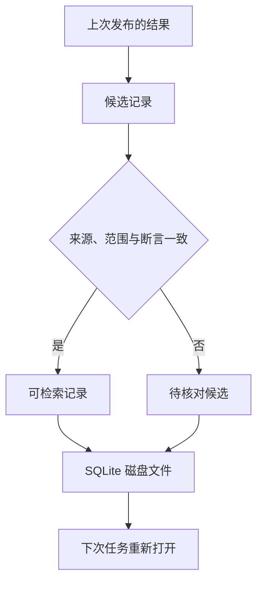

# 01｜关闭程序后仍能找回一条事实



[阅读路线](README.md) · [下一篇：检索与当前任务](02-retrieve-for-current-task.md)

## 一个 Python 字典不能跨过进程结束

上一次 checkout 发布确认了 `timeout_ms=3000`。如果只把它写进 `memory = {"timeout_ms": 3000}`，程序退出后这个字典就消失。下一次启动时，重新创建同名字典不会找回旧值。

下面为**完整可运行片段**，在章节目录执行，只用 Python 标准库，无输入文件。它创建磁盘数据库、提交写入、关闭连接，再重新读取；产物为 `runs/first/memory.sqlite3`。

```python
import sqlite3
from pathlib import Path

path = Path("runs/first/memory.sqlite3")
path.parent.mkdir(parents=True, exist_ok=True)
db = sqlite3.connect(path)
db.execute("CREATE TABLE IF NOT EXISTS facts (key TEXT PRIMARY KEY, value TEXT NOT NULL)")
db.execute("INSERT OR REPLACE INTO facts VALUES (?,?)", ("timeout_ms", "3000"))
db.commit()
db.close()

next_session = sqlite3.connect(path)
print(next_session.execute("SELECT value FROM facts WHERE key=?", ("timeout_ms",)).fetchone()[0])
next_session.close()
```

准确标准输出为 `3000`。`?` 是参数占位符，数据由第二个参数绑定；不把记录正文拼成 SQL。`commit()` 让本次事务提交，`close()` 负责释放连接，两者职责不同。

[完整脚本](code/first_memory.py) 执行同样操作并打印产物位置；README 中的 `python code/first_memory.py` 可以直接运行。这已经证明保存、关闭、重新打开能工作，但还不能证明 3000 适用于下次任务。

## 给事实补齐“在什么情况下成立”

最小表只存 key/value。如果后来审核 search 服务、测试环境，或者政策已升级，盲目复用 3000 都可能错。完整记录至少需要把适用范围、来源和时间一起存下。

[records.json](fixtures/records.json) 的第一条记录包含这些字段；下表是**数据格式说明**，不当作可执行代码。

| 字段 | 本例 | 它回答的问题 |
|---|---|---|
| id | fact-timeout-v3 | 这条记录本身的稳定编号是什么 |
| kind / key / value | fact / timeout_ms / 3000 | 它描述什么，事实值是什么类型 |
| service / environment | checkout / production | 哪个服务、哪个环境可用 |
| user | * | 适用于该范围内所有用户；个人偏好则为 alice |
| source_id | policy-v3 | 到哪里核对原断言 |
| valid_from / expires_at | 2026-09-01 / 2026-10-01 | 生效日含边界，到期日不含边界 |
| conditions | {} | 是否还有必须出现的触发条件 |
| supersedes | [] | 是否明确取代同范围的旧记录 |

`source_uri=fixture://release-review/policy-v3` 的具体内容位于 [evidence.json](fixtures/evidence.json)。它不是一个需要连接网络的 URL。完整程序额外计算来源 JSON 的 SHA-256，并写入 `source_sha256`，以后来源内容变了可以发现。

## 不同记忆类型有不同的复用方式

同一次发布除了得到数字，也可能留下执行经验：

| kind | 样本 | 下次怎样复用 |
|---|---|---|
| fact | 超时是 3000 | 在来源和范围仍有效时作为事实证据 |
| preference | alice 通常偏好中文 | 当前任务未指定语言时使用 |
| procedure | 先查权限、再做回滚演练、再检查退出码 | 对同类发布提供已经核对的步骤 |
| failure | ACCESS_DENIED 时先申请 rollback-runner | 同时匹配 rollback 阶段和错误码才提示 |

操作经验不能凭“上次回答里出现过”就视为已验证。本章来源表记录了人工核对的演练或明确的用户确认；聊天猜测 `chat-unchecked` 的 reviewed 为 False，因此 `rumor-timeout` 写入后仍只是 candidate。候选可以保留供以后核实，但检索不会采用它。

## 写入前先核对来源

下面是 `evidence_check` 的**函数主体节选**，依赖传入的 record dict 和 sources dict；只返回布尔值，不打印。完整字段列表与实现见 [memory.py](code/memory.py)。

```python
source = sources.get(record["source_id"])
if not source:
    return False
return source.get("reviewed") is True and all(
    type(record[k]) is type(source[k]) and record[k] == source[k] for k in assertion_fields)
```

`assertion_fields` 包含类型、key、value、服务、环境、用户、条件和有效期。这样不能拿 search 的来源证明 checkout 的值，也不能自行延长有效期。`verified` 由程序计算，而非接受候选自行声明。

`MemoryStore.add` 随后验证日期区间和类型，并要求 failure 记录有触发条件。采用新 id 写入版本；重复 id 明确报错，避免静默覆盖旧记录。正文保存为 JSON，范围和状态同时放在 SQL 列中，便于查询与状态更新。

## 在真正的第二个进程里读取

以下为**两条完整命令**，工作目录本章、只需标准库。它们读取 fixtures，复用 `runs/manual/memory.sqlite3`；首次 learn 前该数据库不能已有同 id。

```bash
python code/session.py learn
python code/session.py review
```

第一条准确输出 `stored=8 active=7`。第二条会显示 `selected=fact-timeout-v3,failure-permission,procedure-rollback` 和 `language=en`，并生成检查单。learn 的 Python 进程已经结束，review 从文件打开数据库；这是实际跨次复用，而不是函数之间传递同一个对象。

想检查数据库里为什么是 8 条、却只取回 3 条，下一篇会沿着每项过滤条件拆开。你也可以在 sources 中把 `chat-unchecked.reviewed` 改为 True、重新用一个新数据库写入；若内容字段都对应，它会成为与现有超时冲突的已核对记录，第三篇将解释为什么程序不会按“谁写得晚”直接决定采用哪一个。
