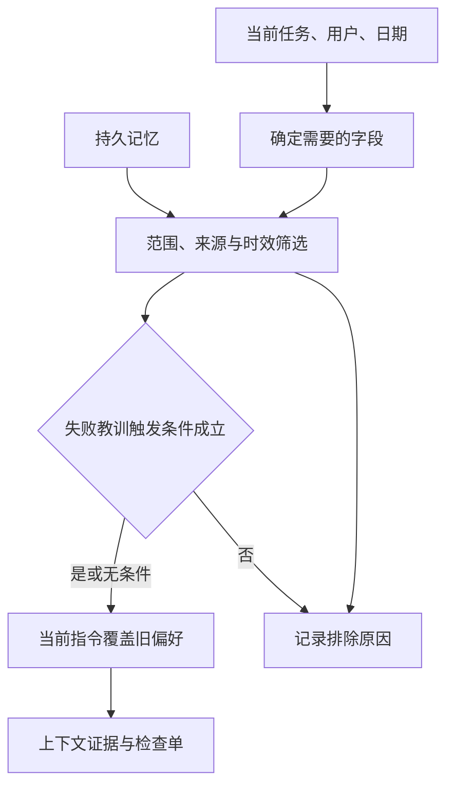

# 02｜按当前任务检索，再决定怎样使用



[阅读路线](README.md) · [上一篇](01-persist-verified-records.md) · [下一篇：更新与过期](03-update-and-expire.md)

## 先写清这一次任务要什么

第二次任务仍是 checkout production 的发布审核，但现在用户是 alice、日期是 2026-09-20，用户明确要求“本次使用英文”，并提供回滚阶段 `ACCESS_DENIED` 的错误信号。全部输入位于 [task-second.json](fixtures/task-second.json)。

`requested_keys` 列出这次需要的 `timeout_ms`、`language`、`rollback_steps`、`rollback_permission`。这个小任务用确切字段检索，易于核对来源；没有使用向量相似度，也不需要为了做等值筛选请求模型。

任务很大时可以先按关键词或向量找候选，再执行相同的范围与有效期规则。相似度只表示“可能相关”，不能替代用户隔离、是否核对和是否过期这些硬条件。

## 顺着一条记忆走过筛选器

`MemoryStore.retrieve` 从磁盘取回记录，每条要经过这些问题：服务和环境相同吗？属于当前用户或公开范围吗？状态 active 吗？来源内容是否变化？今天在有效区间内吗？本次是否需要这个字段？用户当前是否已覆盖偏好？触发条件是否全部满足？

核心是很普通的条件判断。下面为**实现节选**，依赖同函数中定义的 record、task、today、date；完整代码位于 [memory.py](code/memory.py)，这段本身不打印。

```python
elif today >= date.fromisoformat(record["expires_at"]):
    reason = "expired"
elif task.get("requested_keys") is not None and record["key"] not in task["requested_keys"]:
    reason = "not_requested"
elif record["kind"] == "preference" and record["key"] in task.get("current_instructions", {}):
    reason = "current_instruction_overrides"
```

本例日期采用 `YYYY-MM-DD`，在一天粒度上比较，语义为 `valid_from <= as_of < expires_at`。生产系统若需要小时级有效期，应统一使用明确时区的时间戳，再保留同样的闭开区间规则。

同一条记录可能不满足多个条件，`excluded` 只写第一个遇到的原因，用于解释本次为什么没采用。它不是关于所有可能问题的完整诊断。

## 当前明确指令先于历史偏好

数据库中的 `pref-language` 是 alice 以前确认的中文偏好。第二次任务的 `current_instructions.language` 是 en，因此该记忆被排除；随后有效偏好写为 en。

下面为 [memory.py](code/memory.py) 的**实现节选**，接在 retrieve 已生成 selected 列表之后；结果是 effective_preferences 字典，没有标准输出。

```python
effective_preferences = {r["key"]: r["value"] for r in selected if r["kind"] == "preference"}
effective_preferences.update(task.get("current_instructions", {}))
```

这段只处理偏好选择，不把用户要求写成已证实的政策事实。例如“请使用 9000 毫秒”若与生产政策不符，仍须明确处理任务约束和事实冲突；不能由偏好合并语句把真实政策改掉。

程序确实将结果用到产物：`session.py` 在 en 时生成标题为 `checkout release checklist` 的英文检查单，而不是仅在 JSON 里声明 language=en。删除当前语言指令后，旧中文偏好才会恢复作用。

## 失败教训必须有触发条件

`failure-permission` 来自 incident-17，建议申请 rollback-runner 权限。它只在 `phase=rollback` 和 `error_code=ACCESS_DENIED` 都出现时使用。

下面为**条件函数片段**；record 与 task 来自上述检索过程，完整实现见 memory.py。它把任何一个不匹配条件都判为不采用，不产生输出。

```python
if any(task.get("signals", {}).get(k) != v for k, v in record["conditions"].items()):
    reason = "trigger_not_met"
```

如果错误其实是网络超时，直接套用“申请权限”会把上次失败经验变成误导。先保存触发条件，再检查本次证据，才能把教训用在相似原因上。

以下为**完整对照命令**；先按 README 执行过 learn，仍用同一数据库，分别读取两个任务 fixture，第二次结果写入不同目录：

```bash
python code/session.py review
python code/session.py review --task task-no-trigger.json --out runs/manual-no-trigger
```

两者标准输出对照：

| 输入 | selected | language |
|---|---|---|
| 有权限失败信号 | fact-timeout-v3,failure-permission,procedure-rollback | en |
| 无触发信号 | fact-timeout-v3,procedure-rollback | en |

`failure-permission` 并没有被删除，只是本次不适用。procedure-rollback 是同类型发布的通用已验证步骤，因此仍可作为检查清单参考；它不等于自动执行回滚。

## 送入上下文的是少量证据，不是整个数据库

[render_context](code/memory.py) 只保留有效偏好与被选中的记录 id、类型、key、value、source_id、expires_at。这些字段足以让后续调用引用来源、了解值与时效，不需要把所有未采用记录也传给模型。

本次实际结果：

| 未采用记录 | 原因 | 为什么重要 |
|---|---|---|
| pref-language | current_instruction_overrides | 本次英文优先 |
| fact-expired | expired | 旧批量设置到期 |
| rumor-timeout | candidate | 未核对的聊天猜测不成为事实 |
| other-user-pref | user_mismatch | bob 的日语偏好不影响 alice |
| other-service | scope_mismatch | search 的 700 不用于 checkout |

打开 `context.json` 可看到真正送给下一步的证据包，`result.json` 保留筛选原因，`report.md` 根据采用的记录生成检查单。若再接模型，把这个包作为带来源的材料附在当前任务下，不能提升为比当前用户指令更高的系统规则。

可以复制 task fixture 并把 requested_keys 缩到只有 `timeout_ms`，用 `--task` 指向这个新文件；预期只取回超时事实，步骤和权限教训标为 not_requested。这个实验能区分“库里存了什么”与“本次需要什么”。
