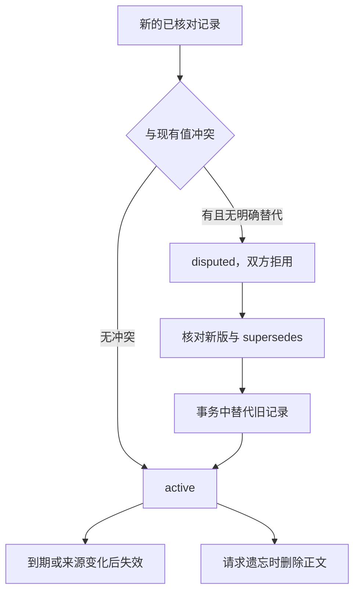

# 03｜出现冲突时，先停止复用，再明确更新



[阅读路线](README.md) · [上一篇](02-retrieve-for-current-task.md) · [下一篇：跨进程实验与源码](04-experiments-and-source.md)

## 为什么不能把最新写入当成最新事实

已有 policy-v3 说 timeout_ms=3000。另一份已核对资料却写 4000，两者适用相同服务、环境和日期。即便后者刚刚写入数据库，也不能由写入时间判断业务政策已经改变：它可能是另一条审批分支，或者更新说明不完整。

本章把“同 kind、key、服务、环境和用户”的不同值视为冲突。新记录没有明确 `supersedes` 时，将参与冲突的旧记录和新记录标记为 disputed，检索都不采用。来源未经核对的 rumor-timeout 只是 candidate，不会把可靠旧记录冲成 disputed。

下面是 `add` 的**实现节选**，依赖已读取的 same、record 和 supersedes；不自行打印，完整事务在 [memory.py](code/memory.py)。

```python
different = [r for r in same if json.loads(r["body"])["value"] != record["value"]]
unresolved = [r for r in different if r["id"] not in supersedes]
if verified and unresolved:
    status = "disputed"
```

相比按置信分数选更高的一条，这条规则牺牲一点自动化，却明确暴露“需要核对政策”的事实。当前例子没有权威等级系统，所以不会假装可以自动解决所有来源冲突。

## 明确的新版本可以一次取代两份旧断言

[update.json](fixtures/update.json) 描述 policy-v4：超时改为 2000，2026-09-21 生效，`supersedes` 显式列出 fact-timeout-v3 和 fact-timeout-conflict。程序核对其来源、范围、有效期，并确认被替代 id 都属于同一种断言范围。

这不是“删除所有相似文本”。只能替代精确列出的同 key 记录；拿 checkout 的新政策替代 search-policy 会报错，数据库不发生变化。

以下为**完整阶段命令**，在本章目录、只用标准库；假设 README 中的 learn 已在新的 manual 数据库成功执行，且尚未加入 conflict/update。每条读取指定 fixture，输出写入对应目录：

```bash
python code/session.py conflict
python code/session.py review --out runs/manual-disputed
python code/session.py update
python code/session.py review --task task-third.json --out runs/manual-updated
```

准确观察：conflict 输出 `status=disputed`；随后 review 的 selected 中没有任何 timeout 记录。update 输出 `status=active`；第三次任务的 selected 改为 fact-timeout-v4、failure-permission、procedure-rollback。

本章库保存“目前使用哪个版本”的状态，不提供完整历史时点查询。新版本替代旧版本后，再用旧日期查询也不会自动恢复旧状态；需要回溯时看运行快照和事件，或另外实现按有效时间查询。新版本生效前不宜提前永久替代唯一可用的旧版本；示例在 9 月 21 日任务采用 v4。

## 三个写操作必须一起成功

更新一次记忆会修改旧记录状态、插入新记录、写入事件。如果前两步成功而第三步失败，用户之后看不到这次变化的依据。所以它们必须处于同一个事务中。

下面为**源码节选**，展示 [MemoryStore.add](code/memory.py) 的替代、写入与事件记录；依赖函数前面已校验的 `record`、`status`、`supersedes`。本段不应单独执行，也不产生标准输出。

```python
with self.db:
    for old_id in supersedes:
        self.db.execute("UPDATE memories SET status='superseded' WHERE id=?", (old_id,))
    self.db.execute("INSERT INTO memories VALUES (?,?,?,?,?,?,?,?)",
                    (record["id"], record["key"], record["kind"], record["service"],
                     record["environment"], record["user"], status, canonical(record)))
    self.db.execute("INSERT INTO events(memory_id,action,detail) VALUES (?,?,?)",
                    (record["id"], "add", canonical({"status": status, "supersedes": supersedes})))
```

这里展示已核对新版替代旧记录的分支；完整函数还在同一事务内处理 disputed。事务中的任何写入抛异常，已有变更都会回滚；不会留下“旧记录失效了，新记录没写进去”的半成品。

测试会创建一个 SQLite trigger，专门在写 events 时抛错，然后尝试加入冲突记录；测试断言整张 memories 表与操作前一致。这比只判断函数是否抛异常更接近真实故障：它直接检查了数据库状态。

## 到期、来源变化和遗忘是不同动作

检索总会检查时间，即便清理程序尚未运行，到期记录也不会被采用。`expire` 只是进一步把状态标为 expired 并记录动作；它不是唯一的失效保障。来源 SHA-256 与当前来源表不一致时，记录返回 source_changed，需要重新核对后以新 id 写入。

以下为**完整命令**，输入已经更新的 manual 数据库；它将截止 2026-10-02 已到期的 active/disputed 记录标记到期，再执行该日任务：

```bash
python code/session.py expire --as-of 2026-10-02
python code/session.py review --task task-expired.json --out runs/manual-expired
```

顺着本章完整手动路线，expire 输出 `expired=6`；随后 `selected=` 为空，但 `language=en` 仍成立，因为当前用户指令不依赖长期记忆。

需要删除某个偏好时运行**完整命令**：

```bash
python code/session.py forget --id pref-language
```

准确输出为 `forgot=pref-language`。代码删除主表正文及该 id 原来的事件详情，只保留 `forget/payload_deleted` 动作。它不删除之前导出的运行快照，也不保证 SQLite 文件空闲页的物理擦除；本节验证的是应用检索中不再存在该正文。若产品承诺连备份、导出和存储介质都删除，必须另外管理这些副本和存储保留策略。

## 什么时候才应该加记忆

当相同信息跨多次任务反复核对、来源足够稳定、可以描述使用范围，且能处理更新时，记忆开始有价值。上次查明的发布规则、用户明确偏好、真实运行成功的步骤，以及带条件的失败教训，分别对应本章四种记录。

一次性的文件片段通常留在任务上下文或产物就够了。没有来源的模型推测、尚未确认的聊天建议，也不应因为“以后可能有用”直接升级为有效事实。可以暂存为 candidate，但要接受它在下次检索中不可用。

把来源、范围、有效期和当前指令的优先级一起设计，比先积累几千条文本、再期待检索相似度自动解决这些问题更容易检查。下一篇会用真正的跨进程结果核对这些分支。
