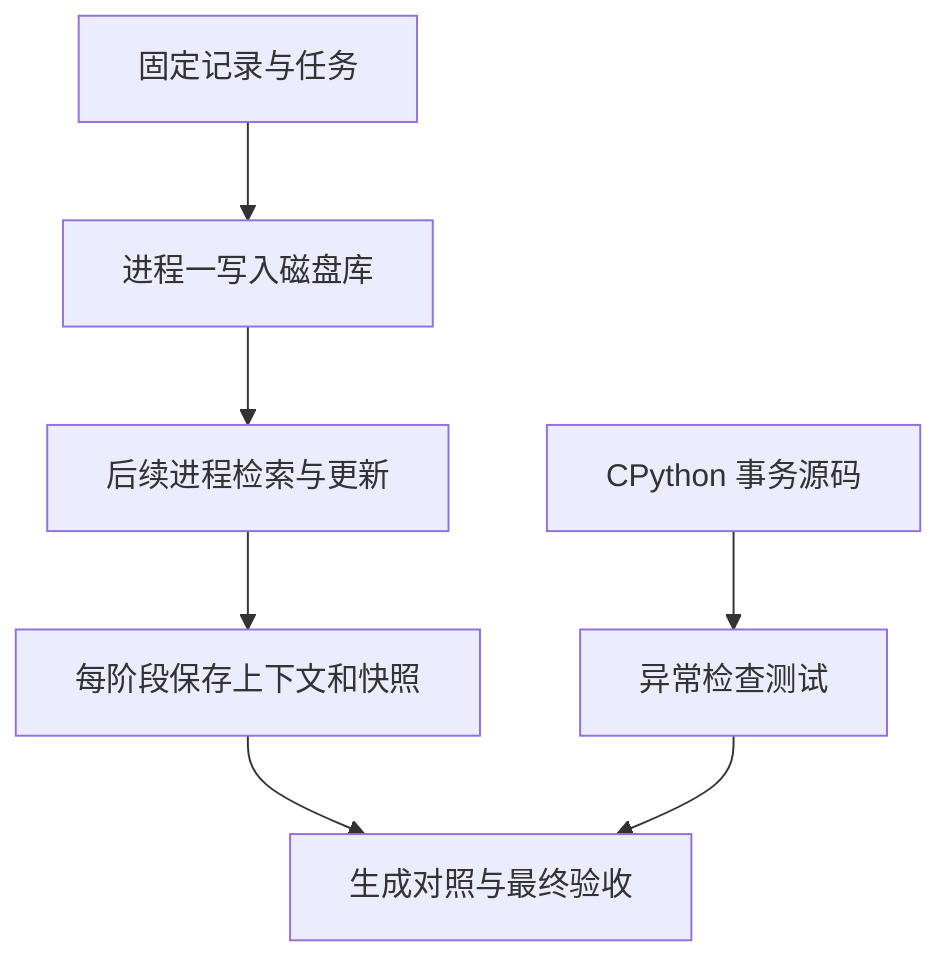

# 04｜跨进程实验与事务源码

本章总览图如下：



[阅读路线](README.md) · [上一篇：记忆冲突与生命周期](03-update-and-expire.md)

## 独立进程

如果把 learn 和 review 写成同一 Python 函数里的两个调用，容易无意复用内存变量。这里的实验入口用 `subprocess.run` 启动十次 `session.py`，它们只共享同一 SQLite 文件。每个进程结束后，下一次重新打开库。

下面为 [run_experiments.py](code/run_experiments.py) 的**源码节选**，依赖该函数已经定义的 cmd；读取上阶段磁盘库，返回当前进程的输出，不单独执行：

```python
completed = subprocess.run(cmd, check=True, capture_output=True, text=True)
```

`check=True` 使子进程失败时立即中断实验，不能把某一步没运行当作完整通过。每条实际参数、退出码、stdout 写进 `processes.json`。运行目录名称取 UTC 时间，因此重复实验创建新数据库，不修改上次证据。

**完整实验命令**，工作目录为本章，依赖标准库，输入 fixtures，产物目录由控制台打印：

```bash
python code/run_experiments.py
```

输出为 `processes=10`、`acceptance=True` 及 `artifacts=runs/<UTC运行编号>`。`acceptance=True` 来自对已保存结果的检查。

## 实验结果

[本次实际对照表](reports/verified-comparison.md) 中记录：

| 阶段 | 实际变化 | 怎样解释 |
|---|---|---|
| learn | stored=8 active=7 | 未核对的传言保留为 candidate |
| reuse | 取回事实、步骤、匹配的失败教训；en | 第二个进程成功复用，当前语言要求优先 |
| no-trigger | 不再取回失败教训 | 不能把权限经验用于没有同类错误的任务 |
| conflict | status=disputed | 相同范围出现两个不同超时值 |
| disputed | timeout 事实缺席 | 程序拒绝替读者猜哪份检查规则正确 |
| update | status=active | 已核对 v4 显式替代冲突双方 |
| new-policy | timeout 使用 2000 | 生效日之后只取回新版本 |
| expiry | expired=6 | 清理到期的 active/disputed 记录 |
| expired | selected 为空，en 仍有效 | 没有旧证据可复用；当前任务指令仍存在 |
| forget | 删除 pref-language 正文 | 主要存储不再返回这条偏好 |

最终 `result.json` 验证第二进程复用了原事实、当前指令获胜、冲突事实拒用、新事实采用、被遗忘正文不在主库五件事。

可以把 `task-no-trigger.json` 的 signals 改成完整匹配条件后重跑；no-trigger 阶段将重新取回失败教训。也可以只把 error_code 改成 TIMEOUT，仍应排除。源资料保持不变，这个实验单独改变了使用条件。

## 事务与边界测试

**完整测试命令**，输入临时数据库与 fixtures，仅用标准库，无网络请求；标准输出包含 7 项通过，临时库在测试后清理：

```bash
python -m unittest discover -s code -p 'test_*.py' -v
```

测试覆盖重新打开连接、来源变更、日期边界、范围和用户排除、触发条件、冲突后显式更新、跨范围替代拒绝、遗忘及事务中途失败。测试之间各用独立临时目录，不依赖 README 手动步骤的先后状态。

事务测试把失败安排在最后的审计写入，前面的状态更新本来已经执行。若没有事务，这时会留下一半更新；测试直接比较操作前后的 memories 表，确认全部检查。

## CPython 事务源码

SQLite 提供磁盘存储，Python 的连接对象决定 `with self.db:` 在正常和异常出口如何提交或检查。固定源码使用 CPython **v3.12.8**：[Modules/_sqlite/connection.c](https://github.com/python/cpython/blob/v3.12.8/Modules/_sqlite/connection.c)。快照与上游许可证位于 [sources/upstream](sources/upstream/)，具体下载 URL、相对文件路径和 SHA-256 在 [manifest.json](sources/manifest.json)。

`pysqlite_connection_exit_impl` 的**原始 C 源码节选**如下。它依赖 CPython 内部类型和上下文，不是可独立编译的程序：

```c
if (exc_type == Py_None && exc_value == Py_None && exc_tb == Py_None) {
    commit = 1;
    result = pysqlite_connection_commit_impl(self);
}
else {
    result = pysqlite_connection_verification_impl(self);
}
```

变量 `exc_type`、`exc_value`、`exc_tb` 来自退出上下文时的异常状态。三者都是 None 时尝试提交；否则检查。后面还有“提交自身失败后再尝试检查”的分支，并保留异常链，不把失败包装成成功。

| 本文位置 | 真实源码对应 | 不应混为一谈的职责 |
|---|---|---|
| `with self.db:` 包住更新 | `pysqlite_connection_exit_impl` | 保障多条 SQL 的提交或检查 |
| `db.commit()` | `pysqlite_connection_commit_impl` | 完成当前事务 |
| `store.close()` | 连接关闭接口 | 释放资源；不等同于自动提交 |
| evidence_check / retrieve | 本章应用代码 | 来源可信、任务适用和有效期不由 SQLite 推断 |

[Python sqlite3 官方文档](https://docs.python.org/3.12/library/sqlite3.html#how-to-use-the-connection-context-manager) 同样说明连接上下文用于事务处理，并不会自动关闭连接，因此 session 入口在 finally 中显式 close。

**完整离线源码核对命令**，输入 manifest 与两份快照，只用标准库，不写产物：

```bash
python sources/verify_sources.py
```

准确输出 `verified=2`。固定源码版本是 v3.12.8；本次实际运行的解释器是 3.12.14，事务测试在实际运行时也已通过。
