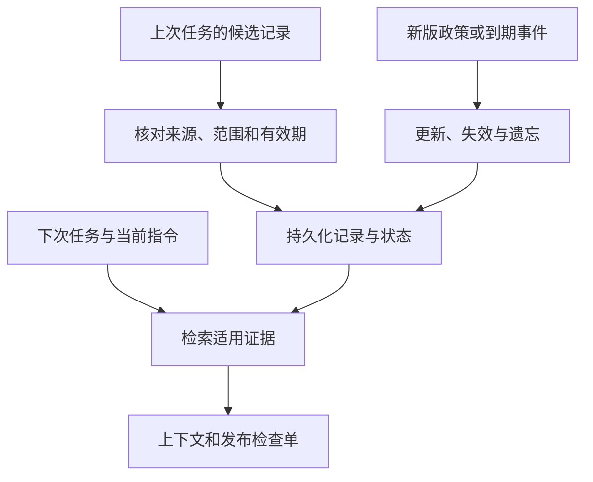

# 13｜长期记忆

本章总览图如下：



[组件总览](../README.md) · [上一组件：权限与资源控制](../12-permissions-and-resources/README.md) · [下一组件：技能库](../14-skills/README.md)

本章保存 `checkout` 生产发布中已核对的超时值、用户偏好、回滚步骤和权限失败教训，供后续审核复用。每次检索都根据当前任务、政策版本和用户指令重新判断适用性。

Memory 是**跨任务保存并有条件取回的信息**。数据库存下来了只是第一步；来源不可靠、范围不匹配或已经过期的信息，取回来反而会制造错误。本章用 SQLite 实现整个生命周期，不为读写和筛选额外引入模型。

| 顺序 | 要解决的问题 | 完整实现与观察对象 |
|---|---|---|
| [01｜记忆持久化与来源](01-persist-verified-records.md) | 最小持久化；怎样把事实、偏好、步骤、教训写成有来源的记录 | `first_memory.py`、`MemoryStore.add`；数据库与候选状态 |
| [02｜记忆检索与当前指令](02-retrieve-for-current-task.md) | 服务、用户、有效期、查询字段与触发条件；当前指令覆盖旧偏好 | `MemoryStore.retrieve`、`session.py review`；context 与实际语言输出 |
| [03｜记忆冲突与生命周期](03-update-and-expire.md) | 不采用冲突事实；显式取代旧记录；事务失败与失效边界 | `add`、`expire`、`forget`；冲突前后与错误回滚 |
| [04｜跨进程实验与事务源码](04-experiments-and-source.md) | 10 次独立进程复用同一库，逐阶段解释产物，核对 CPython 实现 | `run_experiments.py`；comparison、result 和源码快照 |

## 环境与输入

以下所有命令在 `10-Knowledge/13-memory/` 执行。需要 Python 3.10+，只使用标准库，无需 API Key 或第三方包。已验证 Python 3.12.14、SQLite 3.53.1。源码走读使用固定 CPython v3.12.8 快照，运行时版本与走读版本分别记录。

[fixtures](fixtures/) 包含本章发布场景的完整样本：

| 输入 | 内容 |
|---|---|
| `records.json` | 8 条上次任务留下的候选，包含事实、偏好、操作步骤、失败教训及干扰项 |
| `evidence.json` | 每条来源的断言、范围、有效期和是否已核对；`fixture://` 地址指本目录样本 |
| `task-second.json` | 下次任务：alice、checkout production、2026-09-20、本次英文、权限失败信号 |
| `task-no-trigger.json` | 同一任务但没有权限失败信号 |
| `conflict.json`、`update.json` | 相互矛盾的政策与明确替代双方的 v4 政策 |
| `task-third.json`、`task-expired.json` | 新政策生效日与过期后的任务 |

`reviewed` 表示样本中已经记录的核对结论；代码还会逐字段检查记录与来源是否一致，不能靠写上 `verified=true` 就提升可信度。

## 运行与产物

下面是完整命令。第一条创建并重新打开一个最小数据库；第二条为每次实验创建新运行目录，并调用 10 个独立 Python 进程，因此可以重复执行而不污染上次实验。

```bash
python code/first_memory.py
python code/run_experiments.py
python -m unittest discover -s code -p 'test_*.py' -v
python sources/verify_sources.py
```

第一条准确输出：

```text
3000
artifacts=runs/first/memory.sqlite3
```

完整实验的输出结构如下，只有 UTC 运行编号变化：

```text
processes=10
acceptance=True
artifacts=runs/<UTC运行编号>
```

| 产物 | 用来检查什么 |
|---|---|
| `memory.sqlite3` | 真正跨进程共享的持久记录及状态变化 |
| `processes.json` | 每个子进程的参数、退出码与标准输出 |
| `reuse/context.json`、`reuse/report.md` | 下次任务取回的证据、有效偏好以及英文检查单 |
| `disputed/result.json` | 两份矛盾超时值都未采用 |
| `new-policy/result.json` | 只使用 v4 的 2000，旧政策已经被取代 |
| `expired/result.json` | 到期后不再采用发布事实和操作经验 |
| `forget/store-snapshot.json` | 主要存储中已无被遗忘的偏好正文 |
| `comparison.md`、`result.json` | 同一组真实运行产生的阶段对照与最终验收 |
| [reports/verified-comparison.md](reports/verified-comparison.md) | 本次已执行的完整对照表 |

## 跨任务复用

以下为完整命令，每条是一个独立进程。输入 records / evidence 与第二次 task，使用同一磁盘路径 `runs/manual/memory.sqlite3`；第二条生成该目录中的 result、context 和 report：

```bash
python code/session.py learn
python code/session.py review
```

首次执行 learn 输出 `stored=8 active=7`；review 输出：

```text
selected=fact-timeout-v3,failure-permission,procedure-rollback
language=en
```

`active=7` 是写入状态数，不表示七条都可用于这次任务；过期、其他服务、其他用户与旧偏好会在检索时被排除。learn 不覆盖已存在的 id，再次执行会明确报错。想重复整套流程，使用前面的 run_experiments；想手动开始另一组数据库，给两条命令都传同一新 `--db runs/another/memory.sqlite3 --out runs/another`。

本次本地命令、10 个进程的复用实验、7 项针对性测试以及源码哈希核对均已执行。本章可完全离线运行。

旧版概念资料保留在 [Memory 生命周期归档](../_archive/07-state-and-memory/01-concepts/02-memory-lifecycle.md)。
