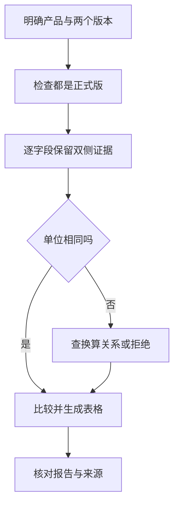

# 01｜从一个比较任务提炼稳定方法

[阅读路线](README.md) · [下一篇](02-package-and-script.md)



假设你每周都整理一次升级清单。工具足够齐全，却需要反复补三句话：“请只用正式版”“请保留旧版出处”“毫秒和秒先换算”。这些话不是新的文件读取能力，而是如何完成这类任务的方法。把它们整理成可复用方法，才是本章的起点。

## 先读两份输入，暴露一个真实差异

工作目录为本章目录。下面完整片段只依赖标准库，不生成文件：

```python
import json
from pathlib import Path
for name in ("v1.json", "v2.json"):
    document = json.loads((Path("examples/inputs") / name).read_text(encoding="utf-8"))
    field = document["fields"]["timeout"]
    print(document["version"], field["value"], field["unit"])
```

标准输出：

```text
1.0 30 s
2.0 10000 ms
```

直接比较 30 与 10000，会把“超时由 30 秒减少到 10 秒”写成“显著增加”。问题发生在比较方法，并非 read_file 没读到文本。若误选 [preview.json](examples/inputs/preview.json)，又会得到 5 秒，数字看起来合理，版本却错了。

本题固定检查三个字段：timeout、retry_limit、batch_size。资料把每个字段的结构化 value、unit 与对应的原文 quote 一起保存；body 是完整的小型资料正文。这种输入让我们能实现确定性的证据检查，而不需要让模型猜测自然语言句子的含义。

## 把每个错误变成一个可执行步骤

| 已观察到的错误 | 方法中的步骤 | 程序的观察对象 |
|---|---|---|
| 新旧版本拿反 | 任务明确 old-version 与 new-version | 元数据 version 是否匹配 |
| 把预览稿当正式版 | 两侧 status 必须为 stable | release_mismatch |
| 只记录新版本 | 每个字段保留 old_evidence 与 new_evidence | comparison.json 的两侧记录 |
| 引用了不存在的原文 | quote 必须是 body 中的完整行 | evidence_mismatch |
| 数值与引用不一致 | quote 与 key、value、unit 必须一致 | 同一证据检查 |
| 直接比较不同单位 | 单位不同才查换算表 | 统一值与统一 unit |
| 写了报告就结束 | 再读实际文件验收 | acceptance.json |

这不是把每项都变成模糊建议。只要规则稳定且可以准确检查，就写入脚本。像“需要比较哪些版本”这样的任务参数仍由调用者提供。若资料缺失，本章程序返回明确错误，让调用方补齐输入；它不会自行编造来源。

## 工具、方法、记忆分别保存什么

| 组件 | 本题中的实例 | 是否直接强制执行 |
|---|---|---|
| 工具 | 读取 v1.json、运行 compare.py、写 report.md | handler 实际执行动作 |
| Skill 方法 | 先确认正式版本、保留双方证据、再处理单位 | 说明本身不强制；脚本和验收器落实可检查部分 |
| 任务输入 | 本次产品与版本号 | 传给具体运行 |
| 长期记忆 | 用户以后偏好简短表格 | 作为有来源的偏好读取 |
| 权限策略 | 只许读取给定资料、发布需批准 | 由宿主执行层强制 |

把“v2 超时是 10 秒”存进 Skill 正文，会把一次事实变成未来任务的固定答案。应保存“检查新版本超时并做单位转换”的方法，让具体数值从当前输入产生。

Skill 中写“使用所有工具”也不会给脚本更多操作系统权限。调用它仍然是一次普通工具执行，必须服从 [08 的执行环境](../08-tools-and-environment/README.md)与 [12 的权限边界](../12-permissions-and-resources/README.md)。本章只在仓库内执行自己的可信包。

## 先让方法能被单独运行

本题的稳定规则已经放进 [compare.py](examples/skills/release-comparison/scripts/compare.py)。在章节目录运行 README 的 direct 命令，会生成三行：

| 参数 | 旧值 | 新值 | 统一单位 |
|---|---:|---:|---|
| timeout | 30 | 10 | s |
| retry_limit | 3 | 2 | attempts |
| batch_size | 100 | 200 | items |

这里先不讨论宿主如何发现技能。方法本身能够接收明确输入、执行步骤、产生检查得了的结果，封装成包才有意义。下一篇把方法说明、代码、附件和模板放进一个读者可以完整追踪的目录。

[下一篇：组织与执行一个技能包](02-package-and-script.md)
