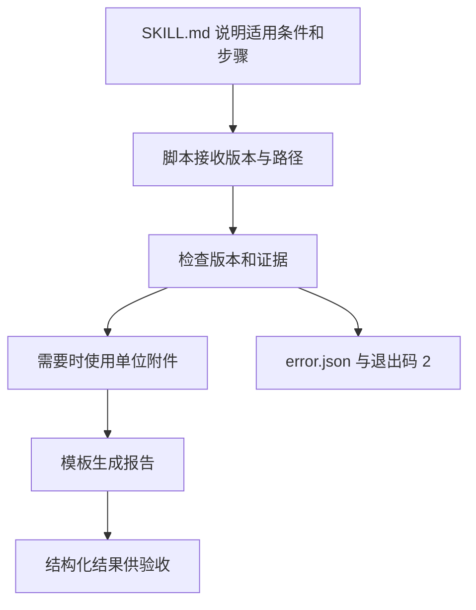

# 02｜组织与执行一个技能包

[阅读路线](README.md) · [上一篇](01-method-from-task.md) · [下一篇](03-progressive-loading.md)



一份包应让调用者知道何时使用、输入什么、如何执行、失败时看哪里。否则“请运行检查脚本”只是把路径与参数的猜测转移给了下一位使用者。

## 主文件让人先读懂方法

实际包位于 `examples/skills/release-comparison/`。主文件前置信息如下，这是已有文件的格式节选，不是待创建模板：

```yaml
name: release-comparison
description: 比较指定产品的两个正式版本，生成单位一致且保留双侧原文的参数变更表；仅润色现有文字时不适用。
metadata:
  version: "1.1.0"
```

这些字段位于 `SKILL.md` 的两个 `---` 之间，后面是普通 Markdown 步骤、完整调用命令与退出码说明。description 同时说明适用和不适用条件：单纯润色现有文字不需要重新运行版本比较。

本包采用官方 Agent Skills 的 SKILL.md、scripts、references、assets 结构。name 与目录名一致；version 放在允许自定义键值的 metadata 中。[Agent Skills 格式规范](https://agentskills.io/specification)

| 文件 | 在本任务中的职责 | 何时读取或运行 |
|---|---|---|
| `SKILL.md` | 稳定顺序、适用条件、输入与错误约定 | 选中后读取正文 |
| `scripts/compare.py` | 版本检查、证据检查、数值比较、文件写入 | 实际执行时调用 |
| `references/units.json` | 量纲与换算倍率 | 两侧单位不同时读取 |
| `assets/report.md` | Markdown 表格格式 | 生成报告时使用 |

脚本本身和域内规范分开后，新增一个受支持单位可以修改版本化的参考表，不必每次让模型重新推算转换关系。

## 输入参数消除写死的任务事实

`compare.py` 用 argparse 接收如下参数：

| 参数 | 当前任务的值 | 约束 |
|---|---|---|
| `--old`、`--new` | v1.json、v2.json | 实际存在的 JSON 文件 |
| `--old-version`、`--new-version` | 1.0、2.0 | 必须匹配资料元数据 |
| `--units` | references/units.json | 跨单位时必须能找到转换 |
| `--template` | assets/report.md | 使用字段 product、old_version、new_version、rows |
| `--output` | runs/direct | 尚不存在的新目录 |

这个脚本不搜索网络、不决定哪个版本代表用户意图，也不批准写入外部服务。显式参数让同一份方法可以用于另一组符合相同格式的资料，而不是复制一份把文件名替换掉的脚本。

## 先检查证据，再比较数值

下面是实际 `compare()` 的函数节选，依赖已载入的 document 与 axis，不是独立程序：

```python
field = document["fields"][axis]
expected = f"{axis} = {field['value']} {field['unit']}"
if field["quote"] != expected or expected not in document["body"].splitlines():
    raise ValueError("evidence_mismatch")
```

这个检查针对本题资料的 `key = value unit` 行格式。它既要求引文确实存在，也要求结构化数值与引文相符。对任意自然语言段落，单纯字符串出现不能证明语义支持；本章通过明确输入格式实现可检查的数值证据。

资料 product 不同、status 不是 stable、version 与参数不符时会先失败。这样错误不会在表格生成后才被包装成貌似可靠的结论。

单位不同的分支使用 Decimal：

```python
# compare() 中已取得左右两侧单位 u、v 的节选。
if u["canonical"] != v["canonical"]:
    raise ValueError("incompatible_dimensions")
a = Decimal(str(left["value"])) * Decimal(str(u["scale"]))
b = Decimal(str(right["value"])) * Decimal(str(v["scale"]))
unit = u["canonical"]
```

units.json 将 ms 映射为 canonical=s、scale=0.001，所以 10000 ms 变成 10 s。若一侧是 s、一侧是 items，则量纲不同，不能只根据数值大小比较。未知转换返回 unit_conversion_required。

## 执行一次，再实际读取文件

在章节目录运行完整命令：

```bash
python examples/skills/release-comparison/scripts/compare.py --old examples/inputs/v1.json --new examples/inputs/v2.json --old-version 1.0 --new-version 2.0 --units examples/skills/release-comparison/references/units.json --template examples/skills/release-comparison/assets/report.md --output runs/direct
```

标准输出为 `status=generated rows=3`。`comparison.json` 保存数值、单位、changed 和双方证据；`report.md` 用模板生成给人阅读的表格。原始 quote 仍保留 `10000 ms`，统一 new 值为 10，二者在不同字段中，不会丢失转换前的信息。

将 `--new` 改成 `examples/inputs/preview.json`，输出目录改成 `runs/direct-preview`，其余不变。标准输出为 `status=rejected reason=release_mismatch`，退出码 2，目录中有 `error.json`，没有完成版报告。缺失字段、伪造引用或不支持的单位也走这一拒绝路径，错误码各不相同。

使用 Skill 不等于脚本退出 0 就合格。下一篇记录加载过程，最后一篇再从实际文件独立验收，观察方法更新是否改善同一任务。

[下一篇：宿主怎样逐步加载与执行](03-progressive-loading.md)
