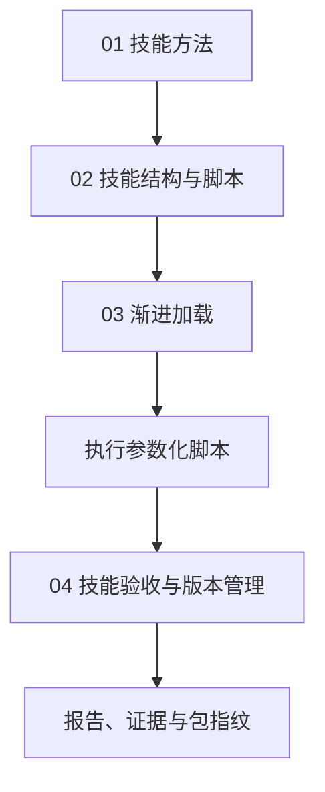

# 14｜技能库 Skills

本章把读取两版配置笔记、比较差异、保存报告的步骤封装成技能包。

[组件总览](../README.md) · [上一组件：长期记忆 Memory](../13-memory/README.md) · [下一组件：自进化](../15-self-improvement/README.md)

`notes-comparison` 技能包比较 Agent Loop 的两版运行配置笔记，检查版本、双侧证据和单位，输出参数变更表。

Agent Loop 是示例程序，资料位于本地。宿主程序 `host.py` 从 `examples/` 读取并执行技能包，无须安装到个人技能目录。

本章总览图如下：



| 顺序 | 正文 | 实际入口 |
|---|---|---|
| 01 | [技能方法](01-method-from-task.md) | 读取两份真实输入，建立逐项证据规则 |
| 02 | [技能结构与脚本](02-package-and-script.md) | `examples/skills/notes-comparison/scripts/compare.py` |
| 03 | [渐进加载](03-progressive-loading.md) | `code/host.py` |
| 04 | [技能验收与版本管理](04-validation-and-versioning.md) | `code/run_experiments.py`、`code/validate_output.py` |

## 运行环境

工作目录为 `10-Knowledge/14-skills/`。Python 3.10+，只依赖标准库；实际验证为 Python 3.12.14。任务类型由 CLI 显式给出，数据转换由确定性脚本完成，因此无需模型和 API Key。

技能脚本与验收命令：

```bash
python examples/skills/notes-comparison/scripts/compare.py --old examples/inputs/v1.json --new examples/inputs/v2.json --old-version 1.0 --new-version 2.0 --units examples/skills/notes-comparison/references/units.json --template examples/skills/notes-comparison/assets/report.md --output runs/direct
python code/validate_output.py --output runs/direct --old examples/inputs/v1.json --new examples/inputs/v2.json
```

标准输出：

```text
status=generated rows=3
acceptance=True checks=23
```

宿主加载与实验命令：

```bash
python code/host.py --task compare --output runs/host
python code/host.py --task polish --output runs/polish
python code/run_experiments.py --output runs/experiments
python code/package_manifest.py --output runs/package-manifest.json
python -m unittest discover -s code -p 'test_*.py' -v
```

可核对的标准输出为：

```text
status=completed acceptance=True
artifacts=runs/host
status=skipped acceptance=None
artifacts=runs/polish
checks=4 passed=4
artifacts=runs/experiments
packages=2 artifacts=runs/package-manifest.json
```

所有任务输出目录应尚不存在；重复运行换一个目录名。polish 入口表示“此任务不加载版本比较技能”，不会替用户执行文本润色。它保留跳过记录供检查。

## 输入与产物

| 位置 | 内容 |
|---|---|
| [v1.json](examples/inputs/v1.json)、[v2.json](examples/inputs/v2.json) | 正式版结构化字段、原文与来源 ID |
| [preview.json](examples/inputs/preview.json) | 会被拒绝的预览版干扰输入 |
| [SKILL.md](examples/skills/notes-comparison/SKILL.md) | name、description、version 和执行方法 |
| [scripts/compare.py](examples/skills/notes-comparison/scripts/compare.py) | 参数化生成程序 |
| [references/units.json](examples/skills/notes-comparison/references/units.json) | 单位、量纲和换算倍率 |
| [assets/report.md](examples/skills/notes-comparison/assets/report.md) | 确定性表格模板 |
| [1.0.0 包](examples/skills-v1/notes-comparison/SKILL.md) | 没有单位附件的旧方法快照 |
| `runs/host/trace.json` | 先目录、后方法、再附件和执行的实际顺序 |
| `runs/host/comparison/` | comparison.json、report.md、acceptance.json |

已生成的 [版本比较报告](evidence/direct/report.md)、[验收](evidence/direct/acceptance.json)、[加载轨迹](evidence/host/trace.json)、[版本对照](evidence/experiments/report.md)与[包指纹](evidence/package-manifest.json)都可核对。

本章已运行全部入口、4 个版本/路由场景和 10 个边界测试，详见 [validation.json](evidence/validation.json)。渐进加载记录的是 UTF-8 字节，不是 token；显式 compare/polish 路由没有测量模型自动选择技能的准确率。格式约定见[技能验收与版本管理](04-validation-and-versioning.md)。
