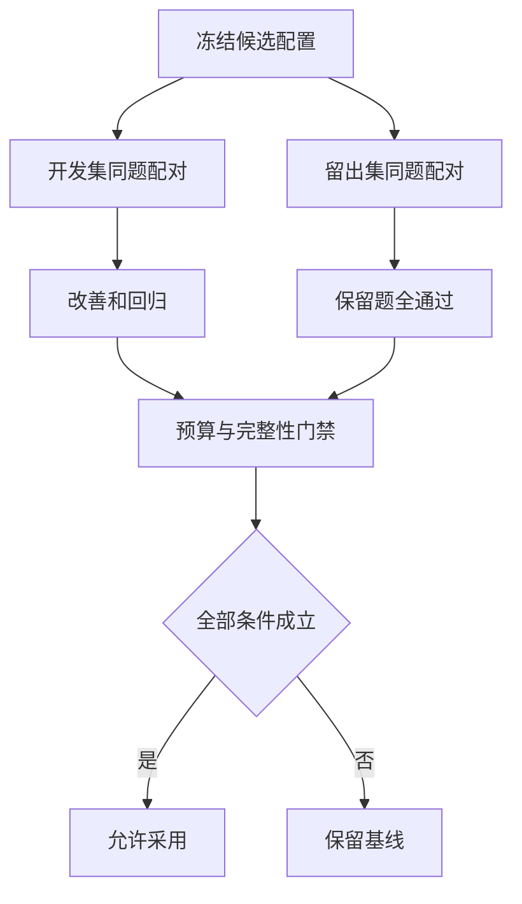
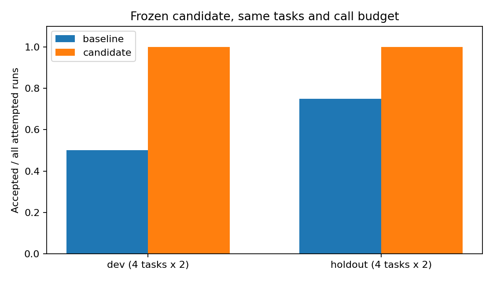

# 02｜同题评测与采用门禁

[上一篇](01-failure-to-candidate.md) · [阅读路线](README.md) · [下一篇](03-version-adopt-and-rollback.md)



## 0. 在看留出结果以前冻结修改

改掉已经见过的失败，是有意义的第一步，却可能只是记住开发题。为观察更一般的行为，本章先只用开发集产生候选，再在候选文件与版本清单写入后读取留出集。

| 划分 | 四个任务 | 在流程中的用途 |
|---|---|---|
| `dev` | 普通、空格、负金额、坏金额 | 发现失败并生成候选；再检查原功能 |
| `holdout` | 大写、空表、全部未支付、0.10+0.20 | 候选冻结后再评测 |

生成器不能读取留出题的预期来改配置。仓库为了学习公开了两份文件，因此这里的“留出”是程序流程上的隔离，不是对作者不可见的秘密集。生产评测如果反复根据同一留出集改版本，它也会逐渐变成开发集，应另留最终评估集或使用新收集的任务。

`suite-lock.json` 保存两份任务表、所有输入、处理器与控制器的哈希，以及重复次数。两版每次调用都重新保存自己的输入副本，用真正被执行的副本哈希进行配对核对。

## 1. 不让失败从比较中消失

每个划分有四题，每题两次，所以每个版本每个划分都必须有 8 条结果。评测器在输入文件不存在或结果错误时仍保存 `accepted=false`，配对器检查全部预期键是否到齐。缺输入时还记录 `error_type=FileNotFoundError`、`input_sha256=null`、`tool_calls=0`；这次尝试仍保留，但无法与另一版建立有效比较。任意一侧输入哈希缺失都会让门禁拒绝计算改善，两侧同时缺失也不算持平。

下面是 [gate](code/cycle.py) 内部索引函数的节选。输入 `rows` 是某版本全部记录，`expected_keys` 已由任务表生成。函数只返回索引；缺失或重复会抛异常，不打印成功率：

```python
def indexed(rows):
    result = {(r["task_id"], r["trial"]): r for r in rows}
    if len(result) != len(rows) or set(result) != expected_keys:
        raise ValueError("incomplete or duplicate evaluation pairs")
    return result
```

基线与候选按 `(task_id, trial)` 配对，然后检查输入哈希与检查器版本相同。每个配对只计算候选通过数减基线通过数：`+1` 改善，`0` 持平，`-1` 回归。不能拿候选最好的两次结果去配基线最差的两次。

本章两次重复是确定性代码重跑，任务层面仍是四题，不应把八次运行说成八道独立题。真实模型系统可用重复试验检查波动，同时保存模型、温度、工具预算和调用顺序；需要更多题或更多次，应该由实际波动和风险决定。

## 2. 先写采用条件，再看分数

本次门禁由下列条件组成，全部为真才采用：

| 条件 | 本章的具体检查 |
|---|---|
| 开发集不能退步 | 任意配对 `delta` 都不能小于 0 |
| 留出集不能退步 | 同上 |
| 开发集至少有改进 | 至少一个配对 `delta` 大于 0 |
| 留出集全部通过 | 候选 8/8 次通过 |
| 资源预算一致 | 两个划分的每次候选运行最多调用汇总工具一次 |
| 数据可比 | 配对完整，输入哈希与检查器版本相同 |

最后一项通过前置校验强制保证；校验失败时不生成一个看似正常的采用结论。预算检查也是真实记录里的 `tool_calls`，不是只写在文字中的承诺。

策略更复杂时，可以提前规定成功率容忍区间、关键任务必须通过、成本上限等不同条件。当前成本采集未接入，`model_cost_usd=null`，所以报告明确标记成本比较不可用，没有因为“没测到费用”而宣称成本下降。

## 3. 实际结果怎样解释

运行 README 的完整实验后，下面这些数值来自保存的 `evaluations/**/result.json`：

| 版本 | 开发集 | 留出集 | 合计 |
|---|---:|---:|---:|
| 基线 | 4/8 | 6/8 | 10/16 |
| 候选 | 8/8 | 8/8 | 16/16 |



开发集中的空格和坏金额两题得到修复，普通与负金额没有退步。留出集的大写状态通过同一规范化规则得到修复；空表、未支付和小数分没有退步。因此本次门禁允许采用。成功来自真实处理函数在这些输入上的结果，并不是在图表代码里硬编码“候选=100%”。

可以在章节目录执行以下完整片段，输入为实际决定文件，只打印门禁检查，不改文件：

```python
import json
from pathlib import Path

decision = json.loads(Path("artifacts/reference/decision.json").read_text())
print(decision["adopted"])
print(all(decision["checks"].values()))
```

标准输出为两行 `True`。把输出拆开是为了区分“所有条件通过”和“控制器真的执行采用分支”；下一篇会再检查当前版本和实际行为。

## 4. 制造一个总分更高、却应拒绝的候选

负金额代表冲减。如果加入“跳过负金额”的规则，会破坏原本通过的 `negative` 题。为了实际验证门禁，配套入口允许显式添加这一项回归实验；它不会混进默认候选生成器。

在章节目录运行完整终端命令。输入和预期保持不变，只给候选增加 `include_negative=false`，产物写入新目录：

```bash
python code/cycle.py run --negative-filter --out runs/regression
```

标准输出：

```text
adopted=False
```

查看 [实际拒绝决定](artifacts/regression/decision.json)，`dev_has_improvement=true`，但 `dev_no_regressions=false`。这个候选在开发集得 6/8，留出集仍得 8/8，总分 14/16，高于基线 10/16，却确实丢掉了两次负金额任务。当前版本仍指向基线。

这项实验说明总分门槛和回归门槛承担不同职责。若负金额是关键业务行为，不能拿别的修复“抵消”它被破坏的事实。被拒绝的版本、差异和评测仍保存，便于查明为什么没有采用。

## 5. 可靠评测是一条会失败的程序路径

本章测试会真的删除一条候选记录，让配对器拒绝；会把某次候选工具调用数改成 2，让预算门禁拒绝；也会修改已经冻结的策略文件，让版本加载拒绝。它们检查的是会改变结论的边界，而不是只验证字典中恰好存在某个键。

如果后续使用模型提出提示词或代码修改，应继续沿用这条能拒绝候选的路径。候选生成速度再快，也不能替代独立产物检查、完整分母和不被候选修改的评分条件。
