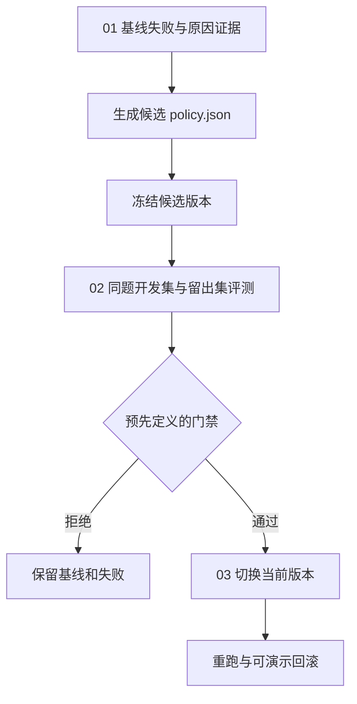

# 15｜自进化

本章根据统计脚本的失败样本修改处理策略，评测通过后采用新版本。

[组件总览](../README.md) · [上一章：技能库 Skills](../14-skills/README.md)

样本统计程序根据开发集失败生成候选策略，并通过同题评测决定是否采用。版本文件、当前指针和历史记录保存修改与回滚的证据。

本章总览图如下：



| 阅读顺序 | 实际新增内容 | 完整实现 |
|---|---|---|
| [01｜失败分析与候选生成](01-failure-to-candidate.md) | 失败分类、证据路径、两项有边界的策略修改 | [cycle.py](code/cycle.py) 的 `collect_failures`、`propose` |
| [02｜同题评测与采用门禁](02-paired-gates.md) | 开发与留出分离、配对、回归、调用预算、拒绝实验 | `evaluate`、`gate` |
| [03｜版本、采用与回滚](03-version-adopt-and-rollback.md) | 内容标识、哈希校验、当前指针、历史、回滚重跑 | `create_version`、`set_active`、`rollback` |

## 任务与配置

仍然汇总有效样本，输出整数和、有效样本行和拒绝的无效数值样本 ID。任务输入已放在 [fixtures](fixtures/)；开发集和留出集各四题，预期经过人工核算。处理器是 [policy_engine.py](code/policy_engine.py)，策略只有三个受支持字段：状态是否规范化、无效数值怎样处理、负数是否计入。

候选生成采用受控规则搜索，未知失败保留为未分类。真实生成的候选文件、差异和评测记录都保留在产物中。

Python 3.10+；`matplotlib` 只用于从实际结果画图。以下命令以章节目录为工作目录，与正文中的命令相同，无需重复执行：

```bash
cd 10-Knowledge/15-self-improvement
python -m pip install -r requirements.txt
python code/experiment.py --out runs/cycle
python code/cycle.py run --negative-filter --out runs/regression
python -m unittest discover -s code -p 'test_*.py' -v
```

输出目录必须尚不存在；重复实验换一个目录名。第一条实验的标准输出：

```text
baseline: dev=4/8 holdout=6/8
candidate: dev=8/8 holdout=8/8
adopted=True after_adopt=True after_rollback=False
artifacts=runs/cycle
```

第二条实验主动加入“丢掉负数”的候选变更，标准输出为 `adopted=False`。它修好了部分任务，但破坏已有负数功能，所以门禁拒绝。

## 参考产物

| 产物 | 对应证据 |
|---|---|
| [reference/failures.json](artifacts/reference/failures.json) | 基线开发集中的原始失败、原因与文件路径 |
| [reference/candidate.diff](artifacts/reference/candidate.diff) | 本次生成的两项策略修改 |
| `artifacts/reference/versions/` | 两个完整策略版本、处理器快照和哈希清单 |
| [reference/decision.json](artifacts/reference/decision.json) | 配对结果、预算检查与采用决定 |
| `artifacts/reference/evaluations/` | 两版本、两任务集、两轮，共 32 份实际结果 |
| [reference/history.jsonl](artifacts/reference/history.jsonl) | 初始化、采用、回滚的变更历史 |
| [reference/report.md](artifacts/reference/report.md) | 实验与回滚重跑的汇总 |
| [regression/decision.json](artifacts/regression/decision.json) | 更高总分仍因回归被拒绝的第二次实验 |

完整实验最后已经主动回滚到基线，因此参考 `active.json` 指向基线。回滚前后各有一次真正的 `whitespace` 任务执行，分别保存在 `after-adopt` 和 `after-rollback`。

本次实际运行了两套本地实验和 8 项关键行为测试；未请求外部模型。
