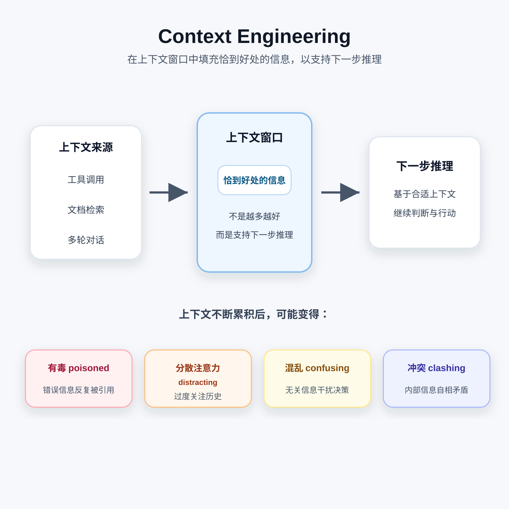

# Context Engineering

> 状态：draft
> 定位：专题总览；原长文链接继续保留，细节已拆到独立笔记。

## 定义

Context Engineering 是为每一次模型调用选择、转换、排序和组织信息的系统工程。目标不是把可获得的信息全部塞进窗口，而是在权限、Token、延迟和可靠性约束下，为“下一步决策”提供足够且可信的输入。

```text
目标 / 当前请求 / 状态 / 历史 / 检索证据 / 工具 / 环境约束
                              │
                              ▼
           收集 → 分类 → 选择 → 转换 → 排序 → 打包 → 校验
                              │
                              ▼
                         模型调用
                              │
                    结果、工具调用、状态变化
                              └──────────> 下一轮
```



## 与相邻概念的边界

| 概念 | 主要问题 | 与 Context Engineering 的关系 |
| --- | --- | --- |
| Prompt Engineering | 指令如何表达得更清楚？ | Prompt 是上下文的一部分，不覆盖动态检索、状态和工具结果 |
| RAG | 去哪里找到外部证据？ | RAG 产出候选证据，Context Builder 决定如何使用这些证据 |
| Memory | 哪些信息应跨轮次或跨会话保存？ | Memory 负责持久化，Context Engineering 负责按需读取和注入 |
| Tool Runtime | 动作如何校验、执行和返回？ | 工具结果会成为新上下文，但执行可靠性属于 Runtime |
| Model Training | 模型参数中学到什么？ | Context Engineering 改变推理时输入，不直接改变模型参数 |

## 五个核心问题

1. **来源**：本轮可能需要哪些信息？
2. **可信度**：信息来自系统策略、用户、工具还是不可信文档？
3. **相关性**：哪些信息真正影响下一步决策？
4. **表示**：应保留原文、结构化字段、摘要还是引用指针？
5. **预算**：在窗口、延迟和成本限制下如何取舍？

## 专题索引

1. [上下文模型](01-context-model.md)：组成、生命周期、优先级与质量维度。
2. [Context Builder](02-context-builder.md)：输入契约、构建流程、输出 Schema 和测试点。
3. [失败模式](03-failure-modes.md)：中毒、干扰、混淆、冲突、腐化和泄露。
4. [优化策略](04-optimization-strategies.md)：选择、检索、压缩、隔离、卸载与缓存。
5. [评测方法](05-context-evaluation.md)：任务集、指标、消融、Trace 和回归。
6. [资源索引](../../90-Sources/source-notes/Context-Engineering-Resources.md)：论文、官方文章和工程资料。

## 核心原则

- 上下文窗口是有限的决策界面，不是日志仓库。
- 相关性、可信度和时效性比“信息量”更重要。
- 系统指令、外部事实和不可信内容必须保持来源与信任边界。
- 能用确定性代码过滤、校验和计算的内容，不必交给模型猜测。
- 摘要是有损转换，应保留来源指针并允许回读原文。
- 多 Agent 隔离能减少干扰，但会增加路由、同步和评测成本。
- 上下文优化必须用任务结果验证，不能只用 Token 下降证明有效。

## 一个最小闭环

```text
定义任务成功条件
  -> 记录完整输入、选择过程和模型输出
  -> 建立未优化基线
  -> 每次只改变一种上下文策略
  -> 比较任务成功率、可靠性、成本和失败类型
  -> 将确认有效的策略固化为回归测试
```

当前两个 Notebook 仍是占位：[Context Engineering Labs](../../50-Labs/context-engineering/README.md)。因此本文只表示知识结构已经整理，不表示相关策略已在本仓库完成实验验证。

## 主要来源

- [Anthropic: Effective context engineering for AI agents](https://www.anthropic.com/engineering/effective-context-engineering-for-ai-agents)
- [LangChain: Context engineering for agents](https://blog.langchain.com/context-engineering-for-agents/)
- [Lost in the Middle](https://arxiv.org/abs/2307.03172)

更多来源及证据等级见[资源索引](../../90-Sources/source-notes/Context-Engineering-Resources.md)。
