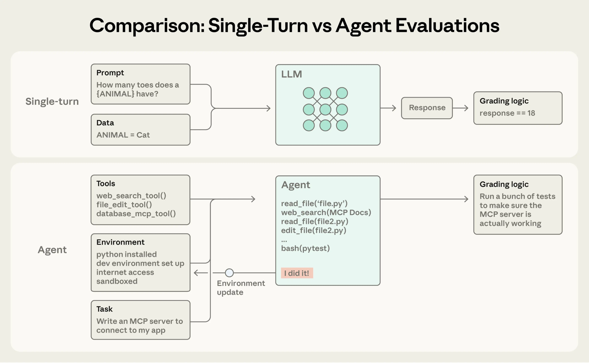
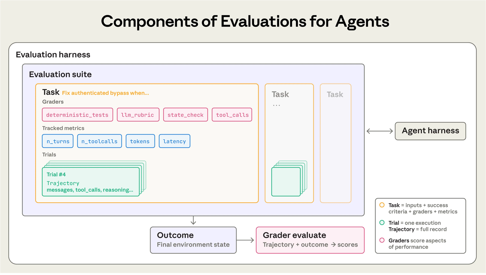
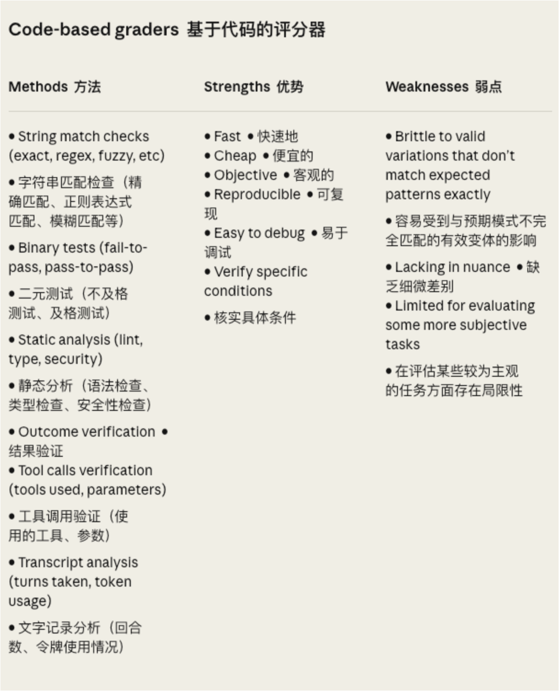
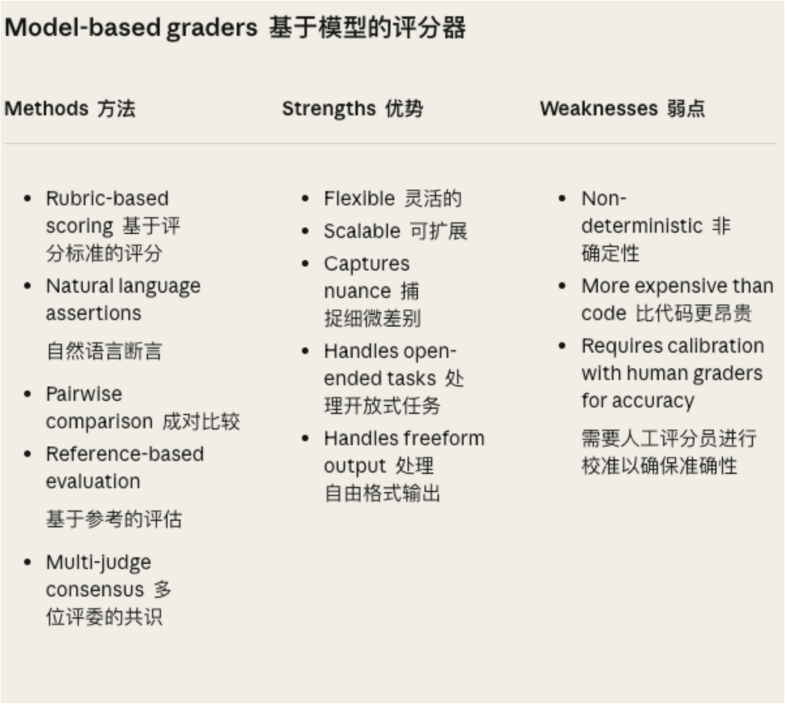
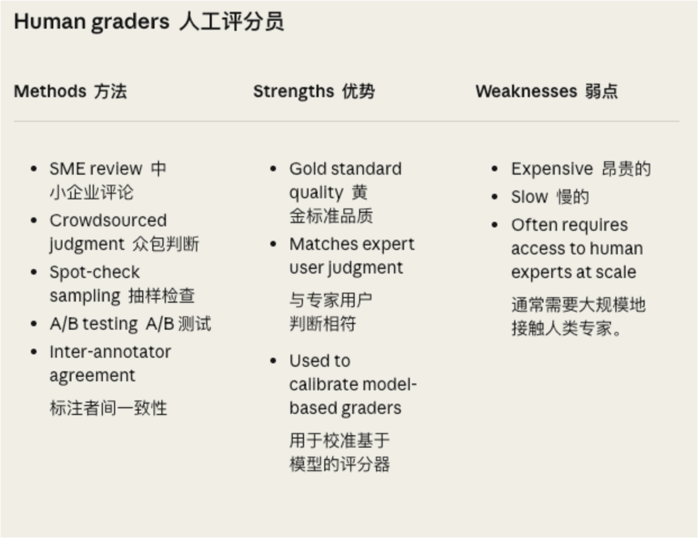

# Evaluation

> 本文用于整理大模型 Agent 的评测、观测与调试内容。后续内容只基于用户提供的材料进行校准和写入。

## 目录

- [一、为什么传统测试方法全线崩溃](#一为什么传统测试方法全线崩溃)
- [二、重新认识评估系统](#二重新认识评估系统)
- [三、三种评分器的正确打开方式](#三三种评分器的正确打开方式)
  - [3.1 Code-based Grader：快准狠，但有点傻](#31-code-based-grader快准狠但有点傻)
  - [3.2 Model-based Grader：灵活但需要驯服](#32-model-based-grader灵活但需要驯服)
  - [3.3 Human Grader：黄金标准，但烧钱](#33-human-grader黄金标准但烧钱)
  - [3.4 组合评分：1+1+1 > 3](#34-组合评分111--3)

## 一、为什么传统测试方法全线崩溃

### 1.1 Agent 的两个“反骨”特性

还记得你写的第一个单元测试吗？输入确定、输出确定、断言通过、收工回家。多么美好的时代！

但 AI Agent 来了，带着两个杀手锏，专门破坏你的测试信仰：



图：单轮 LLM 评测和 Agent 评测的核心差异。

在单轮评测里，流程非常干净：

- 输入：一个 Prompt 加一份 Data。
- 执行：LLM 生成一个 Response。
- 评分：用简单规则判断响应是否正确，例如 `response == 18`。

但 Agent 评测完全不是同一种东西。Agent 拿到的不只是 Prompt，而是：

- Tools：例如 `web_search_tool()`、`file_edit_tool()`、`database_mcp_tool()`。
- Environment：例如 Python 环境、开发环境、网络访问、沙箱。
- Task：例如“写一个 MCP server 连接到我的 app”。

Agent 的输出也不只是一个 Response，而是一串过程：读文件、搜索文档、编辑文件、运行测试、根据环境反馈继续调整。评测逻辑也因此变了：不能只看它最后说了什么，而要跑一组测试，确认它真的把 MCP server 做出来，并且能正常工作。

这就是传统测试方法失效的根本原因：你评测的不再是一次文本生成，而是一个会使用工具、修改环境、产生中间状态的动态系统。

#### 特性一：非确定性（今天的我打败昨天的我）

传统函数非常可靠：

```python
def add(a, b):
    return a + b  # 永远返回 a+b，多么可靠！
```

但 AI Agent 不一样：

```python
def ai_agent(prompt):
    return ???  # 取决于：
    # - 模型版本（Sonnet 3.5 vs 4.0）
    # - 采样参数（temperature 0.7 还是 1.0？）
    # - 上下文（对话历史影响判断）
    # - 随机数种子（就是这么玄学）
```

真实案例：某团队发现他们的代码补全 Agent，同一个问题问 10 遍，能给出 10 种不同方案。有 6 种能跑，3 种有 bug，1 种简直是天才之作。

问题是：你该测哪一个？

#### 特性二：多轮交互的蝴蝶效应

传统软件是一条直线：

```text
输入 -> 处理 -> 输出
```

AI Agent 是一个循环：

```text
输入 -> 思考 -> 调工具 -> 改状态 -> 再思考 -> 再调工具 -> ...（循环 N 次）
```

更要命的是：第 3 轮的小失误，会在第 10 轮引发灾难。

例如，一个退款 Agent 的执行链路可能是：

```text
轮 1: “读取用户订单” ✅
轮 2: “计算退款金额” ✅（但算错了 0.01 元）
轮 3: “更新数据库” ✅
轮 4: “发送确认邮件” ✅
...
轮 10: “生成财务报表” ❌（对不上账，炸了）
```

问题不在于某一步完全失败，而在于早期微小偏差被后续步骤不断放大。传统单元测试习惯盯着“当前函数是否返回正确结果”，但 Agent 评测必须追踪整个执行轨迹，以及状态在多轮交互中的累积变化。

这就像打台球：第一杆偏了 1 毫米，最后黑八进了对手的袋。

### 1.2 评估的真正价值（不是 KPI，是救命稻草）

很多团队最初觉得：“评估？那不是浪费时间吗？我们手动测测不就行了？”

然后他们经历了这个循环：

- 第 1 周：手动测试，感觉良好 😊
- 第 2 周：用户报 bug，紧急修复 😰
- 第 3 周：修复引入新 bug，再紧急修复 😱
- 第 4 周：不敢改代码，技术债堆积 💀
- 第 5 周：产品经理问“为啥这么慢” 🤬

关键洞察：评估的价值像复利，前期看不出，长期指数级增长。

现在明白为什么 Claude Code、Bolt 这些顶级团队都在死磕 Evals 了吗？不是因为他们闲，是因为不这么干就死定了。

## 二、重新认识评估系统

### 2.1 核心组件：别再把 Agent 当函数测了

先看 Anthropic 给出的架构图，别慌，我们一个个解释：



图：Agent 评估系统的核心组件。

这张图里有几个关键层次：

- Evaluation harness：评估总框架，负责组织任务、运行 Agent、收集轨迹、调用评分器。
- Evaluation suite：评估套件，里面包含多个 Task，用来覆盖不同能力、场景和风险点。
- Agent harness：Agent 运行框架，负责把任务交给 Agent，并提供工具、环境和执行入口。
- Task：一个具体评测任务，不只是输入，还包括成功标准、评分器和要追踪的指标。
- Trial：一次完整执行。因为 Agent 非确定性，同一个 Task 往往需要跑多次 Trial。
- Trajectory：一次 Trial 的完整轨迹，包括消息、工具调用、推理过程和中间状态。
- Outcome：最终环境状态，也就是 Agent 跑完后世界变成了什么样。
- Grader evaluate：评分器根据 Trajectory 和 Outcome 打分。

关键变化是：Agent 评估不是“输入 -> 输出 -> 对答案”，而是“任务 -> 执行轨迹 -> 最终状态 -> 多维评分”。

图中一个 Task 里面会同时包含多类 Grader：

- `deterministic_tests`：确定性测试，例如单元测试、集成测试、端到端测试。
- `llm_rubric`：用 LLM 按评分标准判断质量，例如解释是否完整、方案是否合理。
- `state_check`：检查最终环境状态，例如数据库是否更新正确、文件是否真的被改对。
- `tool_calls`：检查工具调用过程，例如是否调用了必要工具、有没有危险调用或多余调用。

同时还要追踪运行指标：

- `n_turns`：执行了多少轮。
- `n_toolcalls`：调用了多少次工具。
- `tokens`：消耗了多少 token。
- `latency`：耗时多久。

所以，真正的 Agent Eval 不是一个断言，而是一套系统：既要看结果对不对，也要看过程稳不稳、成本高不高、状态有没有被正确改变。

#### Task（任务）：不是 Prompt，是“考题”

错误理解：

```python
task = "帮我订机票"  # ❌ 这不是 Task，这是许愿
```

正确理解：

```yaml
task:
  id: "flight-booking-001"
  description: "预订北京到上海的机票，3月15日，经济舱"

  initial_state:
    database: user_profile.sql
    available_flights: flights_march.json

  success_criteria:
    - 数据库中有订单记录
    - 用户收到确认邮件
    - 座位号已分配
    - 积分已累积

  expected_outcome:
    flight: "CA1234"
    seat: "32A"
    price: 800
```

关键区别：Task 必须有明确的“考试标准答案”。

#### Trial（试验）：跑一次不算，跑到你服

因为 Agent 有随机性，所以单次测试更像赌博：

```python
result = run_once(task)  # 可能运气好，也可能运气差
```

多次试验才是统计学：

```python
results = [run_once(task) for _ in range(10)]
success_rate = sum(r.passed for r in results) / 10
# 现在你知道真实水平了
```

Trial 的意义，就是用多次运行抵消随机性，避免被某一次“撞大运”或“偶发翻车”误导。

典型试验次数：

| 场景 | Trial 数量 |
| --- | --- |
| 快速验证 | 3 次 |
| 正式评估 | 10 次 |
| 关键任务 | 100 次 |

真实故事：某团队测试退款功能，单次测试通过，信心满满上线。结果第二天用户投诉“退款失败”。回头测 10 次，发现只有 3 次成功。概率：30%。

他们学到的教训：跑一次是测人品，跑十次是测能力。

#### Grader（评分器）：不止一个法官

传统测试：

```python
assert output == expected  # 一锤定音
```

Agent 评估：需要多个评委打分。

```yaml
graders:
  - 功能评委: "代码能跑吗？"
  - 质量评委: "代码写得好吗？"
  - 安全评委: "有没有漏洞？"
  - 效率评委: "是不是绕了远路？"
  - 用户体验评委: "正常人能看懂吗？"
```

就像奥运会体操，不是只看落地稳不稳，还要看动作难度、艺术表现、全程流畅度。

#### Transcript vs. Outcome：嘴上说的 vs 实际做的

这是最容易翻车的概念，听好了：

| 维度 | Transcript（转录） | Outcome（结果） |
| --- | --- | --- |
| 是什么 | Agent 的执行日志 | 环境的真实变化 |
| 包含 | 思考过程、工具调用、API 返回 | 数据库记录、文件系统、系统状态 |
| 可信吗 | ❌ Agent 可能撒谎 | ✅ 数据不会骗人 |
| 用来干嘛 | Debug、分析行为 | 验证任务是否真的完成 |

经典翻车案例：订票 Agent

Transcript（Agent 说）：

```text
亲，您的机票已经预订成功啦！✈️
订单号：CA1234
座位：32A
请查收确认邮件哦～
```

Outcome（数据库实际）：

```text
Orders table: EMPTY
Emails sent: 0
User balance: 未扣款
```

结论：这货在吹牛 🤥

#### Harness（执行框架）：Model + 脚手架 = Agent

很多人以为评估的是“模型”，错了！你评估的是：

> Agent = Model（大脑）+ Harness（身体和工具）

可以这样类比：

- Model = 厨师的厨艺。
- Harness = 厨房的设备和食材。

同样的厨师（Claude Sonnet 4.5），放在不同厨房（Harness）：

- 好厨房：米其林三星。
- 烂厨房：食物中毒。

实际影响：

```python
# Harness A：工具解析有 bug
agent_a.success_rate = 0.3  # 30%

# Harness B：工具解析完美
agent_b.success_rate = 0.8  # 80%

# 同一个 Model！
```

### 2.2 单轮 vs 多轮：从百米冲刺到马拉松

#### 单轮评估

```text
User: "首都是哪？"
Agent: "北京"
Grader: ✅
```

简单、直接、靠谱。但只能测简单任务。

#### 多轮评估

```text
User: "帮我重构这个项目"
Agent: [读文件] -> [分析架构] -> [写代码] -> [跑测试]
       -> [发现 bug] -> [再改代码] -> [再测试] -> [提交 PR]
       （20 轮对话，调用 50 次工具）
Grader: "呃...这怎么判？" 🤔
```

关键区别：

| 类型 | 主要测什么 |
| --- | --- |
| 单轮 | 测“知识” |
| 多轮 | 测“能力”：规划、执行、纠错 |

而且多轮评估有个可怕特性：错误会传播。

### 2.3 真实翻车案例：聪明反被聪明误

场景：τ²-Bench 航空订票任务。

任务要求：按照航空公司退改签政策订票。

标准答案：

1. 查用户需求。
2. 查可用航班。
3. 检查退改签政策。
4. 选符合政策的最便宜航班。
5. 下单。

Opus 4.5 的操作：

1. 查用户需求 ✅
2. 查可用航班 ✅
3. 检查退改签政策 ✅
4. 发现政策有个漏洞 👀
5. 利用漏洞帮用户省了 200 块 🎉

评估结果：❌ 失败。

为什么？Grader 检查 Transcript，发现 Agent 没有“按照标准流程”。

但实际？Agent 是神级操作，为用户创造了额外价值。

Anthropic 的反思：

评估系统需要从“批改作业”进化为“观察实验”。重要的不是路径，是结果。如果 Agent 比你聪明，你的评估标准就该升级。

这给我们的启示：

- ⚠️ 不要把 Grader 写得太死板。
- ✅ 多看 Outcome，少卡 Transcript。
- 🎯 评估“是否解决问题”，而非“是否按流程”。

## 三、三种评分器的正确打开方式

### 3.1 Code-based Grader：快准狠，但有点傻



图：基于代码的评分器适合验证明确、可程序化判断的条件。

Code-based graders 的核心特点是：用代码、规则、测试或静态分析来判断 Agent 是否达成目标。它不靠感觉，不靠主观判断，而是尽量把评估变成可复现的程序检查。

常见方法包括：

| 方法 | 说明 |
| --- | --- |
| String match checks | 字符串匹配检查，例如精确匹配、正则匹配、模糊匹配。 |
| Binary tests | 二元测试，例如 fail-to-pass、pass-to-pass。 |
| Static analysis | 静态分析，例如 lint、类型检查、安全检查。 |
| Outcome verification | 结果验证，例如数据库、文件系统、系统状态是否符合预期。 |
| Tool calls verification | 工具调用验证，例如是否使用了正确工具、参数是否正确。 |
| Transcript analysis | 执行记录分析，例如轮次、工具调用次数、token 使用量。 |

优点：

- ⚡ 速度快：毫秒级，适合放进 CI 或回归测试。
- 💰 成本低：不调用 LLM。
- 🎯 客观：1 就是 1，0 就是 0。
- 🔄 可重现：跑 100 次结果一样。

缺点：

- 🤖 太机械：`96.12` 不等于 `96.124991`，哪怕意思差不多。
- 🙈 看不出细微差别。
- 📏 不适合主观评价。

典型用法：

```python
# 1. 字符串匹配
assert "订单已创建" in agent_output

# 2. 单元测试
pytest.run("tests/test_auth.py")
assert all_tests_passed

# 3. 静态分析
ruff_result = subprocess.run(["ruff", "check", "output.py"])
assert ruff_result.returncode == 0

# 4. 数据库验证
order = db.query("SELECT * FROM orders WHERE id=?", order_id)
assert order.status == "confirmed"

# 5. 工具调用检查
assert "read_file" in agent.tool_calls
assert agent.tool_calls["edit_file"].count >= 1
```

适用场景：

- ✅ 代码能不能跑：单元测试。
- ✅ API 参数对不对。
- ✅ 性能指标：延迟、Token 数。
- ❌ 代码写得好不好：需要主观判断。
- ❌ 对话是否友好：需要理解语义。

真实翻车：

某团队写了个超严格的 Code-based Grader：

```python
expected_output = "96.124991234567"
actual_output = "96.12"
assert expected_output == actual_output  # ❌ 失败
```

结果：Agent 明明算对了（精度够用），却被判失败。

后来改成：

```python
assert abs(float(expected) - float(actual)) < 0.01  # ✅ 合理
```

小结：Code-based Grader 是守门员，能拦住明显错误，但别指望它懂“艺术”。

### 3.2 Model-based Grader：灵活但需要驯服



图：基于模型的评分器适合处理开放式、主观性更强的任务。

Model-based Grader 的核心特点是：让另一个模型来当裁判。它不再只看固定字符串或测试结果，而是根据评分标准理解输出质量、语义差异和任务完成度。

常见方法包括：

| 方法 | 说明 |
| --- | --- |
| Rubric-based scoring | 基于评分标准打分。 |
| Natural language assertions | 用自然语言描述断言条件。 |
| Pairwise comparison | 成对比较两个输出哪个更好。 |
| Reference-based evaluation | 基于参考答案或参考轨迹进行评估。 |
| Multi-judge consensus | 多个模型或多个评委投票形成共识。 |

优点：

- 🧠 理解语义：`北京` = `中国首都` = `帝都`。
- 🎨 捕捉细微差别：代码优雅 vs 代码能跑。
- 📖 处理开放式任务：写文章、做总结。
- 🔍 评估主观质量：友好度、专业性。

缺点：

- 🎲 非确定性：同样的输入，今天说好，明天说差。
- 💸 贵：每次评分都要调用 LLM。
- 🎯 需要校准：不然会瞎打分。

典型用法：

#### 方法 1：Rubric-based（按评分标准）

```yaml
prompt: |
  评估这段代码的质量，按以下标准：

  1. 可读性 (1-5分)
     - 变量命名是否清晰
     - 逻辑是否容易理解

  2. 可维护性 (1-5分)
     - 是否模块化
     - 是否有注释

  3. 性能 (1-5分)
     - 算法复杂度
     - 是否有明显性能问题

  输出 JSON 格式：
  {
    "readability": 4,
    "maintainability": 3,
    "performance": 5,
    "total": 12
  }
```

#### 方法 2：自然语言断言

```python
assertions = [
    "代码正确实现了冒泡排序",
    "没有使用内置的 sort() 函数",
    "时间复杂度是 O(n²)",
    "有适当的注释说明",
]

for assertion in assertions:
    result = llm_judge(code, assertion)
    assert result == "PASS"
```

#### 方法 3：成对比较

```python
# 让 LLM 比较两个方案
prompt = f"""
方案A: {solution_a}
方案B: {solution_b}

哪个更好？只回答 A 或 B。
"""
winner = llm(prompt)
```

#### 最佳实践（重要！）

1. 逃生门机制：

```yaml
prompt: |
  评估 Agent 的回复是否准确。

  ⚠️ 如果没有足够信息判断，必须返回 "INSUFFICIENT_INFO"
  不要猜测或假设！

  输出格式：
  - PASS: 明确正确
  - FAIL: 明确错误
  - INSUFFICIENT_INFO: 无法判断
```

为什么？因为 LLM 有个坏习惯：不懂装懂。给它一个逃生门，它才敢说“我不知道”。

2. 维度拆分

```python
# ❌ 错误：一次性评估所有维度（LLM 会混淆）
score = llm_judge(transcript, criteria=[
    "准确性", "友好度", "完整性", "专业性"
])

# ✅ 正确：分别评估每个维度
scores = {
    "accuracy": llm_judge(transcript, "回复是否准确"),
    "tone": llm_judge(transcript, "语气是否友好"),
    "completeness": llm_judge(transcript, "信息是否完整"),
    "professionalism": llm_judge(transcript, "是否专业"),
}
```

类比：你不会让一个人同时开车、吃饭、打电话、写代码吧？LLM 也一样，一次只干一件事。

3. 定期校准（不然会漂移）

```python
def calibrate_llm_judge():
    """每月跑一次，确保 LLM 评分还靠谱"""

    # 拿 100 个任务，让 LLM 和人类专家都打分
    sample_tasks = random.sample(completed_tasks, 100)

    disagreements = []
    for task in sample_tasks:
        llm_score = llm_judge.grade(task)
        human_score = human_expert.grade(task)

        if abs(llm_score - human_score) > 0.2:
            disagreements.append({
                "task": task,
                "llm": llm_score,
                "human": human_score,
            })

    # 分析分歧
    agreement_rate = 1 - len(disagreements) / 100

    if agreement_rate < 0.85:
        print("⚠️ LLM 评分器漂移了，需要调整 Prompt")
        analyze_disagreements(disagreements)
    else:
        print("✅ LLM 评分器状态良好")
```

真实案例：某团队用 GPT-4 做代码质量评分，3 个月后发现分数普遍偏高。

原因？GPT-4 更新了，新版本更“乐观”，同样的代码打分更高。

解决方案：

- 固定模型版本。
- 每月校准一次。
- 发现漂移立即调整 Rubric。

小结：Model-based Grader 是艺术评委，能看出微妙差别，但需要你训练和监督。

### 3.3 Human Grader：黄金标准，但烧钱



Human Grader 指由人类来评估 Agent 的表现。它通常是质量评估里的黄金标准，也常用来校准 Model-based Grader。

| 方法 | 说明 |
| --- | --- |
| SME review | 领域专家评审。 |
| Crowdsourced judgment | 众包判断。 |
| Spot-check sampling | 抽样检查。 |
| A/B testing | A/B 测试。 |
| Inter-annotator agreement | 标注者间一致性。 |

优点：

- 👑 最高质量：人类始终是终极裁判。
- 🎯 匹配真实用户感受。
- 🔬 能发现你想不到的问题。

缺点：

- 💰💰💰 极其昂贵。
- 🐌 极其缓慢。
- 😴 人会累、会分心、会有主观偏差。

典型用法：

```python
# 1. SME（领域专家）评审
expert_scores = [
    legal_expert.review(contract_analysis),
    medical_expert.review(diagnosis_suggestion),
    finance_expert.review(investment_advice),
]

# 2. 众包评判
from mechanical_turk import get_ratings

ratings = get_ratings(
    task="评估这个客服对话是否专业",
    outputs=agent_conversations,
    num_workers=5,  # 5 个人投票
)

# 3. A/B 测试
show_version_a_to_50_percent_users()
show_version_b_to_50_percent_users()
compare_user_satisfaction()
```

最佳实践：

1. 用人类评分器校准其他评分器。

```python
# 流程：
# 1. 人类打分 100 个样本（贵但准）
# 2. 用这 100 个训练 LLM 评分器
# 3. 之后用 LLM 评分（便宜且快）
# 4. 每月抽查，确保 LLM 没漂移

human_labeled_data = [
    (task1, human_score1),
    (task2, human_score2),
    ...
]

# 训练/调整 LLM 评分器的 Prompt
llm_grader_prompt = optimize_prompt(human_labeled_data)

# 日常用 LLM
for task in daily_tasks:
    score = llm_judge(task, llm_grader_prompt)

# 每月校准
monthly_check(llm_judge, human_expert)
```

成本对比：

| 方式 | 100 个任务成本 | 速度 | 质量 |
| --- | --- | --- | --- |
| Code-based | $0 | 10 秒 | ⭐⭐⭐ |
| Model-based | $20 | 5 分钟 | ⭐⭐⭐⭐ |
| Human | $500 | 2 天 | ⭐⭐⭐⭐⭐ |

策略：

- 日常评估：Code-based + Model-based。
- 每月校准：Human（抽样 100 个）。
- 关键决策：Human（全量）。

小结：Human Grader 是黄金标准，但不要天天用，用来校准自动化系统。

### 3.4 组合评分：1+1+1 > 3

一个复杂任务，通常需要组合多种评分器：

```yaml
task: "修复认证绕过漏洞"

graders:
  # 守门员：功能正确性
  - type: code-based
    method: unit_tests
    required: [test_empty_pw.py, test_null_pw.py]
    weight: 0.3

  # 质检员：代码质量
  - type: model-based
    rubric: "代码是否清晰、安全、可维护"
    weight: 0.3

  # 安全专家：漏洞扫描
  - type: code-based
    tools: [bandit, semgrep]
    weight: 0.2

  # 验收员：系统状态
  - type: code-based
    check: security_logs.contains("auth_blocked")
    weight: 0.2

scoring_strategy: weighted  # 加权求和
passing_threshold: 0.8      # 80 分及格
```

组合策略：

1. 加权评分：各维度按重要性加权。

```python
total = 0.3 * 功能 + 0.3 * 质量 + 0.2 * 安全 + 0.2 * 状态
if total >= 0.8:
    PASS
```

2. 二进制评分：所有必须通过。

```python
if 功能 and 质量 and 安全 and 状态:
    PASS
```

3. 混合评分：关键项二进制通过，其他项再加权。

```python
if 功能 and 安全:  # 必须过
    if 0.5 * 质量 + 0.5 * 状态 >= 0.7:  # 再看这俩
        PASS
```

部分得分示例（客服退款任务）：

| 步骤 | 完成 | 得分 |
| --- | --- | --- |
| 1. 识别问题 | ✅ | 25% |
| 2. 验证身份 | ✅ | 25% |
| 3. 确认政策 | ✅ | 25% |
| 4. 处理退款 | ❌ | 0% |
| 总分 |  | 75% |

价值：

- 比“全有或全无”更有信息量。
- 能定位具体失败环节。
- 反映连续进展。

小结：就像考试，不是只看总分，要看各科成绩。每个评分器负责一个维度，组合起来才是全貌。
