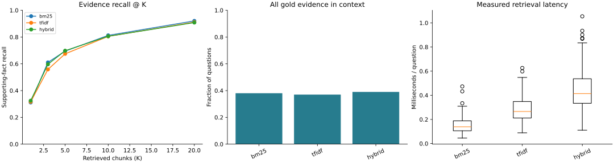
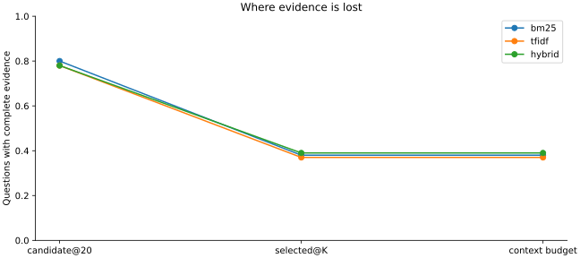
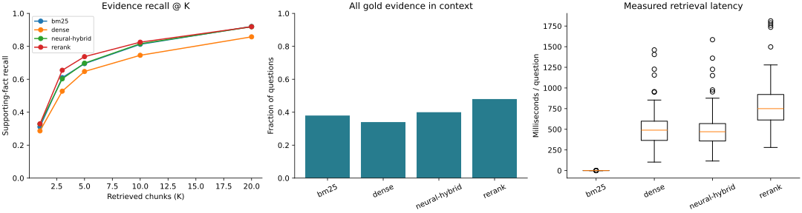
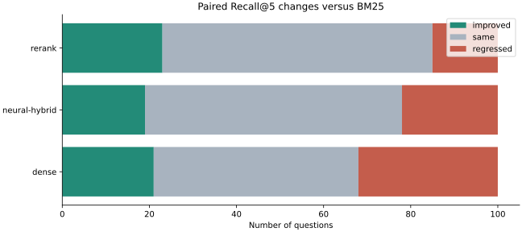

# 项目 01：用可视化实验学会 RAG

你要完成一个多文档问答系统，并能定位：证据没找到、排序被挤掉、上下文没装下，还是模型看到了仍答错。输入使用真实 HotpotQA 数据；第一版固定为每题自带候选文档的 distractor 范围，不是全 Wikipedia 检索。

本项目接在 [Mini Agent](../00-mini-agent/README.md) 之后。核心学习目标是检索与证据链；模型循环只在主动补查时使用。

## 先看结果





三条曲线来自本项目实际运行 100 道验收题，每题分别执行 BM25、TF-IDF 和二者的 RRF 融合。Recall@5 参考值约为 69.48%、67.45%、69.78%；进入最终上下文的完整证据覆盖率分别为 38%、37%、39%。**这些是检索指标，不是回答准确率。** 单凭融合方案的微小提升不能下泛化结论。

下载或克隆仓库后，用浏览器打开 `reference/index.html`，可以切换方案、筛选缺证据题、查看标注原文、候选排名和上下文。GitHub 文件页不直接运行 HTML；SVG 图可直接在上方和 GitHub 中查看。

## 真实语义模型实验

同一批 100 道题另跑了预训练编码器和重排器，完整记录在 `reference-neural/index.html`。

| 方案 | Recall@5 | 上下文证据齐全 |
| --- | --- | --- |
| BM25 | 69.48% | 38% |
| Dense | 64.73% | 34% |
| BM25＋Dense RRF | 69.78% | 40% |
| RRF 后重排 | 73.73% | 48% |





重排相对 BM25 有 23 题 Recall@5 提高、15 题下降、62 题不变。学完应能解释为什么语义检索不一定胜过关键词，以及为什么重排无法找回候选池外的证据。算法、固定权重与复现步骤见 [语义检索实验](NEURAL.md)。这些仍是检索实验，没有调用生成模型。

## 一次运行生成自己的图表

Python 3.11+，从仓库根目录执行；Windows 的命令相同。推荐新建虚拟环境，避免影响其他项目。

```bash
python -m pip install -r 20-Projects/01-rag-lab/requirements.txt
python 20-Projects/01-rag-lab/run.py --output .runs/rag-first
python 20-Projects/01-rag-lab/verify.py --output .runs/rag-first
```

运行后打开 `.runs/rag-first/index.html`。它不需要服务器、CDN 或网络。每次使用新的输出目录，已有结果不会被覆盖。

| 产物 | 用途 |
| --- | --- |
| `index.html` | 交互式整体结果、方案对比与逐题复盘；内嵌本次真实数据 |
| `retrieval.svg` / `.png` | Recall@K、完整证据覆盖率、检索耗时分布，可导出分享 |
| `evidence-loss.svg` / `.png` | 前20候选→Top-K→上下文的证据保留情况 |
| `paired-recall.svg` / `.png` / `.json` | 有 BM25 对照时，逐题召回的改善、不变和退化数量 |
| `results.jsonl` | 每题每方案的排名、上下文、分数、失败状态及模型预测 |
| `summary.json` | 运行配置、逐方案指标、工程验收条件 |

完整数据已经随仓库提供，无需下载全部 HotpotQA；来源、许可和哈希见 [数据说明](data/README.md)。20 道开发题用于调试，100 道验收题用于最后对照；反复调验收题会使它失去独立评估意义。

## 学习顺序与实验

| 实验 | 命令变化 | 你要观察什么 |
| --- | --- | --- |
| 建立基线 | 默认配置；先 `--split dev` | 为什么找到部分证据仍不足以回答跨文档问题 |
| 换检索算法 | `--methods bm25 tfidf hybrid` | BM25 与词项向量余弦排序的差别；融合是否真的改善 |
| 改分块 | `--chunk-size 3` | 同一个 K 对应更多文本；块召回的提高是否伴随上下文预算损失 |
| 改上下文 | `--top-k 10 --budget 600` | 证据是否在检索后因预算被丢弃 |
| 语义检索和重排 | 下面的 neural 命令 | 预训练模型与词项匹配的差别；看“现排名←原排名” |
| 答案与引用 | `--generation live` | 答案 EM/F1 与引用正确性分开看 |
| 主动补查 | `--methods bm25 active --generation live` | 额外查询是否补齐证据；失败与调用量都计入结果 |

默认 `tfidf` 是稀疏词项向量，不是语义 Embedding；默认 `hybrid` 是 BM25＋TF-IDF，绝不标成“BM25＋语义向量”。真正的语义方案分别叫 `dense`、`neural-hybrid`。

## 语义检索与重排入口

```bash
python -m pip install torch==2.8.0 --index-url https://download.pytorch.org/whl/cpu
python -m pip install -r 20-Projects/01-rag-lab/requirements-neural.txt
python 20-Projects/01-rag-lab/run.py --split dev --methods bm25 dense neural-hybrid rerank --output .runs/rag-neural
```

使用 `sentence-transformers/all-MiniLM-L6-v2` 与 `cross-encoder/ms-marco-MiniLM-L6-v2`。首次运行下载预训练模型，需要网络和额外内存；加载失败会明确报错，不降级成词项算法。这两个模型已完成 100 题 CPU 实测，模型 revision 固定在代码中，见 [实测环境](reference-neural/environment.txt)。环境清单记录本次安装版本，不保证跨平台直接安装；CPU 默认为 2 线程。

## 模型生成与主动补查

macOS/Linux 设置环境变量（PowerShell 使用 `$env:RAG_API_KEY='...'` 等形式）：

```bash
export RAG_API_KEY='你自己的密钥'
export RAG_BASE_URL='https://你的服务地址/v1'
export RAG_MODEL='支持JSON输出的模型名'
python 20-Projects/01-rag-lab/run.py --split dev --limit 5 --methods bm25 active --generation live --output .runs/rag-live
```

服务需兼容 Chat Completions 与 `response_format=json_object`。基础地址后自动追加 `/chat/completions`。普通方案每题一次回答请求；active 最多两次补查决策加一次回答请求。每次请求输出限制800 token、超时60秒，无自动重试。无密钥时不能运行 live，不会以标准答案代替生成。

模型只看到实际进入上下文的证据。预测必须是 `{"answer":"短答案","citations":[["文档标题",0]]}`。报告中的标准答案仅在模型调用结束后加入，供学习者对照。

`active` 使用 BM25 起始检索，由模型提出后续查询，RRF 合并后再次装配上下文；模型返回 query=null 即停止补查。这是最多两轮的受限主动检索，不是开放互联网研究。每轮实际上下文保存在 `rounds`。

本次交付**没有真实模型回答成绩**：默认页面显示 N/A。语义检索与重排已实测；API 回答和主动补查仅通过模拟接口测试，尚未执行真实生成模型端到端验证。请求正文及原始响应保存在 `model_events`，不保存认证头；分享自己的报告前请检查其中的输入文档。

## 怎样验收

1. `run.py` 的工程检查 PASS，全部题目和方案都有记录，失败不会被删掉。
2. `verify.py` 重新校验来源映射、上下文装配、逐题评分、汇总、工程验收状态和页面嵌入数据。`passed` 表示文件一致；`experiment_passed` 表示实验工程检查也通过。只有两项都为 true，命令才以退出码 0 结束。
3. 同样的固定数据与默认配置，用下面的 `compare.py` 自动核对逐题检索指标是否匹配 [参考汇总](reference/summary.json)；耗时因机器不同，不要求相等。
4. 自己完成一次受控修改，说明指标变化以及一个失败案例。真实模型部分另看答案和引用成绩，不要求凭空达到某个百分比。

```bash
python -m unittest discover -s 20-Projects/01-rag-lab/tests -v
```

默认实验跑完后，再执行：

```bash
python 20-Projects/01-rag-lab/compare.py --output .runs/rag-first --reference 20-Projects/01-rag-lab/reference
```

期望看到 `passed: true`、`reason: "matches_reference"`、`compared_rows: 300`、`changed_rows: 0`。这是逐题指标复现，不是只检查平均分。语义实验使用 `reference-neural`，要求同样 100 题和四个方案；预训练模型数值差异造成的不一致需逐题分析。

| 检查结果 | 怎么处理 |
| --- | --- |
| `passed=false`（verify） | 结果文件有缺失或不一致；检查 `errors`，不要手动改成 PASS |
| `passed=true`，`experiment_passed=false` | 失败被如实记录；检查模型响应、失败题和配置，修复后用新目录重跑 |
| `incompatible_configuration`（compare） | 题集、K、预算、方法或模型配置不同，不能作为同条件复现 |
| `different_scores`（compare） | 查看每道变化题的 ID、指标及差值；若有意改进算法，不必追求与基线相同 |
| `matches_reference`（compare） | 逐题检索指标与基线相同；仍要完成一次改进实验和失败分析 |

文件检查与基线复现无法证明学习者理解了算法，也不验证算法实现身份。`compare.py` 只接受不含模型生成的实验；实际生成需评估答案与引用，不要求每次输出一致。

这不是“100题全答对”的门禁。评分器采用 HotpotQA 风格的答案归一化、EM、token F1 和证据集合指标；位置有效的引用不一定支持答案。程序检查标注证据匹配，语义上的论证充分性仍需逐题阅读。

## 原理与边界

算法公式、代码路径、实验记录要求见 [学习指南](GUIDE.md)。本次参考测量见 [验收记录](VERIFICATION.md)。所有计时是实际测量；检索耗时不含索引初始化，neural 模型加载也不包含其中。token 用量只按接口返回值记录；没有价格表就不显示费用估计。

数据快照是公开教学数据，未提供企业文档接入、全库索引、向量数据库服务或生产级多租户。这些内容放在掌握本项目之后扩展。
