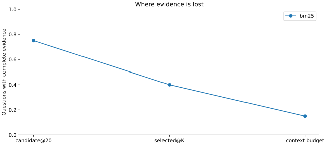

# 本次实际运行与验收范围

默认参考实验：100道 HotpotQA validation 题 × 3种词项检索方案，共300条逐题记录。命令：

```bash
python 20-Projects/01-rag-lab/run.py --output .runs/rag-final
python 20-Projects/01-rag-lab/verify.py --output .runs/rag-final
python -m unittest discover -s 20-Projects/01-rag-lab/tests -v
```

| 方案 | Recall@5 | 前20候选证据齐全 | 最终上下文证据齐全 |
| --- | --- | --- | --- |
| BM25 | 69.48% | 80% | 38% |
| TF-IDF | 67.45% | 78% | 37% |
| BM25＋TF-IDF RRF | 69.78% | 78% | 39% |

这是微型教学子集在每题给定文档上的实测结果，不是完整 HotpotQA 榜单结果。检索实现、数据快照不变时分数可复算；毫秒级计时会因设备和负载波动。

## 预算实验

另外在20道开发题运行 BM25、K=10、600字符预算：前20候选中75%的题证据齐全，Top-10后为40%，预算装配后降至15%。这说明候选中找到了证据，也可能在进入模型前丢失。图中没有执行模型生成。



[预算实验配置与结果](reference/budget-experiment/summary.json)。该实验与默认验收实验题集不同，不能直接比较两者的绝对指标来推断预算影响；阶段下降是在同一批开发题内部计算的。

## 自动检查

测试覆盖：答案归一化、yes/no规则、部分证据集合、分块来源映射、预算、检索排序、真实引用但错误答案、虚假引用、数据划分、完整出图、结果复算以及人为篡改检测。测试通过不代表真实模型完成任务。

默认参考的 `prediction` 为 null，答案EM/F1为null，页面显示“未运行”。语义模型、Cross-Encoder、真实API回答和模型主动补查没有在本次环境完成端到端验证。模型效果、模型文件revision、硬件开销应在这些实际实验后补充，不填写占位成绩。

HTML内嵌数据和JSONL逐条一致；SVG与PNG由同一结果集合生成。参考目录只保存SVG，重新运行同时生成PNG。保留数据归属与CC-BY-SA说明，见 [数据许可](data/README.md)。

## 页面检查

已检查导出图表的实际图像，并使用 DOM 环境执行页面脚本：3个方案、100道题；BM25缺证据筛选为62题，融合方案完整证据筛选为39题；未发现JavaScript异常。浏览器安装下载超时，因此本次未完成完整浏览器像素截图验证，DOM检查不冒充浏览器渲染验证。
