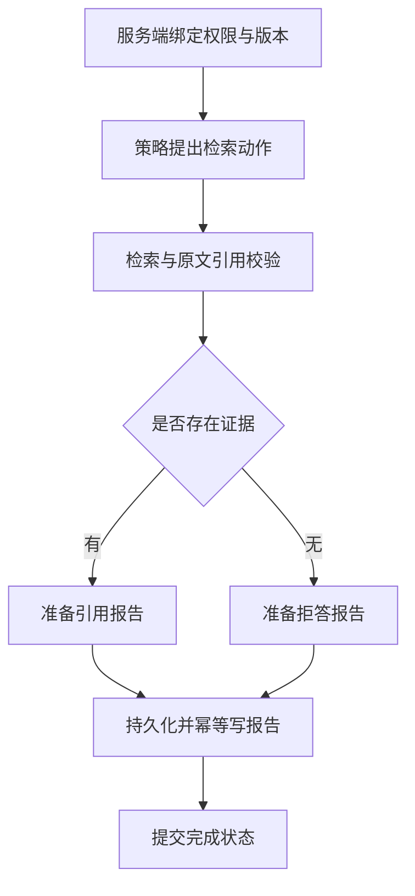

# 领域资料研究助手：从检索证据到可恢复报告

> 状态：verified（仅本地构造任务、Python 集成测试与评测运行）  
> 验证日期：2026-09-06；默认策略：确定性状态决策；回答方式：原文抽取。

这个项目回答一个具体问题：用户问某个错误码的处理方法时，如何只读取他有权访问的资料，把答案定位回原文，并在写报告时崩溃后继续执行？语料里的 `ERR-12003` 等编号都是教学构造，不能用于处理真实产品故障。

先运行，再沿着代码回看五个知识领域。默认不需要 API Key，也不调用模型服务。每次运行的差异可以归因于你修改的检索、权限或恢复逻辑；接入模型后的生成质量必须另测。

## 两条命令开始

从仓库根目录运行，使用 Python 3.11 或更高版本；本项目核心组件只依赖标准库。

```bash
python scripts/run_python.py -m domain_research.cli --query ERR-12003 --run-id first
python scripts/run_python.py 20-Projects/domain-research-agent/evaluation/run_eval.py --output .runs/research-eval
```

第一条命令输出答案和引用，并把报告、Checkpoint、记忆和运行事件写到 `.runs/research/`。第二条用四个构造任务评测证据、拒答、租户隔离和恢复，报告写到 `.runs/research-eval/`，仓库内的 [evaluation/report/](evaluation/report/) 保留先前运行证据。重复使用同一 `run-id` 和相同请求会返回已完成结果；更换问题时也应换 `run-id`。资料或版本变化时，会拒绝复用原请求标识。

## 实际复用了什么

| 学过的知识 | 本项目怎样用 | 跳到实现 |
| --- | --- | --- |
| Agent Loop | 策略先调用 `lookup`，收到观察后终止；Runtime 限定四步 | [Agent Loop](../../10-Knowledge/03-agent-core/05-code/agent-loop-python/README.md) |
| RAG | 先过滤租户、产品和版本，再按完整编号和 BM25 检索，生成原文引用 | [RAG Pipeline](../../10-Knowledge/06-rag-and-knowledge-systems/05-code/rag-pipeline-python/README.md) |
| State / Memory | Checkpoint 保存进度；Memory 只保存已验证引用指针 | [状态与记忆](../../10-Knowledge/07-state-and-memory/05-code/state-memory-python/README.md) |
| Runtime | 复用 SQLite `EventStore` 留下准备和完成事件；恢复以 Checkpoint 为准 | [恢复运行时](../../10-Knowledge/09-runtime-harness-environment/05-code/recoverable-runtime-python/README.md) |
| Evaluation | 每个 Trial 创建独立工作目录；评分器核查回答字段和落盘状态 | [评测 Harness](../../10-Knowledge/10-evaluation-observability/05-code/eval-harness-python/README.md) |

核心只依赖标准库，但本项目**依赖仓库内其他领域组件**：不能只复制当前目录，再期待 `pip install .` 得到完整运行环境。请保留整个仓库并使用上面的运行脚本。

入口代码是 [service.py](src/domain_research/service.py)。`scripts/run_python.py` 将各领域的 `src/` 加入导入路径，所以这里没有复制另一份 Agent、检索器或记忆库。

## 沿一次请求看控制权



`EvidencePolicy` 只决定什么时候调用工具和结束。权限由 `ResearchService` 构造时绑定，工具参数里没有可让模型修改的 `tenant`。工具多传一个权限字段就会被拒绝。最终报告取自经过引用检查的工具结果，不直接发布模型的 `finish.answer`。

一次模型动作成功并不足以发布报告：必须真正检索过、Loop 正常结束，而且每个引用的文档、版本、原文与位置都匹配。工具还要求查询与原任务完全一致，避免模型把 `ERR-12003` 改成 `ERR-12030`，拿另一个问题的真实引用回答当前问题。未来增加查询改写时，应单独保留原问题的编号、版本等约束。

引用校验验证的是“这些字符确实来自授权资料”。它不能证明原始资料正确，也不能证明抽取内容足以回答所有开放式问题。普通问题使用词法匹配，完整编号问题有额外硬过滤；“有匹配词”不等于“语义上已有充分答案”。结果分别记录 `decision_policy` 与 `answer_mode`，不会将外部模型适配器标成默认确定性策略。

无证据时，仍写可检查的拒答报告，但不把拒答写入事实记忆。后续使用 Memory 时也要重新读取引用指向的资料，因为资料可能更新或撤销授权；记忆不能绕过检索权限。

## 为什么先保存 prepared，再写文件

假设报告已写出，进程却在保存“完成”前崩溃。恢复时只看 `completed=false` 再执行一次，就可能重复副作用。如果报告写操作改成发邮件，这个错误会直接影响用户。

本例分成三个阶段：

1. 保存请求绑定信息与完整结果，状态为 `prepared`。恢复后继续使用同一结果，无需再次调用策略或检索。
2. 以 `run-id` 为稳定文件名，写临时文件，再原子替换。已有文件内容一致就复用，不一致就报冲突。
3. 保存引用记忆，最后标记 `completed`。记忆键也是 `run-id`，恢复后检查已有内容，避免递增版本。

测试分别在步骤 1 后、步骤 2 后抛异常，关闭数据库、重建服务，再验证只有一份报告和一个记忆版本。这个方法依赖“同一键、相同内容的本地写入可重复”。外部支付、邮件等副作用需要接收方幂等键、状态对账或补偿，见 [Runtime 的副作用实验](../../10-Knowledge/09-runtime-harness-environment/05-code/recoverable-runtime-python/README.md)。

本例限定单写者，文件写入未做断电级 `fsync`，也没有分布式事务。Checkpoint 与事件库不在同一事务，极端中断时可能缺少完成事件，因此恢复依据是 Checkpoint。这不是通用的“恰好一次”执行保证。

还要区分两个重跑场景：已经写入 `prepared` 或 `completed` 时，沿同一 `run-id` 能继续；如果第一次在生成 `prepared` **之前**就失败，可能只留下 trace，重跑会因排他创建同名 trace 报错。这个教学项目不自动修复这种未准备运行；保留失败轨迹，换新的 `run-id` 重试。不要将“支持两个指定崩溃点恢复”理解为任意时刻中断都能恢复。

## 自己动手改三处

| 实验 | 操作 | 应观察的变化 |
| --- | --- | --- |
| 区分相近编号 | 查询改为 `ERR-12030`，使用新 run-id | 引用切换到授权说明，不能因字符相似召回超时说明 |
| 验证拒答 | 查询 `ERR-99999` | 另一个租户虽然有记录，当前请求仍拒答，记忆为空 |
| 验证恢复 | 运行下面的测试 | 恢复时传空 `ScriptedModel` 也能完成，证明没有重新检索 |

```bash
python scripts/run_python.py -m unittest discover -s 20-Projects/domain-research-agent/tests -v
```

接真实模型时实现 `decide(state) -> Action` 并传给 `run(model=...)`。先保留权限、步数和引用发布规则，再加入真实问题集、错误工具调用与引用充分性评测。本地任务通过，只证明这些执行规则在被测场景下成立。

运行记录见 [run-report.md](run-report.md)；构造语料见 [corpus.jsonl](fixtures/corpus.jsonl)，评分条件见 [run_eval.py](evaluation/run_eval.py)。
