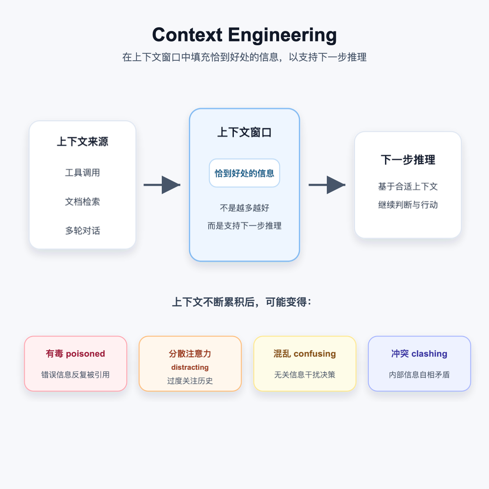
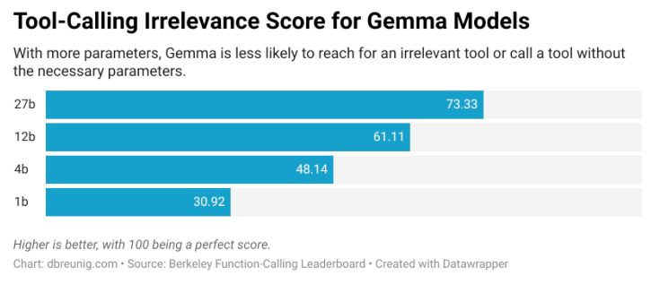
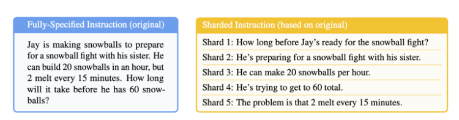

# Context Engineering

## 目录

- 第一章：上下文工程全景指南
  - 1.1 什么是上下文工程？
  - 1.2 核心原理：为什么上下文有效？
  - 1.3 核心组件
  - 1.4 Agents：决策大脑
  - 1.5 Query Augmentation：查询增强
  - 1.6 Retrieval：检索系统
  - 1.7 Context Packing：上下文打包
  - 1.8 Prompting Techniques：提示技巧
  - 1.9 Memory：记忆系统
  - 1.10 Tools：工具集成
  - 1.11 工程化与进阶方向
- 第二章：上下文失效与修复技巧
  - 一、什么是上下文工程？
  - 二、上下文的 4 种失效模式
  - 三、6 大上下文修复技巧
- 第三章：实践案例与工程落地
  - 一、LangGraph 实战：6 个 Notebook
  - 二、Anthropic 多智能体研究系统
  - 三、Anthropic Think 工具
  - 四、Claude Code 的工程实践
  - 五、Manus 的优化实践
  - 六、Spec-Driven Development
- 结语：关键洞察与总结
- 资源索引
- 参考资料

## 第一章：上下文工程全景指南

> 核心理念：上下文工程是设计架构的学科，在正确的时间向 LLM 提供正确的信息。这不是改变模型本身，而是构建连接模型与外部世界的桥梁。

### 1.1 什么是上下文工程？

每个使用大语言模型（LLM）构建应用的开发者都会遇到同样的瓶颈：模型能够写作、总结、推理，但一旦进入真实业务场景，就会暴露出几个问题：

- 无法回答关于私有文档的问题。
- 不知道训练后或昨天刚发生的事件。
- 当不知道答案时，可能会自信地编造。

问题的本质不在于模型不够聪明，而在于它从根本上是断开连接的。

这种隔离来自模型的核心架构限制：上下文窗口。上下文窗口是模型的活动工作内存，保存当前任务的指令和信息。每个字、数字、标点符号都会消耗窗口空间。它像一块白板：一旦写满，旧信息就会被擦除以便为新指令腾出空间，重要细节也可能随之丢失。

你无法仅通过编写更好的提示词来修复这个根本限制。你必须围绕模型构建一个系统。这就是上下文工程。

### 1.2 核心原理：为什么上下文有效？

上下文工程之所以有效，是因为 LLM 的行为高度依赖当前上下文窗口中的信息。模型权重没有被更新，但上下文会临时塑造模型的注意力、推理路径和输出格式。

可以从几个层面理解：

- Attention 机制：上下文窗口是模型进行 Self-Attention 的工作空间，模型会在窗口内寻找与当前生成最相关的信息。
- In-Context Learning：模型可以在不更新参数的情况下，从上下文中的指令、示例和资料里临时“学会”任务。
- Few-Shot 示例：示例不仅提供内容，也提供格式约束。很多时候，示例的结构和排列会直接影响输出质量。
- Lost in the Middle：长上下文并不等于高质量上下文。信息放在中间位置时，模型可能更容易忽略，需要通过重排序等策略提升关键内容可见性。

工程上的启示是：上下文不是越多越好，而是越相关、越清晰、越靠近当前任务越好。

### 1.3 核心组件

上下文工程由 6 个核心组件组成，每个组件解决 LLM 应用中的特定挑战：

- Agents：决策大脑。
- Query Augmentation：查询增强。
- Retrieval：检索系统。
- Prompting Techniques：提示技巧。
- Memory：记忆系统。
- Tools：工具集成。

如果按“真正进入上下文窗口的内容”来拆，还可以把上下文载荷分成 7 类：

| 上下文载荷 | 作用 |
| --- | --- |
| 指令 / 系统提示词 | 定义模型整体行为、规则、边界和示例。 |
| 用户提示词 | 用户当前提出的即时任务或问题。 |
| 短期记忆 | 当前会话中的历史对话、操作和中间状态。 |
| 长期记忆 | 跨会话保存的用户偏好、项目知识、历史摘要和特定事实。 |
| 检索信息 | 通过 RAG、数据库、API 或搜索工具获得的外部资料。 |
| 可用工具 | 模型可以调用的函数、内置工具或 MCP 工具定义。 |
| 结构化输出 | 对模型输出格式的约束，例如 JSON Schema、表格或固定字段。 |

### 1.4 Agents：决策大脑

Agents 是编排如何以及何时使用信息的决策系统。

在大语言模型的上下文中，AI Agent 能够：

- 动态决策信息流：基于学到的内容决定下一步做什么，而不是遵循预定路径。
- 跨多次交互维护状态：记住已完成的事情，并使用历史信息指导未来决策。
- 自适应使用工具：从可用工具中选择，并以未明确编程的方式组合它们。
- 基于结果修改方法：当一种策略不起作用时，可以尝试不同的方法。

常见架构包括：

- 单 Agent 架构：尝试自己处理所有任务，适用于中等复杂度的工作流。
- 多 Agent 架构：在专门的 Agent 之间分配工作，允许复杂工作流，但会引入协调挑战。

Agent 处理上下文时，需要持续判断：

- 哪些信息应该保持在上下文窗口中活跃。
- 哪些信息应该外部存储，并在需要时检索。
- 哪些信息可以总结或压缩以节省空间。
- 应该为推理和规划保留多少空间。

Agent 的核心策略包括：

- 上下文总结：定期将累积历史压缩成摘要。
- 质量验证：检查检索信息是否一致、有用。
- 上下文修剪：主动删除不相关或过时的上下文。
- 自适应检索策略：当初始尝试失败时，重新制定查询、切换知识库或改变分块策略。
- 上下文卸载：将细节存储在外部，并仅在需要时检索。
- 动态工具选择：只过滤和加载与任务相关的工具。
- 多源综合：组合多个来源的信息，解决冲突并产生连贯答案。

生产级 Agent 还需要工程化地管理上下文窗口：

- 拥有你的上下文窗口：不要把上下文交给框架或模型自动堆积，而要明确决定哪些信息进入窗口。
- 确定性代码优先：能用普通代码确定完成的部分尽量用代码处理，把 LLM 调用留给真正需要语义判断、规划和生成的环节。
- 状态管理：支持任务暂停、恢复、人机协同和中间结果复用。
- 成本意识：多轮 Agent 的上下文会持续膨胀，轮次越多，推理成本和延迟越容易失控。

### 1.5 Query Augmentation：查询增强

Query Augmentation 是将混乱、模糊的用户请求转换为精确、机器可读意图的艺术。

它要解决两个问题：

- 用户通常不以理想方式与聊天机器人交互：现实输入可能不清楚、混乱且不完整。
- 管道的不同部分需要以不同方式处理查询：LLM 理解良好的问题，不一定是搜索向量数据库的最佳格式。

常见方式包括：

- 查询重写（Query Rewriting）：将原始用户查询转换为更有效的检索版本。
- 查询扩展（Query Expansion）：从单个用户输入生成多个相关查询来增强检索。
- 查询分解（Query Decomposition）：将复杂、多方面的问题拆成更简单、集中的子查询。
- 查询 Agent（Query Agents）：使用 AI Agent 智能处理整个查询处理管道。

查询重写通常包括：

- 重构不清楚的问题：将模糊或形式不佳的用户输入转换为精确、信息密集的术语。
- 上下文移除：消除可能混淆检索过程的无关信息。
- 关键词增强：引入常见术语以增加匹配相关文档的可能性。

查询扩展需要注意：

- 查询漂移：扩展查询可能偏离用户原始意图。
- 过度扩展：添加过多术语可能降低精度。
- 计算开销：处理多个查询会增加系统延迟。

查询分解通常包含两个阶段：

- 分解阶段：LLM 分析原始复杂查询，并将其分解为更小、集中的子查询。
- 处理阶段：每个子查询独立通过检索管道处理。

查询 Agent 的核心流程是“动态分析 -> 精准检索 -> 评估优化 -> 生成反馈”：

- 分析：解析用户查询，明确任务需求。
- 构建查询：根据用户意图和数据结构动态生成查询。
- 执行查询：把查询发送到目标数据集合，并支持多集合路由。
- 评估检索结果：检查信息是否与用户查询相关，不相关则调整查询或更换知识源。
- 收尾：用生成式模型将数据库结果转化为自然语言回答，并记录上下文。

意图识别可以看作上下文构建的前置步骤：先判断用户真实需求，再决定要加载哪些工具、检索哪些知识库、保留多少历史记录。

常见能力包括：

- 意图分类（Intent Classification）：识别用户到底是在查询信息、执行任务、闲聊、复杂推理，还是同时提出多个需求。
- 槽位填充（Slot Filling）：从用户输入中提取关键参数，例如地点、时间、对象、约束条件。
- 多意图识别与消歧：面对复合请求时，将多个目标拆开处理，再合并结果。
- 意图驱动的上下文策略：不同意图对应不同上下文构建方式。

| 意图类型 | 上下文策略 | 示例 |
| --- | --- | --- |
| 信息查询 | RAG 检索 + 精确匹配 | “北京今天天气如何？” |
| 任务执行 | 工具调用 + 参数提取 | “帮我订一张去上海的机票” |
| 闲聊对话 | 短期记忆 + 人格设定 | “你觉得今天过得怎么样？” |
| 复杂推理 | CoT + 长上下文 | “分析这份报告的关键趋势” |
| 多意图 | 并行处理 + 结果合并 | “查天气顺便帮我订机票” |

### 1.6 Retrieval：检索系统

Retrieval 是连接 LLM 到特定文档和知识库的桥梁。

LLM 的能力取决于它能访问的信息。虽然 LLM 在海量数据集上训练，但它们缺乏对私有文档以及训练完成后创建信息的了解。

原始文档数据集通常太大，无法直接放入有限上下文窗口。系统必须找到最合适的片段，也就是包含用户查询答案的段落或部分。为了让庞大的知识库可搜索，需要先将文档分解为更小、可管理的部分，这个过程称为分块（Chunking）。

分块是影响检索系统性能的关键决策。设计分块策略时，需要平衡两个优先级：

- 检索精度：块需要足够小，聚焦于单个想法。
- 上下文丰富性：块必须足够大、自包含，便于被理解。

目标是找到“分块最佳点”：块足够小，可以实现精确检索；同时足够完整，可以给 LLM 所需上下文。

常见分块方式包括：

- 固定大小分块（Fixed-Size Chunking）：按固定长度切分。
- 递归分块（Recursive Chunking）：使用优先级分隔符列表切分文本，尊重文档自然结构。
- 基于文档的分块（Document-Based Chunking）：利用文档固有结构切分。
- 语义分块（Semantic Chunking）：基于含义而不是分隔符切分文本。
- 基于 LLM 的分块（LLM-Based Chunking）：借助 LLM 判断切分边界。
- Agentic 分块：由 Agent 动态判断如何组织片段。
- 层次分块（Hierarchical Chunking）：保留文档不同层级的结构。
- 延迟分块（Late Chunking）：先进行更大范围处理，再在后续阶段切分。

分块策略还涉及预分块与后分块的权衡：

- 预分块：先把文档切好再索引，工程实现简单，检索速度更稳定。
- 后分块：先保留更完整的文档语义，再在检索或生成阶段按任务需要切分，更适合复杂语义场景。

RAG 系统的核心流程可以概括为：

- 预处理：清洗原始文档，移除页眉、页脚、特殊字符等冗余内容。
- 语义检索：用户查询和文档通过 Embedding Model 转成向量，并通过向量数据库做语义相似度检索。
- 分块与重排序：将检索到的内容分块、重排序，再放入上下文窗口。
- 增强生成：将检索内容填入 Prompt Template，由 LLM 生成最终回答。

复杂系统中，检索通常不只依赖一种方式。可以组合关键词检索、语义检索和图检索，并配合查询改写、HyDE、重排序等策略，提高召回和精度的平衡。

在代码 Agent 场景里，也不一定必须先上复杂向量库。`llms.txt`、`grep`、`find` 这类朴素文本检索工具，配合 Agent 的多轮查询和读取能力，也可以构成高效的上下文选择机制。

### 1.7 Context Packing：上下文打包

Context Packing 解决的是“检索到了多个片段之后，如何把它们装进上下文窗口”的问题。RAG 负责找到候选信息，Context Packing 负责决定哪些信息进入窗口、以什么顺序进入、是否需要去重或压缩。

核心目标是：在有限 token 预算内，把最能支持当前任务的上下文组合出来。

常见步骤包括：

- 排序：根据相关性、时效性、来源可信度、逻辑依赖关系，对候选片段重新排序。
- 去重：删除重复片段、近似重复段落和表达不同但信息相同的内容。
- 压缩：对较长片段做摘要、裁剪或提取关键句，保留结论、数据、约束和证据。
- 分层：优先放入任务目标、关键事实、强相关证据，再放补充背景。
- 预算控制：为系统指令、用户问题、工具定义和模型输出预留空间，避免上下文被检索内容挤满。

一个实用的打包顺序可以是：

1. 系统指令和任务目标。
2. 用户当前问题。
3. 最高相关、最高可信的检索片段。
4. 必要的背景信息和约束条件。
5. 冲突信息或不确定信息的标记。
6. 输出格式要求。

需要特别注意：Context Packing 不是简单拼接检索结果。如果把片段按召回顺序直接塞进窗口，很容易出现重复、冲突、关键信息被埋在中间、无关背景挤占预算等问题。

### 1.8 Prompting Techniques：提示技巧

Prompting Techniques 是给出清晰、有效指令以引导模型推理的技能。

提示工程是设计、细化和优化给予大语言模型输入，以获得期望输出的实践。

经典提示技术包括：

- 思维链（Chain of Thought, CoT）：引导模型展示或遵循推理过程。
- 少样本提示（Few-Shot Prompting）：通过少量示例约束模型输出格式和行为。
- CoT + Few-shot：同时指导模型的推理过程和输出格式。

提示技巧可以进一步细化：

- 让思维链推理非常具体到用例，例如要求模型评估环境、重复相关信息、解释这些信息对当前请求的重要性。
- 为了最大化效率并减少 token 数量，可以要求模型以“草稿”形式推理，每句话不超过 5 个单词。

高级提示策略包括：

- 思维树（Tree of Thoughts, ToT）：探索多个推理路径。
- ReAct 提示：将推理和行动结合，让模型在思考、调用工具、观察结果之间循环。

### 1.9 Memory：记忆系统

Memory 是给应用程序历史感和从交互中学习能力的系统。

在构建强大的 Agent 时，需要分层思考记忆，并混合不同类型的记忆。

短期记忆是 Agent 的即时工作空间，是“现在”，通常被放入上下文窗口以推动即时决策和推理。它通过上下文学习实现，将最近的对话、操作或数据直接打包到提示中。主要挑战是效率：要保持精简，减少成本和延迟，同时不遗漏下一步处理所需的重要细节。

长期记忆超越即时上下文窗口，将信息外部存储，以便在需要时快速检索。它使 Agent 能随着时间推移建立对世界和用户的持久理解，通常由 RAG 驱动。

长期记忆可以存储：

- 情节记忆：特定事件或过去交互。
- 语义记忆：一般知识和事实，例如公司文档、产品手册或领域知识库。

现代系统通常使用混合记忆：

- 工作记忆：与特定多步骤任务相关的信息临时存储区。
- 程序记忆：帮助 Agent 学习和掌握例程，通过观察成功工作流程来内化重复任务步骤。

有效记忆管理的关键原则包括：

- 修剪和细化。
- 选择性存储。
- 掌握检索的艺术。

几个代表性方向可以帮助理解记忆系统的演进：

- Generative Agents：通过 Memory Stream、Retrieval、Reflection 构建能持续积累经验的智能体。
- MemGPT：把 LLM 看作操作系统，引入 Main Context 与 External Context 的虚拟内存思想。
- 主动清理记忆：让 Agent 定期修剪和细化记忆，丢弃噪音，避免长期记忆污染后续任务。

### 1.10 Tools：工具集成

如果记忆给 Agent 自我意识，那么工具就是给它超能力的东西。

让 LLM 使用工具的能力经历了从提示到行动的演变。早期开发者试图通过传统提示工程，让 LLM 生成看起来像命令的文本。真正的突破是函数调用（Function Calling），也称为工具调用（Tool Calling）。这种能力现在已成为多数模型的原生功能，允许 LLM 输出结构化 JSON，其中包含要调用的函数名称和参数。

常见工具形态包括：

- 简单工具：例如旅行 Agent 使用 `search_flights` 查询真实航班，而不是让模型猜答案。
- 工具链：例如规划周末旅行时，Agent 可能依次调用 `find_flights`、`search_hotels`、`get_local_events`。

上下文工程在这里的任务是如何呈现工具。一个写得好的工具描述就像一个小型提示，指导模型理解工具作用、输入要求和返回内容。

工具编排包括几个关键步骤：

- 工具发现：Agent 需要知道自己拥有哪些工具。工具描述质量非常关键，它是 Agent 理解工具作用、何时使用和何时避免使用的主要指南。
- 工具选择和规划：面对用户请求时，Agent 要判断是否需要工具、需要哪个工具，以及是否需要工具链。
- 参数制定：选择工具后，Agent 必须从用户查询中提取正确参数，并按工具要求格式化。
- 反思和观察：工具执行后，输出会被反馈到上下文窗口中，Agent 反思输出以决定下一步。

这个流程构成现代 Agent 框架中的基本推理循环：思考 -> 行动 -> 观察。

MCP（Model Context Protocol）可以看作工具集成的一种标准化方向，让模型、工具和上下文资源之间的连接方式更加统一。

工具系统设计时需要注意：

- 语义清晰：工具名称和描述要让模型准确判断何时使用。
- 无状态：尽量减少工具对隐式上下文的依赖。
- 原子性：一个工具只做一类明确事情，避免“大而全”的模糊工具。
- 最小权限：只暴露完成任务所需的能力，降低误用和安全风险。

### 1.11 工程化与进阶方向

#### 12-Factor Agents

生产级 Agent 的核心不是把所有能力都交给 LLM，而是用工程系统管理 LLM 的输入、输出和状态。

关键原则包括：

- 拥有你的上下文窗口。
- 用确定性代码处理可确定的部分。
- 明确管理状态、暂停、恢复和人机协同。
- 把成本、延迟和上下文增长当作架构问题，而不是事后优化项。

#### 编程化与自动化

上下文工程也在从“手写提示”走向“编译式上下文”：

- DSPy：将上下文、提示和示例视为可优化的参数。
- 自动提示优化（APO）：让系统自动搜索更好的提示和上下文组合。
- Many-Shot In-Context Learning：在百万级上下文模型中使用大量示例，探索超过传统少样本提示的效果。

这类方法的方向是让上下文工程从经验调参，逐步走向可评估、可优化、可复现。

#### 安全与攻防

上下文工程也必须处理安全问题，尤其是 Prompt Injection。

常见策略包括：

- 上下文隔离：把用户输入、系统指令、工具输出和外部文档分区管理。
- 分隔符防御：使用明确边界标记不同来源的信息。
- 安全架构设计：不让外部内容直接覆盖系统规则，也不让模型自由调用超出任务边界的工具。

#### 从上下文工程到环境工程

上下文工程关注的是“模型输入”：在正确时间把正确的信息和工具放进上下文窗口。

更进一步的方向是环境工程：为 Agent 构建一个可感知、可交互、可持续演化的外部世界。环境不仅包含上下文，还包含世界状态、规则、交互历史、反馈机制和长期影响。

可以把三种阶段这样区分：

| 阶段 | 关注点 | 局限 |
| --- | --- | --- |
| 提示词工程 | 单条高质量 Prompt | 静态、一次性、依赖人工表达。 |
| 上下文工程 | 动态组织模型输入 | 仍以模型上下文窗口为中心。 |
| 环境工程 | 构建模型所处的世界 | 需要更复杂的状态、反馈和交互机制。 |

上下文工程不仅仅是提示大语言模型、构建检索系统或设计 AI 架构。它是关于构建在各种用途和用户中可靠工作的互联、动态系统。

我们正在从与模型对话的提示者，转变为构建模型生活世界的架构师。最好的 AI 系统不是来自更大的模型，而是来自更好的工程。

## 第二章：上下文失效与修复技巧

### 一、什么是上下文工程？

正如 Andrej Karpathy 所说，上下文工程是一门精妙的艺术与科学：在上下文窗口中填充恰到好处的信息，以支持下一步的推理。

这件事听起来简单，但实际操作中，随着上下文的不断累积，例如工具调用、文档检索、多轮对话，上下文可能变得：

- 有毒（poisoned）：错误信息反复被引用。
- 分散注意力（distracting）：模型过度关注历史而忽略训练知识。
- 混乱（confusing）：无关信息干扰决策。
- 冲突（clashing）：内部信息自相矛盾。

下面这张图完美总结了上下文工程的核心技巧：



图：上下文工程的关键，是让上下文窗口中保留恰到好处的信息，用来支持下一步推理，同时避免上下文变得有毒、分散注意力、混乱或冲突。

### 二、上下文的 4 种失效模式

在介绍解决方案之前，我们先要理解问题本质。Drew Breunig 总结了上下文失效的 4 种典型模式：

#### 2.1 上下文中毒（Context Poisoning）

定义：当幻觉或错误进入上下文后，被模型反复引用和强化。

案例：DeepMind 团队在 Gemini 2.5 技术报告中提到，他们让 Gemini 玩宝可梦游戏时，模型偶尔会产生幻觉。一旦“目标”部分被污染，例如认为自己需要完成一个根本不存在的任务，智能体就会制定荒谬的策略，并不断重复无效行为。

危害：模型会执着于实现不可能的目标，陷入死循环。

#### 2.2 上下文干扰（Context Distraction）

定义：上下文过长时，模型过度关注历史记录，忽略了训练时学到的知识。

数据支持：

- Gemini 2.5 Pro 虽然支持 100 万+ token 的上下文，但当上下文超过 10 万 token 时，就开始倾向于重复历史操作，而不是生成新策略。
- Databricks 研究发现，Llama 3.1 405B 的正确率在 32k token 左右就开始下降，更小的模型下降得更早。

启示：即使模型支持超长上下文，也不意味着应该全部填满。

#### 2.3 上下文混淆（Context Confusion）

定义：上下文中的冗余内容被模型错误使用，导致低质量响应。

典型场景：MCP（Model Context Protocol）工具过载。

实验证据：

- Berkeley Function-Calling Leaderboard 显示，当提供多个工具时，所有模型的表现都会下降。
- 一项研究发现，量化版 Llama 3.1 8B 在面对 46 个工具时失败，但只给 19 个工具时就成功了。即使上下文窗口还很充裕，工具过多也会造成干扰。



图中展示了不同规模 Gemma 模型的 Tool-Calling Irrelevance Score。这个分数越高，表示模型越不容易调用无关工具，或在缺少必要参数时调用工具。图中 27B 模型得分为 73.33，12B 为 61.11，4B 为 48.14，1B 为 30.92，说明参数更多的模型在工具选择上更稳，但仍然没有达到满分。

这张图对应的启示是：工具列表本身也是上下文的一部分。工具越多、越杂，模型越可能被无关工具干扰；模型越小，这种干扰越明显。

核心问题：模型会试图使用上下文中的所有信息，即使它们与任务无关。

#### 2.4 上下文冲突（Context Clash）

定义：上下文中累积的信息自相矛盾。

重磅研究：微软和 Salesforce 的联合团队做了一个实验：

- 把一个完整的提示词拆分成多轮对话。
- 所有信息都相同，只是分阶段提供。
- 结果：平均性能下降 39%。
- 甚至 OpenAI 的 o3 模型得分从 98.1 暴跌到 64.1。



图中左侧是完整提示词，右侧是基于同一提示词拆分出的多个 shard。信息本身没有变化，但提供方式从“一次性完整给出”变成了“分阶段进入上下文”。这对应了上面的实验设置：同样的信息被拆成多轮后，模型更容易受早期回答和历史上下文影响。

原因：早期的错误回答会留在上下文中，影响后续推理。研究团队总结：

> “当 LLM 在对话中走错方向时，它们就会迷失并无法恢复。”

对 Agent 的影响：Agent 需要从文档、工具调用、子任务中收集上下文，这些来自不同来源的信息更容易产生冲突。

### 三、6 大上下文修复技巧

了解了问题，现在来看解决方案。这 6 种技巧环环相扣，可以单独使用，也可以组合应用。

从工程方法论看，也可以把上下文管理概括成 4 类操作：

| 方法 | 含义 | 对应本文技巧 |
| --- | --- | --- |
| Offload | 把信息写到上下文窗口之外，只保留指针、摘要或引用。 | 上下文卸载 |
| Retrieve | 从外部知识、工具或记忆中选择相关内容。 | RAG、工具装载 |
| Compress | 对已有上下文做压缩、裁剪和重排。 | 上下文修剪、上下文摘要 |
| Isolate | 把任务拆到独立上下文或独立执行环境中。 | 上下文隔离、多 Agent |

#### 3.1 技巧 1：RAG（检索增强生成）

对应问题：RAG 主要解决的是上下文干扰（Context Distraction）和上下文混淆（Context Confusion）。

最核心对应的是上下文混淆。因为 RAG 的作用是只检索和当前任务相关的信息，避免把大量无关文档、工具结果、历史材料全塞进上下文。这样可以减少冗余信息被模型误用。

同时，RAG 也能缓解上下文干扰。如果不做 RAG，直接塞入长文档或大量历史内容，模型容易过度关注上下文里的历史记录，忽略自身已有知识或当前任务重点。RAG 通过精准检索，控制上下文长度和信息密度。

它对另外两个问题也有间接帮助：

- 上下文中毒：如果检索源本身有错误，RAG 也可能把错误带进来；所以 RAG 不天然解决中毒，除非配合来源校验。
- 上下文冲突：如果检索到互相矛盾的资料，RAG 也可能放大冲突；需要配合去重、排序、冲突检测。

核心思想：选择性地添加相关信息，而不是一股脑全塞进去。

现状：每当模型上下文窗口扩大，就有人喊“RAG 已死”。Llama 4 Scout 推出 1000 万 token 窗口时，这种声音尤其响亮。

事实：RAG 不仅没死，反而更重要了。

- 如果把上下文当作“杂物抽屉”，杂物会影响模型响应。
- 即使有超大窗口，精准检索依然是提升质量的关键。
- RAG 的本质是信息管理，而不是窗口大小问题。

实现要点（基于 LangGraph）：

- 文档切块：使用 `RecursiveCharacterTextSplitter`。
- 向量存储：OpenAI Embeddings。
- 智能检索：先明确研究范围，再执行检索。
- 性能：复杂查询约消耗 25k tokens（含工具调用）。

代码示例：

```python
from langchain_community.document_loaders import WebBaseLoader
from langchain_text_splitters import RecursiveCharacterTextSplitter
from langchain_openai import OpenAIEmbeddings
from langchain_chroma import Chroma
from langchain.tools.retriever import create_retriever_tool

# 1. 加载并切分文档
loader = WebBaseLoader("https://lilianweng.github.io/posts/2023-06-23-agent/")
docs = loader.load()
text_splitter = RecursiveCharacterTextSplitter(chunk_size=1000, chunk_overlap=200)
documents = text_splitter.split_documents(docs)

# 2. 创建向量存储
embeddings = OpenAIEmbeddings()
vectorstore = Chroma.from_documents(documents, embeddings)
retriever = vectorstore.as_retriever(search_kwargs={"k": 5})

# 3. 封装为工具
retriever_tool = create_retriever_tool(
    retriever,
    "retrieve_blog_posts",
    "搜索并返回 Lilian Weng 关于 AI Agent 的博客文章片段",
)

# 4. 在 LangGraph 中使用
from langgraph.prebuilt import create_react_agent
from langchain_anthropic import ChatAnthropic

llm = ChatAnthropic(model="claude-sonnet-4-20250514")
agent = create_react_agent(llm, [retriever_tool])

# 执行查询
result = agent.invoke({
    "messages": [("user", "什么是 reward hacking？给我详细解释")]
})
```

关键点：模型会先调用检索工具获取相关文档片段，再基于这些片段生成答案，而不是把所有文档塞进上下文。

#### 3.2 技巧 2：工具装载（Tool Loadout）

核心思想：只加载与任务相关的工具定义。

术语来源：“Loadout”是游戏术语，指开局前选择的技能、武器和装备组合，根据关卡、队友和自身能力量身定制。

关键研究：

- RAG MCP 论文：用向量数据库存储工具描述，根据提示词检索相关工具。
- 测试发现：对于 DeepSeek-v3，工具超过 30 个时，描述开始重叠造成混淆；超过 100 个几乎必然失败。
- 效果：动态选择少于 30 个工具，工具选择准确率提升 3 倍。

“Less is More”研究：

- 使用 LLM 驱动的工具推荐器，让模型先推理“需要哪些工具”。
- 再通过语义搜索确定最终工具集。
- Llama 3.1 8B 性能提升 44%。
- 即使准确率不变，功耗降低 18%，速度提升 77%（边缘计算场景）。

实践建议：

- 小型 Agent 手工精选少量工具即可。
- 大型系统必须实现动态工具选择。
- 边缘设备尤其要注意工具数量（功耗和速度）。

代码示例：

```python
from langchain_chroma import Chroma
from langchain.tools import tool
from langchain_openai import OpenAIEmbeddings

# 1. 定义工具池（以数学工具为例）
@tool
def add(a: float, b: float) -> float:
    """计算两个数的和"""
    return a + b


@tool
def multiply(a: float, b: float) -> float:
    """计算两个数的乘积"""
    return a * b


# ... 定义更多工具
all_tools = [add, multiply, ...]  # 假设有 50+ 个工具

# 2. 为每个工具创建描述和索引
tool_descriptions = [
    f"名称: {tool.name}\n描述: {tool.description}"
    for tool in all_tools
]
tool_metadatas = [
    {"index": i}
    for i, _ in enumerate(all_tools)
]

embeddings = OpenAIEmbeddings()
vectorstore = Chroma.from_texts(
    texts=tool_descriptions,
    embedding=embeddings,
    metadatas=tool_metadatas,
)

# 3. 根据用户查询动态选择工具
def select_relevant_tools(query: str, top_k: int = 5):
    # 语义搜索最相关的工具
    docs = vectorstore.similarity_search(query, k=top_k)
    tool_indices = [int(doc.metadata["index"]) for doc in docs]
    return [all_tools[i] for i in tool_indices]


# 4. 使用选定的工具
user_query = "我需要计算一些数学运算"
selected_tools = select_relevant_tools(user_query, top_k=5)

# 只绑定相关工具，避免上下文混淆
agent = create_react_agent(llm, selected_tools)
```

#### 3.3 技巧 3：上下文隔离（Context Quarantine）

核心思想：把任务拆分到独立的线程中，每个线程有自己的上下文。

核心优势：

- 关注点分离：每个子智能体有专属工具、提示和探索路径。
- 降低路径依赖：独立调查，互不干扰。
- 适合广度优先、可并行探索的问题。
- 通过独立上下文减少路径依赖和上下文污染。

实现要点：

- 设计不同类型的智能体（研究型、计算型、分析型等）。
- 每个智能体有专属工具集和提示词。
- 主智能体负责任务分配和结果汇总。
- 适合可并行化的问题。

局限：不适合需要多智能体频繁共享上下文的场景。

典型实践案例见第三章“Anthropic 多智能体研究系统”。

代码示例：

```python
from langgraph.graph import StateGraph, MessagesState, START, END
from langgraph.prebuilt import create_react_agent
from langchain_anthropic import ChatAnthropic
from langchain.tools import tool

# 1. 定义专家智能体的工具
@tool
def multiply(a: float, b: float) -> float:
    """计算两个数的乘积"""
    return a * b


@tool
def add(a: float, b: float) -> float:
    """计算两个数的和"""
    return a + b


@tool
def web_search(query: str) -> str:
    """执行网页搜索"""
    # 实际实现会调用搜索 API
    return f"搜索结果: {query}"


# 2. 创建专家智能体（各自独立的上下文）
math_agent = create_react_agent(
    ChatAnthropic(model="claude-sonnet-4-20250514"),
    tools=[add, multiply],
    state_modifier="你是数学专家，专注于计算任务。",
)

research_agent = create_react_agent(
    ChatAnthropic(model="claude-sonnet-4-20250514"),
    tools=[web_search],
    state_modifier="你是研究专家，专注于信息搜索和分析。",
)


# 3. 创建 Supervisor 节点
def supervisor(state: MessagesState):
    """主智能体：路由任务到合适的专家"""
    llm = ChatAnthropic(model="claude-opus-4-20250514")

    system_prompt = """你是任务协调员。分析用户请求：
    - 如果涉及数学计算，调用 'math_expert'
    - 如果需要搜索信息，调用 'research_expert'
    - 如果任务完成，返回 'FINISH'
    """

    # 分析并路由
    response = llm.invoke([system_prompt] + state["messages"])
    return {"next": response.tool_calls[0]["name"] if response.tool_calls else "FINISH"}


# 4. 构建多智能体图
workflow = StateGraph(MessagesState)
workflow.add_node("supervisor", supervisor)
workflow.add_node("math_expert", math_agent)
workflow.add_node("research_expert", research_agent)

workflow.add_edge(START, "supervisor")
workflow.add_conditional_edges(
    "supervisor",
    lambda x: x["next"],
    {
        "math_expert": "math_expert",
        "research_expert": "research_expert",
        "FINISH": END,
    },
)

app = workflow.compile()

# 5. 执行任务
result = app.invoke({
    "messages": [("user", "帮我搜索量子计算的最新进展，然后计算 123 * 456")]
})
```

关键点：每个专家智能体在独立的上下文中工作，互不干扰。Supervisor 负责任务分解和结果汇总，性能提升 90.2%。

#### 3.4 技巧 4：上下文修剪（Context Pruning）

核心思想：删除上下文中不相关或不必要的信息。

应用场景：Agent 在调用工具和收集文档时会不断积累上下文，定期修剪可以去除冗余。

推荐工具：Provence。

Provence 是一个高效的问答系统上下文修剪器：

- 模型大小：仅 1.75 GB。
- 速度：快速。
- 准确性：高。
- 易用性：几行代码搞定。

使用示例：

```python
from transformers import AutoModel

provence = AutoModel.from_pretrained(
    "naver/provence-reranker-debertav3-v1",
    trust_remote_code=True,
)

# 读取维基百科条目
with open("alameda_wiki.md", "r", encoding="utf-8") as f:
    alameda_wiki = f.read()

# 根据问题修剪文章
question = "What are my options for leaving Alameda?"
provence_output = provence.process(question, alameda_wiki)
```

效果：可以删减 95% 的内容，只保留相关部分。

架构建议：

- 使用字典或结构化数据维护上下文。
- 在每次 LLM 调用前组装成字符串。
- 修剪时保护核心指令和目标。
- 可选择性修剪文档或历史记录部分。

性能提升：

- 某案例中，从 25k tokens（RAG）降至 11k tokens（RAG + 修剪）。
- 答案质量不变。

#### 3.5 技巧 5：上下文摘要（Context Summarization）

核心思想：将累积的上下文浓缩成简洁摘要。

历史渊源：最初是为了应对小上下文窗口而生。快到上限时，生成摘要并开启新对话。用户在 ChatGPT / Claude 中手动操作过。

新发现：即使窗口够大，摘要依然有价值。

回顾 Gemini 团队的发现：

> “当上下文超过 10 万 tokens 时，智能体倾向于重复历史操作，而非生成新策略。”

这就是上下文干扰的典型表现。

实现难点：

- 容易做，难做好：关键在于判断哪些信息应该保留。
- 需要细致调优：针对特定 Agent 定制摘要策略。
- 建议：把摘要功能独立出来，作为专门的 LLM 驱动阶段，方便收集评估数据和优化。

模型选择：

- 使用成本更低的模型（如 GPT-4o-mini）进行摘要。
- 目标：压缩 50-70% 的长度，保留所有关键信息。

vs 修剪：

- 修剪：删除无关内容。
- 摘要：压缩所有信息，适合内容都相关但冗长的场景。

代码示例：

```python
from typing import TypedDict

from langgraph.graph import StateGraph, START, END
from langchain_openai import ChatOpenAI
from langchain_anthropic import ChatAnthropic


class AgentState(TypedDict):
    messages: list
    tool_results: str  # 工具调用的原始结果
    summary: str       # 摘要后的结果


def tool_call_node(state: AgentState):
    """模拟工具调用，返回长文本"""
    # 假设这是一个检索到的长文档
    long_document = """
    [此处是 5000 字的检索文档内容...]
    包含大量细节、案例、引用等信息...
    """
    return {"tool_results": long_document}


def summarize_node(state: AgentState):
    """摘要节点：压缩工具结果"""
    summarizer = ChatOpenAI(model="gpt-4o-mini")

    prompt = f"""请将以下内容压缩为简洁摘要，保留所有关键信息：

要求：
1. 压缩到原长度的 30-50%
2. 保留核心论点、关键数据和重要结论
3. 删除冗余描述和重复内容
4. 保持信息完整性

原文：
{state['tool_results']}

摘要："""

    response = summarizer.invoke(prompt)
    return {"summary": response.content}


def respond_node(state: AgentState):
    """基于摘要生成最终答案"""
    llm = ChatAnthropic(model="claude-sonnet-4-20250514")

    # 使用摘要而非原始长文档
    prompt = f"""基于以下摘要信息回答用户问题：

摘要：
{state['summary']}

用户问题：
{state['messages'][-1]['content']}
"""

    response = llm.invoke(prompt)
    return {"messages": state["messages"] + [{"role": "assistant", "content": response.content}]}


# 构建工作流
workflow = StateGraph(AgentState)
workflow.add_node("tool_call", tool_call_node)
workflow.add_node("summarize", summarize_node)
workflow.add_node("respond", respond_node)

workflow.add_edge(START, "tool_call")
workflow.add_edge("tool_call", "summarize")
workflow.add_edge("summarize", "respond")
workflow.add_edge("respond", END)

app = workflow.compile()

# 执行
result = app.invoke({
    "messages": [{"role": "user", "content": "解释一下强化学习中的 reward hacking"}]
})
```

关键点：通过摘要将 5000 字压缩到 1500-2500 字，上下文清晰，答案质量不变，成本降低 50-70%。

#### 3.6 技巧 6：上下文卸载（Context Offloading）

核心思想：把信息存储到 LLM 上下文之外，通常通过工具管理。

个人最爱：这是我最喜欢的技巧，因为它简单到你不敢相信它有效。

先搞懂：为什么需要“卸载”？

LLM 的上下文窗口就像你的“短时记忆”，容量有限，比如只能记住几千 / 几万字。如果把所有中间步骤、工具输出、政策条款都堆进去，会出现两个问题：

- 信息拥挤：关键内容被淹没，LLM 记混、遗漏重要细节。
- 效率下降：模型要花大量精力筛选信息，多步骤任务容易出错。

而“卸载”就是把这些非即时核心的信息，移到专门的外部存储，让 LLM 只聚焦当前最该处理的事。

Anthropic 的 “think” 工具是上下文卸载的典型实践案例，详情见第三章。

两种存储模式（LangGraph 实现）：

模式 1：会话草稿本。

- 相当于做题时用的“草稿纸”。
- 临时存储，仅在单次对话中有效，对话结束就清空。
- 工具：`WriteToScratchpad`、`ReadFromScratchpad`。
- 适合：单次任务的中间结果。
- 例子：用工具查数据后，把原始结果写到草稿本。LLM 不用记住完整数据，后续需要分析时再读草稿本即可，不占主上下文空间。

模式 2：持久化内存。

- 相当于“笔记本”。
- 跨对话、跨线程都能访问，数据长期保存。
- 使用 `InMemoryStore` 跨线程存储。
- 支持命名空间的键值对。
- 适合：需要跨多次会话访问的研究成果、用户偏好等。
- 例子：用户说过“我过敏芒果”，把这个偏好存到持久化内存。下次不管隔多久聊天，LLM 都能调取，不用用户重复说。

什么时候用最香？

- 处理工具输出时：比如用代码查了一堆数据，不用把所有数据都贴进上下文，只存关键结果到草稿本，LLM 专注分析。
- 要守很多规则时：比如合规政策有几百条，不用全塞给 LLM，把核心条款存起来，需要验证时调取，避免遗漏。
- 多步骤任务时：比如“查资料 -> 分析 -> 生成报告”，每一步的结果存到草稿本，后续步骤能回溯，错了也能针对性修正，不用从头再来。

类比：类似 ChatGPT 的“记忆”功能和 Anthropic 多智能体研究系统的知识积累机制。

核心价值：简单却高效。

为什么说“简单到不敢信有效”？因为它没搞复杂技术，只是“分了个存储位置”，但解决了 LLM 的核心痛点：上下文拥挤。配合领域提示词后性能提升 54%，就是因为 LLM 能更专注于“思考”，而不是“记东西”。

类比一下：你工作时，不会把所有文件、笔记都堆在桌面上。桌面对应上下文窗口，暂时不用的放进“草稿文件夹”（会话草稿本），常用的放进“我的文档”（持久化内存），桌面只留当前要处理的文件，效率自然翻倍。

总结：这个“上下文卸载”核心很好懂：不给 LLM 的“临时内存”（上下文窗口）添负担，把中间信息、关键数据放到专门的“草稿本 / 数据库”里，需要时再调取，本质是“减负 + 精准存用信息”。

代码示例：

```python
from typing import TypedDict

from langgraph.graph import StateGraph, START, END
from langgraph.prebuilt import create_react_agent
from langgraph.store.memory import InMemoryStore
from langchain_anthropic import ChatAnthropic
from langchain.tools import tool


# 1. 定义带草稿本的状态
class AgentState(TypedDict):
    messages: list
    scratchpad: str  # 草稿本，存储中间思考


# 2. 定义草稿本工具
@tool
def write_to_scratchpad(content: str) -> str:
    """将内容写入草稿本"""
    return f"已记录: {content}"


@tool
def read_from_scratchpad() -> str:
    """从草稿本读取内容"""
    return "草稿本内容: [之前记录的信息]"


# 3. 创建智能体节点
def agent_node(state: AgentState):
    llm = ChatAnthropic(model="claude-sonnet-4-20250514")

    system_prompt = """你有一个草稿本工具可以使用：
    - write_to_scratchpad: 记录中间思考、计划、发现
    - read_from_scratchpad: 查看之前记录的内容

    对于复杂任务：
    1. 先将问题分解写入草稿本
    2. 执行步骤时记录进度
    3. 需要时读取之前的记录

    这样主上下文保持简洁，重要信息不会丢失。"""

    tools = [write_to_scratchpad, read_from_scratchpad]
    agent = create_react_agent(llm, tools, state_modifier=system_prompt)

    return agent.invoke(state)


# 4. 持久化内存存储（跨会话）
store = InMemoryStore()


def save_to_memory(user_id: str, key: str, value: str):
    """保存到持久化内存"""
    namespace = ("users", user_id)
    store.put(namespace, key, {"content": value})


def load_from_memory(user_id: str, key: str) -> str:
    """从持久化内存读取"""
    namespace = ("users", user_id)
    item = store.get(namespace, key)
    return item.value["content"] if item else None


# 5. 使用示例
workflow = StateGraph(AgentState)
workflow.add_node("agent", agent_node)
workflow.add_edge(START, "agent")
workflow.add_edge("agent", END)

app = workflow.compile()

# 会话 1：研究任务
result1 = app.invoke({
    "messages": [("user", "帮我研究量子计算的最新进展，这是个多步骤任务")]
})

# 智能体会使用草稿本记录：
# - 研究计划
# - 已搜索的关键词
# - 重要发现
# - 待深入的方向

# 会话 2：继续研究（跨会话记忆）
save_to_memory("user123", "quantum_research", "上次研究了量子纠缠和量子门")

previous_work = load_from_memory("user123", "quantum_research")
result2 = app.invoke({
    "messages": [("user", f"继续上次的研究。上次内容：{previous_work}")]
})
```

关键点：

- 草稿本让主上下文保持简洁，性能提升 54%。
- 持久化内存支持跨会话知识积累。
- 适合多步骤任务和长期研究项目。

## 第三章：实践案例与工程落地

### 一、LangGraph 实战：6 个 Notebook

LangGraph 是一个低级编排框架，适合把前面的上下文修复技巧落到可执行工作流中。核心概念：

- Nodes（节点）：处理步骤，接收状态并返回更新。
- Edges（边）：连接节点，创建执行流（线性、条件或循环）。
- State（状态）：节点间共享的“草稿本”。

官方仓库提供了 6 个 Jupyter Notebook，每个对应一种技巧：

#### Notebook 1：RAG

- 使用 Lilian Weng 的博客构建检索工具。
- Claude Sonnet 作为主模型。
- 系统提示引导模型先明确研究范围。
- 25k tokens（复杂查询）。

#### Notebook 2：Tool Loadout

- Python math 库的所有函数作为工具池。
- 向量数据库索引工具描述。
- 动态绑定前 5 个最相关工具。
- 避免工具描述重叠导致的混淆。

#### Notebook 3：Context Quarantine

- Supervisor 多智能体架构。
- 数学专家智能体（加法 / 乘法工具）。
- 研究专家智能体（网页搜索工具）。
- 基于任务类型的智能路由。

#### Notebook 4：Context Pruning

- 扩展 RAG Agent，增加修剪步骤。
- GPT-4o-mini 作为修剪模型（降低成本）。
- 基于用户原始请求修剪文档。
- 从 25k tokens 降至 11k tokens。

#### Notebook 5：Context Summarization

- 在 RAG Agent 基础上增加摘要步骤。
- GPT-4o-mini 进行摘要（成本优化）。
- 目标：压缩 50-70%，保留关键信息。
- 适合所有内容都相关但冗长的场景。

#### Notebook 6：Context Offloading

- 两种模式：会话草稿本 + 持久化内存。
- `InMemoryStore` 实现跨会话存储。
- 命名空间管理不同类型的记忆。
- 支持研究型工作流的知识积累。

仓库地址：[langchain-ai/how_to_fix_your_context](https://github.com/langchain-ai/how_to_fix_your_context)

原文提到 Star 数为 452，实际数量可能变化。

### 二、Anthropic 多智能体研究系统

这个案例对应第二章里的“上下文隔离”。Anthropic 团队的多智能体研究系统把搜索任务拆给多个子智能体，让它们在各自独立的上下文窗口里并行探索，再由主智能体汇总结果。

Anthropic 团队对这个架构的核心判断是：搜索本质上是一种压缩，即从庞大语料中提炼洞察。子智能体并行运行在独立上下文中，可以同时探索问题的不同方面。

核心优势：

- 关注点分离：每个子智能体有专属工具、提示和探索路径。
- 降低路径依赖：独立调查，互不干扰。
- 大幅提升性能：Claude Opus 4（主智能体）+ Claude Sonnet 4（子智能体）的多智能体系统，比单智能体 Opus 4 性能提升 90.2%。

典型场景：广度优先搜索。

例如：“找出标普 500 信息技术板块所有公司的董事会成员”。

- 单智能体：缓慢的顺序搜索，容易失败。
- 多智能体：拆解任务给子智能体，并行处理，成功率高。

### 三、Anthropic Think 工具

这个案例对应第二章里的“上下文卸载”。Anthropic 的 “think” 工具本质上像一个草稿本：给 Claude 一个额外的专属空间，用来记录中间分析、工具结果和多步骤决策依据。

它尤其适合：

- 长工具调用链：需要处理多个工具输出，并可能回溯前面步骤。
- 政策密集环境：需要遵循详细规则，并验证是否合规。
- 顺序决策任务：每个动作都依赖前一个动作，错误代价较高。

效果：配合领域特定提示词，性能提升高达 54%。

一个更直观的理解是：不要让模型把所有中间信息都塞进主上下文，而是给它一个可读写的草稿空间。主上下文保持干净，草稿本负责承载过程信息。

### 四、Claude Code 的工程实践

Claude Code 代表了代码 Agent 中比较成熟的一类上下文工程实践，重点在记忆、协作、可中断执行和动态注入。

关键做法包括：

- 三层记忆架构：短期记忆保存当前对话，中期记忆负责智能压缩，长期记忆通过 `CLAUDE.md` 保存项目知识和用户偏好。
- 自动压缩：接近上下文上限时触发压缩，用结构化格式保存核心信息，避免长对话直接断裂。
- 实时 Steering：通过异步消息队列和主循环支持中断、恢复和方向调整，用户不必等待完整执行结束。
- 分层多 Agent：主 Agent 负责任务协调，SubAgent 执行专项任务，降低上下文污染和故障传播。
- 动态上下文注入：识别用户提到的文件、符号或概念，自动读取相关内容，并控制注入容量与格式。

### 五、Manus 的优化实践

Manus 的经验更偏长任务 Agent 的成本、缓存和注意力管理。

关键做法包括：

- KV 缓存优化：只追加不修改，提高缓存命中率。
- 稳定前缀：避免时间戳、非确定性 JSON 键顺序等细节破坏缓存。
- 缓存断点：在需要时显式标记缓存断点，减少重复推理成本。
- 工具遮蔽：动态移除工具可能破坏缓存，也可能让模型困惑；更稳妥的方式是保留工具定义，通过状态机、响应预填充或解码约束控制工具可用性。
- 文件系统作为上下文：把网页、文档和中间产物存到外部，只在上下文中保留 URL、文件路径或摘要。
- 复述操控注意力：把全局计划或 TODO 列表持续推到上下文末尾，缓解 Lost in the Middle。
- 保留错误信息：保留失败轨迹、观察结果或堆栈信息，让模型避免重复同样的错误。
- 避免少样本陷阱：Few-Shot 在 Agent 中可能造成行为固化，可以通过受控的模板、措辞和顺序变化增加鲁棒性。

成本优化需要重点关注：

- 多轮 Agent 成本可能呈二次增长。
- Agent 的输入 / 输出 token 比例可能高度倾斜，例如长任务中输入远大于输出。
- KV 缓存命中可以显著降低成本和首 token 延迟。
- 上下文总结可以减少大量令牌消耗。

### 六、Spec-Driven Development

在开发型 Agent 场景里，上下文工程不仅是给模型补材料，也包括把需求、设计和任务拆解成稳定、可执行的上下文资产。

传统 Vibe Coding 更像是：

```text
Prompt -> Code
```

Spec-Driven Development 则把链路拉长：

```text
Prompt -> Requirements -> Design -> Tasks -> Code
```

这种方式的价值在于：

- 先定义需求文档、系统设计和任务清单，让生成代码与业务目标对齐。
- 标准化上下文格式，方便模型理解实体、交互、数据结构和约束。
- 降低技术债，因为开发过程不只依赖一次性提示词。
- 更适合大项目维护和多人协作。

典型文件可以拆成：

- `requirement.md`：定义用户故事和系统行为，可使用 EARS 格式。
- `design.md`：列出架构设计、模块拆分、接口流程、数据库表结构和前端实现。
- `tasks.md`：把开发过程拆成可执行 TODO，并支持状态更新和回溯。

EARS 的基本格式：

```text
WHEN [condition/event] THE SYSTEM SHALL [expected behavior]
```

## 结语：关键洞察与总结

### 核心认知：上下文不是免费的

这是所有技巧的底层逻辑：

上下文中的每个 token 都会影响模型行为，不管好坏。

百万级上下文窗口确实强大，但绝不是“信息管理马虎”的借口。

### 编程 LLM = 上下文管理

Karpathy 的金句：

> “上下文工程是编程 LLM，让它‘恰到好处地打包上下文窗口’。”

巧妙部署工具、信息和定期维护，才是 Agent 设计师的核心工作。

### 选择合适的技巧组合

| 问题 | 推荐技巧 |
| --- | --- |
| 文档太多 | RAG + 修剪 / 摘要 |
| 工具过载 | 工具装载 |
| 任务可并行 | 上下文隔离 |
| 长期对话 | 摘要 + 卸载 |
| 多来源冲突 | 隔离 + 修剪 |
| 历史记录膨胀 | 卸载 |

### 评估检查清单

在构建或优化 Agent 时，问自己：

- ✅ 上下文中的每条信息都“物有所值”吗？
- ✅ 有没有无关的工具定义？
- ✅ 历史记录是否过长？
- ✅ 是否有内部矛盾的信息？
- ✅ 能否拆分成独立子任务？
- ✅ 是否需要跨会话记忆？

百万级上下文窗口带来了无限可能，但也引入了新的失效模式。作为大模型工程师，我们需要：

### 理解 4 种失效模式

- 🧪 上下文中毒：幻觉被反复引用。
- 🎯 上下文干扰：过度依赖历史。
- 🌀 上下文混淆：无关信息干扰。
- ⚔️ 上下文冲突：信息自相矛盾。

### 掌握 6 大修复技巧

- 📚 RAG：精准检索相关信息。
- 🎮 工具装载：动态选择必要工具。
- 🔒 上下文隔离：独立线程并行处理。
- ✂️ 上下文修剪：删除无关内容。
- 📝 上下文摘要：压缩冗长信息。
- 💾 上下文卸载：外部存储管理。

### 建立核心理念

上下文不是免费的。上下文管理是 Agent 设计的核心工作。

现在，去检查你的 Agent 吧：上下文中的每个 token 都“配得上”它的位置吗？

如果没有，你已经知道该怎么做了。

## 资源索引

- 本地资源合集：[Context Engineering Resources](./Context-Engineering-Resources.md)

## 参考资料

- Drew Breunig - [How to Fix Your Context](https://www.dbreunig.com/2025/06/26/how-to-fix-your-context.html)
- Drew Breunig - [How Contexts Fail and How to Fix Them](https://www.dbreunig.com/2025/06/22/how-contexts-fail-and-how-to-fix-them.html)
- LangChain - [how_to_fix_your_context GitHub](https://github.com/langchain-ai/how_to_fix_your_context)
- Chroma - [Context Rot Report](https://research.trychroma.com/context-rot)
- Phil Schmid - [The New Skill in AI is Not Prompting](https://www.philschmid.de/context-engineering)
- LangChain - [The Rise of Context Engineering](https://blog.langchain.com/the-rise-of-context-engineering/)
- LangChain - [Context Engineering for Agents](https://blog.langchain.com/context-engineering-for-agents/)
- Google - [Attention Is All You Need](https://arxiv.org/abs/1706.03762)
- OpenAI - [Language Models are Few-Shot Learners](https://arxiv.org/abs/2005.14165)
- Stanford - [DSPy: Compiling Declarative Language Model Calls into Self-Improving Pipelines](https://arxiv.org/abs/2310.03714)
- Stanford / Google - [Generative Agents](https://arxiv.org/abs/2304.03442)
- UC Berkeley - [MemGPT](https://arxiv.org/abs/2310.08560)
- Stanford - [Lost in the Middle](https://arxiv.org/abs/2307.03172)
- HumanLayer - [12-Factor Agents](https://github.com/humanlayer/12-factor-agents)
- Simon Willison - [Prompt Injection](https://simonwillison.net/2022/Sep/12/prompt-injection/)
- Manus - [Context Engineering for AI Agents](https://manus.im/zh-cn/blog/Context-Engineering-for-AI-Agents-Lessons-from-Building-Manus)
- CAMEL-AI - [Brainwash Your Agent](https://www.camel-ai.org/blogs/brainwash-your-agent-how-we-keep-the-memory-clean)
- Semantic Router - [GitHub](https://github.com/aurelio-labs/semantic-router)
- Rasa - [NLU Training Data](https://rasa.com/docs/rasa/nlu-training-data/)
- Google DeepMind - [Gemini 2.5 Technical Report](https://storage.googleapis.com/deepmind-media/gemini/gemini_v2_5_report.pdf)
- Berkeley - [Function-Calling Leaderboard](https://gorilla.cs.berkeley.edu/leaderboard.html)
- Anthropic - [Multi-Agent Research System](https://www.anthropic.com/engineering/built-multi-agent-research-system)
- Anthropic - [Claude Think Tool](https://www.anthropic.com/engineering/claude-think-tool)
- Weaviate - [Chunking Strategies for RAG](https://weaviate.io/blog/chunking-strategies-for-rag)
- Weaviate - [Elysia Agentic RAG Framework](https://weaviate.io/blog/elysia-agentic-rag)
- Humanloop - [Model Context Protocol Introduction](https://humanloop.com/blog/mcp)
- Andrej Karpathy - Software Is Changing (Again)
