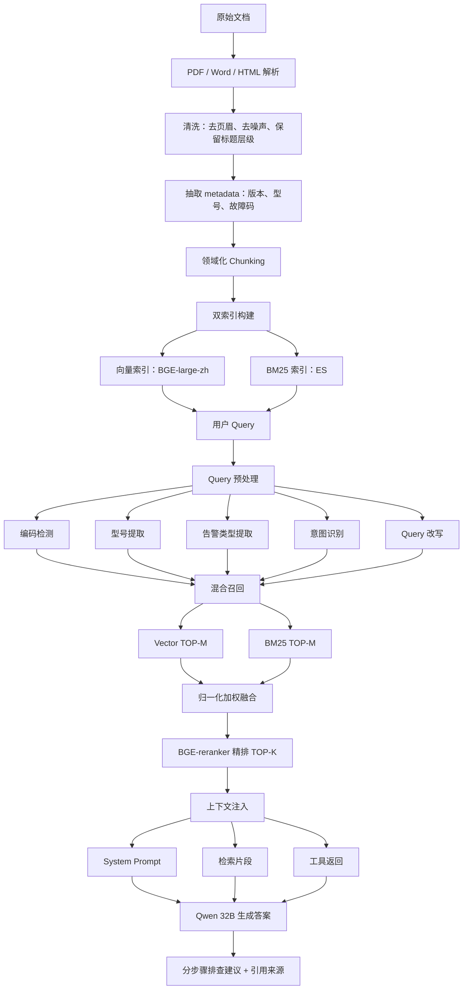

# 运维领域 RAG 问答系统

## 项目概述

这是一个面向运维领域的 RAG 问答系统，用于将 PDF、Word、HTML 等不同格式的运维文档清洗成统一结构，并结合运维知识的特点进行 Chunk 切分、索引构建、混合召回和答案生成。

系统最终会把高质量上下文注入 Qwen 32B，让模型输出带引用来源的分步骤排查建议。

## 我在运维大模型中的具体工作

1. 文档清洗
   - 统一处理 PDF、Word、HTML 等不同格式的运维文档。
   - 去除页眉、页脚、页码等噪声。
   - 保留标题层级。
   - 抽取版本、型号等 metadata。

2. 领域化 Chunking
   - 案例类文档按「问题-原因-步骤」组织成块。
   - 手册类文档按章节切分。
   - FAQ 类文档按问答对切分。
   - 单个 Chunk 控制在 800-1000 token 上限内。

3. 双索引构建
   - 使用 BGE-large-zh 生成 1024 维向量。
   - 构建向量索引用于语义召回。
   - 使用 ES / BM25 保证编码、型号、故障码等信息能够精确匹配。

4. Query 预处理
   - 使用正则检测故障码、错误码等编码信息。
   - 对用户问题进行意图预判。
   - 提取告警类型、设备型号等关键词。
   - 必要时进行 query 改写，提升召回质量。

5. 混合检索 + 重排
   - 向量检索召回 TOP-M。
   - BM25 / 精确检索召回 TOP-M。
   - 对不同来源的分数进行归一化加权融合。
   - 使用 BGE-reranker 精排 TOP-K。

6. 上下文注入生成
   - 将 System Prompt、检索片段和工具返回结果组织成模型输入。
   - 使用 Qwen 32B 生成分步骤排查建议。
   - 输出内容包含引用来源，方便追溯依据。

## 系统整体流程图

整个系统可以理解为从原始文档到最终问答生成的一条完整链路：

```text
原始文档
  ↓
PDF / Word / HTML 解析
  ↓
清洗：去页眉、去噪声、保留标题层级
  ↓
抽取 metadata：版本、型号、故障码
  ↓
领域化 Chunking
  ↓
双索引构建
  ├── 向量索引：BGE-large-zh
  └── BM25 索引：ES
  ↓
用户 Query
  ↓
Query 预处理
  ├── 编码检测
  ├── 型号提取
  ├── 告警类型提取
  ├── 意图识别
  └── Query 改写
  ↓
混合召回
  ├── Vector TOP-M
  └── BM25 TOP-M
  ↓
归一化加权融合
  ↓
BGE-reranker 精排 TOP-K
  ↓
上下文注入
  ├── System Prompt
  ├── 检索片段
  └── 工具返回
  ↓
Qwen 32B 生成答案
  ↓
分步骤排查建议 + 引用来源
```



## 核心流程

1. 文档清洗
   - 支持 PDF、Word、HTML 等运维文档。
   - 将不同格式的文档统一清洗为结构化内容。
   - 去除页眉、页脚、页码等噪声信息。
   - 保留标题层级，并抽取版本、设备型号等 metadata。

2. 知识切分
   - 按运维知识类型进行 Chunk 切分。
   - 保留故障码、设备型号、告警信息、处理步骤等关键结构化特征。

3. 索引构建
   - 构建向量索引，用于语义召回。
   - 构建 BM25 精确索引，用于故障码、设备型号、告警编号等精确匹配。

4. Query 预处理
   - 识别用户问题中的编码、型号、告警意图等信息。
   - 根据问题类型判断更适合精确匹配还是语义匹配。

5. 混合召回与重排
   - 结合向量检索和 BM25 检索结果。
   - 根据 Query 类型动态调整召回权重。
   - 对候选结果进行重排，筛选出高质量上下文。

6. 答案生成
   - 将重排后的上下文注入 Qwen 32B。
   - 生成带引用来源的分步骤排查建议。

## 文档清洗

运维文档的来源通常包括 PDF、Word、HTML 等格式。不同格式的原始结构差异很大，如果直接入库，会导致 Chunk 边界混乱、标题层级丢失、metadata 缺失，最终影响检索质量。

因此，在入库前需要先做统一清洗，将不同来源的文档转换成统一的中间格式。

清洗过程中主要处理以下内容：

- 统一 PDF、Word、HTML 等不同格式的解析结果。
- 去除页眉、页脚、页码、重复目录等噪声。
- 保留章节标题、层级关系和正文结构。
- 抽取版本号、设备型号、文档来源类型等 metadata。
- 将文档内容转换成适合后续 Chunk、索引和检索的结构化表示。

统一后的中间格式示例：

```json
{
  "doc_id": "manual_001",
  "title": "XX 交换机维护手册",
  "content": "## 3.2 风扇告警处理\n...",
  "headings": ["维护手册", "告警处理", "风扇告警"],
  "metadata": {
    "version": "V2.3",
    "model": ["S5735", "S6730"],
    "source_type": "pdf"
  }
}
```

这样做的核心目的是让后续的 Chunk 切分、向量索引、BM25 索引和引用溯源都基于统一、干净、结构稳定的文档表示。

## Query 预处理

Query 预处理的目标是在检索前先理解用户问题中的关键结构化信息，包括编码、型号、告警类型和用户意图。

运维问题里经常同时包含自然语言描述和精确字段。例如：

```text
S5735 出现 ALM-12003 风扇告警怎么处理？
```

系统需要先识别出：

- 设备型号：`S5735`
- 故障码：`ALM-12003`
- 告警类型：风扇告警
- 用户意图：排查处理

这些信息会影响后续检索策略。如果问题中包含故障码、型号等精确信息，就需要提高 BM25 / keyword 检索权重；如果问题更偏现象描述，就需要提高向量检索权重。

### 为什么要 Query 改写

用户问题经常不规范、口语化，和文档中的标准表达不一致。

例如用户问：

```text
这个盒子风扇又红了，咋弄？
```

文档里可能写的是：

```text
风扇模块故障告警处理
```

这时候可以将 query 改写或扩展为：

```text
风扇告警 风扇模块故障 设备硬件告警 处理步骤
```

这样可以提高语义检索和关键词检索的召回质量。

但需要注意的是：编码、型号不能在改写过程中丢失。

例如原始 query：

```text
ALM-12003 怎么处理？
```

不能改写成：

```text
告警怎么处理？
```

否则 `ALM-12003` 这个关键精确信息会丢失，后续检索就可能召回到错误的故障码内容。

## 混合检索与重排

混合检索和重排是这个系统的检索核心。

整体流程可以概括为：

```text
向量检索 TOP-M
  +
BM25 / 精确检索 TOP-M
  ↓
分数归一化
  ↓
动态加权融合
  ↓
BGE-reranker 精排
  ↓
输出 TOP-K 高质量上下文
```

### 向量 TOP-M

向量 TOP-M 指的是向量检索返回语义上最接近的 M 个 Chunk。

例如用户问：

```text
设备风扇异常怎么处理？
```

向量检索可能召回：

```text
FAN_FAIL 告警处理
风扇模块故障处理
硬件风扇异常排查
```

这一步主要解决「用户说法和文档说法不一致」的问题。用户可能不会直接说出文档里的标准术语，但向量检索可以通过语义相似度找到相关内容。

### BM25 TOP-M

BM25 TOP-M 指的是通过关键词、型号、故障码、命令等文本特征召回最相关的 M 个 Chunk。

BM25 检索会返回关键词匹配最好的 M 个 Chunk。

例如用户问：

```text
ALM-12003 怎么处理？
```

BM25 会优先找包含 `ALM-12003` 的 Chunk。

例如用户问：

```text
S5735 出现 ALM-12003 风扇告警怎么处理？
```

BM25 / 精确检索会重点匹配：

- `S5735`
- `ALM-12003`
- `风扇告警`

这一步主要保证型号、故障码、编码、命令等关键信息能够准确命中，避免向量检索把相似但不相同的编码混在一起。

换句话说，BM25 TOP-M 主要解决的是「编码、型号、故障码必须精确命中」的问题。

### 归一化加权融合

向量检索和 BM25 检索的分数来源不同，不能直接相加，所以需要先做归一化，再根据 Query 类型进行加权融合。

原因是二者不在同一个量纲上。

向量分数可能是：

```text
0.72
0.68
0.65
```

BM25 分数可能是：

```text
18.7
12.3
7.5
```

如果直接相加，BM25 分数会天然压过向量分数，导致语义召回结果被削弱。因此需要先把不同来源的分数归一化到相近范围，例如 0 到 1。

示例：

```text
score = alpha * vector_score + (1 - alpha) * bm25_score
```

其中 `alpha` 不是固定值，而是根据 Query 类型动态调整。

- 如果用户问题更偏自然语言描述，例如「设备风扇异常怎么处理」，就提高向量检索权重。
- 如果用户问题中包含明确的型号、故障码或错误码，例如 `S5735`、`ALM-12003`，就提高 BM25 / 精确检索权重。

也就是说，编码和型号类问题更偏 BM25，自然语言描述类问题更偏向量检索。

### 为什么还要 BGE-reranker 精排

融合后的结果仍然只是候选集，还需要使用 BGE-reranker 进行精排。

混合召回本质上是粗筛，解决的是：

```text
先从海量 Chunk 中找出可能相关的几十个
```

但最终注入大模型的上下文不能太多，否则会引入噪声、浪费上下文窗口，并影响最终回答质量。因此需要再做一层精排。

reranker 会把用户问题和候选 Chunk 组成 pair，重新判断它们之间的相关性，并输出更准确的排序结果。

它比 embedding 检索更精细，因为 reranker 会同时看 query 和 passage，而不是把二者分别编码后只计算向量相似度。

这一步的作用是从混合召回得到的候选内容中筛出真正适合注入大模型的 TOP-K 上下文，减少无关 Chunk 对最终回答的干扰。

### 关键代码：reranker 精排 TOP-K

```python
from FlagEmbedding import FlagReranker

reranker = FlagReranker("BAAI/bge-reranker-large", use_fp16=True)

def rerank(query: str, candidate_chunks: list[Chunk], top_k: int = 8) -> list[dict]:
    pairs = [
        [query, chunk.text]
        for chunk in candidate_chunks
    ]

    scores = reranker.compute_score(pairs)

    reranked = []
    for chunk, score in zip(candidate_chunks, scores):
        reranked.append({
            "chunk": chunk,
            "rerank_score": float(score)
        })

    reranked.sort(key=lambda x: x["rerank_score"], reverse=True)
    return reranked[:top_k]
```

对外可以这样表达：

混合检索负责高召回，reranker 负责高精度。系统会先通过向量索引和 BM25 / 精确索引召回 TOP-M 候选 Chunk，再用 BGE-reranker 精排到 TOP-K，减少无关 Chunk 被注入大模型上下文。

## 技术亮点

- 不是单纯依赖向量检索，而是结合了运维场景中的结构化特征。
- 针对故障码、设备型号等信息，使用 BM25 精确索引提升命中率。
- 针对自然语言故障描述，使用向量索引进行语义匹配。
- 通过 Query 预处理识别编码、型号、告警意图。
- 使用动态权重融合，让不同类型问题走更合适的召回策略。
- 通过重排提升最终注入大模型的上下文质量。
- 输出结果包含引用来源，方便用户追溯依据。

## 对外汇报版说法

我主要负责运维大模型的 RAG 链路建设。首先对 PDF、Word、HTML 等多源文档做统一清洗，去除页眉页脚等噪声，保留标题层级，并抽取版本、型号、故障码等 metadata。

在 Chunking 上，我没有采用简单固定长度切分，而是做了领域化切分：故障案例按「问题-原因-步骤」成块，手册按章节成块，FAQ 按问答对成块，并把 Chunk 控制在 800-1000 token 左右，保证语义完整和检索粒度之间的平衡。

检索侧我做了双索引：用 BGE-large-zh 构建 1024 维向量索引，解决自然语言语义匹配；同时用 Elasticsearch / BM25 保证编码、型号、故障码的精确召回。

Query 进入系统后，会先做预处理，包括编码正则检测、型号提取、告警类型识别、意图预判和必要的 query 改写。然后进行向量 TOP-M 和 BM25 TOP-M 的混合召回，对两路分数归一化后按公式 `score = alpha * vector + (1 - alpha) * BM25` 融合。对于有编码、型号的问题，我把 `alpha` 调低到 0.3，更相信 BM25；对于自然语言描述类问题，`alpha` 提高到 0.7，更相信向量检索。

融合召回后，我再用 BGE-reranker 做精排，选出 TOP-K 片段注入 Prompt。最后把 System Prompt、检索片段和工具返回结果一起交给 Qwen 32B，由模型生成带引用来源的分步骤排查建议。

在模型分工上，RAG 负责事实依据、版本和引用，SFT 负责排查步骤、术语和输出格式，DPO 负责提升回答的可用性和人工采纳偏好。模型选型上，Qwen 32B 是能力、成本、中文效果和本地部署之间的折中。7B / 14B 在复杂意图识别和 JSON 参数抽取上不够稳定，72B 推理成本过高，32B 配合 vLLM 和 INT4 量化比较可控。

我还针对 badcase 做了优化。比如编码精确匹配失败时，通过正则识别故障码并走 BM25 精确通道；跨文档拼接不足时，通过二次检索补充告警和型号相关知识；过时文档干扰时，通过 metadata 做版本优先和 inactive 文档下线。

## 面试时可重点强调的亮点

1. 理解运维场景的知识特点
   - 故障码、型号、版本非常关键，所以不能只靠向量检索。

2. 做了领域化 Chunking
   - 案例、手册、FAQ 的切分方式不同，说明不是机械切文档。

3. 做了动态混合检索
   - `alpha` 不是固定值，而是根据 query 类型调整。

4. 有 badcase 闭环
   - 能说清楚问题、根因和改进动作，比只讲方案更有说服力。

5. 能区分 RAG、SFT、DPO 的边界
   - 事实更新交给 RAG，表达格式交给 SFT，偏好可用性交给 DPO。

## 最后用一句技术总结

这个系统的核心思路是：用结构化清洗和领域化 Chunking 提升知识质量，用向量 + BM25 的双索引解决语义召回和精确匹配的矛盾，用动态融合和 reranker 提升检索精度，再通过 Prompt 注入和 Qwen 32B 生成可执行、可引用、符合运维习惯的排查建议。
